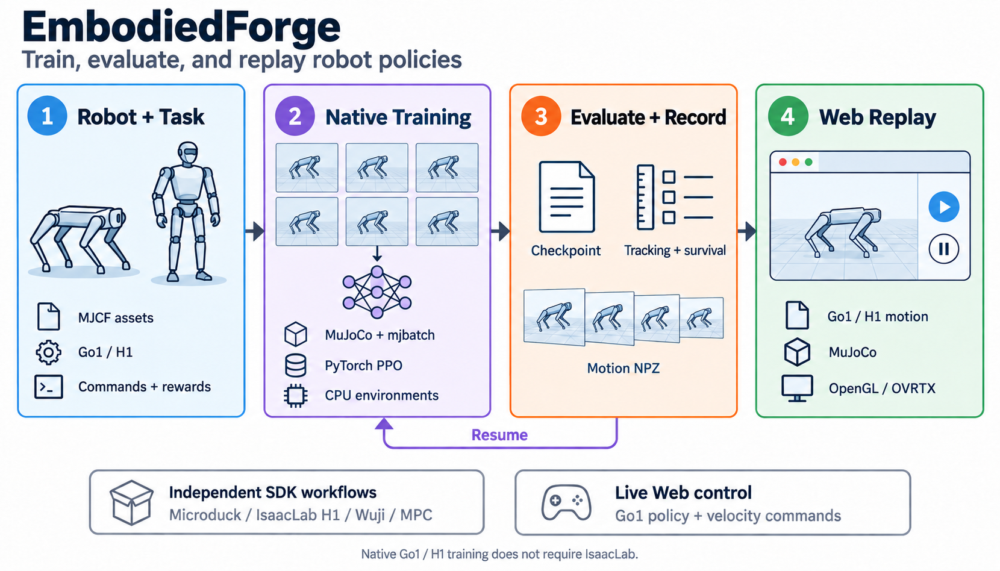

# EmbodiedForge

[简体中文](README.md) | **English**



*Workflow diagram: native Go1 / H1 training uses MuJoCo, mjbatch, and PyTorch without IsaacLab; evaluation can record motions for Web replay. Live policy interaction currently supports Go1; H1 walking policies still need training and acceptance evaluation. External SDK tasks have separate entry points; see [current capabilities](#capabilities).*

A modular platform for robot simulation, data collection, and training for RL and VLA experiments. Tasks, physics, rendering, sensors, and policies compose through separate interfaces. A shared Web viewer displays simulations, replays motion recordings, and controls live policies.

The current implementation includes a CPU `VectorEnv` reference runtime, Go1 and native H1 task/PPO implementations maintained in this repository, and isolated training entry points for Microduck, IsaacLab H1, Wuji, and other tasks. The table below describes their scope; see the [architecture](docs/architecture.md) for the longer-term design.

**Quick links:** [Quick start](#quick-start) · [Training and deployment commands](docs/training-deployment.en.md) · [Web controls](#web-viewer) · [Live Go1](#go1-live) · [Motion replay](#robot-replay) · [Robot training](#robot-training) · [Troubleshooting](#troubleshooting) · [Documentation](#documentation)

<a id="quick-start"></a>

## Quick start: no GPU required

Run these commands from the repository root. Environment creation below targets Linux. The core package supports Python 3.10+; the full viewer stack was validated locally with Python 3.11. If you already have an `ef-viewer` environment, activate it and skip creation.

```bash
conda create -n ef-viewer python=3.11 -y
conda activate ef-viewer
python -m pip install -e '.[viz-web]'
python -m embodiedforge.visualization --physics numpy --port 8080
```

Open **http://127.0.0.1:8080** to view the point-mass task and use pause, step, reset, and camera controls. The defaults are the Web viewer, CPU Raster rendering, and a target of **30 FPS**. Raster uses an orthographic view and does not support camera orbit.

For environment and data APIs alone, install with `python -m pip install -e .`. Pillow, Torch, and graphics SDKs are not required.

<a id="capabilities"></a>

## Current capabilities

| Component | Implemented | Scope |
| --- | --- | --- |
| Core runtime | `reach` / `hold`, partial resets, freezing completed environments, camera sampling, final observations | CPU point-mass reference tasks |
| Physics backends | NumPy, MuJoCo, mjbatch thread pool, Newton **1.6.0rc1** | Core backends use CPU state snapshots |
| Core training and data | PyTorch PPO, termination/timeout-aware GAE, checkpoint evaluation, episode recording, windowed reading | Core PPO uses proprioception; training and dataset validation can run separately |
| Go1 locomotion | Task, rewards, mirrored policy, normalization, and PPO ported into this repository; training, resume, evaluation, and live control | Still depends on mjbatch, MuJoCo, Torch, and Menagerie assets; not yet part of the core `VectorEnv` |
| Native H1 | MJCF model, named joint groups, batched commands, randomization, resets, torque data, and PPO | CPU MuJoCo/mjbatch; no IsaacLab runtime. Initial policy has not passed walking tracking acceptance. [Guide](docs/h1-native.en.md) |
| Other robot tasks | Microduck, IsaacLab H1, Wuji reorientation, Cartpole MPC, arm throwing co-design | Upstream workflows and adapters in isolated SDK environments, rather than complete ports |
| Shared Web viewer | Raster / MuJoCo / OpenGL / OVRTX, live Go1 policies, Go1/H1 mesh replay | Viewer and physics backends are selected independently; Web frames are not training camera observations |
| VLA interfaces | Image, language, and proprioception data windows; action-chunk executor | No pretrained VLA model integration or fine-tuning trainer yet |

<a id="web-viewer"></a>

## Shared Web visualization

Point tasks, live Go1 control, and Go1/H1 replay share a blue-gray scene palette with a matte, low-contrast tiled floor, directional lighting, and fill light. MuJoCo uses a gradient sky; RTX uses soft studio lighting. Floor tiles stay anchored in world space, using 0.5 m or 1 m cells according to robot size to help judge motion. Raster uses a simplified grid background. Styling applies only to viewers and does not change training observations or physics parameters; color and shadows still differ between renderers.

Browser and native-window entry points use different options:

| Desired entry point | Command |
| --- | --- |
| Web + MuJoCo rendering | `python -m embodiedforge.visualization --viewer web --render-backend mujoco` |
| Web + OVRTX rendering | `python -m embodiedforge.visualization --viewer web --render-backend rtx` |
| Native OVRTX window | `python -m embodiedforge.visualization --viewer rtx` |

These commands use NumPy point-task physics by default. For robots, use the live policy or replay entry points below. The Web entry point requires neither `--headless`, Node, nor ImGui; the OpenGL backend still needs a working graphics context.

### Install additional renderers

The MuJoCo mesh viewer does not require an RTX GPU. The commands below pin the MuJoCo version used by the local Go1 training environment; the live viewer and policy process must use the same MuJoCo version.

```bash
python -m pip install -e '.[viz-robot]' 'mujoco==3.11.0'
python -m embodiedforge.visualization --physics numpy --render-backend mujoco
```

OVRTX requires a compatible NVIDIA RTX GPU and driver. These commands use the locally validated viewer constraints and also install OpenGL support:

```bash
python -m pip install --extra-index-url https://pypi.nvidia.com \
  -c configs/viewer-constraints.txt -e '.[viz-robot,viz-rtx]' 'mujoco==3.11.0'
python -m embodiedforge.visualization --physics numpy --render-backend rtx
```

For OpenGL alone, install `.[viz-robot,viz-gl]`. Select point-task physics with `--physics numpy|mujoco|mjbatch|newton` and rendering with `--render-backend raster|mujoco|gl|rtx`. These can be combined after installing the corresponding physics dependencies. For example, after `pip install -e '.[newton]'`, use `--physics newton --render-backend mujoco`.

### Browser controls

| Control | Behavior |
| --- | --- |
| Pause / resume / step | Controls the entire session; reset affects only the selected environment |
| Renderer selection | Validates the candidate's first frame before replacing the renderer; keeps the previous view on failure |
| Resolution | 360p, 540p, 720p, and 1080p; preserves simulation state, with a brief wait while rebuilding the renderer |
| Target frame rate | 1–60 FPS, default 30; displays actual frame rate, image dimensions, and frame size |
| Camera and fullscreen | Drag to orbit, scroll to zoom, default view, robot following, fullscreen, and snapshots; enabled according to backend capabilities |
| Go1 velocity commands | Buttons or numeric inputs, with Enter to submit; drafts are saved per environment, with pending and applied status |
| Robot replay | Seek on the timeline, switch recordings, retain the last frame, and return to the start |

Use the actual dimensions reported by the page: Raster produces a square with side length `min(width, height)`, while the other three backends support the widescreen presets above. Actual FPS measures server frame output, not browser refresh rate; an “idle” indication while paused is expected.

Go1 shortcuts: **W/S** forward/backward, **A/D** left/right, **Q/E** turn, and **X** zero the command. Each key press sets a persistent command; releasing the key does not clear it or start the simulation. **Space** pauses/resumes, **N** steps, **R** resets, and **F** restores the default view. Shortcuts are ignored while editing an input field.

An unchanged paused view reuses its JPEG without repeated rendering or transmission; control state continues to update. Browsers share the session. On disconnection, controls are disabled and the browser reconnects automatically without replaying old actions or automatically pausing the server simulation. The stop button or Ctrl+C releases session resources.

For remote access, run `ssh -L 8080:127.0.0.1:8080 user@server` on your client, then open the local address. Use different ports for separate sessions. See the [viewer documentation](docs/viewers.md) for dependencies, APIs, and frame-rate semantics.

<a id="go1-live"></a>

### Live Go1 policy

Live control requires a completed managed `go1-joystick` training directory, not an arbitrary `model.pt`. This example references an existing local training artifact. A fresh checkout does not include these `runs/` files; substitute your own compatible training directory.

```bash
python -m embodiedforge live \
  --run runs/go1-preserve-balanced-s0-1800-20260914 \
  --render-backend rtx --num-envs 2 \
  --width 960 --height 540 --fps 30 --port 8080
```

The session starts paused with zero velocity commands. The Web interface currently uses Chinese labels: click “前进” (Forward), then “继续” (Resume). Use `--render-backend mujoco` if OVRTX is not installed.

The policy and mjbatch simulation run in the separate Python environment recorded by the training run; the viewer does not need to import Torch. Use `--worker-python /path/to/venv/bin/python` to select a compatible environment. Loading checks the model hash, configuration, and SDK versions. Live execution does not update policy weights. When any environment finishes, the session pauses and retains the final state; reset the affected environment before continuing. See [live Go1 control](docs/go1-live-web.md).

<a id="robot-replay"></a>

### Go1 / H1 motion replay

Replay requires a matching local MJCF model and NPZ motion recording. It does not rerun the policy or physics. The model and recording are validated across all frames. H1 currently supports recorded replay in the shared Web viewer, with no live velocity control yet.

```bash
python -m embodiedforge replay \
  --model /path/to/unitree_h1/h1.xml \
  --motion /path/to/motion-seed-0-forward-env-0.npz \
  --render-backend mujoco --fps 30 --port 8081
```

Replace the placeholder paths with your model and recording, then open **http://127.0.0.1:8081**. See [robot replay](docs/robot-web-replay.md) for complete local Go1/H1 examples, recording generation, and material support.

<a id="core-rl"></a>

## Core RL and data workflow

Core PPO trains the `reach` or `hold` point task through a separate entry point from robot recipes such as Go1. Use a new, nonexistent path for each output directory.

```bash
python -m pip install -e '.[train,mujoco,test]'

# Check configuration and physics dependencies
python -m embodiedforge plan --config configs/reach.json
python -m embodiedforge doctor --physics mujoco

# Record demonstration data and inspect complete episodes
python -m embodiedforge rollout --config configs/reach.json \
  --physics mujoco --steps 300 --output runs/reach-demo
python -m embodiedforge inspect --dataset runs/reach-demo

# Train and evaluate PPO without images
python -m embodiedforge train --task reach --num-envs 32 \
  --updates 100 --output runs/reach-ppo
python -m embodiedforge evaluate --checkpoint runs/reach-ppo/checkpoint.pt \
  --num-envs 32 --steps 300
```

Python API example:

```python
import numpy as np
from embodiedforge import Config, VectorEnv

with VectorEnv(Config(physics="numpy", render="raster", channels=("rgb",))) as env:
    observation = env.observe()
    result = env.step(np.zeros((env.config.num_envs, 2)))
    done_ids = np.flatnonzero(result.terminated | result.truncated)
    env.reset(done_ids)
```

Core task actions are XY forces in `[-1, 1]` newtons. `reach` has six proprioceptive dimensions; `hold` has four. `result.observation` retains the terminal frame, and the caller resets explicitly. RGB observations include environment and camera dimensions; inspect `env.spec` for the exact specification. See the [interfaces](docs/interfaces.md) and [implementation guide](docs/implementation.md) for data windows and extension points.

<a id="robot-training"></a>

## Robot training and upstream integration

See the [training and deployment command guide](docs/training-deployment.en.md) for task-specific setup, training, resume, evaluation, model export, and remote Web execution. It covers reach/hold, Go1, Microduck, H1, Wuji/Light, Cartpole MPC, and arm CEM, with the execution and deployment modes actually supported by each task.

Robot training SDKs use isolated environments to avoid conflicting Warp, Torch, and MuJoCo versions. Prepare source checkouts at the revisions specified in each task guide before setup. Those guides document local paths, caches, and GPU requirements.

| Entry point | Tasks and methods | Implementation and documentation |
| --- | --- | --- |
| `python -m embodiedforge recipes` | Go1 PPO, Wuji / Wuji Light reorientation PPO, Cartpole MPC, arm throwing CEM | Go1 is ported; other tasks use pinned source snapshots and adapters. [Task recipes](docs/recipes.md) |
| `python -m embodiedforge.microduck` | Microduck flat-ground walking PPO, evaluation, playback, and ONNX export | Runs the upstream mjlab workflow in isolation. [Microduck](docs/microduck.md) |
| `python -m embodiedforge h1-native` | Native H1 training, resume, fixed-command evaluation and motion recording | Project-owned CPU task/PPO. [Native H1](docs/h1-native.en.md) |
| `python -m embodiedforge h1` | H1 flat-ground walking training, resume, and multi-seed fixed-command evaluation | Isolated IsaacLab / Newton / MuJoCo-Warp recipe. [H1](docs/h1-isaaclab.md) |

Example managed Go1 training workflow; first replace the source path with a clean checkout as required by the task guide:

```bash
python -m embodiedforge recipes list
python -m embodiedforge recipes setup --source mjbatch \
  --repo /path/to/mjbatch --python 3.12
python -m embodiedforge recipes train --task go1-joystick \
  --num-envs 512 --updates 600 --threads 4 --timeout 1200 \
  --output runs/go1-train
python -m embodiedforge recipes status --run runs/go1-train
python -m embodiedforge recipes evaluate --task go1-joystick \
  --run runs/go1-train --suite basic --num-envs 32 \
  --seeds 0 1 2 --steps 500 --output runs/go1-evaluation
```

Completing a run does not mean its policy passes behavioral acceptance. Each task guide describes acceptance thresholds, training budgets, resume semantics, and motion-recording options. Historical candidates include Wuji reorientation, prolonged H1 standing, and some Go1 compound commands that have not passed acceptance; successful short tests do not establish stability across all behaviors.

<a id="troubleshooting"></a>

## Troubleshooting

First check viewer dependencies in the current environment without opening a window:

```bash
python -m embodiedforge.visualization --viewer web --render-backend mujoco --check
```

`--check` validates installed package metadata only, not GPU, driver, or rendering functionality. Replace `mujoco` with `rtx` to check OVRTX dependencies.

| Symptom | What to do |
| --- | --- |
| EGL warnings or unexpected GPU selection | Run `python -m embodiedforge doctor --graphics egl` to inspect the actual vendor, device, and driver warnings; see [EGL diagnostics](docs/graphics-diagnostics.md) |
| A standalone window opens instead of a browser viewer | Use `--viewer web --render-backend rtx`; `--viewer rtx` selects the native window |
| The page displays Go1, but it does not move | Sessions start paused with zero commands. Set “前进” (Forward), then “继续” (Resume). If episodes have ended, reset all completed environments first |
| Actual frame rate is below the 60 FPS target | Check actual FPS, dimensions, and frame size. Start at 540p / 30 FPS, then increase one setting at a time. Rendering, encoding, and the network all affect the viewing experience |
| A remote browser cannot connect | Keep the server running, check that ports match, and use the SSH tunnel above; the server binds to loopback by default |
| Go1 reports an incompatible run, model, or SDK | Use a completed managed training directory and its matching environment. Check versions against the error and set `--worker-python` if needed; see [loading requirements](docs/go1-live-web.md) |

See the [viewer installation guide](docs/viewers.md) for graphics initialization failures, driver diagnostics, and native-window dependencies.

<a id="validation"></a>

## Validation and current limits

```bash
python -m pip install -e '.[test]'
python -m pytest -q
python -m ruff check src tests
```

Tests requiring missing optional SDKs are explicitly skipped. The 2026-09-14 regression run in `ef-viewer` reported **496 passed / 55 skipped**; this does not establish acceptance for every training SDK combination. Another **22 real-browser checks** covered resolution, frame rate, three renderers, state preservation, and changes during playback or simulation.

In a short local Go1 live test on an RTX 5090 D v2 at 960×540, a 60 FPS target produced about 59 FPS while physics advanced at about 50 steps per second. Higher display FPS does not produce extra policy actions, and these results do not guarantee the same performance for other models, resolutions, or machines. See the [frame-rate validation](docs/viewers.md) for methods and full results.

The core runtime does not yet provide GPU state transport, generic robot asset import, a real training-camera pipeline, visual PPO, distributed scheduling, or hardware control. The robot viewer's dedicated MJCF bridge is not a generic scene importer, and robot recipes are not yet unified under the core `VectorEnv`. The shared Web viewer does not currently manage training jobs.

<a id="documentation"></a>

## Documentation and research notes

Detailed guides are currently mostly in Chinese. This English README covers the same main capabilities, installation steps, and commands as the Chinese version.

| Topic | Documentation |
| --- | --- |
| Training and deployment commands | [Task-by-task guide](docs/training-deployment.en.md) · [简体中文](docs/training-deployment.md) |
| Architecture and interfaces | [Target architecture](docs/architecture.md) · [Interfaces and modules](docs/interfaces.md) · [Implementation and extensions](docs/implementation.md) |
| Viewers | [Installation and backends](docs/viewers.md) · [Robot replay](docs/robot-web-replay.md) · [Live Go1 control](docs/go1-live-web.md) |
| Training entry points | [Task recipes](docs/recipes.md) · [Microduck](docs/microduck.md) · [IsaacLab H1](docs/h1-isaaclab.md) |
| Go1 experiments | [Turning accuracy](docs/go1-yaw-study.md) · [Lateral motion and stopping](docs/go1-response-study.md) · [Compound commands](docs/go1-maneuver-study.md) · [Capability preservation](docs/go1-preservation-study.md) · [Response and compute optimization](docs/go1-fast-response-study.md) |
| Engineering | [Newton compatibility](docs/newton.md) · [Logging design](docs/logging.md) |

Dependencies, robot assets, and ported code retain their respective licenses. The Go1 port includes the [mjbatch license](src/embodiedforge/locomotion/LICENSE.mjbatch).
