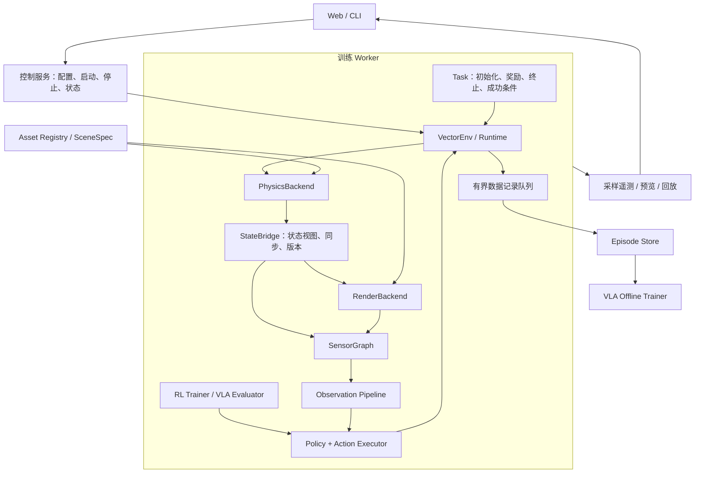

# EmbodiedForge 训练平台架构

本文是目标架构与接口草案，接口名称属于本平台，不代表第三方引擎已有 API。候选后端的具体能力、版本和性能需要在实现适配器时验证。

## 1. 设计目标

支持状态或视觉 RL、VLA 离线训练与在线评估，共用任务语义、动作定义和数据协议。物理后端与渲染后端独立选择；也允许某个引擎同时提供两者。

高频执行留在训练 worker 进程内。Web、任务调度、指标展示与回放通过采样和异步消息接入，不控制物理子步。

“支持多后端”表示通过统一接口适配、校验和选择后端，不保证不同引擎的物理结果相同，也不保证任意物理与渲染组合都能运行。

## 2. 总体结构



核心库不依赖 Web、调度器或某个训练算法。后端适配器依赖核心协议，核心协议不导入后端 SDK。

## 3. 模块划分

| 模块 | 职责 | 不承担的职责 |
| --- | --- | --- |
| `core` | 类型、能力声明、错误、坐标与时间约定 | 第三方引擎调用 |
| `assets` | 资产标识、哈希、源文件、编译缓存、名称映射 | 每步状态同步 |
| `scene` | 实体、关节、材质、相机、环境实例描述 | 具体引擎对象生命周期 |
| `backends.physics` | 动力学、碰撞、接触、状态读写 | 奖励、策略、图像生成 |
| `backends.render` | 场景实例、图像输出、渲染资源 | 推进物理时间 |
| `runtime` | 后端装配、时钟、状态桥、资源与执行顺序 | 训练算法 |
| `sensors` | 相机、关节、接触等测量及采样频率 | 策略输入归一化 |
| `tasks` | reset 分布、动作语义、奖励、终止、成功条件 | 直接操作后端私有句柄 |
| `envs` | 批量 reset/step、观测构建、环境规范 | Web 通信 |
| `policies` | RL/VLA 策略适配、历史缓存、动作 chunk 执行 | 仿真求解 |
| `training` | rollout、优化器、checkpoint、评估 | 定义场景实体 |
| `data` | episode schema、读写、校验、数据集适配 | 训练闭环内的阻塞网络请求 |
| `services` | 作业管理、设备分配、模型与运行记录 | 物理步进 |
| `visualization` | 预览与回放适配 | 修改训练状态，除非显式调试模式 |

## 4. 物理与渲染分别抽象

### 4.1 物理后端

以下 Python 为接口示意；`Batch`、`TensorView` 等类型由核心模块定义。

```python
class PhysicsBackend(Protocol):
    def capabilities(self) -> PhysicsCapabilities: ...
    def build(self, scene: SceneSpec, config: PhysicsConfig) -> SceneBinding: ...
    def reset(self, env_ids: TensorView, initial: ResetState) -> None: ...
    def apply_control(self, control: ControlBatch) -> None: ...
    def step(self, dt: float, substeps: int) -> None: ...
    def state_view(self, fields: set[str]) -> PhysicsStateView: ...
    def close(self) -> None: ...
```

`step(dt, substeps)` 推进的总时长为 `dt`，内部每个子步为 `dt / substeps`。该定义避免适配器各自解释时间参数。

`PhysicsStateView` 按需暴露刚体位姿、线/角速度、关节位置/速度、接触数据和完成事件。不要每步导出所有状态，也不要强制转为 NumPy。状态视图默认借用后端内存，有效期到下一次状态写入；异步消费者必须取得快照或持有受保护的缓冲区。

任务通过稳定实体 ID 与关节 ID 访问状态。`SceneBinding` 将这些 ID 映射到引擎内部索引，并保存关节排列、自由度数量和单位转换。

关节位置控制、速度控制、力矩控制分别声明能力。末端位姿等高级动作由独立控制器转换为底层控制命令；控制器的模型、增益和限幅进入运行配置。

### 4.2 渲染后端

```python
class RenderBackend(Protocol):
    def capabilities(self) -> RenderCapabilities: ...
    def build(self, scene: SceneSpec, config: RenderConfig) -> RenderBinding: ...
    def sync(self, update: SceneUpdate, ready: CompletionToken) -> None: ...
    def render(self, request: RenderRequest) -> RenderBatch: ...
    def close(self) -> None: ...
```

`SceneUpdate` 包含需要更新的实体位姿、可选变形数据和场景修订号。刚体通常只需同步位姿；柔体、粒子等必须声明额外状态与渲染能力，不能假定刚体接口足够。

`RenderRequest` 指定环境 ID、相机 ID、分辨率、输出通道与目标时间。`RenderBatch` 返回图像、相机内外参、实际采样时间、状态版本和完成事件。

RGB、depth、normal、instance ID 和 semantic ID 分别声明支持情况。实例标签由统一实体 ID 映射，语义标签由任务资产标注提供，不能把引擎内部 shape ID 直接当作语义类别。

### 4.3 三种组合方式

| 组合 | 实现 | 适用情况 |
| --- | --- | --- |
| 同引擎共享资源 | 物理与渲染适配器共享一个 `BackendSession`，引用计数管理资源 | 后端允许共享模型或设备缓冲区 |
| 跨引擎设备同步 | 状态桥映射实体并同步设备数据，渲染器独立持有场景 | 两端设备、数据格式与同步机制兼容 |
| 跨引擎主机同步 | 状态桥显式复制到主机再上传 | 调试、低频预览或允许复制的任务 |

`NullRenderer` 用于纯状态训练。共享会话只是优化路径，不能让任务代码依赖它。

可将 Newton、MuJoCo 等作为物理适配器候选，将 Newton 相机渲染、独立渲染器等作为渲染适配器候选。Viser/Rerun 首先作为预览与回放输出端接入；是否能承担训练图像生成，需要单独满足渲染协议并验证。

### 4.4 能力协商与失败方式

启动时由 `BackendResolver` 同时检查任务、物理、渲染、传感器和数据需求，生成可查看的执行计划：

- 设备类型、批量环境能力、最大或实际支持的 batch、局部 reset。
- 控制模式、接触读回、刚体/柔体、动态资产更新。
- 渲染通道、相机模型、数据布局、深度含义、设备输出能力。
- 两端支持的资产转换路径与实体映射完整性。
- 传输方式、同步事件、是否需要主机复制及预计复制量。

缺少必需能力时在开始训练前报错，列出缺失项。仅在配置明确允许时选择降级路径，并记录在运行清单里。后端在一次运行内固定，切换后端需要重建环境。

## 5. 场景、坐标和数据约定

`SceneSpec` 是声明式场景清单，引用源资产与后端编译产物；不要求所有格式先无损转换到同一种格式。可将 USD 用作场景组织格式，同时保留 URDF/MJCF 原始动力学信息。

跨后端公共描述覆盖实体层级、变换、惯性、碰撞与视觉几何、关节、执行器、材质、灯光、相机和语义标签。后端特有字段放在带命名空间的扩展中，并声明任务可移植性要求。

编译缓存键包含资产内容哈希、适配器及引擎版本、编译参数、坐标转换和需要时的设备信息。对不能表达的关节、材质或碰撞语义给出明确诊断。

统一约定：

- 米、秒、千克、弧度；世界右手系，Z 向上。
- 位姿 `T_world_entity` 表示从实体局部坐标到世界坐标；四元数采用 `xyzw`。
- 相机光学坐标 X 向右、Y 向下、Z 向前；适配器负责与引擎相机坐标转换。
- 深度默认是光学坐标 Z 值，单位米，零为无效值，同时提供有效掩码；射线距离作为不同通道。
- batch 轴优先：proprio `[N, P]`、动作 `[N, A]`、RGB `[N, K, H, W, 3]`，RGB 默认 `uint8`、sRGB；网络所需布局与数值转换在观测管线完成。
- normal 的坐标系必须写入通道规格；ID 输出保留整型，禁止有损图像压缩。

## 6. 统一环境与 RL/VLA 执行

```python
class VectorEnv(Protocol):
    @property
    def spec(self) -> EnvSpec: ...
    def reset(self, env_ids=None, *, seed=None) -> ResetResult: ...
    def step(self, actions: ActionBatch) -> StepResult: ...
    def observe(self) -> ObservationBatch: ...
    def close(self) -> None: ...

# StepResult:
# observation, reward, terminated, truncated, info
# observation 是本次动作之后、reset 之前的观测。
```

默认不自动 reset。done 环境进入冻结状态，下一步由后端执行活动掩码，或通过已验证的适配策略保持该环境状态不变；如果不支持则拒绝此执行模式。调用方按 ID reset 后恢复执行。可额外提供 autoreset wrapper，但必须保留最终观测与 reset 观测的区别。

`observe()` 返回当前观测，不推进时间、不隐式随机化。`reset(env_ids)` 返回这些环境的观测及对应 ID，并只清除它们的控制器、传感器、历史、动作 chunk 和 episode 计数。重置后需要立即生成首帧。

`EnvSpec` 固定观测字段、dtype、shape、设备、动作语义、限幅、控制周期与可选模态。语言指令可通过每个 episode 的 instruction ID 关联文本，避免每个物理子步复制字符串。

`Task` 定义初始化分布、传感器需求、状态到奖励/终止/成功指标的计算，以及随机化参数。任务依赖公共状态字段和受校验的场景修改操作；后端专属任务显式声明依赖。

策略适配器统一输出 `[N, H, A]` 与有效长度，单步策略的 `H=1`。`ActionExecutor` 按控制步消费动作，支持配置的重规划周期，处理局部 done 与历史缓存。环境只接收 `[N, A]`。记录动作生成时间、实际执行时间和策略版本。

RL trainer 负责 rollout、value、log-prob、GAE 和优化；VLA trainer 从数据集读取图像、语言、proprio history 和动作窗口。离线 VLA 训练无需创建仿真后端，在线评估使用相同 `PolicyAdapter` 与 `VectorEnv`。

## 7. 一次控制步与同步

1. 执行器产生当前动作，控制器转换并校验底层控制命令。
2. 物理后端按配置的子步推进一个控制周期。
3. 取得本步完成事件与状态版本；任务计算奖励、终止和成功条件。
4. 到期传感器采样；渲染器等待物理完成事件，同步对应版本的场景并渲染。
5. 观测管线组合状态与图像，返回 `StepResult`。
6. 记录器捕获本次 transition；预览按独立预算抽样。

物理、控制、相机和预览各自配置频率，使用整数 tick 或有理数调度，避免浮点累积漂移。默认要求物理频率是控制频率的整数倍。

低频图像可采用保持最近帧的策略，但观测必须带采样时间、帧龄和有效掩码；任务可要求每个控制步新帧，并在能力校验时拒绝不满足的配置。

设备内存共享需要同时满足布局、设备、生命周期和流同步条件。跨设备或不支持共享时执行显式复制并计入指标。异步读取不能引用正在被下一物理步覆盖的缓冲区；使用事件加缓冲池，必要时采用双缓冲。

## 8. Episode 与可复现性

一次记录对应 `(obs_t, action_t, reward_t, terminated_t, truncated_t, obs_t+1)`，终止后的观测不得替换成 reset 观测。图像流与 transition 表可分开保存，通过帧 ID 和仿真时间关联。

| 层级 | 必需内容 |
| --- | --- |
| Run manifest | schema 版本、完整配置、源码版本、依赖/适配器版本、设备、资产哈希、seed、后端组合与传输路径 |
| Episode metadata | run/episode/env ID、任务、指令、随机化结果、相机标定、动作与观测规格 |
| Transition | step ID、仿真时间、观测引用、实际执行动作、奖励、两类 done、成功指标、策略版本 |
| Sensor frame | sensor/frame ID、采样时间、状态版本、有效性、数据引用 |

第一版可用 JSON 元数据、分片数组和独立图像文件实现；存储格式通过 reader/writer 接口替换，避免训练器依赖目录细节。写入使用临时文件与完成标记，未完成 episode 不作为完整样本读取。

训练数据队列满时选择显式背压或让记录失败并标记运行，不能静默丢 transition。预览队列允许丢旧帧，优先展示最新状态。记录、压缩与存储开销单独计量。

随机种子按 run、env、episode 和随机化组件派生，避免批量 reset 改变无关环境的随机序列。配置与 seed 支持追溯；跨后端及跨设备的数值一致性不作为承诺。

## 9. 配置草案

以下后端 ID 是拟定注册名，不表示适配器已经存在。配置只接受注册插件，不从任意 YAML 字符串导入和执行 Python。

```yaml
schema_version: 1
task:
  id: reach
  asset: robot_arm_v1
env:
  count: 256
  seed: 42
  control_hz: 50
physics:
  backend: newton
  device: cuda:0
  physics_hz: 200
  options:
    solver: mujoco_warp
render:
  backend: newton_tiled
  device: cuda:0
  transfer: auto
  allow_host_copy: false
sensors:
  external:
    type: camera
    hz: 25
    resolution: [128, 128]
    channels: [rgb, depth]
observation:
  image_sampling: hold_last
policy:
  adapter: torch
  execution_horizon: 1
training:
  algorithm: ppo
recording:
  enabled: true
  env_ids: [0, 1]
  overflow: backpressure
preview:
  enabled: false
```

组合解析先生成报告，再加载昂贵的模型与资源。共享会话由运行时创建和统一关闭；初始化中途失败也按逆序释放已创建资源。训练 worker 持有设备，后续分布式扩展优先按进程分配设备，跨进程只交换训练所需数据。

## 10. 建议目录

```text
src/embodiedforge/
  core/                 # specs, tensors, capabilities, errors
  assets/               # registry, importers, cache
  scene/                # declarative scene and stable IDs
  backends/
    physics/            # protocol, newton adapter, later adapters
    render/             # protocol, null, tiled adapter
  runtime/              # resolver, sessions, state bridge, clocks
  sensors/
  tasks/
  envs/
  policies/             # adapters, controllers, action executor
  training/             # rl, offline, evaluation
  data/                 # schema, recorder, readers, writers
  visualization/
  services/
configs/
examples/
tests/contract/
tests/integration/
benchmarks/
```

重型依赖放在可选安装组中。仅安装核心包时可以读配置、检查 schema、处理数据；导入核心包不能触发 GPU 初始化或导入全部后端。

## 11. 分阶段交付与验收

| 阶段 | 交付 | 验收依据 |
| --- | --- | --- |
| 1：协议与运行时 | 核心 specs、能力解析、时钟、物理适配器、NullRenderer、简单任务 | 批量 reset/step、局部 reset 隔离、done 语义、资源释放；无渲染运行 |
| 2：RL 闭环 | PPO、checkpoint、评估、指标 | 多 seed 的奖励/成功率改善；checkpoint 可加载评估；分别报告仿真和端到端吞吐 |
| 3：视觉与数据 | 一个相机渲染适配器、状态桥、Episode writer/reader | 图像与状态时间一致、标定投影检查、深度单位与 ID 映射正确、终止 transition 完整 |
| 4：验证可替换性 | 第二个物理适配器和一个独立渲染适配器 | 同一任务代码可切换已支持组合；轨迹投影检查；不支持组合在启动时失败 |
| 5：VLA 链路 | 数据窗口采样、策略适配、chunk 执行、在线评估 | 窗口不跨 episode、局部 reset 清空历史、动作时序可追溯 |
| 6：平台管理 | CLI/Web、任务状态、预览、回放与设备分配 | 预览断开不阻断训练；停止任务后设备资源释放 |

契约测试验证适配器共同语义；集成测试验证具体组合。后端等价性以单位、索引、时间、边界行为和任务容差为准，不比较逐位相同的长时间轨迹。

性能基准分别测量物理步、状态传输、渲染、策略推理、数据记录和完整训练吞吐，记录显存与场景规模。GPU 测量等待相应完成事件并区分预热与稳态，避免只测异步提交耗时。

第一版采用单机单 worker、一个物理适配器、NullRenderer 与一个训练相机适配器。先保证真实闭环，再通过第二个后端发现并修正抽象泄漏；Web 和分布式调度随后接入。
