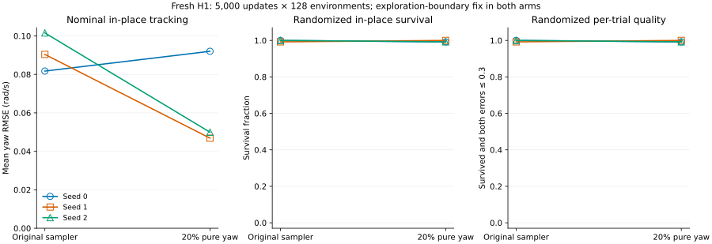
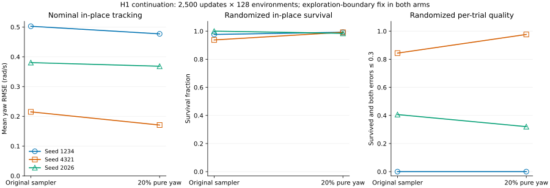
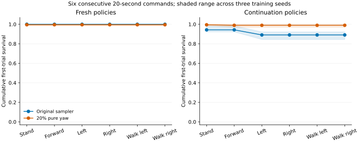
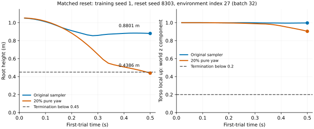

# H1 指令采样：探索边界修复后的从零训练与续训对照

本轮验证上一轮尚未覆盖的组合：**探索参数边界修复 + 20% 纯转向指令**。同时为 `h1-native evaluate` 增加逐环境存活与速度误差，并用 `--record-env` 选择要回放的环境，帮助区分“存活”和“跟踪指令”、复现具体失败。训练、评估均为 CPU headless，ef 继续用于编排。

实际新执行 **9 条训练任务、115,200,000 条环境转换**：六条从零训练、三条旧权重续训；另外复用上一轮三条同预算续训对照，并用新评估种子重新评估。补充的四组合分析另复用六条历史权重。所有复用训练均不计入本轮执行量。全部主实验最终权重完成固定指令与连续指令切换评估，没有挑选中间 checkpoint。

[机器可读结果](h1-command-mixture-20260930.json) 保存协议、源码清单、权重和证据哈希；原始 `runs/` 产物位于本机，不随 Git 分发。日期使用本地北京时间，实验起始 UTC 日期为 2026-09-29。上一轮机制、模型大小与消融见 [转向与探索参数研究](h1-turning-study-20260929.md)。

## 本轮决定

保留原指令采样和奖励默认值，接入逐环境评估指标与指定环境的首次试验记录。从零训练三种子的标称原地转向 yaw RMSE 均值从 0.0912 降至 0.0629 rad/s（改善 31.0%），但六类指令的随机试验存活数从 1151/1152 降至 1144/1152，未通过预声明的存活筛选。续训平均转向误差改善 7.5%，也不能覆盖从零训练的退化。所有最终权重和失败结果均保留。 追加八个随机起点 seed 后，存活数仍为原采样 4598/4608、候选 4567/4608；这组补充诊断没有改变主筛选规则。

逐环境字段已接入默认评估输出，不需要新启动模式。它们只扩充报告；四组同权重、同初始状态的完整新旧评估中，原有字段全部精确一致。

| 预声明筛选项 | 结果 |
| --- | --- |
| 从零训练的标称原地转向 yaw RMSE 至少改善 10% | 通过 |
| 从零训练的六命令标称存活数不下降 | 通过 |
| 续训的六命令标称存活数不下降 | 通过 |
| 从零训练的六命令随机存活数不下降 | 未通过 |
| 续训的六命令随机存活数不下降 | 通过 |
| 从零训练站立平面 RMSE 最多增加 0.03 m/s | 通过 |
| 从零训练前进平面 RMSE 最多增加 0.03 m/s | 通过 |
| 续训的标称原地转向 yaw RMSE 不上升 | 通过 |
| 从零训练 seed 0 的原地转向 yaw RMSE 最多增加 0.03 rad/s | 通过 |
| 从零训练 seed 1 的原地转向 yaw RMSE 最多增加 0.03 rad/s | 通过 |
| 从零训练 seed 2 的原地转向 yaw RMSE 最多增加 0.03 rad/s | 通过 |

这是本地默认配方筛选，不是统计显著性或真机验收。协议在训练前写入；RMSE 筛选使用标称评估这一点，在任何从零训练任务完成前另行澄清记录，数值阈值未改变。逐环境质量和连续切换指令属于补充诊断，不能用来覆盖主筛选失败。

## 配对结果

以下均值对每个权重的左右转向报告取算术平均。存活数对应三个训练种子 × 两个方向；随机评估每个方向使用两个种子、每次 32 行。不同方向复用同一批初始状态，384 次是试验实例，不是 384 个独立训练模型。

| 训练方式 | 方案 | 标称 yaw RMSE，rad/s | 标称存活 | 随机存活 | 随机逐行质量通过 |
| --- | --- | ---: | ---: | ---: | ---: |
| 从零训练 | 原采样 | 0.0912 | 6/6 | 383/384 | 383/384 |
| 从零训练 | 20% 纯转向 | 0.0629 | 6/6 | 382/384 | 382/384 |
| 续训 | 原采样 | 0.3660 | 6/6 | 373/384 | 160/384 |
| 续训 | 20% 纯转向 | 0.3387 | 6/6 | 380/384 | 166/384 |

逐行质量要求首次试验完整存活，且平面 RMSE ≤0.3 m/s、yaw RMSE ≤0.3 rad/s。这是预先记录的离线补充标准；CLI 的现有阈值仍作用于全局指标。没有把提前跌倒后的低误差算作通过。





| 训练方式 | seed | 原采样 yaw RMSE | 纯转向采样 yaw RMSE | 当前随机转向存活 | 纯转向随机转向存活 |
| --- | ---: | ---: | ---: | ---: | ---: |
| 从零训练 | 0 | 0.0817 | 0.0920 | 128/128 | 127/128 |
| 从零训练 | 1 | 0.0904 | 0.0469 | 127/128 | 128/128 |
| 从零训练 | 2 | 0.1016 | 0.0499 | 128/128 | 127/128 |
| 续训 | 1234 | 0.5026 | 0.4770 | 125/128 | 127/128 |
| 续训 | 4321 | 0.2150 | 0.1707 | 120/128 | 127/128 |
| 续训 | 2026 | 0.3805 | 0.3683 | 128/128 | 126/128 |

误差单位为 rad/s。每个训练种子的 128 次随机转向实例复用了 64 个初始状态。不同种子可能改善或退化；保留全部结果，没有按结果删除种子。

## 实验设计与预算

- 两个方案都保留上一轮 `log_std` 的 Adam 后投影修复、原奖励函数、网络结构、学习率 3e-4 和两个 CPU 线程。候选仅改变指令采样：使用原有同一次模式抽样，2% 站立、20% 纯 yaw、78% 前进加 yaw；对照为 2% 站立、98% 前进加 yaw。20% 指每次抽样概率，不保证 rollout 中恰好 20% 的帧使用纯转向命令。没有启用上一轮的纯转向抬脚奖励候选。
- 从零训练使用 seed 0、1、2，每个方案 128 环境 × 24 步 rollout × 5000 更新，即每条 15,360,000 次转换。这三个 seed 也是此前训练研究使用过的约定种子，不能称为完全未见的基准；本轮重新执行配对训练。
- 续训使用此前较弱的 seed 1234、4321、2026 输入链，恢复其 32 环境、10000 更新的 policy 和 Adam；新方案每条再执行 128 环境 × 24 步 × 2500 更新。对照复用上一轮同样输入、同样探索修复、同样预算的最终权重。新增报告字段不进入训练路径。
- 续训恢复 policy 与 Adam，但环境和 RNG 重新初始化；它不等价于连续不中断训练。从零和续训的累计转换数均为 15,360,000，但最终 Adam 步数分别为 100,000 与 250,000（每轮 5 个 epoch × 4 个 minibatch）。优化器步数、批量历史和环境历史不同，不能把两组之差单独归因于纯转向采样。
- 两个训练进程并行，方案顺序在 seed 间交错，部分评估和软件验证同时执行。GPU 正被其他任务占用，本轮禁用 CUDA。共享 CPU 负载下的耗时不用于声称吞吐提升。

固定指令评估覆盖站立、前进 0.5 m/s、原地左右 0.5 rad/s、前进加左右转向，每次最多 20 秒。标称起点一行；随机起点每次 32 行，评估 seed 8301、8302，与上一轮不同。初始姿态/速度、摩擦与躯干质量惯量按训练 reset 分布采样，观测噪声关闭，指令固定。所有权重使用同一评估代码，训练采样候选不会改变评估指令。

## 连续切换指令

补充评估连续执行站立→前进→原地左转→原地右转→行进左转→行进右转，每段 20 秒，共 120 秒。存活行在命令边界不重置；每个权重使用两个新评估 seed 8303、8304，各 32 个随机初始状态。跌倒后的帧永远不计入首次试验。



阴影是三个训练种子的范围，不是置信区间。各时间点统计同一批初始状态的累计存活；后段误差只来自此前仍存活的行，因此必须同时查看进入该段的数量与观察帧数。

| 训练方式 | 方案 | 进入最后一段 | 完成 120 秒 | 初始状态数 |
| --- | --- | ---: | ---: | ---: |
| 从零训练 | 原采样 | 192 | 192 | 192 |
| 从零训练 | 20% 纯转向 | 191 | 191 | 192 |
| 续训 | 原采样 | 171 | 171 | 192 |
| 续训 | 20% 纯转向 | 190 | 190 | 192 |

连续切换评估是本轮本机分析脚本，尚未新增产品 CLI。长时间存活不等于各段均成功跟踪命令；完整分段误差、覆盖帧数和逐行结果保存在机器记录中。

## 为什么增加逐环境指标

此前全局 RMSE 根据所有已观察帧计算：长时间存活的行贡献更多帧，提前跌倒的行统计窗口较短。单一均值无法指出具体失败的初始状态。新字段与已有 `observed_seconds` 使用相同的环境索引：

| 字段 | 含义 |
| --- | --- |
| `survived` | 每行首次试验是否完整存活；最后一步跌倒仍为 false |
| `planar_rmse_per_env` | 每行已观察帧的平面速度 RMSE，m/s |
| `yaw_rmse_per_env` | 每行已观察帧的 yaw 速度 RMSE，rad/s |

例如旧续训对照 seed 1234 在本轮 128 次随机左右转向实例中存活 125 次，但逐行质量通过数为 0。这个例子说明要同时看存活、误差和观察时长。128 次包含两个方向对同一批初始状态的复用。

全局指标仍满足 `global_rmse² = sum(per_env_rmse² × observed_seconds) / sum(observed_seconds)`。它与逐行 RMSE 的算术平均不同。现有验收参数与退出码不变，未配置阈值时 `accepted=null`；新增字段不会自动把逐行阈值变成产品验收要求。

## 完整固定指令结果

| 训练 | 协议 | 方案 | 指令 | 存活 / 次数 | 平面 RMSE，m/s | yaw RMSE，rad/s | 逐行质量通过 |
| --- | --- | --- | --- | ---: | ---: | ---: | ---: |
| 从零 | 标称 | 原采样 | 站立 | 3/3 | 0.0858 | 0.0909 | 3/3 |
| 从零 | 标称 | 原采样 | 前进 | 3/3 | 0.1183 | 0.0663 | 3/3 |
| 从零 | 标称 | 原采样 | 原地左转 | 3/3 | 0.0865 | 0.0832 | 3/3 |
| 从零 | 标称 | 原采样 | 原地右转 | 3/3 | 0.0948 | 0.0992 | 3/3 |
| 从零 | 标称 | 原采样 | 行进左转 | 3/3 | 0.1147 | 0.0525 | 3/3 |
| 从零 | 标称 | 原采样 | 行进右转 | 3/3 | 0.1240 | 0.0861 | 3/3 |
| 从零 | 标称 | 20% 纯转向 | 站立 | 3/3 | 0.1118 | 0.0571 | 3/3 |
| 从零 | 标称 | 20% 纯转向 | 前进 | 3/3 | 0.1190 | 0.0611 | 3/3 |
| 从零 | 标称 | 20% 纯转向 | 原地左转 | 3/3 | 0.0789 | 0.0552 | 3/3 |
| 从零 | 标称 | 20% 纯转向 | 原地右转 | 3/3 | 0.0963 | 0.0707 | 3/3 |
| 从零 | 标称 | 20% 纯转向 | 行进左转 | 3/3 | 0.1171 | 0.0672 | 3/3 |
| 从零 | 标称 | 20% 纯转向 | 行进右转 | 3/3 | 0.1175 | 0.0595 | 3/3 |
| 从零 | 随机 | 原采样 | 站立 | 192/192 | 0.0944 | 0.0927 | 192/192 |
| 从零 | 随机 | 原采样 | 前进 | 192/192 | 0.1334 | 0.0731 | 192/192 |
| 从零 | 随机 | 原采样 | 原地左转 | 192/192 | 0.0957 | 0.0863 | 192/192 |
| 从零 | 随机 | 原采样 | 原地右转 | 191/192 | 0.1054 | 0.0983 | 191/192 |
| 从零 | 随机 | 原采样 | 行进左转 | 192/192 | 0.1300 | 0.0612 | 192/192 |
| 从零 | 随机 | 原采样 | 行进右转 | 192/192 | 0.1381 | 0.0901 | 191/192 |
| 从零 | 随机 | 20% 纯转向 | 站立 | 191/192 | 0.1191 | 0.0638 | 191/192 |
| 从零 | 随机 | 20% 纯转向 | 前进 | 191/192 | 0.1354 | 0.0685 | 191/192 |
| 从零 | 随机 | 20% 纯转向 | 原地左转 | 191/192 | 0.0906 | 0.0614 | 191/192 |
| 从零 | 随机 | 20% 纯转向 | 原地右转 | 191/192 | 0.1094 | 0.0766 | 191/192 |
| 从零 | 随机 | 20% 纯转向 | 行进左转 | 190/192 | 0.1350 | 0.0733 | 190/192 |
| 从零 | 随机 | 20% 纯转向 | 行进右转 | 190/192 | 0.1332 | 0.0676 | 190/192 |
| 续训 | 标称 | 原采样 | 站立 | 3/3 | 0.0668 | 0.0846 | 3/3 |
| 续训 | 标称 | 原采样 | 前进 | 3/3 | 0.1367 | 0.2105 | 3/3 |
| 续训 | 标称 | 原采样 | 原地左转 | 3/3 | 0.1033 | 0.3706 | 1/3 |
| 续训 | 标称 | 原采样 | 原地右转 | 3/3 | 0.1043 | 0.3614 | 1/3 |
| 续训 | 标称 | 原采样 | 行进左转 | 3/3 | 0.1602 | 0.2121 | 3/3 |
| 续训 | 标称 | 原采样 | 行进右转 | 3/3 | 0.1296 | 0.2076 | 3/3 |
| 续训 | 标称 | 20% 纯转向 | 站立 | 3/3 | 0.0479 | 0.0953 | 3/3 |
| 续训 | 标称 | 20% 纯转向 | 前进 | 3/3 | 0.1535 | 0.1663 | 3/3 |
| 续训 | 标称 | 20% 纯转向 | 原地左转 | 3/3 | 0.0878 | 0.3713 | 1/3 |
| 续训 | 标称 | 20% 纯转向 | 原地右转 | 3/3 | 0.1036 | 0.3060 | 1/3 |
| 续训 | 标称 | 20% 纯转向 | 行进左转 | 3/3 | 0.1399 | 0.1869 | 3/3 |
| 续训 | 标称 | 20% 纯转向 | 行进右转 | 3/3 | 0.1511 | 0.1631 | 3/3 |
| 续训 | 随机 | 原采样 | 站立 | 183/192 | 0.1028 | 0.2057 | 181/192 |
| 续训 | 随机 | 原采样 | 前进 | 187/192 | 0.1507 | 0.2485 | 185/192 |
| 续训 | 随机 | 原采样 | 原地左转 | 183/192 | 0.1348 | 0.4500 | 52/192 |
| 续训 | 随机 | 原采样 | 原地右转 | 190/192 | 0.1347 | 0.3742 | 108/192 |
| 续训 | 随机 | 原采样 | 行进左转 | 186/192 | 0.1505 | 0.2479 | 184/192 |
| 续训 | 随机 | 原采样 | 行进右转 | 185/192 | 0.1557 | 0.2841 | 184/192 |
| 续训 | 随机 | 20% 纯转向 | 站立 | 192/192 | 0.0880 | 0.1128 | 192/192 |
| 续训 | 随机 | 20% 纯转向 | 前进 | 180/192 | 0.1563 | 0.1718 | 180/192 |
| 续训 | 随机 | 20% 纯转向 | 原地左转 | 189/192 | 0.1138 | 0.3761 | 61/192 |
| 续训 | 随机 | 20% 纯转向 | 原地右转 | 191/192 | 0.1268 | 0.2920 | 105/192 |
| 续训 | 随机 | 20% 纯转向 | 行进左转 | 177/192 | 0.1524 | 0.1969 | 177/192 |
| 续训 | 随机 | 20% 纯转向 | 行进右转 | 188/192 | 0.1647 | 0.1811 | 188/192 |

### 从零训练的失败定位

下表是主筛选完成后的定位分析：只列出配对方案至少一方跌倒的试验。20 秒表示完整存活；更短时间表示首次跌倒。候选的失败发生在 0.48–1.60 秒，主要暴露随机起点下的早期稳定性问题，不能据此认定长时间指令切换是原因。部分行重复使用同一个初始状态，因此不能把失败次数当作独立样本。

| 训练 seed | 指令 | 评估 seed | 环境索引 | 原采样观察秒数 | 纯转向观察秒数 |
| --- | --- | ---: | ---: | ---: | ---: |
| 0 | 站立 | 8301 | 16 | 20.00 | 0.48 |
| 0 | 原地右转 | 8301 | 16 | 20.00 | 1.02 |
| 1 | 前进 | 8301 | 16 | 20.00 | 0.62 |
| 1 | 原地右转 | 8301 | 17 | 0.64 | 20.00 |
| 1 | 行进左转 | 8301 | 16 | 20.00 | 0.62 |
| 1 | 行进左转 | 8302 | 24 | 20.00 | 0.64 |
| 2 | 原地左转 | 8301 | 18 | 20.00 | 1.60 |
| 2 | 行进右转 | 8301 | 17 | 20.00 | 0.56 |
| 2 | 行进右转 | 8301 | 26 | 20.00 | 0.52 |

## 追加随机起点检查

主筛选结束后，固定追加评估 seed 8401–8408，保持原来的六条从零训练最终权重、六种指令、32 环境与 20 秒窗口。协议在追加评估开始前写入。这 288 份报告只检查存活退化是否在更多起点重复出现，不重新训练、不挑 checkpoint，也不改变主筛选规则。

每个方案包含 3 个训练种子 × 8 个评估 seed × 32 行 × 6 条指令，共 4608 次试验实例。同一初始状态在指令间复用，训练种子之间也使用配对起点；新增起点不等于新增独立训练模型。

| 训练 seed | 原采样存活 / 次数 | 纯转向存活 / 次数 |
| --- | ---: | ---: |
| 0 | 1533/1536 | 1521/1536 |
| 1 | 1532/1536 | 1520/1536 |
| 2 | 1533/1536 | 1526/1536 |
| 合计 | 4598/4608 | 4567/4608 |

| 指令 | 原采样存活 | 纯转向存活 | 原采样平面 RMSE | 纯转向平面 RMSE | 原采样 yaw RMSE | 纯转向 yaw RMSE |
| --- | ---: | ---: | ---: | ---: | ---: | ---: |
| 站立 | 767/768 | 764/768 | 0.0947 | 0.1164 | 0.0938 | 0.0638 |
| 前进 | 768/768 | 760/768 | 0.1315 | 0.1348 | 0.0734 | 0.0754 |
| 原地左转 | 764/768 | 765/768 | 0.0974 | 0.0889 | 0.0862 | 0.0609 |
| 原地右转 | 766/768 | 758/768 | 0.1065 | 0.1091 | 0.1004 | 0.0776 |
| 行进左转 | 767/768 | 759/768 | 0.1281 | 0.1338 | 0.0627 | 0.0770 |
| 行进右转 | 766/768 | 761/768 | 0.1354 | 0.1326 | 0.0898 | 0.0708 |

配对实例中，两者均存活 4558 次，仅原采样存活 40 次，仅候选存活 9 次，两者均失败 1 次。这里的配对计数仍包含跨指令的重复初始状态，未据此做独立样本显著性检验。

追加结果按协议完整公布，保留主筛选失败及原采样默认值。不同评估种子下的存活计数应共同查看，不能只选较有利的一组。每份报告的汇总值与全部失败环境索引保存在 JSON，完整逐行数组留在本机带哈希的原始报告中。平面误差单位为 m/s，yaw 误差为 rad/s。


## 续训的四组合消融

结合上一轮已完成的权重，本轮补齐了采样与探索修复的 2×2 对照。四个分支对每个 seed 使用同一个预训练输入、相同 2500 更新预算和原奖励；六条旧优化器权重重新接受本轮统一评估，没有再次训练。这里分析两项改动的相互作用，不增加主筛选的通过路径。

| 优化器 | 采样 | 标称 yaw RMSE | 标称转向存活 | 随机 yaw RMSE | 随机转向存活 | 随机逐行质量通过 |
| --- | --- | ---: | ---: | ---: | ---: | ---: |
| 仅前向截断 | 原采样 | 0.5116 | 5/6 | 0.5201 | 312/384 | 114/384 |
| 仅前向截断 | 20% 纯转向 | 0.3454 | 6/6 | 0.3355 | 378/384 | 186/384 |
| Adam 后投影 | 原采样 | 0.3660 | 6/6 | 0.4121 | 373/384 | 160/384 |
| Adam 后投影 | 20% 纯转向 | 0.3387 | 6/6 | 0.3341 | 380/384 | 166/384 |

| 输入 seed | 旧优化器下采样效应 | 修复后采样效应 | 两者之差 |
| --- | ---: | ---: | ---: |
| 1234 | -0.0774 | -0.0256 | +0.0518 |
| 4321 | -0.4237 | -0.0443 | +0.3794 |
| 2026 | +0.0025 | -0.0122 | -0.0147 |

采样效应定义为“纯转向采样的标称左右转 yaw RMSE 均值 − 原采样均值”，单位 rad/s，负数表示误差下降。最后一列为“修复后的采样效应 − 旧优化器下的采样效应”。它是三个具体输入链的描述性差值；部分旧策略提前跌倒，RMSE 窗口不同，必须同时参考存活结果，不能据此宣称普遍的交互效应或统计显著性。


## 从逐环境结果复现一次真实跌倒

连续切换评估中，`fresh-mixture-s1` 在 seed 8303、32 环境的站立阶段有一行跌倒：环境 27 在 0.5 秒终止。环境 0 的录像无法代表这次失败。本轮增加 `--record-env`，并在完整 20 秒批量评估中记录这一行：

```bash
conda activate ef
H1_PY=/home/ubuntu/workspace/chase/EmbodiedForge/.cache/external/mjbatch/.venv/bin/python
PYTHONPATH=src "$H1_PY" -m embodiedforge h1-native evaluate --headless \
  --run runs/h1-command-mixture-20260930/fresh-mixture-s1 \
  --randomized-reset --num-envs 32 --threads 2 --seed 8303 \
  --steps 1000 --velocity 0 0 0 --record-motion --record-env 27 \
  --output runs/h1-failure-row27-replay
```

这是本机已训练权重的复现命令；在新机器上需先生成对应候选权重。必须保留批量大小与 seed，不能改成单环境后仍认为是同一个初始状态。`--record-env` 从 0 开始，需与 `--record-motion` 同时使用，越界参数在加载权重或创建输出目录前被拒绝。

实际产物在 `runs/h1-command-mixture-20260930/recorded-failure-env27/`。保存的运动恰好 25 帧、0.5 秒，最后一帧标记终止，未混入后续重置；完整批量的其他行仍继续接受评估。运动元数据记录环境索引、批量、seed、随机化模式及模型/权重 SHA256。使用同一模型载入 `RobotMotion` 后，FK 最大位置误差约 1.1×10⁻⁷ m。终止帧根高度为 0.4386 m，低于原有 0.45 m 保护阈值；躯干竖直轴的世界 z 分量为 0.9041，高于倾倒保护阈值 0.2。保存姿态可确认身体下沉满足了根高度终止条件，未据此推断未保存的接触力。带选行记录的完整评估与冻结对照的全部报告字段精确一致。回放命令见 [H1 指南](h1-native.md#评估与网页回放)。



补充对照在相同模型、seed 8303、32 环境和随机化设置下记录 `fresh-baseline-s1` 的同一行：原采样策略完整存活 20 秒，0.5 秒时根高度为 0.8801 m；候选此时为 0.4386 m。图中仅展示两者前 0.5 秒的首次试验姿态，虚线为既有终止阈值。两份回放均通过 FK 一致性校验。该案例是事后选中的失败定位，不是新增独立验收；没有以姿态代替接触力测量。


## 不同转速的补充评估

纯转向的角速度另覆盖 ±0.25、±0.75、±1.0 rad/s，使用新随机起点 seed 8305、32 行、20 秒。它们位于训练指令范围内，采用同一批初始状态配对比较；此补充诊断不改变以 ±0.5 rad/s 为主的预声明筛选。每格包含三个训练种子各 32 次试验，不是 96 个独立训练模型。这里沿用固定 0.3 的误差阈值：在 ±0.25 rad/s 下，即使完全不转也可能满足 yaw 阈值，因此另列实际平均 yaw 速度，不能只用阈值通过数宣称低速转向学会了。实际速度对逐环境已观察帧均值取平均，仍需结合存活结果。

| 训练 | 方案 | 指令 yaw，rad/s | 实际平均 yaw，rad/s | 存活 / 次数 | yaw RMSE，rad/s | 平面 RMSE，m/s | 按固定阈值通过 |
| --- | --- | ---: | ---: | ---: | ---: | ---: | ---: |
| 从零 | 原采样 | -1.00 | -0.9585 | 92/96 | 0.1112 | 0.1265 | 92/96 |
| 从零 | 原采样 | -0.75 | -0.7257 | 95/96 | 0.1024 | 0.1127 | 95/96 |
| 从零 | 原采样 | -0.25 | -0.2304 | 96/96 | 0.0959 | 0.0943 | 96/96 |
| 从零 | 原采样 | +0.25 | +0.2702 | 96/96 | 0.0865 | 0.0886 | 96/96 |
| 从零 | 原采样 | +0.75 | +0.7702 | 95/96 | 0.0848 | 0.0966 | 95/96 |
| 从零 | 原采样 | +1.00 | +1.0180 | 95/96 | 0.0899 | 0.1003 | 95/96 |
| 从零 | 20% 纯转向 | -1.00 | -0.9899 | 96/96 | 0.0971 | 0.1001 | 96/96 |
| 从零 | 20% 纯转向 | -0.75 | -0.7416 | 96/96 | 0.0835 | 0.1015 | 96/96 |
| 从零 | 20% 纯转向 | -0.25 | -0.2395 | 96/96 | 0.0658 | 0.1090 | 96/96 |
| 从零 | 20% 纯转向 | +0.25 | +0.2502 | 96/96 | 0.0555 | 0.1072 | 96/96 |
| 从零 | 20% 纯转向 | +0.75 | +0.7361 | 96/96 | 0.0647 | 0.0902 | 96/96 |
| 从零 | 20% 纯转向 | +1.00 | +0.9803 | 95/96 | 0.0727 | 0.0998 | 95/96 |
| 续训 | 原采样 | -1.00 | -0.4314 | 96/96 | 0.6103 | 0.2088 | 0/96 |
| 续训 | 原采样 | -0.75 | -0.3511 | 96/96 | 0.4442 | 0.1798 | 0/96 |
| 续训 | 原采样 | -0.25 | -0.0740 | 92/96 | 0.2806 | 0.0998 | 85/96 |
| 续训 | 原采样 | +0.25 | +0.0586 | 91/96 | 0.3435 | 0.1169 | 87/96 |
| 续训 | 原采样 | +0.75 | +0.3473 | 89/96 | 0.5156 | 0.1644 | 9/96 |
| 续训 | 原采样 | +1.00 | +0.5119 | 88/96 | 0.5687 | 0.1881 | 1/96 |
| 续训 | 20% 纯转向 | -1.00 | -0.5309 | 80/96 | 0.4758 | 0.1935 | 16/96 |
| 续训 | 20% 纯转向 | -0.75 | -0.4135 | 92/96 | 0.3810 | 0.1544 | 28/96 |
| 续训 | 20% 纯转向 | -0.25 | -0.1063 | 91/96 | 0.1956 | 0.1087 | 91/96 |
| 续训 | 20% 纯转向 | +0.25 | +0.0340 | 96/96 | 0.2449 | 0.0903 | 96/96 |
| 续训 | 20% 纯转向 | +0.75 | +0.3259 | 94/96 | 0.4691 | 0.1336 | 29/96 |
| 续训 | 20% 纯转向 | +1.00 | +0.4763 | 87/96 | 0.5816 | 0.1612 | 5/96 |

表中 RMSE 是报告间的算术平均；原始逐环境 RMSE 与存活数组保留在 JSON 中。六种命令重复使用初始状态，不应将试验数相加当作独立样本量。

补充结果也限制了续训收益的适用范围：在 −1.0 rad/s 下，纯转向采样虽将 yaw RMSE 从 0.6103 降至 0.4758，存活数却从 96/96 降至 80/96。因此不能把 ±0.5 rad/s 的均值改善推广到全部转速。另一个反例是 +0.25 rad/s：候选续训的固定阈值通过数达到 96/96，但实际平均 yaw 仅 +0.0340 rad/s；固定绝对误差阈值会掩盖低速指令跟踪不足。

## 模型、权重和训练成本

actor 仍为 69→128→128→128→19，critic 为 69→128→128→128→1，中间激活为 ELU。本轮没有改变模型规模。

| 项目 | 实测 |
| --- | ---: |
| actor 参数 | 44,435 |
| critic 参数 | 42,113 |
| log_std 参数 | 19 |
| 策略全部参数，含 critic 与 log_std | 86,567 |
| 策略 FP32 张量字节 | 346,268 |
| Adam 状态张量字节 | 692,604 |
| 单个训练 checkpoint 文件字节 | 1,060,407 |
| 编译模型及网格 MJB 字节 | 51,615,297 |

actor 的 FP32 参数数据为 177,740 字节；当前加载器读取包含 critic、探索参数、Adam 与归档开销的完整 checkpoint。不能将 checkpoint 文件大小等同于部署 actor 参数大小。

| 训练任务 | 本轮执行 | 新增更新 | 转换数 | 训练记录耗时，秒 |
| --- | --- | ---: | ---: | ---: |
| fresh-baseline-s0 | 是 | 5,000 | 15,360,000 | 1285.6 |
| fresh-mixture-s0 | 是 | 5,000 | 15,360,000 | 1476.8 |
| fresh-baseline-s1 | 是 | 5,000 | 15,360,000 | 1474.2 |
| fresh-mixture-s1 | 是 | 5,000 | 15,360,000 | 1296.5 |
| fresh-baseline-s2 | 是 | 5,000 | 15,360,000 | 1253.7 |
| fresh-mixture-s2 | 是 | 5,000 | 15,360,000 | 1255.8 |
| resume-baseline-s1234 | 复用上一轮 | 2,500 | 7,680,000 | 587.0 |
| resume-mixture-s1234 | 是 | 2,500 | 7,680,000 | 654.0 |
| resume-baseline-s4321 | 复用上一轮 | 2,500 | 7,680,000 | 608.1 |
| resume-mixture-s4321 | 是 | 2,500 | 7,680,000 | 656.0 |
| resume-baseline-s2026 | 复用上一轮 | 2,500 | 7,680,000 | 601.8 |
| resume-mixture-s2026 | 是 | 2,500 | 7,680,000 | 624.3 |

耗时取 `run.json.seconds`，包含环境初始化、更新和保存，不含前面的模型构建与进程启动。主实验 12 条结果的最终探索参数均位于既有 [-5,2] 范围内，包括复用的三个已修复对照；停在上界本身不等于梯度冻结。四组合消融另用的六条旧优化器权重保留原状态，不属于这一范围结论。逐关节值及主实验上界参数数保存在 JSON 中。

## 验证和限制

- ef 全套测试 913 通过、91 跳过；独立 SDK 的 H1 与核心 PPO 专项 43 通过。扩展既有集成测试检查逐环境指标、非零环境索引的首次试验记录及来源元数据，没有增加冒烟启动入口。
- 两个旧权重 × 左右转向的四组 32 行、20 秒新旧评估，已有报告字段全部精确一致；新增三个字段之外没有改变仿真和统计结果。包含提前跌倒与完整存活两类试验。
- 实验训练源码冻结于本机快照，JSON 保存源文件哈希与运行时记录。基线基于本轮开始时的工作树并加入本轮评估报告字段，包含尚未提交的前几轮修改，不等于单独的 Git HEAD。
- 这是三个从零训练种子、三个已知弱输入链的本地配对研究；没有假装随机初始状态数量等于独立训练种子，也没有进行显著性宣称。
- 没有运行中推力、观测噪声、新地形或真机测试。未训练横向移动，不能据此宣称全向部署能力。

## 训练与评估命令

在目标检出的仓库根目录执行，ef 保留为编排环境。`H1_PY` 指向已有 SDK 的绝对路径；`PYTHONPATH=src` 明确选择当前检出的源码，避免仍调用其他目录的 editable 安装。输出目录必须尚不存在；下面是完整预算的训练与评估，采样方案说明见下文。

```bash
conda activate ef
H1_PY=/home/ubuntu/workspace/chase/EmbodiedForge/.cache/external/mjbatch/.venv/bin/python
PYTHONPATH=src "$H1_PY" -m embodiedforge h1-native train --headless \
  --model /home/ubuntu/workspace/3rdparty/mink/examples/unitree_h1/h1.xml \
  --num-envs 128 --threads 2 --horizon 24 --updates 5000 \
  --seed 0 --learning-rate 0.0003 --output runs/h1-mixture-study-s0
PYTHONPATH=src "$H1_PY" -m embodiedforge h1-native evaluate --headless \
  --run runs/h1-mixture-study-s0 --randomized-reset --num-envs 32 \
  --threads 2 --seed 8301 --steps 1000 --velocity 0 0 0.5 \
  --min-survival 0.8 --max-planar-rmse 0.3 --max-yaw-rmse 0.3 \
  --output runs/h1-mixture-study-s0-left
```

带阈值评估未通过时仍保存报告并返回 2；本轮原始研究报告没有启用这些产品阈值。更换指令、评估 seed 和输出目录可完成其他条件。查看逐环境结果：

```python
import json
from pathlib import Path

report = json.loads(Path("runs/h1-mixture-study-s0-left/evaluation.json").read_text())
for i, (alive, seconds, planar, yaw) in enumerate(zip(
    report["survived"], report["observed_seconds"],
    report["planar_rmse_per_env"], report["yaw_rmse_per_env"],
)):
    print(i, alive, seconds, planar, yaw)
```

复现候选时，在独立检出中将 `src/embodiedforge/locomotion/h1_native.py` 的 `resample` 方法体改为以下采样；其余源文件使用同一实现，保留探索边界修复及原奖励。两个方案必须从同一输入、同一 seed 和相同预算独立训练，使用不同输出目录：

```python
self.commands[ids] = self.rng.uniform((0, 0, -1), (1, 0, 1), (len(ids), 3))
mode = self.rng.random(len(ids))
self.commands[ids[mode < 0.02]] = 0
self.commands[ids[(mode >= 0.02) & (mode < 0.22)], :2] = 0
```

对照采样的最后两行等价于仅执行 `self.commands[ids[mode < 0.02]] = 0`。续训须先准备相同的旧输入链：按 [上一轮复现命令](h1-turning-study-20260929.md#复现命令)，在旧优化器、原采样实现下训练 32 环境、10000 更新，然后恢复本轮 Adam 后投影修复。新机器不能直接用当前实现重训后声称获得了同一旧输入；本机输入 SHA256 已保存在 JSON 中。下面示范本机现有 seed 1234 输入的一条续训：

```bash
PYTHONPATH=src "$H1_PY" -m embodiedforge h1-native train --headless \
  --resume runs/h1-checkpoint-publication-20260929/candidate-s1234 \
  --num-envs 128 --threads 2 --horizon 24 --updates 2500 \
  --seed 1234 --learning-rate 0.0003 --output runs/h1-resume-study-s1234
```

两个采样方案分别在对应检出中运行，并更换输出目录；用 seed 4321、2026 及其对应输入完成其他配对。不要把不同前史的输入当作对照。本轮保留原采样默认值，因此未经候选源码修改的命令运行原采样。
