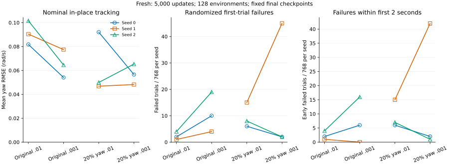
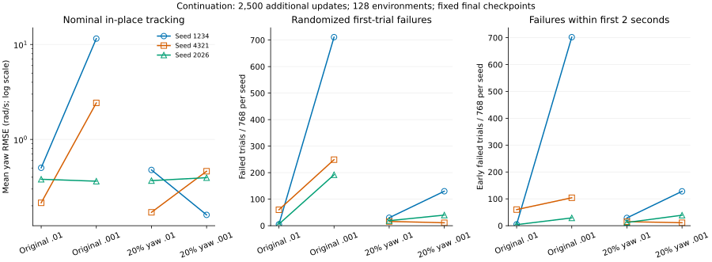
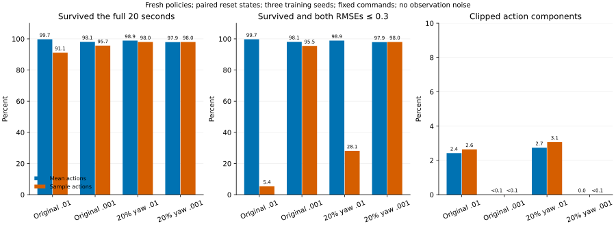
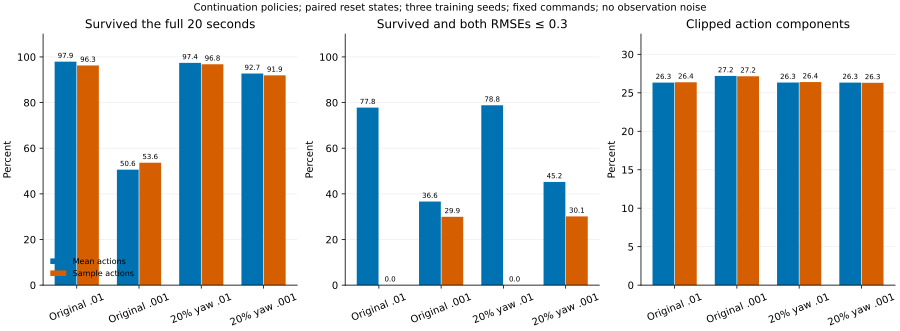
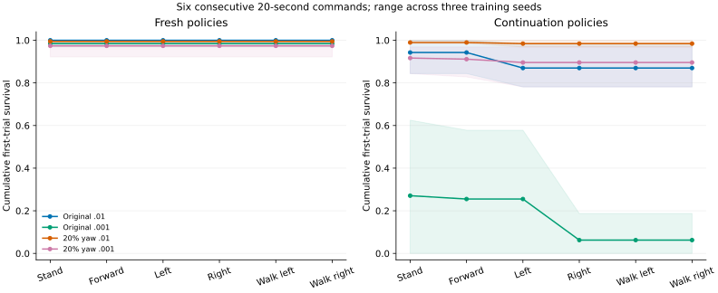

# H1 探索熵：训练动作、均值部署与完整预算消融

上一轮 [终止惩罚研究](h1-termination-cost-20260930.md) 发现：部分策略在随机动作训练中很少跌倒，部署为均值动作后却明显退化；增加随机动作可能提高存活，但不能恢复准确跟踪。本轮将 PPO 熵奖励系数从 **0.01 降到 0.001**，分别配对原采样器与 20% 纯转向采样器，检查能否减少这种差异。终止惩罚统一保持 −200，不能把本轮与 −400 配方直接混为一个因果对照。

实际新增 **12 条完整预算训练、138,240,000 条环境转换**，含六条从零训练和六条续训。复用十二条最终控制权重，以及先前完全相同条件下的 360 份固定指令、24 份连续指令评估；新增 360 份固定指令、24 份连续指令评估。另执行 576 份动作模式诊断（从零、续训各 288 份），无优化器更新，不计为训练预算。

[机器可读结果](h1-entropy-study-20260930.json) 保存预声明协议、逐环境结果、源码与权重哈希；本机原始数据和脚本位于 `runs/h1-entropy-study-20260930/`。`runs/` 被 Git 忽略，克隆仓库不会自动获得这些权重。

## 默认配方决定

两项候选均未通过预声明筛选，**保留原采样、0.01 熵系数及 −200 终止系数**。本轮产品改动还包括首次试验的动作限幅比例，和移除环境中重复的一次动作截断；未增加启动模式或 CLI 调参开关。

| 候选 | 配对对照 | 配对筛选 | 相对原默认 | 可替换默认 |
| --- | --- | --- | --- | --- |
| 原采样 / 0.001 | 原采样 / 0.01 | 未通过 | 未通过 | 否 |
| 纯转向采样 / 0.001 | 纯转向采样 / 0.01 | 未通过 | 未通过 | 否 |

门槛在首条训练开始前写入：从零训练随机总存活严格提高、每个训练 seed 的随机存活不降低；从零和续训标称存活不降；从零平均标称原地 yaw RMSE 最多增加 0.01 rad/s、每 seed 最多增加 0.03；站立和前进标称平面 RMSE 最多增加 0.03 m/s；续训随机存活不降、标称原地 yaw RMSE 最多增加 0.03 rad/s。候选既要通过其配对对照，也要通过相对原生产配方的同一检查；均通过时优先只改变熵系数。连续指令和动作诊断不能推翻筛选失败。

| 检查 | 原采样降熵 / 原配方 | 组合 / 纯转向 | 组合 / 原配方 |
| --- | --- | --- | --- |
| 从零随机总存活严格提高 | 未通过 | 未通过 | 未通过 |
| 从零标称存活不降 | 通过 | 通过 | 通过 |
| 续训标称存活不降 | 未通过 | 通过 | 通过 |
| 从零 seed 0 随机存活不降 | 未通过 | 通过 | 通过 |
| 从零 seed 0 原地 yaw RMSE 增量 ≤ 0.03 | 通过 | 通过 | 通过 |
| 从零 seed 1 随机存活不降 | 未通过 | 未通过 | 未通过 |
| 从零 seed 1 原地 yaw RMSE 增量 ≤ 0.03 | 通过 | 通过 | 通过 |
| 从零 seed 2 随机存活不降 | 未通过 | 通过 | 通过 |
| 从零 seed 2 原地 yaw RMSE 增量 ≤ 0.03 | 通过 | 通过 | 通过 |
| 从零平均原地 yaw RMSE 增量 ≤ 0.01 | 通过 | 通过 | 通过 |
| 从零站立平面 RMSE 增量 ≤ 0.03 | 通过 | 通过 | 通过 |
| 从零前进平面 RMSE 增量 ≤ 0.03 | 通过 | 通过 | 通过 |
| 续训随机总存活不降 | 未通过 | 未通过 | 未通过 |
| 续训平均原地 yaw RMSE 增量 ≤ 0.03 | 未通过 | 通过 | 通过 |

## 固定指令结果

每个训练种子对六条指令评估：站立、前进 0.5 m/s、原地左右转 ±0.5 rad/s、前进左右转。标称姿态每指令一行；随机起点为四个评估 seed（9001–9004）× 32 行。窗口 1,000 控制步，即 20 秒。推理使用均值动作，关闭观测噪声，只统计各行首次试验并包含终止帧。

下表 yaw 为三个训练 seed、左右两条标称原地转向报告的算术平均；随机存活分母是三个训练 seed × 六条指令 × 四批 × 32 行 = 2304。不同指令复用起点，不能把这些行视为 2304 个独立训练模型。

| 训练 | 配方 / 熵系数 | 标称原地 yaw RMSE | 标称存活 | 随机存活 | ≤2 秒失败 | >2 秒失败 |
| --- | --- | --- | --- | --- | --- | --- |
| 从零 | 原采样 / 0.01 | 0.0912 | 18/18 | 2297/2304 | 7 | 0 |
| 从零 | 原采样 / 0.001 | 0.0654 | 18/18 | 2271/2304 | 22 | 11 |
| 从零 | 纯转向采样 / 0.01 | 0.0629 | 18/18 | 2275/2304 | 28 | 1 |
| 从零 | 纯转向采样 / 0.001 | 0.0567 | 18/18 | 2255/2304 | 45 | 4 |
| 续训 | 原采样 / 0.01 | 0.3660 | 18/18 | 2233/2304 | 69 | 2 |
| 续训 | 原采样 / 0.001 | 4.7735 | 9/18 | 1152/2304 | 835 | 317 |
| 续训 | 纯转向采样 / 0.01 | 0.3387 | 18/18 | 2239/2304 | 56 | 9 |
| 续训 | 纯转向采样 / 0.001 | 0.3394 | 18/18 | 2123/2304 | 178 | 3 |

原采样降熵将平均标称原地 yaw RMSE 从 0.0912 降到 0.0654，但随机存活从 2297/2304 降到 2271/2304；三个训练 seed 的存活均下降。纯转向采样降熵也降低平均标称转向误差，却将随机存活从 2275/2304 降到 2255/2304。这是跟踪与随机起点稳定性的取舍，不能把较低的标称 RMSE 单独写成整体改进。





图中同色对应同一训练 seed，连线只连接采样相同、熵系数不同的一对；每个 seed 的随机存活分母为 768。续训图的 yaw 轴使用对数刻度，以同时展示短时失稳的大误差和其他策略的较低误差；失败计数轴保持线性。早期失败数只是描述，不能替代完整窗口的存活和跟踪误差。

| 训练 | seed | 配方 | 标称原地 yaw RMSE | 随机存活 |
| --- | --- | --- | --- | --- |
| 从零 | 0 | 原采样 / 0.01 | 0.0817 | 766/768 |
| 从零 | 0 | 原采样 / 0.001 | 0.0541 | 758/768 |
| 从零 | 0 | 纯转向采样 / 0.01 | 0.0920 | 762/768 |
| 从零 | 0 | 纯转向采样 / 0.001 | 0.0566 | 766/768 |
| 从零 | 1 | 原采样 / 0.01 | 0.0904 | 767/768 |
| 从零 | 1 | 原采样 / 0.001 | 0.0774 | 764/768 |
| 从零 | 1 | 纯转向采样 / 0.01 | 0.0469 | 753/768 |
| 从零 | 1 | 纯转向采样 / 0.001 | 0.0482 | 723/768 |
| 从零 | 2 | 原采样 / 0.01 | 0.1016 | 764/768 |
| 从零 | 2 | 原采样 / 0.001 | 0.0645 | 749/768 |
| 从零 | 2 | 纯转向采样 / 0.01 | 0.0499 | 760/768 |
| 从零 | 2 | 纯转向采样 / 0.001 | 0.0654 | 766/768 |
| 续训 | 1234 | 原采样 / 0.01 | 0.5026 | 763/768 |
| 续训 | 1234 | 原采样 / 0.001 | 11.5331 | 57/768 |
| 续训 | 1234 | 纯转向采样 / 0.01 | 0.4770 | 738/768 |
| 续训 | 1234 | 纯转向采样 / 0.001 | 0.1604 | 638/768 |
| 续训 | 4321 | 原采样 / 0.01 | 0.2150 | 708/768 |
| 续训 | 4321 | 原采样 / 0.001 | 2.4243 | 519/768 |
| 续训 | 4321 | 纯转向采样 / 0.01 | 0.1707 | 752/768 |
| 续训 | 4321 | 纯转向采样 / 0.001 | 0.4624 | 757/768 |
| 续训 | 2026 | 原采样 / 0.01 | 0.3805 | 762/768 |
| 续训 | 2026 | 原采样 / 0.001 | 0.3630 | 576/768 |
| 续训 | 2026 | 纯转向采样 / 0.01 | 0.3683 | 749/768 |
| 续训 | 2026 | 纯转向采样 / 0.001 | 0.3954 | 728/768 |

相同训练 seed、评估 seed、指令和环境索引可以逐行配对。下表把总存活变化拆成候选挽回的失败与候选新增的失败；净变化等于二者相减，不把复用起点当成独立显著性证据。

| 训练 | 候选 | 对照 | 双方存活 | 双方失败 | 候选挽回 | 候选新增失败 |
| --- | --- | --- | --- | --- | --- | --- |
| 从零 | 原采样 / 0.001 | 原采样 / 0.01 | 2264 | 0 | 7 | 33 |
| 从零 | 纯转向采样 / 0.001 | 纯转向采样 / 0.01 | 2229 | 3 | 26 | 46 |
| 从零 | 纯转向采样 / 0.001 | 原采样 / 0.01 | 2249 | 1 | 6 | 48 |
| 续训 | 原采样 / 0.001 | 原采样 / 0.01 | 1126 | 45 | 26 | 1107 |
| 续训 | 纯转向采样 / 0.001 | 纯转向采样 / 0.01 | 2074 | 16 | 49 | 165 |
| 续训 | 纯转向采样 / 0.001 | 原采样 / 0.01 | 2058 | 6 | 65 | 175 |

续训 seed 1234 的原采样降熵策略在六条标称指令下都于 0.24–0.44 秒终止；其原地 yaw RMSE 超过 10 rad/s，描述的是这段短暂失稳，不是持续 20 秒的稳定旋转。该模型随机存活仅 57/768，所有失败均纳入汇总，没有按异常值删除。相同输入的混合采样降熵虽然改善标称转向，也损失随机存活，说明对已有策略的影响依赖训练历史。

事后补录了 seed 1234 的标称右转及对应原采样控制：候选仅观察 0.24 秒，203/228 个动作分量被限幅（89.04%）；控制完整存活 20 秒、限幅 26.32%。补录报告的所有既有字段与主评估完全一致，轨迹位于本机 `recorded-resume-{baseline,entropy}-right-s1234/motion.npz`（研究运行目录下）。两者观察时长不同，限幅差异不能单独证明失稳原因；录制也不增加独立试验数。

## 从零训练、预训练历史与后续训练

这里的“预训练”指同一 H1 平地任务的已有 PPO 权重，不是通用机器人基础模型；“后续训练”是恢复策略和 Adam 的任务内续训，不是保证逐步等价的断点恢复。六条新续训分别使用同一组历史弱策略输入，使同 seed 的候选与对照具有相同起点。

| 阶段 | seed | 并行环境 × horizon × 更新数 | 环境转换 / 模型 | Adam 更新 / 模型 |
| --- | --- | --- | --- | --- |
| 本轮从零训练 | 0、1、2 | 128 × 24 × 5000 | 15,360,000 | 100,000 |
| 历史预训练输入 | 1234、4321、2026 | 32 × 24 × 10000 | 7,680,000 | 200,000 |
| 本轮新增续训 | 1234、4321、2026 | 128 × 24 × 2500 | 7,680,000 | 50,000 |

PPO 每轮 5 个 epoch × 4 个 minibatch = 20 次 Adam 更新。续训结束累计轮数为 12,500、Adam 步数 250,000。虽然“历史预训练 + 续训”和“从零 5,000 轮”的总环境转换数同为 15,360,000，批量、优化器步数和历史不同，不能按相同数据量认定两个训练过程等价。历史输入使用旧版仅前向限制 `log_std` 的实现；本轮所有候选与控制的继续训练都采用已修复的更新后投影。

本轮比较的从零训练与续训采用 CPU、每进程两线程、学习率 0.0003、128 环境、horizon 24；`--updates` 为本次新增轮数。续训继承策略与 Adam，环境和 RNG 重新初始化。两条进程交错执行配方，未改变预算、提前停止或按评估挑选中间 checkpoint；结果使用最终保存点。共享主机上的运行时长不作为吞吐性能对照；逐字段精确相等的校验限于本机条件，不承诺跨硬件、编译器或依赖版本的逐位确定性。

## 熵项与实际动作的区别

策略分布为 `Normal(actor(obs), exp(clamp(log_std, -5, 2)))`。19 个关节各有一个可学习 `log_std`，共享于全部状态。PPO 损失包含 `actor_loss + critic_loss - beta * mean(sum(entropy_per_joint))`；在采样相同的配对中仅修改 `beta`，不改策略网络、学习率、价值损失、梯度裁剪或标准差边界。较小的 beta 减弱鼓励探索的梯度，但不强制所有关节的标准差下降。两种 beta 的总损失数值也不能直接作为学习优劣指标。

训练从该高斯分布采样，环境再把动作截断至 ±5，并以 `default_joint_position + 0.5 * action` 形成关节目标。熵项描述的是截断前高斯分布，不是实际执行动作的熵。`log_std=2` 对应原始动作标准差约 7.389；环境的 ±5 限幅会明显改变采样动作分布。均值部署计算 `clip(actor(obs))`，它一般不等于随机部署的平均 `E[clip(action)]`，更不保证闭环轨迹等价。

| 训练 | 配方 | 各 seed 最终最大 log_std | 各 seed 到达上界的关节数 | 末 500 轮每十万转换跌倒数均值 |
| --- | --- | --- | --- | --- |
| 从零 | 原采样 / 0.01 | 0.419, 0.672, 1.039 | 0, 0, 0 | 9.98 |
| 从零 | 原采样 / 0.001 | -0.935, -0.822, -0.864 | 0, 0, 0 | 23.68 |
| 从零 | 纯转向采样 / 0.01 | 1.094, 0.351, 0.508 | 0, 0, 0 | 9.92 |
| 从零 | 纯转向采样 / 0.001 | -0.893, -0.910, -1.009 | 0, 0, 0 | 9.87 |
| 续训 | 原采样 / 0.01 | 2.000, 2.000, 2.000 | 4, 3, 4 | 10.29 |
| 续训 | 原采样 / 0.001 | 2.000, 2.000, 2.000 | 0, 1, 1 | 313.04 |
| 续训 | 纯转向采样 / 0.01 | 2.000, 2.000, 2.000 | 4, 1, 4 | 10.89 |
| 续训 | 纯转向采样 / 0.001 | 2.000, 2.000, 1.989 | 1, 1, 0 | 9.77 |

表内 seed 顺序分别为从零训练 0/1/2、续训 1234/4321/2026；最大值保留三位小数，上界关节数按原始值严格等于 2 计数，因此显示 2.000 不一定表示恰好触及上界。末 500 轮每模型覆盖 1,536,000 条转换。训练同时包含随机动作、观测噪声和周期换指令；固定指令部署评估关闭后两者并使用均值动作，因此训练跌倒率不能直接替代部署验收。上述标准差只反映最终保存点，不是整个训练过程的因果解释。

从零训练候选的各 seed 最大 `log_std` 都小于零，意味着所有关节的原始动作标准差都小于 1；续训候选仍保留接近上界的探索参数，不能把从零训练中噪声与限幅的下降直接外推到旧权重。原采样降熵续训的末 500 轮平均跌倒率为每十万转换 313.04 次，对照为 10.29 次，说明退化也出现在训练中，并非完全由均值评估口径造成。

## 均值与随机动作的配对诊断

诊断在训练完成前预声明，覆盖四配方 × 三个从零训练 seed × 六条指令 × 两个 reset seed × 两种动作模式，共 288 份报告。reset/action seed 分别为 9001/9101、9002/9102；每份 32 行、最长 20 秒。每一对只改变动作是否采样，初始状态、指令、无噪声观测和终止口径保持一致。没有优化器更新，随机动作诊断不是新的部署入口。

续训动作诊断在两组从零训练结果出现后、全部续训开始前追加，沿用相同评估条件，另执行 288 份报告。它针对历史大探索噪声的适应过程，不改变筛选规则。

### 从零训练的动作模式对比

| 配方 | 动作 | 完整存活 | 存活且跟踪通过 | 随机原地 yaw RMSE | 动作限幅比例 |
| --- | --- | --- | --- | --- | --- |
| 原采样 / 0.01 | 均值 | 1149/1152 | 1149/1152 | 0.0936 | 2.425486% |
| 原采样 / 0.01 | 采样 | 1050/1152 | 62/1152 | 0.3560 | 2.642993% |
| 原采样 / 0.001 | 均值 | 1130/1152 | 1130/1152 | 0.0726 | 0.000753% |
| 原采样 / 0.001 | 采样 | 1102/1152 | 1100/1152 | 0.1651 | 0.002262% |
| 纯转向采样 / 0.01 | 均值 | 1139/1152 | 1139/1152 | 0.0685 | 2.736741% |
| 纯转向采样 / 0.01 | 采样 | 1129/1152 | 324/1152 | 0.3598 | 3.070372% |
| 纯转向采样 / 0.001 | 均值 | 1128/1152 | 1128/1152 | 0.0685 | 0.000000% |
| 纯转向采样 / 0.001 | 采样 | 1129/1152 | 1129/1152 | 0.1370 | 0.000033% |



### 续训的动作模式对比

| 配方 | 动作 | 完整存活 | 存活且跟踪通过 | 随机原地 yaw RMSE | 动作限幅比例 |
| --- | --- | --- | --- | --- | --- |
| 原采样 / 0.01 | 均值 | 1128/1152 | 896/1152 | 0.3961 | 26.325284% |
| 原采样 / 0.01 | 采样 | 1109/1152 | 0/1152 | 0.5014 | 26.370848% |
| 原采样 / 0.001 | 均值 | 583/1152 | 422/1152 | 1.4458 | 27.190701% |
| 原采样 / 0.001 | 采样 | 618/1152 | 345/1152 | 1.5473 | 27.151517% |
| 纯转向采样 / 0.01 | 均值 | 1122/1152 | 908/1152 | 0.3335 | 26.331503% |
| 纯转向采样 / 0.01 | 采样 | 1115/1152 | 0/1152 | 0.4943 | 26.394027% |
| 纯转向采样 / 0.001 | 均值 | 1068/1152 | 521/1152 | 0.3237 | 26.327960% |
| 纯转向采样 / 0.001 | 采样 | 1059/1152 | 347/1152 | 0.3699 | 26.296847% |



从零训练策略在这两批随机起点中，原采样降熵使随机动作的合格计数从 62/1152 提高到 1100/1152；混合采样从 324/1152 提高到 1129/1152。动作模式差距确实缩小，但同条件下均值动作的合格计数分别从 1149 降到 1130、从 1139 降到 1128。因此诊断目标的改善与默认部署鲁棒性退化可以同时发生。

续训中，随机动作的合格计数由两个控制组的 0/1152 分别提高到 345/1152 和 347/1152，但同条件均值部署的合格计数分别从 896 降到 422、从 908 降到 521。这仍不支持替换默认部署配方。

“存活且跟踪通过”要求每行完整存活，且该行 planar RMSE ≤ 0.3 m/s、yaw RMSE ≤ 0.3 rad/s。这里的 yaw 是随机起点原地指令报告均值，不是主筛选的标称 yaw；限幅比例按实际观测动作分量加权。提前失败缩短观测窗口，因此限幅少本身不代表更好。表格比例保留六位小数；图中小于 0.1% 的正值显示为 `<0.1`，不应读作严格零。

全部 288 份均值动作诊断的首次试验数组与主评估逐项一致；72 份旧控制组采样诊断与前一研究逐项一致。诊断实际执行 17,950,720 条仿真转换，其中首次试验实际观测 16,960,093 条；差额来自失败行重置后仍随批量积分的转换，后者不计入存活、误差或限幅统计。诊断不计入训练量，不能从单个指标改善推导随机部署优于均值部署。

## 连续 120 秒指令切换

补充评估按站立、前进、原地左转、原地右转、前进左转、前进右转顺序执行，各 20 秒；存活行不中途重置。使用评估 seed 9005、9006，每次 32 行；每配方三模型，分母 192。失败后的模拟重置只为保持批量积分，不重新计入存活。

| 训练 | 配方 | 120 秒完整存活 | 六段均存活且跟踪通过 |
| --- | --- | --- | --- |
| 从零 | 原采样 / 0.01 | 192/192 | 192/192 |
| 从零 | 原采样 / 0.001 | 189/192 | 189/192 |
| 从零 | 纯转向采样 / 0.01 | 191/192 | 191/192 |
| 从零 | 纯转向采样 / 0.001 | 187/192 | 187/192 |
| 续训 | 原采样 / 0.01 | 167/192 | 50/192 |
| 续训 | 原采样 / 0.001 | 12/192 | 0/192 |
| 续训 | 纯转向采样 / 0.01 | 189/192 | 64/192 |
| 续训 | 纯转向采样 / 0.001 | 172/192 | 110/192 |

连续指令也有局部正面结果：纯转向采样降熵续训的六段跟踪合格数从 64/192 增至 110/192，但完整存活从 189/192 降至 172/192。连续指令路径与每条指令重新起步的协议不同，不能互相替代；本轮只测试一种切换顺序，这项质量改善不能覆盖主筛选的随机起点稳定性退化。



质量列要求每一段都完整存活且两个逐行 RMSE 均 ≤ 0.3；在存活行中再挑低误差不能代替这个计数。曲线阴影展示训练 seed 之间的范围，不是置信区间。

## 参数量、权重和模型资产

| 内容 | 大小 |
| --- | --- |
| Actor 参数 | 44435 |
| Critic 参数 | 42113 |
| 探索 log_std 参数 | 19 |
| 完整 Policy 参数 | 86567 |
| Actor FP32 张量字节 | 177740 |
| 完整 Policy 张量字节 | 346268 |
| Adam 状态张量字节 | 692604 |
| 完整 checkpoint 文件字节 | 1060407 |
| 编译 MJB 文件字节 | 51615297 |

完整 checkpoint 为 1.011 MiB，MJB 为 49.224 MiB（1 MiB = 1,048,576 字节）。

网络为 Actor `69 → 128 → 128 → 128 → 19`、Critic `69 → 128 → 128 → 128 → 1`，隐藏层 ELU。四配方网络结构与参数量相同；降低熵奖励不会压缩网络或减小权重文件。checkpoint 包含策略、优化器、步数等元数据；张量字节不是进程峰值内存，也不是 ZIP 文件大小。MJB 含模型与网格，属于仿真资产，不是神经网络权重。均值评估不使用 Critic/探索采样，但当前加载接口仍构建完整 Policy，不能将 Actor 张量大小声称为现有部署进程占用。

全部 24 个 MJB 的 SHA256 相同：`6c50b2a6642ac834bfab4771e3758b312f1c162ecfb3884be9ce98d490af7bd3`。各权重、输入权重、运行依赖与实际加载模块的路径/源码 SHA256 均在 JSON 中保存。

## 产品诊断与数值验证

H1 评估新增 `action_clip_fraction_per_env` 与按观测步数加权的 `action_clip_fraction`。分母为首次试验实际步数 × 19 个关节，包含终止帧、排除重置后的动作，原始值恰好为 ±5 不计为截断；该指标不表示关节触碰机械行程边界，也不新增验收阈值。环境与评估共享限幅常量，并移除环境对已经截断动作的重复截断。

四组真实权重新旧评估的所有旧字段完全一致；带训练噪声/随机重置的 32 环境 × 1,200 步轨迹（固定策略加小幅动作噪声，无优化器更新），观测、奖励、状态和标志哈希完全一致，覆盖 1 次跌倒、32 次时间截断和 64 个换指令边界。真实失败行的独立原始动作轨迹含 475 个分量、15 次截断，新报告精确得到 15/475；这也验证失败行没有混入其后重置动作。

验证结果：ef 通用测试 **913 通过、91 跳过**，原生 H1 专项 **26 通过**。本轮涉及的 H1 路径另在带真实仿真依赖的环境验证；其他可选组件的跳过不等于通过。仅扩展已有集成测试断言，没有新增测试函数或冒烟启动设计。变更文件 Ruff 与格式检查通过；全仓库 Ruff 的 100 项既有问题与启动时源码快照完全一致，本轮未增加。训练快照在产品诊断改动前冻结，主评估采用固定 baseline-source；诊断采用 reported-source，轨迹与评估等价性支持两者可比。

## 训练、续训和评估命令

本机继续使用 ef 编排，并让已有原生 SDK 解释器执行 H1。每个输出目录必须不存在，正式训练使用完整预算。

```bash
conda activate ef
H1_PY=/home/ubuntu/workspace/chase/EmbodiedForge/.cache/external/mjbatch/.venv/bin/python
PYTHONPATH=src "$H1_PY" -m embodiedforge h1-native train --headless \
  --model /home/ubuntu/workspace/3rdparty/mink/examples/unitree_h1/h1.xml \
  --num-envs 128 --threads 2 --horizon 24 --updates 5000 \
  --seed 0 --learning-rate 0.0003 --output runs/h1-production-new

PYTHONPATH=src "$H1_PY" -m embodiedforge h1-native train --headless \
  --resume runs/h1-production-new --num-envs 128 --threads 2 \
  --horizon 24 --updates 2500 --seed 0 --learning-rate 0.0003 \
  --output runs/h1-production-continued
```

上面的续训展示日常使用，输入是刚训练的策略；它不等同于论文表格中的历史弱策略续训。复现本轮候选必须使用留存的 frozen snapshot 与对应输入，不能把今天的 `src` 自动认作历史研究实现。以下命令复现一条候选和一条研究续训；更换 seed 重复全部三组。

```bash
PYTHONPATH=runs/h1-entropy-study-20260930/entropy-source \
  "$H1_PY" -m embodiedforge h1-native train --headless \
  --model /home/ubuntu/workspace/3rdparty/mink/examples/unitree_h1/h1.xml \
  --num-envs 128 --threads 2 --horizon 24 --updates 5000 \
  --seed 0 --learning-rate 0.0003 --output runs/h1-entropy-reproduce-s0

PYTHONPATH=runs/h1-entropy-study-20260930/entropy-source \
  "$H1_PY" -m embodiedforge h1-native train --headless \
  --resume runs/h1-checkpoint-publication-20260929/candidate-s1234 \
  --num-envs 128 --threads 2 --horizon 24 --updates 2500 \
  --seed 1234 --learning-rate 0.0003 --output runs/h1-entropy-reproduce-resume-s1234
```

纯转向组合使用 `mixedentropy-source`；原控制分别是 `baseline-source` 与 `mixture-source`。本机保留的实验快照可直接运行，其他机器须提供模型资产、历史输入权重和匹配源码。四组合的完整源码差分与 102 个包内 Python 文件哈希保存在 JSON 的 `implementation_audit` / `implementations`；训练时实际模块由 `training-runtime.json` 记录。源码快照清单不表示每一个包文件都被本次执行加载。

新研究版本的唯一区别是 PPO 损失中熵系数 0.01 / 0.001 与 `resample_commands` 的采样：原配方 2% 站立、98% 前进加转向；混合配方 2% 站立、20% 原地转向、78% 前进加转向。前向速度统一均匀采样 [0,1]、yaw 统一 [−1,1]，同一次 mode 随机抽样决定将哪些行前向速度归零；没有额外 RNG 抽样。

对新训练的模型应分别检查标称和随机起点。以下以原地左转为例；其他五条指令同样独立运行并更换输出目录。

```bash
PYTHONPATH=src "$H1_PY" -m embodiedforge h1-native evaluate --headless \
  --run runs/h1-production-new --threads 2 --steps 1000 \
  --velocity 0 0 0.5 --min-survival 0.8 \
  --max-planar-rmse 0.3 --max-yaw-rmse 0.3 \
  --output runs/h1-production-left

PYTHONPATH=src "$H1_PY" -m embodiedforge h1-native evaluate --headless \
  --run runs/h1-production-new --randomized-reset --num-envs 32 \
  --seed 9001 --threads 2 --steps 1000 --velocity 0 0 0.5 \
  --min-survival 0.8 --max-planar-rmse 0.3 --max-yaw-rmse 0.3 \
  --record-motion --record-env 0 --output runs/h1-production-left-random
```

这些命令的 0.8/0.3 阈值属于单次运行门槛，不是本文三种子候选替换规则。阈值失败仍保存 `evaluation.json` 并退出 2；不指定阈值时 `accepted=null`，命令成功只代表完成评估。网页运动回放步骤见 [H1 使用说明](h1-native.md#评估与网页回放)，仿真评估不能直接充当真机部署验收。

## 解释边界

本轮只有三个从零训练 seed，以及三个事先选定的弱续训输入；结果不代表全部随机初始化。评估覆盖训练内随机起点与物理参数，没有外部推力、新地形、传感器延迟或真实硬件。若多轮调参反复使用同一评估 seed，会使这些起点逐渐成为开发集；这里不把它们称为独立留出验证。后续候选发布还需要未参与配方筛选的起点与更多训练种子。

本轮隔离的是熵系数与指令采样，不能由动作限幅的相关性直接断言“限幅就是失败原因”，也没有证明修改关节目标范围或改成随机部署可以解决问题。失败行的 RMSE 只覆盖终止前窗口，需与存活和时长一起解读。全部候选、失败种子及未通过门槛均保留，不以单个成功案例替代总体结果。
