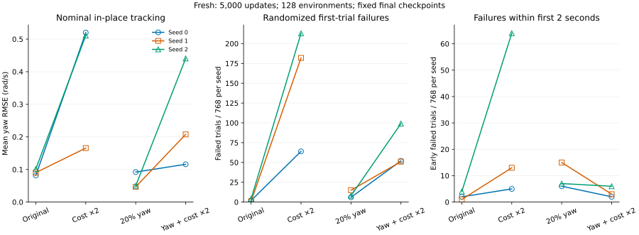
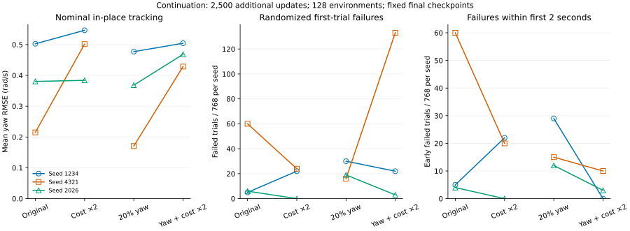
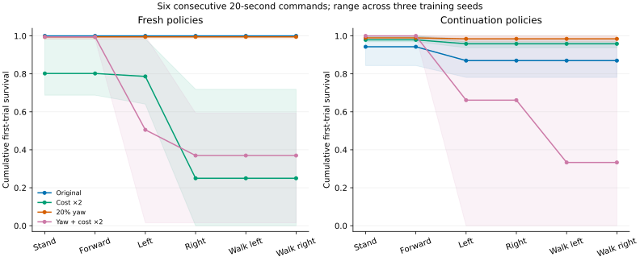
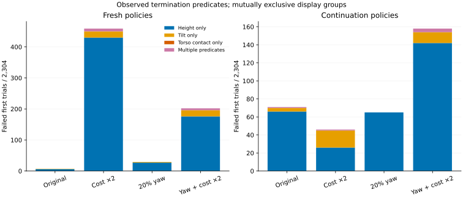
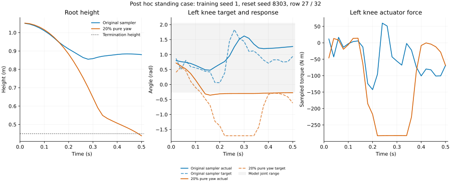

# H1 终止惩罚：早期稳定性、指令采样与配对续训

上一轮 [指令采样研究](h1-command-mixture-20260930.md) 中，20% 纯转向采样降低了平均转向误差，却增加随机起点下的早期失败。本轮检查更强的失败惩罚是否能改善这一问题：仅将终止项系数从 −200 改为 −400，并与原采样/纯转向采样组成四组合对照。原奖励不是软件错误，候选也不预设为改进。

每个控制步为 0.02 秒，终止项对失败步回报的贡献因此从 −4 改为 −8；这是该项贡献，不是包含其他奖励后的整个步回报。所有候选都保留已有的探索参数边界修复、网络、优化器、学习率、动作缩放、随机化与终止阈值。

实际新增 **12 条完整预算训练、138,240,000 条环境转换**：六条从零训练、六条续训。复用十二条历史最终权重作为对照，统一重新评估；复用训练不计入本轮执行量。全部实验为 CPU headless，ef 用于编排，原生 SDK 负责训练。

[机器可读结果](h1-termination-cost-20260930.json) 保存实验协议、逐环境结果、权重与源码哈希。原始权重、完整日志和分析脚本留在本机 `runs/h1-termination-cost-20260930/`，不随 Git 分发。

## 本轮决定

两项候选均未满足预声明的默认替换条件，**保留原采样及 −200 终止系数**。新增的 `termination_reasons` 诊断字段接入产品评估；研究中的奖励与采样候选只保留在实验快照中。

| 候选 | 对应对照 | 配对筛选 | 相对原默认 | 可替换默认 |
| --- | --- | --- | --- | --- |
| 原采样 / −400 | 原采样 / −200 | 未通过 | 未通过 | 否 |
| 纯转向采样 / −400 | 纯转向采样 / −200 | 未通过 | 未通过 | 否 |

筛选在训练开始前写入：从零训练的全部随机试验存活数须严格提高、各训练 seed 存活数不得降低；标称存活不得退化，平均标称原地转向误差最多增加 0.01 rad/s、各 seed 最多增加 0.03；站立和前进的标称平面误差最多增加 0.03 m/s。续训的标称与随机存活数不得降低，平均标称原地转向误差最多增加 0.03 rad/s。候选还须对原生产配方满足同一套条件；两者均合格时优先仅改终止惩罚。

这是本地默认配方筛选，不是显著性检验或真机认证。连续指令和原因分析只用于解释结果，不能覆盖主筛选失败。所有训练 seed 与最终 checkpoint 均保留，没有按结果挑选。

| 预声明检查 | 原采样加倍 / 原配方 | 组合 / 纯转向 | 组合 / 原配方 |
| --- | --- | --- | --- |
| 从零随机总存活严格提高 | 未通过 | 未通过 | 未通过 |
| 从零标称存活不降 | 未通过 | 未通过 | 未通过 |
| 续训标称存活不降 | 通过 | 未通过 | 未通过 |
| 从零平均原地 yaw RMSE 增量 ≤ 0.01 | 未通过 | 未通过 | 未通过 |
| 从零站立平面 RMSE 增量 ≤ 0.03 | 未通过 | 通过 | 通过 |
| 从零前进平面 RMSE 增量 ≤ 0.03 | 未通过 | 通过 | 通过 |
| 续训随机总存活不降 | 通过 | 未通过 | 未通过 |
| 续训平均原地 yaw RMSE 增量 ≤ 0.03 | 未通过 | 未通过 | 未通过 |
| 从零 seed 0 随机存活不降 | 未通过 | 未通过 | 未通过 |
| 从零 seed 0 原地 yaw RMSE 增量 ≤ 0.03 | 未通过 | 通过 | 未通过 |
| 从零 seed 1 随机存活不降 | 未通过 | 未通过 | 未通过 |
| 从零 seed 1 原地 yaw RMSE 增量 ≤ 0.03 | 未通过 | 未通过 | 未通过 |
| 从零 seed 2 随机存活不降 | 未通过 | 未通过 | 未通过 |
| 从零 seed 2 原地 yaw RMSE 增量 ≤ 0.03 | 未通过 | 未通过 | 未通过 |

## 总体结果

转向误差为三个训练 seed、左右两个标称指令报告的算术平均。随机存活为三个训练 seed × 四个评估 seed × 32 行 × 六条指令，共 2304 次试验实例。指令间复用初始状态，这些实例不是 2304 个独立模型。

| 训练 | 配方 | 标称原地 yaw RMSE | 六指令标称存活 | 六指令随机存活 | 两秒内失败 | 两秒后失败 |
| --- | --- | ---: | ---: | ---: | ---: | ---: |
| 从零 | 原采样 / −200 | 0.0912 | 18/18 | 2297/2304 | 7 | 0 |
| 从零 | 原采样 / −400 | 0.3988 | 13/18 | 1845/2304 | 82 | 377 |
| 从零 | 纯转向采样 / −200 | 0.0629 | 18/18 | 2275/2304 | 28 | 1 |
| 从零 | 纯转向采样 / −400 | 0.2547 | 17/18 | 2102/2304 | 11 | 191 |
| 续训 | 原采样 / −200 | 0.3660 | 18/18 | 2233/2304 | 69 | 2 |
| 续训 | 原采样 / −400 | 0.4773 | 18/18 | 2258/2304 | 42 | 4 |
| 续训 | 纯转向采样 / −200 | 0.3387 | 18/18 | 2239/2304 | 56 | 9 |
| 续训 | 纯转向采样 / −400 | 0.4672 | 17/18 | 2146/2304 | 13 | 145 |

从零训练中，仅加倍惩罚将随机存活从 2297/2304 降至 1845/2304，三个训练 seed 均退化。组合方案虽然将纯转向对照的两秒内失败从 28 次降至 11 次，却把两秒后失败从 1 次增至 191 次。因此早期稳定性的单项改善没有转化为完整窗口的改善。

续训中，仅加倍惩罚使总随机存活增加 25 次，但标称原地 yaw RMSE 从 0.3660 增至 0.4773 rad/s，超过允许增量。这是存活与指令跟踪之间的取舍，不能据此替换默认配方。

yaw 误差单位为 rad/s。两秒内失败包含第 2 秒的终止帧；这里按首次试验计数。失败分布属于补充描述，不替代总存活和跟踪误差。





同色为同一训练 seed，连线只连接采样相同、终止系数不同的一对。每个 seed 的随机试验分母为 768；图中的失败计数重复使用初始状态，不是独立样本显著性证据。

| 训练 | seed | 配方 | 标称原地 yaw RMSE | 随机存活 / 次数 |
| --- | ---: | --- | ---: | ---: |
| 从零 | 0 | 原采样 / −200 | 0.0817 | 766/768 |
| 从零 | 0 | 原采样 / −400 | 0.5199 | 704/768 |
| 从零 | 0 | 纯转向采样 / −200 | 0.0920 | 762/768 |
| 从零 | 0 | 纯转向采样 / −400 | 0.1160 | 716/768 |
| 从零 | 1 | 原采样 / −200 | 0.0904 | 767/768 |
| 从零 | 1 | 原采样 / −400 | 0.1657 | 586/768 |
| 从零 | 1 | 纯转向采样 / −200 | 0.0469 | 753/768 |
| 从零 | 1 | 纯转向采样 / −400 | 0.2076 | 717/768 |
| 从零 | 2 | 原采样 / −200 | 0.1016 | 764/768 |
| 从零 | 2 | 原采样 / −400 | 0.5109 | 555/768 |
| 从零 | 2 | 纯转向采样 / −200 | 0.0499 | 760/768 |
| 从零 | 2 | 纯转向采样 / −400 | 0.4406 | 669/768 |
| 续训 | 1234 | 原采样 / −200 | 0.5026 | 763/768 |
| 续训 | 1234 | 原采样 / −400 | 0.5464 | 746/768 |
| 续训 | 1234 | 纯转向采样 / −200 | 0.4770 | 738/768 |
| 续训 | 1234 | 纯转向采样 / −400 | 0.5043 | 746/768 |
| 续训 | 4321 | 原采样 / −200 | 0.2150 | 708/768 |
| 续训 | 4321 | 原采样 / −400 | 0.5015 | 744/768 |
| 续训 | 4321 | 纯转向采样 / −200 | 0.1707 | 752/768 |
| 续训 | 4321 | 纯转向采样 / −400 | 0.4287 | 635/768 |
| 续训 | 2026 | 原采样 / −200 | 0.3805 | 762/768 |
| 续训 | 2026 | 原采样 / −400 | 0.3839 | 768/768 |
| 续训 | 2026 | 纯转向采样 / −200 | 0.3683 | 749/768 |
| 续训 | 2026 | 纯转向采样 / −400 | 0.4684 | 765/768 |

## 实验协议和输入前史

- 原采样每次重采样为 2% 站立、98% 前进加 yaw；纯转向方案为 2% 站立、20% 纯 yaw、78% 前进加 yaw，使用同一次模式随机抽样。百分比是指令抽样概率，不是精确帧占比。横向指令仍为 0。
- 四个分支的终止条件保持相同：躯干 touch 传感器超过 1、根高度低于 0.45 m、或躯干姿态 z-z 分量低于 0.2。改变惩罚不会推迟终止、降低验收要求或把跌倒后重置计作存活。
- 从零训练 seed 0、1、2；每条 128 环境 × 24 步 × 5000 更新，15,360,000 次转换。沿用此前研究的训练 seed，不能称为未见训练种子。
- 续训 seed 1234、4321、2026，均使用此前 32 环境、10000 更新的相同旧输入。每条恢复 policy 和 Adam，再执行 128 环境 × 24 步 × 2500 更新。环境和 RNG 重新初始化；不同奖励分支从同一输入独立训练，不是先后串联。
- 每条从零训练及预训练加续训链的累计转换数相同，但最终 Adam 步数分别为 100,000 和 250,000，批量历史及环境历史也不同。因此不能把两类训练结果之差单独归因于终止惩罚。
- 全部训练使用学习率 3e-4、两个 CPU 线程和最终 checkpoint。两条训练流水线交错候选顺序，同时完成部分评估；CUDA 对本轮进程禁用，共享主机耗时不用于吞吐比较。
- 所有固定指令评估都使用同一原奖励实现（−200），采用标称单环境或随机 32 环境、seed 9001–9004、20 秒窗口。观测噪声关闭，指令固定；随机化范围与训练 reset 一致。训练回报因奖励定义改变而不可直接横向比较，筛选使用存活和速度误差。

实际运行版本：MuJoCo 3.11.0、mjbatch 0.1.0、NumPy 2.5.2、PyTorch 2.9.0+cu128。PyTorch 包含 CUDA 构建标记，但本轮仿真和学习器均在 CPU 执行。

复用对照的新标称报告与上一轮逐项一致（仅 seed 字段和新增原因字段不同），更换标称 seed 没有产生新的随机试验。随机评估使用新起点，但同一权重的更多起点仍不是更多独立训练 seed。

## 固定指令完整结果

| 训练 | 起点 | 配方 | 指令 | 存活 / 次数 | 平面 RMSE | yaw RMSE | 逐行质量通过 |
| --- | --- | --- | --- | ---: | ---: | ---: | ---: |
| 从零 | 标称 | 原采样 / −200 | 站立 | 3/3 | 0.0858 | 0.0909 | 3/3 |
| 从零 | 标称 | 原采样 / −200 | 前进 | 3/3 | 0.1183 | 0.0663 | 3/3 |
| 从零 | 标称 | 原采样 / −200 | 原地左转 | 3/3 | 0.0865 | 0.0832 | 3/3 |
| 从零 | 标称 | 原采样 / −200 | 原地右转 | 3/3 | 0.0948 | 0.0992 | 3/3 |
| 从零 | 标称 | 原采样 / −200 | 行进左转 | 3/3 | 0.1147 | 0.0525 | 3/3 |
| 从零 | 标称 | 原采样 / −200 | 行进右转 | 3/3 | 0.1240 | 0.0861 | 3/3 |
| 从零 | 标称 | 原采样 / −400 | 站立 | 2/3 | 0.1950 | 0.1849 | 2/3 |
| 从零 | 标称 | 原采样 / −400 | 前进 | 3/3 | 0.1487 | 0.0827 | 3/3 |
| 从零 | 标称 | 原采样 / −400 | 原地左转 | 1/3 | 0.4697 | 0.3987 | 1/3 |
| 从零 | 标称 | 原采样 / −400 | 原地右转 | 1/3 | 0.3969 | 0.3990 | 1/3 |
| 从零 | 标称 | 原采样 / −400 | 行进左转 | 3/3 | 0.1411 | 0.0880 | 3/3 |
| 从零 | 标称 | 原采样 / −400 | 行进右转 | 3/3 | 0.1460 | 0.0982 | 3/3 |
| 从零 | 标称 | 纯转向采样 / −200 | 站立 | 3/3 | 0.1118 | 0.0571 | 3/3 |
| 从零 | 标称 | 纯转向采样 / −200 | 前进 | 3/3 | 0.1190 | 0.0611 | 3/3 |
| 从零 | 标称 | 纯转向采样 / −200 | 原地左转 | 3/3 | 0.0789 | 0.0552 | 3/3 |
| 从零 | 标称 | 纯转向采样 / −200 | 原地右转 | 3/3 | 0.0963 | 0.0707 | 3/3 |
| 从零 | 标称 | 纯转向采样 / −200 | 行进左转 | 3/3 | 0.1171 | 0.0672 | 3/3 |
| 从零 | 标称 | 纯转向采样 / −200 | 行进右转 | 3/3 | 0.1175 | 0.0595 | 3/3 |
| 从零 | 标称 | 纯转向采样 / −400 | 站立 | 3/3 | 0.0419 | 0.0540 | 3/3 |
| 从零 | 标称 | 纯转向采样 / −400 | 前进 | 3/3 | 0.1096 | 0.1006 | 3/3 |
| 从零 | 标称 | 纯转向采样 / −400 | 原地左转 | 2/3 | 0.4325 | 0.4086 | 1/3 |
| 从零 | 标称 | 纯转向采样 / −400 | 原地右转 | 3/3 | 0.1437 | 0.1009 | 3/3 |
| 从零 | 标称 | 纯转向采样 / −400 | 行进左转 | 3/3 | 0.1055 | 0.1100 | 3/3 |
| 从零 | 标称 | 纯转向采样 / −400 | 行进右转 | 3/3 | 0.1137 | 0.1054 | 3/3 |
| 从零 | 随机 | 原采样 / −200 | 站立 | 383/384 | 0.0938 | 0.0937 | 383/384 |
| 从零 | 随机 | 原采样 / −200 | 前进 | 384/384 | 0.1311 | 0.0726 | 384/384 |
| 从零 | 随机 | 原采样 / −200 | 原地左转 | 381/384 | 0.0950 | 0.0862 | 381/384 |
| 从零 | 随机 | 原采样 / −200 | 原地右转 | 383/384 | 0.1055 | 0.1000 | 383/384 |
| 从零 | 随机 | 原采样 / −200 | 行进左转 | 383/384 | 0.1279 | 0.0593 | 383/384 |
| 从零 | 随机 | 原采样 / −200 | 行进右转 | 383/384 | 0.1356 | 0.0896 | 382/384 |
| 从零 | 随机 | 原采样 / −400 | 站立 | 322/384 | 0.1945 | 0.1438 | 257/384 |
| 从零 | 随机 | 原采样 / −400 | 前进 | 381/384 | 0.1827 | 0.1005 | 379/384 |
| 从零 | 随机 | 原采样 / −400 | 原地左转 | 252/384 | 0.2491 | 0.1997 | 236/384 |
| 从零 | 随机 | 原采样 / −400 | 原地右转 | 139/384 | 0.3064 | 0.2780 | 128/384 |
| 从零 | 随机 | 原采样 / −400 | 行进左转 | 379/384 | 0.1810 | 0.1011 | 373/384 |
| 从零 | 随机 | 原采样 / −400 | 行进右转 | 372/384 | 0.1778 | 0.1219 | 369/384 |
| 从零 | 随机 | 纯转向采样 / −200 | 站立 | 381/384 | 0.1159 | 0.0632 | 381/384 |
| 从零 | 随机 | 纯转向采样 / −200 | 前进 | 377/384 | 0.1357 | 0.0737 | 377/384 |
| 从零 | 随机 | 纯转向采样 / −200 | 原地左转 | 382/384 | 0.0886 | 0.0603 | 382/384 |
| 从零 | 随机 | 纯转向采样 / −200 | 原地右转 | 377/384 | 0.1075 | 0.0767 | 377/384 |
| 从零 | 随机 | 纯转向采样 / −200 | 行进左转 | 379/384 | 0.1331 | 0.0730 | 379/384 |
| 从零 | 随机 | 纯转向采样 / −200 | 行进右转 | 379/384 | 0.1321 | 0.0730 | 379/384 |
| 从零 | 随机 | 纯转向采样 / −400 | 站立 | 378/384 | 0.1535 | 0.0836 | 354/384 |
| 从零 | 随机 | 纯转向采样 / −400 | 前进 | 384/384 | 0.1281 | 0.1069 | 384/384 |
| 从零 | 随机 | 纯转向采样 / −400 | 原地左转 | 233/384 | 0.2553 | 0.2452 | 163/384 |
| 从零 | 随机 | 纯转向采样 / −400 | 原地右转 | 343/384 | 0.1651 | 0.1042 | 339/384 |
| 从零 | 随机 | 纯转向采样 / −400 | 行进左转 | 381/384 | 0.1289 | 0.1212 | 381/384 |
| 从零 | 随机 | 纯转向采样 / −400 | 行进右转 | 383/384 | 0.1381 | 0.1081 | 382/384 |
| 续训 | 标称 | 原采样 / −200 | 站立 | 3/3 | 0.0668 | 0.0846 | 3/3 |
| 续训 | 标称 | 原采样 / −200 | 前进 | 3/3 | 0.1367 | 0.2105 | 3/3 |
| 续训 | 标称 | 原采样 / −200 | 原地左转 | 3/3 | 0.1033 | 0.3706 | 1/3 |
| 续训 | 标称 | 原采样 / −200 | 原地右转 | 3/3 | 0.1043 | 0.3614 | 1/3 |
| 续训 | 标称 | 原采样 / −200 | 行进左转 | 3/3 | 0.1602 | 0.2121 | 3/3 |
| 续训 | 标称 | 原采样 / −200 | 行进右转 | 3/3 | 0.1296 | 0.2076 | 3/3 |
| 续训 | 标称 | 原采样 / −400 | 站立 | 3/3 | 0.0641 | 0.1458 | 3/3 |
| 续训 | 标称 | 原采样 / −400 | 前进 | 3/3 | 0.1776 | 0.3166 | 2/3 |
| 续训 | 标称 | 原采样 / −400 | 原地左转 | 3/3 | 0.0900 | 0.4507 | 1/3 |
| 续训 | 标称 | 原采样 / −400 | 原地右转 | 3/3 | 0.0795 | 0.5038 | 0/3 |
| 续训 | 标称 | 原采样 / −400 | 行进左转 | 3/3 | 0.1589 | 0.3755 | 2/3 |
| 续训 | 标称 | 原采样 / −400 | 行进右转 | 3/3 | 0.1687 | 0.2509 | 2/3 |
| 续训 | 标称 | 纯转向采样 / −200 | 站立 | 3/3 | 0.0479 | 0.0953 | 3/3 |
| 续训 | 标称 | 纯转向采样 / −200 | 前进 | 3/3 | 0.1535 | 0.1663 | 3/3 |
| 续训 | 标称 | 纯转向采样 / −200 | 原地左转 | 3/3 | 0.0878 | 0.3713 | 1/3 |
| 续训 | 标称 | 纯转向采样 / −200 | 原地右转 | 3/3 | 0.1036 | 0.3060 | 1/3 |
| 续训 | 标称 | 纯转向采样 / −200 | 行进左转 | 3/3 | 0.1399 | 0.1869 | 3/3 |
| 续训 | 标称 | 纯转向采样 / −200 | 行进右转 | 3/3 | 0.1511 | 0.1631 | 3/3 |
| 续训 | 标称 | 纯转向采样 / −400 | 站立 | 3/3 | 0.0388 | 0.0878 | 3/3 |
| 续训 | 标称 | 纯转向采样 / −400 | 前进 | 3/3 | 0.1745 | 0.1965 | 3/3 |
| 续训 | 标称 | 纯转向采样 / −400 | 原地左转 | 2/3 | 0.1459 | 0.4865 | 0/3 |
| 续训 | 标称 | 纯转向采样 / −400 | 原地右转 | 3/3 | 0.0747 | 0.4478 | 0/3 |
| 续训 | 标称 | 纯转向采样 / −400 | 行进左转 | 3/3 | 0.1804 | 0.1889 | 3/3 |
| 续训 | 标称 | 纯转向采样 / −400 | 行进右转 | 3/3 | 0.1823 | 0.2674 | 2/3 |
| 续训 | 随机 | 原采样 / −200 | 站立 | 369/384 | 0.1013 | 0.1893 | 360/384 |
| 续训 | 随机 | 原采样 / −200 | 前进 | 380/384 | 0.1505 | 0.2547 | 371/384 |
| 续训 | 随机 | 原采样 / −200 | 原地左转 | 362/384 | 0.1330 | 0.4620 | 95/384 |
| 续训 | 随机 | 原采样 / −200 | 原地右转 | 378/384 | 0.1341 | 0.3734 | 195/384 |
| 续训 | 随机 | 原采样 / −200 | 行进左转 | 367/384 | 0.1500 | 0.2664 | 360/384 |
| 续训 | 随机 | 原采样 / −200 | 行进右转 | 377/384 | 0.1535 | 0.2722 | 373/384 |
| 续训 | 随机 | 原采样 / −400 | 站立 | 378/384 | 0.0913 | 0.1590 | 378/384 |
| 续训 | 随机 | 原采样 / −400 | 前进 | 377/384 | 0.1724 | 0.3589 | 251/384 |
| 续训 | 随机 | 原采样 / −400 | 原地左转 | 378/384 | 0.1128 | 0.4599 | 91/384 |
| 续训 | 随机 | 原采样 / −400 | 原地右转 | 378/384 | 0.0965 | 0.5138 | 0/384 |
| 续训 | 随机 | 原采样 / −400 | 行进左转 | 372/384 | 0.1696 | 0.5008 | 243/384 |
| 续训 | 随机 | 原采样 / −400 | 行进右转 | 375/384 | 0.1803 | 0.2932 | 252/384 |
| 续训 | 随机 | 纯转向采样 / −200 | 站立 | 376/384 | 0.0861 | 0.1139 | 376/384 |
| 续训 | 随机 | 纯转向采样 / −200 | 前进 | 366/384 | 0.1524 | 0.1700 | 366/384 |
| 续训 | 随机 | 纯转向采样 / −200 | 原地左转 | 376/384 | 0.1103 | 0.3772 | 119/384 |
| 续训 | 随机 | 纯转向采样 / −200 | 原地右转 | 383/384 | 0.1243 | 0.2911 | 219/384 |
| 续训 | 随机 | 纯转向采样 / −200 | 行进左转 | 361/384 | 0.1499 | 0.1946 | 360/384 |
| 续训 | 随机 | 纯转向采样 / −200 | 行进右转 | 377/384 | 0.1617 | 0.1769 | 377/384 |
| 续训 | 随机 | 纯转向采样 / −400 | 站立 | 384/384 | 0.0791 | 0.0941 | 384/384 |
| 续训 | 随机 | 纯转向采样 / −400 | 前进 | 378/384 | 0.1793 | 0.2068 | 361/384 |
| 续训 | 随机 | 纯转向采样 / −400 | 原地左转 | 256/384 | 0.2242 | 0.4774 | 0/384 |
| 续训 | 随机 | 纯转向采样 / −400 | 原地右转 | 384/384 | 0.1036 | 0.4413 | 0/384 |
| 续训 | 随机 | 纯转向采样 / −400 | 行进左转 | 361/384 | 0.1900 | 0.2027 | 361/384 |
| 续训 | 随机 | 纯转向采样 / −400 | 行进右转 | 383/384 | 0.1828 | 0.2455 | 255/384 |

平面误差单位为 m/s，yaw 误差单位为 rad/s。表中 RMSE 为报告间算术平均；各报告自身按首次试验已观察帧汇总，提前跌倒的测量窗口更短。逐行质量是“完整存活且平面、yaw RMSE 各不超过 0.3”的离线诊断，未改变产品的全局阈值与退出码；低幅值命令的固定绝对阈值不等于相对跟踪精度。

## 连续 120 秒指令切换

每个权重使用 seed 9005、9006，各 32 个随机起点；连续执行站立、前进、原地左转、原地右转、行进左转、行进右转，每段 20 秒。存活行在段落边界不重置；已经跌倒的行永远不再贡献首次试验指标。此项为本机补充分析，没有新增产品启动模式。



阴影为三个训练 seed 的范围，不是置信区间。后段误差只来自此前仍存活的行，不能脱离进入该段的数量解释。

| 训练 | 配方 | 进入最后一段 | 完成 120 秒 | 六段质量均通过 | 初始状态数 |
| --- | --- | ---: | ---: | ---: | ---: |
| 从零 | 原采样 / −200 | 192 | 192 | 192 | 192 |
| 从零 | 原采样 / −400 | 48 | 48 | 32 | 192 |
| 从零 | 纯转向采样 / −200 | 191 | 191 | 191 | 192 |
| 从零 | 纯转向采样 / −400 | 71 | 71 | 51 | 192 |
| 续训 | 原采样 / −200 | 167 | 167 | 50 | 192 |
| 续训 | 原采样 / −400 | 184 | 184 | 0 | 192 |
| 续训 | 纯转向采样 / −200 | 189 | 189 | 64 | 192 |
| 续训 | 纯转向采样 / −400 | 64 | 64 | 0 | 192 |

六段质量均通过要求同一行完整存活 120 秒，且每一段的平面、yaw RMSE 分别不超过 0.3。它是事后补充的离线诊断，不参与预声明的默认替换筛选；不能仅凭长时间不跌倒推断正确跟随所有指令。

## 直接记录终止原因

本轮新增评估字段 `termination_reasons`：按环境索引记录首次试验结束时实际触发的条件，完整存活的行是空列表。同一行可以同时触发多项；各原因计数相加不必等于跌倒总数。正常跑完请求的评估窗口不会被当作终止，重置后的再次跌倒也不会覆盖首次原因。

| 字段值 | 实际判据 |
| --- | --- |
| `torso_contact` | 躯干 touch 传感器值大于 1 |
| `base_height` | 根高度小于 0.45 m |
| `base_tilt` | 躯干姿态矩阵 z-z 分量小于 0.2 |
| `time_limit` | 环境报告时间截断；本轮固定窗口评估不触发 |

这些是控制步终止判据，不是完整物理根因；不能推断未记录的子步接触力或假设只有一个原因。上一轮 seed 1、reset seed 8303、环境 27 在 0.5 秒失败的案例，新增记录直接确认 `base_height`，且所有原有评估字段精确一致。



图中将同时触发多项的行单独归为组合，以免堆叠时重复计数。完整的非互斥计数及具体组合保存在 JSON 中。

## 事后诊断：动作与梯度

以下分析在看到已有失败后进行，不属于独立验收数据，也没有据此修改动作限幅或梯度裁剪。

本轮原采样 / −400 的 seed 0 策略，标称左转在 4.78 秒触发高度终止；同种子的原配方完成 20 秒。两份实际首次试验回放保存于本机 `runs/h1-termination-cost-20260930/recorded-penalty-left-s0/motion.npz` 和 `recorded-baseline-left-s0/motion.npz`，录制评估的全部数值字段与主实验一致。它们是主结果的复现，不计作额外独立样本。

对上一轮已识别的站立失败行（训练 seed 1、reset seed 8303、32 行中的第 27 行，从 0 编号），用相同初始条件重新记录前 0.5 秒。原采样策略完整存活 20 秒；纯转向采样策略在 0.5 秒触发高度终止。记录的姿态和时间与原回放一致。



| 策略 | 0.5 秒根高度 | 动作被 ±5 截断的分量 / 475 | 左膝目标超关节范围的帧 / 25 | 采样关节力矩绝对峰值 |
| --- | ---: | ---: | ---: | ---: |
| 原采样 / −200 | 0.8801 m | 5/475 | 0/25 | 300.00 N·m |
| 纯转向采样 / −200 | 0.4386 m | 15/475 | 19/25 | 282.79 N·m |

左膝模型范围为 −0.26 至 2.05 rad。纯转向策略在这条轨迹上持续给出范围外的左膝目标，但正常存活的原策略在其他关节也存在范围外目标。这是一个事后选定案例，不能把目标越界单独定为跌倒原因，也不能据此证明增加目标裁剪会改善策略。图中的关节力矩是每个控制步末尾的积分子步采样，不是步平均或全部子步峰值；关节限位为模型约束，目标位置不自动等于受限后的实际角度。

另检查了“加倍终止惩罚是否让 critic 梯度主导全局裁剪”的解释。取四种配方的从零 seed 0 最终权重，各运行 20 个连续训练模式 rollout（128 × 24，seed 9020），每个 rollout 只在首个随机 minibatch 计算原 PPO 损失梯度，不执行优化器更新。各自使用对应训练采样与奖励；共 245,760 次诊断转换，单独记录，不计为新增训练预算。

| 配方 | actor + entropy 梯度范数中位数 | critic 梯度范数中位数 | 全局裁剪系数中位数 |
| --- | ---: | ---: | ---: |
| 原采样 / −200 | 7.593 | 0.243 | 0.132 |
| 原采样 / −400 | 6.765 | 0.102 | 0.148 |
| 纯转向采样 / −200 | 7.331 | 0.197 | 0.136 |
| 纯转向采样 / −400 | 5.391 | 0.164 | 0.185 |

这些采样中 actor 梯度始终大于 critic，**不支持 critic 主导裁剪的解释**。这只检查最终权重附近的局部梯度，不能还原训练早期的全部更新；Adam 的参数步长也不能直接由裁剪系数推断。因此没有引入分开裁剪的实现或把该猜测写成性能结论。

## 训练信号和确定性策略评估

下面从每条训练日志的最后 500 次更新汇总跌倒和时间截断，并对三个训练 seed 取算术平均；每条记录覆盖 1,536,000 次转换。探索参数列依次对应从零 seed 0、1、2，或续训 seed 1234、4321、2026。训练使用随机策略动作、观测噪声和重采样指令；主评估采用确定性 actor、无观测噪声和固定指令。两套数字的分母与协议不同，不能把训练跌倒率直接换算成评估存活率。

| 训练 | 配方 | 每十万转换跌倒次数 | 每十万转换时间截断次数 | 三个 seed 的最终 log_std 最大值 |
| --- | --- | ---: | ---: | --- |
| 从零 | 原采样 / −200 | 9.98 | 95.79 | 0.419, 0.672, 1.039 |
| 从零 | 原采样 / −400 | 8.16 | 98.46 | 2.000, 2.000, 2.000 |
| 从零 | 纯转向采样 / −200 | 9.92 | 96.51 | 1.094, 0.351, 0.508 |
| 从零 | 纯转向采样 / −400 | 9.29 | 97.14 | 2.000, 2.000, 2.000 |
| 续训 | 原采样 / −200 | 10.29 | 96.85 | 2.000, 2.000, 2.000 |
| 续训 | 原采样 / −400 | 18.10 | 93.66 | 2.000, 2.000, 2.000 |
| 续训 | 纯转向采样 / −200 | 10.89 | 95.94 | 2.000, 2.000, 2.000 |
| 续训 | 纯转向采样 / −400 | 12.70 | 94.73 | 2.000, 2.000, 2.000 |

例如，从零 seed 1 的原采样 / −400 在训练尾段的跌倒次数少于原配方，但确定性随机起点评估的失败由 1/768 增至 182/768。最终 log_std 触及边界只是参数观测，不证明它导致评估退化；本轮没有改变探索上限或据此调整默认值。训练回报因终止奖励定义不同，不作横向质量排名。

六个从零候选均有髋部 roll 或踝部探索参数达到 `log_std=2`。这对应原始动作标准差 `exp(2)≈7.389`，随后才进行 ±5 动作截断和 0.5 rad 的目标缩放，不能把 `log_std=2` 直接解释为 2 rad 噪声。截断是非线性操作，随机动作截断后的期望一般不等于均值动作截断后的值；这说明两种推理方式确实可以产生不同控制分布，但不单独证明本轮性能退化的原因。各关节参数原值保存在 JSON 中。

## 事后诊断：均值动作与随机动作

观察到训练跌倒率和确定性评估方向不一致后，另外声明并执行了动作采样诊断。覆盖全部 12 个从零模型，仍采用同一原奖励环境、无观测噪声、六条固定指令和每条 20 秒窗口；reset seed 9001、9002，分别搭配 PyTorch 动作 seed 9101、9102，每次 32 行。唯一干预是用策略高斯分布采样动作，代替 actor 均值；默认 ±5 动作限幅仍然生效。对照直接复用主实验中相同权重、指令和 reset seed 的确定性报告。

新增 144 份诊断报告、4,608 个首次试验实例，实际仿真 4,608,000 次环境转换（包含已终止行的后续稳定重置步）。没有执行优化器更新，不计入新增训练预算。指令间复用起点，每种配方仍只有三个独立训练 seed；此项事后诊断不改变主筛选。

| 配方 | 动作 | 六指令存活 | 六指令逐行质量通过 | 随机起点原地 yaw RMSE |
| --- | --- | ---: | ---: | ---: |
| 原采样 / −200 | 均值 | 1149/1152 | 1149/1152 | 0.0936 |
| 原采样 / −200 | 随机采样 | 1050/1152 | 62/1152 | 0.3560 |
| 原采样 / −400 | 均值 | 929/1152 | 877/1152 | 0.2293 |
| 原采样 / −400 | 随机采样 | 1082/1152 | 0/1152 | 0.4619 |
| 纯转向采样 / −200 | 均值 | 1139/1152 | 1139/1152 | 0.0685 |
| 纯转向采样 / −200 | 随机采样 | 1129/1152 | 324/1152 | 0.3598 |
| 纯转向采样 / −400 | 均值 | 1053/1152 | 1006/1152 | 0.1756 |
| 纯转向采样 / −400 | 随机采样 | 1107/1152 | 0/1152 | 0.4599 |

这里的 yaw 指标是两个随机起点批次、三个训练 seed、左右转报告的算术平均；统计到首次终止帧，不能与前文的标称起点均值混为一项指标。逐行质量仍要求完整存活且平面、yaw RMSE 各不超过 0.3。随机动作改变了测试时的行为分布，这项比较不还原完整训练协议，也不支持直接改用随机动作部署；是否存活和是否准确跟随指令必须分别看。

## 模型、权重和预算

actor 为 69→128→128→128→19，critic 为 69→128→128→128→1，隐藏激活为 ELU。所有方案保持模型规模；没有增加传感器、策略输入或网络层。

| 项目 | 实测 |
| --- | ---: |
| actor 参数 | 44,435 |
| critic 参数 | 42,113 |
| log_std 参数 | 19 |
| 全部策略参数 | 86,567 |
| 策略 FP32 张量字节 | 346,268 |
| Adam 状态张量字节 | 692,604 |
| 单个训练 checkpoint 文件字节 | 1,060,407 |
| 编译模型和网格 MJB 字节 | 51,615,297 |

actor 的 FP32 参数数据为 177,740 字节。当前加载器读取包含 critic、探索参数、Adam 及归档开销的完整 checkpoint；模型与网格文件又是另一项大小，不能混用。

| 任务 | 本轮执行 | 该次训练更新 | 该次转换数 | 训练记录秒数 |
| --- | --- | ---: | ---: | ---: |
| fresh-baseline-s0 | 复用 | 5,000 | 15,360,000 | 1285.6 |
| fresh-mixture-s0 | 复用 | 5,000 | 15,360,000 | 1476.8 |
| fresh-penalty-s0 | 是 | 5,000 | 15,360,000 | 1132.7 |
| fresh-combined-s0 | 是 | 5,000 | 15,360,000 | 1126.8 |
| fresh-baseline-s1 | 复用 | 5,000 | 15,360,000 | 1474.2 |
| fresh-mixture-s1 | 复用 | 5,000 | 15,360,000 | 1296.5 |
| fresh-penalty-s1 | 是 | 5,000 | 15,360,000 | 1103.2 |
| fresh-combined-s1 | 是 | 5,000 | 15,360,000 | 1097.4 |
| fresh-baseline-s2 | 复用 | 5,000 | 15,360,000 | 1253.7 |
| fresh-mixture-s2 | 复用 | 5,000 | 15,360,000 | 1255.8 |
| fresh-penalty-s2 | 是 | 5,000 | 15,360,000 | 1101.2 |
| fresh-combined-s2 | 是 | 5,000 | 15,360,000 | 1104.2 |
| resume-baseline-s1234 | 复用 | 2,500 | 7,680,000 | 587.0 |
| resume-mixture-s1234 | 复用 | 2,500 | 7,680,000 | 654.0 |
| resume-penalty-s1234 | 是 | 2,500 | 7,680,000 | 591.8 |
| resume-combined-s1234 | 是 | 2,500 | 7,680,000 | 596.8 |
| resume-baseline-s4321 | 复用 | 2,500 | 7,680,000 | 608.1 |
| resume-mixture-s4321 | 复用 | 2,500 | 7,680,000 | 656.0 |
| resume-penalty-s4321 | 是 | 2,500 | 7,680,000 | 573.1 |
| resume-combined-s4321 | 是 | 2,500 | 7,680,000 | 572.1 |
| resume-baseline-s2026 | 复用 | 2,500 | 7,680,000 | 601.8 |
| resume-mixture-s2026 | 复用 | 2,500 | 7,680,000 | 624.3 |
| resume-penalty-s2026 | 是 | 2,500 | 7,680,000 | 559.2 |
| resume-combined-s2026 | 是 | 2,500 | 7,680,000 | 562.2 |

耗时来自 `run.json.seconds`，包含环境初始化、训练更新和保存，不含模型构建与进程启动。并发主机负载不同，不将这些耗时解释为算法速度差异。

## 软件验证与适用范围

- ef 全套 913 项通过、91 项跳过；独立 SDK 的 H1/PPO 专项 43 项通过。扩展既有集成用例校验逐行原因、存活一致性和记录姿态对应的高度判据，没有新增冒烟入口或测试函数。
- 四组完整新旧评估中，新增原因字段以外的所有字段精确一致，覆盖完整存活和提前终止。
- 32 环境 × 1200 步的训练模式轨迹，开启观测噪声、随机重置与周期指令采样；新增诊断前后的观测、奖励、状态、指令、全部奖励项和终止标志逐项哈希一致，覆盖一次跌倒、32 次超时与 64 次指令边界。该轨迹没有执行优化，不计入训练转换预算。
- 十二条历史对照的 72 份标称报告与上一轮原有数值字段一致；改变标称 seed 本身不增加试验独立性。
- 对照使用的包快照共 102 个 Python 源文件：100 个其他文件逐字节一致；环境只有终止原因记录差异，包装入口只有评估和 CLI 函数差异，训练函数 AST 一致。24 个模型的学习器源码哈希与记录依赖版本一致。
- 冻结快照包含本轮开始时尚未提交的前几轮修改，不能只凭 Git HEAD 复现。JSON 保存 Python 源文件、实际运行入口、权重、编译模型和证据哈希。
- 结果只覆盖当前平地模型、三个从零训练种子和三个已有较弱输入链。没有运行中推力、新地形、真机测试，也没有验证横向移动。

## 完整预算训练与评估命令

在对应检出的仓库根目录执行。ef 用于编排，`H1_PY` 指向本机已有原生 SDK；`PYTHONPATH=src` 明确选择当前检出的实现，输出目录必须尚不存在。下面演示产品训练与阈值评估；复现配对研究时还需按下文准备各配方源码，并用单独的原奖励检出统一执行评估：

```bash
conda activate ef
H1_PY=/home/ubuntu/workspace/chase/EmbodiedForge/.cache/external/mjbatch/.venv/bin/python
PYTHONPATH=src "$H1_PY" -m embodiedforge h1-native train --headless \
  --model /home/ubuntu/workspace/3rdparty/mink/examples/unitree_h1/h1.xml \
  --num-envs 128 --threads 2 --horizon 24 --updates 5000 \
  --seed 0 --learning-rate 0.0003 --output runs/h1-termination-study-s0
PYTHONPATH=src "$H1_PY" -m embodiedforge h1-native evaluate --headless \
  --run runs/h1-termination-study-s0 --randomized-reset --num-envs 32 \
  --seed 9001 --threads 2 --steps 1000 --velocity 0 0 0.5 \
  --min-survival 0.8 --max-planar-rmse 0.3 --max-yaw-rmse 0.3 \
  --output runs/h1-termination-study-s0-left
```

带阈值评估未通过仍保存报告并返回 2；本轮原始研究报告没有设置这些产品阈值。其他指令和评估 seed 见协议。查看首次失败原因：

```python
import json
from pathlib import Path

r = json.loads(Path("runs/h1-termination-study-s0-left/evaluation.json").read_text())
for index, (seconds, reasons) in enumerate(zip(
    r["observed_seconds"], r["termination_reasons"], strict=True
)):
    if reasons:
        print(index, seconds, reasons)
```

四组合复现时，在独立检出中修改 `src/embodiedforge/locomotion/h1_native.py`：终止项分别为 `"termination": -200 * fell.astype(float)` 或 `-400`；采样分别采用当前原采样及 [上一轮纯转向采样方法体](h1-command-mixture-20260930.md#训练与评估命令)。其他实现保持一致，并为各组合更换输出目录。评估全部使用相同的原奖励检出，保证回报可比。

续训输入须按 [旧输入的复现说明](h1-turning-study-20260929.md#复现命令) 生成：旧优化器、原采样、32 环境、10000 更新。之后恢复本轮边界投影修复，并从同一输入分别训练各配方。新机器若直接使用当前实现生成旧输入，会得到另一条训练前史。下面使用本机现有输入：

```bash
PYTHONPATH=src "$H1_PY" -m embodiedforge h1-native train --headless \
  --resume runs/h1-checkpoint-publication-20260929/candidate-s1234 \
  --num-envs 128 --threads 2 --horizon 24 --updates 2500 \
  --seed 1234 --learning-rate 0.0003 --output runs/h1-termination-resume-s1234
```

将训练 seed 和输入目录同时替换为 4321、2026 可覆盖其他配对。`--resume` 恢复 policy 与 Adam，环境/RNG 重新初始化。候选没有新增产品配置开关；当前生产选择以本节开头的决定及实际源码为准。
