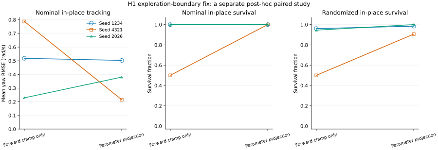
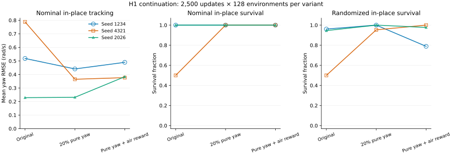

# H1 原地转向：续训消融与随机起点评估

本轮新增 `h1-native evaluate --randomized-reset`，让批量评估覆盖训练分布内的不同初始状态和物理参数，并修复 H1 与核心 PPO 中探索参数越界后梯度冻结的问题。指令采样和奖励默认值保持不变。

共完成 **15 条 H1 训练任务、130,560,000 条 H1 训练环境转换**：九条指令/奖励消融续训、一条评估功能数值一致性续训、两条从零训练参考、三条探索参数边界修复续训。另完成 12 条核心 reach/hold PPO 对照，共 24,576,000 条转换。数值一致性任务重复同一训练轨迹，不能算作新的独立训练样本。

[机器可读结果](h1-turning-study-20260929.json) 保存协议、指标、训练命令所在证据文件路径及 SHA256。本文 `runs/` 路径为本机产物，不随 Git 分发。

## 探索参数越界后的梯度冻结

首个种子的三方案完成后，检查 checkpoint 发现弱策略的部分 `log_std` 已超过 2。原实现使用 `log_std.clamp(-5, 2).exp()` 构造高斯标准差，越界区间的 clamp 梯度为零；即使后续数据要求降低噪声，对应参数也无法收到有效梯度。标准差被固定在 exp(2)≈7.389，而不是自动回到可训练区间。

这是在原消融之后形成的机制假设，追加协议单独记录时间。修复在每次 Adam 更新后检查 `log_std` 有限性并投回已有的 [-5,2] 范围。没有缩小范围、重置 Adam、改网络或改奖励。边界处仍能获得梯度，从而允许后续向内部更新；如果目标确实偏好上界，参数也可以留在上界。

三条弱预训练链分别再进行 2500 更新，与原方案使用相同输入 checkpoint、seed、环境数和预算。下面只比较这组修复与对应原方案，不将其混入预先声明的三方案筛选：



图中每个点对左右转向取平均。下表 yaw RMSE 单位为 rad/s，平面 RMSE 单位为 m/s。RMSE 只覆盖已观察帧，需结合两个存活面板阅读；原实现早停的试验与完整存活试验具有不同统计时长。

| 协议 | 指令 | 原实现存活 | 修复后存活 | 原 yaw RMSE | 修复后 yaw RMSE | 原平面 RMSE | 修复后平面 RMSE |
| --- | --- | ---: | ---: | ---: | ---: | ---: | ---: |
| 标称 | 站立 | 3/3 | 3/3 | 0.1105 | 0.0846 | 0.0668 | 0.0668 |
| 标称 | 前进 | 3/3 | 3/3 | 0.1837 | 0.2105 | 0.1515 | 0.1367 |
| 标称 | 原地左转 | 2/3 | 3/3 | 0.6346 | 0.3706 | 0.1423 | 0.1033 |
| 标称 | 原地右转 | 3/3 | 3/3 | 0.3887 | 0.3614 | 0.0987 | 0.1043 |
| 标称 | 行进左转 | 3/3 | 3/3 | 0.1976 | 0.2121 | 0.1234 | 0.1602 |
| 标称 | 行进右转 | 3/3 | 3/3 | 0.2148 | 0.2076 | 0.1308 | 0.1296 |
| 随机 | 站立 | 189/192 | 186/192 | 0.1335 | 0.1856 | 0.1005 | 0.1031 |
| 随机 | 前进 | 192/192 | 190/192 | 0.1811 | 0.2701 | 0.1520 | 0.1526 |
| 随机 | 原地左转 | 125/192 | 180/192 | 0.6377 | 0.4774 | 0.1728 | 0.1347 |
| 随机 | 原地右转 | 183/192 | 190/192 | 0.4009 | 0.3614 | 0.1276 | 0.1363 |
| 随机 | 行进左转 | 192/192 | 189/192 | 0.2043 | 0.2601 | 0.1453 | 0.1473 |
| 随机 | 行进右转 | 187/192 | 188/192 | 0.2357 | 0.2934 | 0.1435 | 0.1536 |

| 输入训练种子 | 原左右转 yaw RMSE 均值 | 修复后均值 | 原六命令存活 | 修复后存活 |
| --- | ---: | ---: | ---: | ---: |
| 1234 | 0.5180 | 0.5026 | 6/6 | 6/6 |
| 4321 | 0.7881 | 0.2150 | 5/6 | 6/6 |
| 2026 | 0.2287 | 0.3805 | 6/6 | 6/6 |

边界修复保证参数能继续更新，不保证固定预算内每个训练种子的行为得分都提高。本次平均原地转向误差反而上升的输入种子为 2026；退化结果保留在表中。

| 输入训练种子 | 原先越界的关节 | 修复后越界参数数 |
| --- | --- | ---: |
| 1234 | left_hip_roll, left_knee, right_hip_roll, right_knee | 0 |
| 4321 | left_hip_roll, left_knee, right_hip_roll, right_knee, left_shoulder_roll | 0 |
| 2026 | left_hip_roll, left_knee, right_hip_roll, right_knee, left_shoulder_roll | 0 |

原始源码上的两种 PPO 边界回归测试均失败，修复后均通过。测试覆盖上下两个边界，并确认优化目标要求相反的方差调整时，参数能够重新进入范围内部；完整续训另验证已有 Adam 动量下的真实更新。该修复不改变加载后的确定性 actor 输出，但会改变触及边界时的训练轨迹。

### 核心 PPO 的完整预算对照

相同修复应用于核心 `train` 的 ActorCritic，Go1 独立 PPO 没有修改。核心 NumPy reach/hold 各使用训练 seed 0、1、2，新旧实现分别训练 1000 更新、64 环境、32 步 rollout，共 12 条完整训练；它们是核心学习器回归，不是行走或真机测试。

| 任务 | seed | 全部训练指标一致 | checkpoint 数值一致 |
| --- | ---: | --- | --- |
| reach | 0 | 是 | 是 |
| reach | 1 | 是 | 是 |
| reach | 2 | 是 | 是 |
| hold | 0 | 是 | 是 |
| hold | 1 | 是 | 是 |
| hold | 2 | 是 | 是 |

精确相等只说明本次未触发差异的训练轨迹保持一致，不能推断所有任务或预算都不受参数边界修复影响。

## 指令采样与奖励消融

| 方案 | 原地转向 yaw RMSE 均值，rad/s | 原地转向存活 | 六种命令存活 | 预声明筛选 |
| --- | ---: | ---: | ---: | --- |
| 原实现 | 0.5116 | 5/6 | 17/18 | 对照 |
| 增加纯转向指令 | 0.3454 | 6/6 | 18/18 | 通过 |
| 纯转向指令 + 转向抬脚奖励 | 0.4164 | 6/6 | 18/18 | 未通过 |

表中每个原地转向格来自一个输入训练种子和一个方向，最长 20 秒，确定性标称起点。筛选结果不是真机验收，也不代表统计显著性。即使局部筛选通过，本轮也没有足够的从零训练候选方案对照支持替换默认配方。



每条线代表同一条预训练链的三个续训方案。左图对左右转的 RMSE 取平均；中图为两个标称试验的存活率；右图为两个方向、两个评估种子、每次 32 行的存活率。重复起点或多个初始状态均没有被当成独立训练种子。

本轮调查起因：上一轮 32 环境、10000 更新的三个权重在原地转向命令下几乎不转，部分行走命令会跌倒；一次后训练改善了存活和行进转向，但原地转向仍未学会。不能把“训练完成”“没有跌倒”和“跟踪指令”视为同一结论。

本轮实际交付包含 `--randomized-reset` 评估选项。默认标称起点评估保留，训练随机化语义保留；新选项单独开启初始姿态/速度和物理参数随机化，固定指令，关闭观测噪声。已经结束的行可以重置以维持仿真，但其后所有帧不再进入统计或运动记录。

## 实验设计

三个输入训练种子为 1234、4321、2026，全部保留，没有只选表现较好的输入。各输入均从上一轮 32 环境 × 24 rollout × 10000 更新的最终权重及 Adam 状态续训。

三个实验方案：

1. 原实现：前进速度均匀采样 0–1 m/s，横向为零，转向均匀采样 ±1 rad/s；2% 指令全部归零。
2. 增加原地转向：使用原有同一个随机数，2% 站立、20% 只保留 yaw、78% 保留原来的前进加转向指令。没有为方案额外消耗一次 RNG 抽样。
3. 原地转向加抬脚奖励：在方案 2 基础上，把抬脚奖励的启用条件从平移速度 >0.1 m/s 改成平移速度 >0.1 m/s 或 yaw 绝对值 >0.1 rad/s。其余奖励权重不变。

每个方案/输入增加 2500 次更新，128 环境、24 步 rollout、两个线程、学习率 3e-4；续训 seed 使用对应输入种子。每条链增加 7,680,000 条环境转换，累计数据量为 15,360,000，但 12500 次 PPO 更新不同于从零以 128 环境训练 5000 次更新。

方案执行次序在三个输入种子间轮换。所有训练完成预算后才评估最终权重，不基于中间得分选择 checkpoint。三个方案执行相同的未修改评估实现，因此训练奖励变化不会污染速度评估口径。

协议在训练前写入本地 JSON。预先声明的候选筛选：三个输入种子 × 两个原地转向方向，共六个组合的 yaw RMSE 算术平均至少下降 20%；原地转向存活数和全部 18 个命令组合的存活数不能下降；前进、站立的平均平面 RMSE 各最多增加 0.05 m/s。这只是本地筛选，不代表硬件验收或统计显著性。

没有第四个“只改奖励、不改采样”方案，因此方案 2 与 3 的差异只能说明采样已改变时奖励条件的增量作用，不能分离所有交互效应。
这三组使用修复前的优化器；后续边界修复实验保留原指令采样和奖励。本轮没有验证“修改采样 + 边界修复”的组合收益。

## 评估范围

每个最终权重测试站立、前进 0.5 m/s、原地左右 0.5 rad/s、前进加左右转向，共六种命令，每次 1000 控制步、最长 20 秒。

主要评估从一个确定性标称起点开始。补充评估使用两个评估种子 9701、9702，每个 32 行，按训练 reset 分布采样。每个权重/命令包含 64 个初始状态；这些状态不等于 64 个独立训练模型。相同 seed 和环境数在不同命令、不同权重间复用初始条件，属于配对评估。

每行只统计首次试验，包含终止帧。原始 RMSE 根据观察到的帧汇总；文中跨种子表格为报告 RMSE 的算术平均，不是重新合并所有帧。必须同时阅读存活率和持续时长，因为提前跌倒可能使误差统计窗口缩短。

## 原因判断的边界

旧的 128 环境、5000 更新、训练 seed 0/1/2 模型在当前未修改评估实现中仍能原地左右转，并延长到了 20 秒。因此没有证据把问题直接归为命令接线、yaw 测量或版本回归。

当前训练采样不给纯转向正概率质量，抬脚奖励也在零平移命令下关闭；二者是可检验的训练假设，不是已经证明的唯一根因。额外训练预算、原始批量、优化器步数和初始化都可能影响结果。

## 复现与部署边界

源码快照和原始权重位于忽略提交的 runs 目录；随文 JSON 保存摘要、原始路径、SHA256、协议、源码文件清单和变体说明。基线快照来自本轮开始时的工作树，包含上一轮尚未提交的修复，不等同于单独的 Git HEAD。要从新仓库复现，首先生成三个输入模型，再各自执行三个方案的独立续训。首次训练学习率、模型资产及依赖版本应一致。

本轮没有真机部署，也没有在运行中加推力、观测噪声或改变地形。CPU 同机还有其他任务，训练耗时仅描述本次成本，不能用来作性能优劣结论。

## 各指令的完整结果

| 协议 | 方案 | 指令 | 存活数 / 首次试验数 | 平面 RMSE 均值，m/s | yaw RMSE 均值，rad/s | 平均观察时长，s |
| --- | --- | --- | ---: | ---: | ---: | ---: |
| 标称 | 原实现 | 站立 | 3/3 | 0.0668 | 0.1105 | 20.00 |
| 标称 | 原实现 | 前进 | 3/3 | 0.1515 | 0.1837 | 20.00 |
| 标称 | 原实现 | 原地左转 | 2/3 | 0.1423 | 0.6346 | 14.99 |
| 标称 | 原实现 | 原地右转 | 3/3 | 0.0987 | 0.3887 | 20.00 |
| 标称 | 原实现 | 行进左转 | 3/3 | 0.1234 | 0.1976 | 20.00 |
| 标称 | 原实现 | 行进右转 | 3/3 | 0.1308 | 0.2148 | 20.00 |
| 标称 | 增加纯转向指令 | 站立 | 3/3 | 0.0439 | 0.0951 | 20.00 |
| 标称 | 增加纯转向指令 | 前进 | 3/3 | 0.1704 | 0.1486 | 20.00 |
| 标称 | 增加纯转向指令 | 原地左转 | 3/3 | 0.1121 | 0.2872 | 20.00 |
| 标称 | 增加纯转向指令 | 原地右转 | 3/3 | 0.0577 | 0.4036 | 20.00 |
| 标称 | 增加纯转向指令 | 行进左转 | 3/3 | 0.1640 | 0.1681 | 20.00 |
| 标称 | 增加纯转向指令 | 行进右转 | 3/3 | 0.1450 | 0.1680 | 20.00 |
| 标称 | 纯转向指令 + 转向抬脚奖励 | 站立 | 3/3 | 0.0600 | 0.1221 | 20.00 |
| 标称 | 纯转向指令 + 转向抬脚奖励 | 前进 | 3/3 | 0.1451 | 0.1856 | 20.00 |
| 标称 | 纯转向指令 + 转向抬脚奖励 | 原地左转 | 3/3 | 0.0851 | 0.4235 | 20.00 |
| 标称 | 纯转向指令 + 转向抬脚奖励 | 原地右转 | 3/3 | 0.0803 | 0.4093 | 20.00 |
| 标称 | 纯转向指令 + 转向抬脚奖励 | 行进左转 | 3/3 | 0.1658 | 0.1926 | 20.00 |
| 标称 | 纯转向指令 + 转向抬脚奖励 | 行进右转 | 3/3 | 0.1414 | 0.1986 | 20.00 |
| 随机 | 原实现 | 站立 | 189/192 | 0.1005 | 0.1335 | 19.71 |
| 随机 | 原实现 | 前进 | 192/192 | 0.1520 | 0.1811 | 20.00 |
| 随机 | 原实现 | 原地左转 | 125/192 | 0.1728 | 0.6377 | 14.64 |
| 随机 | 原实现 | 原地右转 | 183/192 | 0.1276 | 0.4009 | 19.22 |
| 随机 | 原实现 | 行进左转 | 192/192 | 0.1453 | 0.2043 | 20.00 |
| 随机 | 原实现 | 行进右转 | 187/192 | 0.1435 | 0.2357 | 19.51 |
| 随机 | 增加纯转向指令 | 站立 | 187/192 | 0.0893 | 0.1114 | 19.52 |
| 随机 | 增加纯转向指令 | 前进 | 188/192 | 0.1717 | 0.1547 | 19.61 |
| 随机 | 增加纯转向指令 | 原地左转 | 186/192 | 0.1327 | 0.2838 | 19.42 |
| 随机 | 增加纯转向指令 | 原地右转 | 192/192 | 0.1000 | 0.3894 | 20.00 |
| 随机 | 增加纯转向指令 | 行进左转 | 181/192 | 0.1616 | 0.1803 | 18.93 |
| 随机 | 增加纯转向指令 | 行进右转 | 188/192 | 0.1552 | 0.1768 | 19.61 |
| 随机 | 纯转向指令 + 转向抬脚奖励 | 站立 | 187/192 | 0.0945 | 0.1295 | 19.52 |
| 随机 | 纯转向指令 + 转向抬脚奖励 | 前进 | 189/192 | 0.1511 | 0.1869 | 19.71 |
| 随机 | 纯转向指令 + 转向抬脚奖励 | 原地左转 | 164/192 | 0.1150 | 0.4362 | 18.91 |
| 随机 | 纯转向指令 + 转向抬脚奖励 | 原地右转 | 190/192 | 0.1146 | 0.4094 | 19.81 |
| 随机 | 纯转向指令 + 转向抬脚奖励 | 行进左转 | 187/192 | 0.1629 | 0.1983 | 19.51 |
| 随机 | 纯转向指令 + 转向抬脚奖励 | 行进右转 | 186/192 | 0.1581 | 0.2055 | 19.42 |

随机协议每个方案/指令的 192 次首次试验来自三个权重各 64 个初始状态。不同命令复用同一批初始状态，不能把六种命令的次数相加当成独立样本量。所有原始评估均未指定产品阈值，`accepted=null`；本节表格与预声明筛选是离线分析。

seed 1234 的抬脚奖励方案在标称原地转向中均未跌倒，但在左右转、两个评估 seed 的 128 次随机试验中只存活 101 次，原实现为 123 次。此处 128 次包含两个方向对同一批初始状态的复用。标称结果不能替代随机起点评估。

## 一对从零训练参考

原实现和边界修复分别从零训练 seed 1234，128 环境、5000 更新；每条具有 15,360,000 条转换，与一条预训练加续训链的累计数据量相同。该种子因此前的小批量权重较弱而选取，只有一个配对参考；相对于续训，批量、优化器步数和环境重置历史同时不同，不能据此单独归因，也不能声称从零训练普遍优于续训。

| 指令 | 原标称存活 | 修复标称存活 | 原平面 RMSE | 修复平面 RMSE | 原 yaw RMSE | 修复 yaw RMSE | 原随机存活 | 修复随机存活 |
| --- | ---: | ---: | ---: | ---: | ---: | ---: | ---: | ---: |
| 站立 | 1/1 | 1/1 | 0.1071 | 0.1071 | 0.0876 | 0.0876 | 64/64 | 64/64 |
| 前进 | 1/1 | 1/1 | 0.1200 | 0.1200 | 0.0763 | 0.0763 | 64/64 | 64/64 |
| 原地左转 | 1/1 | 1/1 | 0.1289 | 0.1289 | 0.0692 | 0.0692 | 64/64 | 64/64 |
| 原地右转 | 1/1 | 1/1 | 0.0922 | 0.0922 | 0.0986 | 0.0986 | 64/64 | 64/64 |
| 行进左转 | 1/1 | 1/1 | 0.1250 | 0.1250 | 0.0589 | 0.0589 | 64/64 | 64/64 |
| 行进右转 | 1/1 | 1/1 | 0.1099 | 0.1099 | 0.0952 | 0.0952 | 64/64 | 64/64 |

这对从零训练的全部 checkpoint 数值精确一致：是；全部非计时训练指标精确一致：是。表中 yaw RMSE 单位为 rad/s，平面 RMSE 单位为 m/s。


## 模型、权重与成本

| 项目 | 本轮实测 |
| --- | ---: |
| actor 参数 | 44,435 |
| critic 参数 | 42,113 |
| 策略全部参数，含 log_std | 86,567 |
| 策略 FP32 张量字节 | 346,268 |
| Adam 状态张量字节 | 692,604 |
| 单个 checkpoint 文件字节 | 1,060,407 |
| 两个保留保存点合计字节 | 2,120,814 |
| 含网格的 model.mjb 字节 | 51,615,297 |

actor 为 69→128→128→128→19，critic 为 69→128→128→128→1，中间使用 ELU。actor 推理需要的 FP32 参数数据为 177,740 字节；当前加载器读取完整策略 checkpoint。文件还包含 critic、探索标准差、Adam 状态及归档开销，不能把约 1 MB 的训练 checkpoint 当作 actor 参数大小。

| 训练任务 | 新增更新 | 实际执行转换数 | 训练循环秒数 |
| --- | ---: | ---: | ---: |
| original-s1234 | 2,500 | 7,680,000 | 553.7 |
| turn_commands-s1234 | 2,500 | 7,680,000 | 557.6 |
| turn_commands_air-s1234 | 2,500 | 7,680,000 | 564.5 |
| original-s4321 | 2,500 | 7,680,000 | 589.6 |
| turn_commands-s4321 | 2,500 | 7,680,000 | 594.9 |
| turn_commands_air-s4321 | 2,500 | 7,680,000 | 605.8 |
| original-s2026 | 2,500 | 7,680,000 | 533.1 |
| turn_commands-s2026 | 2,500 | 7,680,000 | 563.0 |
| turn_commands_air-s2026 | 2,500 | 7,680,000 | 600.8 |
| training-parity | 2,500 | 7,680,000 | 526.3 |
| fresh-s1234 | 5,000 | 15,360,000 | 1041.9 |
| projected-s1234 | 2,500 | 7,680,000 | 587.0 |
| projected-s4321 | 2,500 | 7,680,000 | 608.1 |
| projected-s2026 | 2,500 | 7,680,000 | 601.8 |
| fresh-projected-s1234 | 5,000 | 15,360,000 | 1182.5 |

CPU MuJoCo/mjbatch 与 PPO，两个线程，CUDA 对本轮进程禁用；GPU 已被其他任务占用。依赖版本与源码快照哈希保存于机器记录。同机负载不同，表中耗时不用于比较方案速度。

## 软件验证

- 新评估选项复用训练 reset 分布，观测噪声仍关闭，指令保持固定。不同结束时间的行只统计首次试验，运动记录也不会混入重置后的帧。
- 两次额外的完整 32 行、20 秒随机评估验证产品阈值：已知较好策略返回 0，转向不足的策略保存失败报告并返回 2。这是复用已观察模型的功能验收，不是新增独立研究样本。
- 仅加入随机评估功能、尚未加入探索边界修复的源码快照，与原始快照从同一个保存点完整续训 2500 次更新；全部非计时训练指标、策略与 Adam 张量、checkpoint 文件字节一致。该数值一致性结论只适用于评估功能改动，不适用于后续边界修复。
- ef 全套测试：913 通过、91 跳过；独立 SDK 的 H1 与核心 PPO 专项合计 43 通过。包含随机初始状态复现、选行隔离、首次试验统计、回放 FK 一致性和探索参数越界恢复。
- 本轮修改的 Python 文件通过 Ruff 与格式检查。全仓既有 Microduck 导入文件的 Ruff 问题未在本轮扩展处理。
- rollout 性能采样的主要耗时在物理仿真；没有为占比很小的数组构造引入缓存，也没有宣称本轮提升训练吞吐。

## 复现命令

以下使用本机独立 H1 SDK。请在目标检出的仓库根目录执行；SDK 使用绝对路径，`PYTHONPATH=src` 明确选择当前检出中的源码，避免误用其他目录的 editable 安装。ef 继续用于编排；所有训练和评估保持 headless，输出目录需不存在。**复现原三方案时，先在独立检出中移除 `h1_ppo.optimize` 内 `optimizer.step()` 后新增的参数投影块**，恢复原先仅在前向截断的实现。再执行下面命令生成原实现输入与对照；替换 seed 可覆盖其他两条输入链。当前默认代码包含边界修复，直接运行会产生另一条训练轨迹。

```bash
conda activate ef
H1_PY=/home/ubuntu/workspace/chase/EmbodiedForge/.cache/external/mjbatch/.venv/bin/python
PYTHONPATH=src "$H1_PY" -m embodiedforge h1-native train --headless \
  --model /home/ubuntu/workspace/3rdparty/mink/examples/unitree_h1/h1.xml \
  --num-envs 32 --threads 2 --horizon 24 --updates 10000 \
  --seed 1234 --learning-rate 0.0003 --output runs/h1-turn-input-s1234
PYTHONPATH=src "$H1_PY" -m embodiedforge h1-native train --headless \
  --resume runs/h1-turn-input-s1234 --num-envs 128 --threads 2 \
  --horizon 24 --updates 2500 --seed 1234 --learning-rate 0.0003 \
  --output runs/h1-turn-original-s1234
PYTHONPATH=src "$H1_PY" -m embodiedforge h1-native evaluate --headless \
  --run runs/h1-turn-original-s1234 --threads 2 --steps 1000 \
  --velocity 0 0 0.5 --output runs/h1-turn-original-left
PYTHONPATH=src "$H1_PY" -m embodiedforge h1-native evaluate --headless \
  --run runs/h1-turn-original-s1234 --randomized-reset --num-envs 32 \
  --seed 9701 --threads 2 --steps 1000 --velocity 0 0 0.5 \
  --min-survival 0.8 --max-planar-rmse 0.3 --max-yaw-rmse 0.3 \
  --output runs/h1-turn-original-randomized-left
```

最后一条命令示范带阈值的产品验收，未通过时保存报告并返回 2；本轮原始研究报告没有设置这些阈值。其余指令、评估 seed 和初始状态数见 JSON 协议。

候选方案没有新增训练 CLI 配置。若要复现，在独立检出中仅修改 `locomotion/h1_native.py` 的 `resample` 方法；以相同输入重新执行续训并使用独立输出目录：

```python
self.commands[ids] = self.rng.uniform((0, 0, -1), (1, 0, 1), (len(ids), 3))
mode = self.rng.random(len(ids))
self.commands[ids[mode < 0.02]] = 0
self.commands[ids[(mode >= 0.02) & (mode < 0.22)], :2] = 0
```

第三方案在此基础上，将 `air_reward` 的最后一个门控乘数换成：

```python
((np.linalg.norm(self.commands[:, :2], axis=1) > 0.1)
 | (np.abs(self.commands[:, 2]) > 0.1))
```

训练指令采样和奖励门控的候选改动不用于评估。所有候选权重都用同一评估实现加载；本轮保留原指令采样和奖励默认值。复现探索边界修复时，使用当前完整代码，从刚才生成的同一个原实现输入续训，恢复原始采样和奖励，并换新的输出目录。训练和新评估用法见 [H1 中文说明](h1-native.md) / [English guide](h1-native.en.md)。
