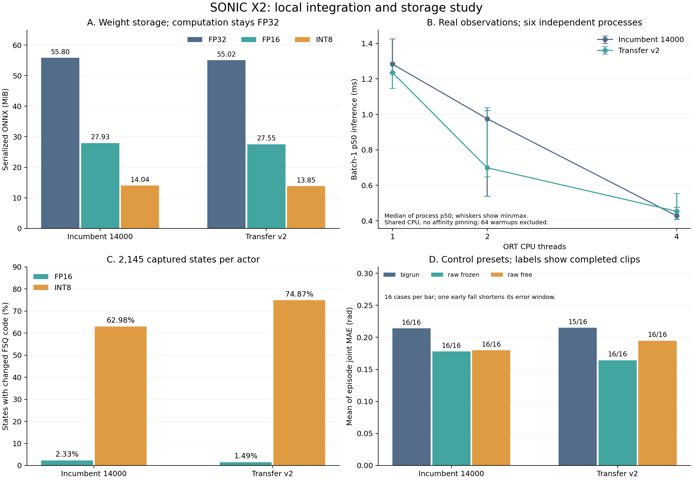
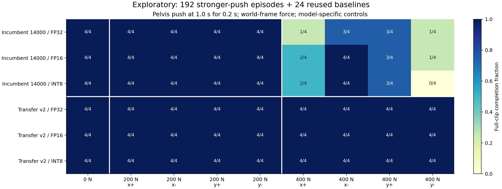

# 人形动作接入实验：GMR、SONIC X2、模型体积与控制消融

本轮将 GMR 的 BVH 重定向和 SONIC X2 的无窗口仿真评估接入 EmbodiedForge，
并检查既有 Weave 入口。代码和常规运行指令见[人形动作指南](humanoid-motion.md)。
本篇记录真实动作、权重统计、控制预设消融、CPU 推理和精度存储实验；
完整数值与产物哈希在[实验 JSON](humanoid-integration-study-20260928.json)。

## 实现与数据边界

GMR 调用固定外部 API，输出沿用本项目已有的机器人 NPZ 回放格式。两个目标机器人
都处理完整 4,249 帧 Xsens 拳击动作，采用同一输入文件和显式身高 1.75 米。
SONIC 使用外部仓库自带的两个 ONNX 模型和四段动作：行走、站立、舞蹈、镜像舞蹈。
模型、参考动作、机器人网格没有复制进源码或安装包。

本轮训练更新次数为 **0**。GMR 执行逆运动学；SONIC 使用已有推理权重；FP16 / INT8
实验是训练后的存储精度转换，没有更新梯度。Weave 已有训练适配，但本机仍缺动作集
和解析后的物体 USD，完整 HOI 仿真训练未实测。不能将这些评估称为重新完成 SONIC
预训练或 LoRA 后训练。已有 RLinf 后训练实验另见[压缩与 QAT 文章](rl-compression-study-20260928.md)。

| 组件 | 本轮实际版本 |
| --- | --- |
| GMR | `bb1bbe40774794fceb2a7c579a3464a28e68c844` |
| sonic-x2 | `c9959443f80276533083a8b31ecd3760a41eaa65` |
| 智元 X2 v1.3.0 资产 | `575cc6b988f976c23550e0db85aa1e5475d3652d`，35 个所需网格，共 89,685,740 字节 |
| CPU SDK | Python 3.10.0、NumPy 1.26.4、SciPy 1.15.3、MuJoCo 3.3.7、ORT 1.23.2 |
| IK | Mink 0.0.13、qpsolvers 4.8.1、DAQP 0.10.1 |
| CPU | AMD Ryzen 9 9950X 16-Core Processor；共享机器，未绑定核心 |

主入口始终由 `ef` 调度。SDK 通过单独 Python 运行；CPU IK / ONNX 不需要在 `ef`
安装 Torch 或 ORT。实际过程删除 DISPLAY 进行 headless 验证，创建窗口不是必需步骤。

## GMR：帧数、时间和回放一致性

BVH 声明 `Frame Time: 0.008333`，保留其实际约 120.004800192 fps。
源第 0 帧至最后一帧跨度为 35.398584 秒。为兼容已有 NPZ 回放格式的正时间戳约定，
输出第 0 帧位于 dt，最后一帧位于 35.406917 秒；元数据明确记录这一个 dt 的偏移。
没有丢弃最后一帧，也没有将文件标成默认 30 fps。

| 目标机器人 | 标量关节 | 记录刚体 | 最大关节范围越界 |
| --- | --- | --- | --- |
| Unitree G1 | 29 | 38 | 约 5.6e-17 rad，数值舍入量级 |
| Unitree H1-2 | 27 | 28 | 约 5.6e-17 rad，数值舍入量级 |

将输出重新交给 `ef` 中 MuJoCo 3.13.0 的现有回放器，逐帧按命名关节重建 FK：

| 运行 | 帧数 | 最大位置差 / m | 最大旋转差 / rad |
| --- | --- | --- | --- |
| wheel-gmr-g1 | 4249 | 1.13e-07 | 1.76e-07 |
| gmr-h1-2-final | 4249 | 1.49e-07 | 1.79e-07 |

还验证了离线 HTML 回放、G1 网格回放和跳到第 800 帧。验证中修复了 MuJoCo 枚举
与 NumPy 标量的元组成员比较问题，以及 float32 四元数归一化引入的旋转误差底噪。
这些修复同时适用于现有机器人回放。

GMR 输出是运动学参考。当前 API 的关节范围约束通过，不代表速度、接触或动力学
可行性已验证；速度限制明确关闭。另检查了入口列出的八种目标模型均能加载，具备
一个浮动根和标量铰链，但只有 G1 / H1-2 用真实 Xsens 片段完成了重定向验证。

另外按输出的实际相邻时间戳，对标量关节角做未平滑的一阶有限差分：

| 机器人 | 全部关节绝对角速度 p95 / rad·s⁻¹ | 峰值 / rad·s⁻¹ | 峰值关节 | 源帧对 |
| --- | --- | --- | --- | --- |
| unitree_g1 | 1.945 | 14.038 | left_shoulder_yaw_joint | 3266→3267 |
| unitree_h1_2 | 2.026 | 9.264 | right_elbow_joint | 3187→3188 |

这里统计的是保存轨迹的差分速度，没有设置电机可行性阈值，也没有把速度限制重新
打开。两条峰值均发生在序列中段，不能只用删除启动帧来代替后续的动作质量检查。

## 模型大小与 LoRA 的含义

旧模型原始 ONNX 包含 14,621,279 个 FP32 初始化元素；迁移模型为 14,415,724 个
FP32 元素，另有 60 个 INT64 元素。两者输入均为 1670 维、输出为 31 维。
初始化元素统计描述推理图，无法恢复训练时哪些参数被冻结、LoRA 秩或优化器占用。

上游模型说明文件将 v2 描述为冻结 G1 核心后的 LoRA 迁移产物。当前本地只有融合 ONNX，
没有它的优化器状态或独立适配器，因此不能从一个 55 MiB 文件推算 LoRA 训练显存，
也不能按“只训练少量参数”估计最终部署文件大小。

精度实验只转换十二个二维权重矩阵，保留 bias 和其余常量的原精度。FP16 先舍入再
Cast 回 FP32；INT8 对每个矩阵行独立取尺度 `max(abs(row))/127`，使用 -127…127、
最近偶数舍入，再用 Cast + Mul 解码。两套图中的这些矩阵行对应输出通道，旧模型
decoder 的 Transpose 节点保留不变。这里没有激活量化。

| 模型 | 矩阵存储 | 文件字节 | MiB | 相对原文件缩小 |
| --- | --- | --- | --- | --- |
| 旧模型 14000 | FP32 | 58,505,726 | 55.795 | 0.00% |
| 旧模型 14000 | FP16 | 29,286,570 | 27.930 | 49.94% |
| 旧模型 14000 | INT8 | 14,723,285 | 14.041 | 74.83% |
| 迁移模型 v2 | FP32 | 57,692,064 | 55.019 | 0.00% |
| 迁移模型 v2 | FP16 | 28,884,556 | 27.546 | 49.93% |
| 迁移模型 v2 | INT8 | 14,527,085 | 13.854 | 74.82% |

ORT 优化后，三种存储的矩阵都变成 FP32；原图和两个压缩版本在同一模型下的优化
图文件大小相同。六张优化图中均没有剩余的存储解码节点。这支持“减少分发文件”
的结论，不能当作 FP16 / INT8 算子加速或进程 RAM 减少的证据。



## 基础闭环与控制预设消融

基础矩阵包含两个模型 × 四段动作 × 初始化帧 0/50/100/200 × ORT 线程 1/2/4，
共 **96 次完整首回合**。全部达到 motion_end。不同线程设置下的打印指标一致。
动作包中的镜像片段单独执行，不能只运行上游默认选中的第一个 clip。

另固定 ORT 为两线程，在上述十六种动作/起点上比较三个控制配置。每个模型自己的
默认配置复用基础矩阵中的 16 条，另外执行 32 条，共 96 个对照结果、64 次新增试验。

- `bigrun`：旧模型的 YAML 控制预设，包括 PD、目标限制和低通滤波。
- `raw_frozen`：空 tuning、action clip 20、冻结手腕，是 v2 的配套配置。
- `raw_free`：相同空 tuning 和 action clip 20，手腕不冻结。

| 模型 | 控制配置 | 完成片段数 | 逐试验关节 MAE 等权均值 / rad |
| --- | --- | --- | --- |
| 旧模型 14000 | bigrun | 16/16 | 0.21401 |
| 旧模型 14000 | raw_frozen | 16/16 | 0.17794 |
| 旧模型 14000 | raw_free | 16/16 | 0.17984 |
| 迁移模型 v2 | bigrun | 15/16 | 0.21481 |
| 迁移模型 v2 | raw_frozen | 16/16 | 0.16428 |
| 迁移模型 v2 | raw_free | 16/16 | 0.19486 |

迁移模型误用 bigrun 时，非镜像舞蹈从第 100 帧开始的试验在 5.48 秒发生骨盆高度
跌倒，正确配置完成 7.22 秒。这个结果支持入口固定模型与控制参数配对。
`raw_frozen` 与 `raw_free` 只改变手腕冻结，bigrun 与 raw 的比较则同时改变多个
控制环节，不能据此单独归因于某一个 PD 增益或滤波项。表中失败试验只统计跌倒前
的误差，其观测时长更短，不能把较低 MAE 单独当作更好的控制。

## 编码变化与精度转换

分别从两个 actor 自己的四次完整、无外力 f0 闭环记录 2,145 个实际观测，逐条
以 batch=1 比较原始和压缩 ONNX。不是随机输入，也不是两个模型共享同一批机器人
状态。FSQ（有限标量量化）将编码映射到离散格点，每次观测有 64 个量化值；
额外导出 Round 中间输出用于诊断，六种图的
诊断版动作与原图动作逐元素完全相同。

| 模型 | 存储 | 动作 RMSE | 动作最大绝对差 | 至少一个 FSQ 值变化的状态 | 变化的 FSQ 元素 |
| --- | --- | --- | --- | --- | --- |
| 旧模型 14000 | FP16 | 0.002707 | 0.138087 | 2.331% | 0.036% |
| 旧模型 14000 | INT8 | 0.066615 | 0.461705 | 62.984% | 1.613% |
| 迁移模型 v2 | FP16 | 0.001845 | 0.067823 | 1.492% | 0.024% |
| 迁移模型 v2 | INT8 | 0.055874 | 0.361583 | 74.872% | 2.825% |

这些是网络动作输出单位，并非乘过每关节 ACTION_SCALE 后的关节目标角误差。
FSQ 对连续编码做离散舍入；接近分界的输入可能因较小权重变化进入不同格点。
文件大小和平均输出误差之外，应同时观察这种离散变化及完整闭环。

FP16 和 INT8 版本各自使用模型配套控制，在相同十六种动作/起点上新增 64 次评估，
全部完成片段。这个基础结果还不足以代表扰动、新动作或真机表现。正式 `sonic`
入口仍运行仓库自带权重；压缩图和下文外力注入属于独立实验产物。

## 固定外力扰动

在模拟开始后 1.0 秒，对 pelvis 施加持续 0.2 秒的世界坐标力。使用 20/60/100 N，
分别沿 ±X、±Y；其余物理和控制循环不变。两个模型 × 三种存储 × 四段动作 ×
三个起点 0/100/200 × 三档力 × 四个方向，共 **864 次新增首回合**。
零外力基线复用 72 条已有结果，避免重复记成新增试验。

扰动通过研究脚本包裹上游 `mujoco.mj_step` 注入力，没有修改上游源文件。零力验证
先完整跑过 742 个行走控制步骤：所有 1670 维观测及 31 维动作与原播放器逐元素相同。
每个扰动试验保存实际施力步数、物理 dt、力向量、总质量和实际冲量，失败提前结束
时不能默认已经施加全部请求冲量。

| 模型 | 存储 | 20 N 完成数 | 60 N 完成数 | 100 N 完成数 |
| --- | --- | --- | --- | --- |
| 旧模型 14000 | FP32 | 48/48 | 48/48 | 48/48 |
| 旧模型 14000 | FP16 | 48/48 | 48/48 | 48/48 |
| 旧模型 14000 | INT8 | 48/48 | 48/48 | 48/48 |
| 迁移模型 v2 | FP32 | 48/48 | 48/48 | 48/48 |
| 迁移模型 v2 | FP16 | 48/48 | 48/48 | 48/48 |
| 迁移模型 v2 | INT8 | 48/48 | 48/48 | 48/48 |

[完整方向图](assets/humanoid-integration-study-20260928-pushes.svg)保留逐方向的完成数。

每个热图格对应四段动作 × 三个起点的 12 次试验。它们不是 12 个独立训练种子，
零力列也不是新跑的试验。本实验仅改变外力和权重存储；地形、摩擦、延迟和人体动作
分布均未形成独立的泛化评估。

## 更强扰动：探索性追加对照

首批 864 次实验执行到第 665 次时仍未出现跌倒，因此另行固定一个更强扰动协议：
200/400 N、持续 0.2 秒，保留同样四个世界坐标方向和模型配套控制，只使用起点 0。
两个模型 × 三种存储 × 四段动作 × 两档力 × 四个方向，共 **192 次新增试验**。
这一阶段是在看到部分结果后追加，属于探索性实验；没有更改前一阶段的协议或次数。

| 模型 | 存储 | 200 N 完成数 | 400 N 完成数 |
| --- | --- | --- | --- |
| 旧模型 14000 | FP32 | 16/16 | 8/16 |
| 旧模型 14000 | FP16 | 16/16 | 10/16 |
| 旧模型 14000 | INT8 | 16/16 | 9/16 |
| 迁移模型 v2 | FP32 | 16/16 | 16/16 |
| 迁移模型 v2 | FP16 | 16/16 | 16/16 |
| 迁移模型 v2 | INT8 | 16/16 | 16/16 |

不同模型使用各自配套控制，跨模型差异同时包含权重与控制配置的影响，不能只归因于
LoRA 或网络结构。同一个模型内部的三种存储对照则保持控制参数相同。



下面将每个压缩版本与同模型的 FP32 按动作、力和方向逐项配对，每行 32 对：

| 模型 | 存储 | 均完成 | 均失败 | FP32 完成而压缩失败 | FP32 失败而压缩完成 |
| --- | --- | --- | --- | --- | --- |
| 旧模型 14000 | FP16 | 24 | 6 | 0 | 2 |
| 旧模型 14000 | INT8 | 23 | 6 | 1 | 2 |
| 迁移模型 v2 | FP16 | 32 | 0 | 0 | 0 |
| 迁移模型 v2 | INT8 | 32 | 0 | 0 | 0 |

单个条件从失败变为完成，也不构成压缩提升泛化能力的证据；表格保留两个方向的
结果变化，便于识别平均完成率掩盖的差异。

其中旧模型站立片段受到世界 −Y 方向 400 N 推力时，FP32 完成 9.62 秒，INT8 在
2.12 秒因骨盆高度 0.385 m 低于 0.40 m 而失败。FP32、FP16、INT8 各用两个新进程
复跑这一条件：终止指标均复现，且各版本两次复跑的全部观测和动作逐元素一致。
这六次复核另计，不增加矩阵的独立条件数。压缩减小文件，仍可能改变具体闭环结果。

这里每格只有四段固定动作，零力列复用 24 条已有结果。完成比例描述这些具体条件，
不能作为不同训练种子上的统计显著性、最大抗冲击能力或真机稳定性证明。固定世界
坐标方向也不等于整个舞蹈过程中的身体前后方向。

## 强扰动下固定控制配置

为了进一步拆开前述模型与控制配置的混合影响，另用原始 FP32 权重，在相同四段动作、
起点 0、400 N 和四个方向上比较三个控制预设。此追加对照在观察到强扰动差异后设定，
也是探索性的：两个模型 × 三个预设 × 四段动作 × 四个方向，共 96 条，复用上文的
32 条配套预设结果，新增 **64 次**。

| 模型 | 控制配置 | 400 N 完成数 |
| --- | --- | --- |
| 旧模型 14000 | bigrun | 8/16 |
| 旧模型 14000 | raw_frozen | 16/16 |
| 旧模型 14000 | raw_free | 16/16 |
| 迁移模型 v2 | bigrun | 6/16 |
| 迁移模型 v2 | raw_frozen | 16/16 |
| 迁移模型 v2 | raw_free | 16/16 |

在这组条件中，两套权重用两种 raw 配置都完成 16/16；使用 bigrun 时，旧模型为
8/16，迁移模型为 6/16。因此，前面两个配套组合的抗扰动差异不能单独当作权重
迁移带来的改善。模型文件以外，控制参数是本次闭环结果的重要变量。

同一预设下可以比较两套融合权重；同一模型下可以比较控制配置。bigrun 与 raw
仍包含多个控制项同时变化，因此这一对照也没有单独识别某个增益或滤波项的贡献。
正式入口保留模型配套预设；实验没有把少量固定片段下的结果推广成通用控制参数。

## CPU 延迟

固定原始 FP32 模型，对采集到的实际观测进行 batch=1 推理。每个模型/线程设置
独立启动六个进程，六个分组内用固定种子打乱设置顺序。每个进程先进行 64 次预热，
再测 512 次 `session.run`；不包含 MuJoCo、观测构建、文件加载或数据传输。

| 模型 | ORT 线程 | 进程 p50 的中位数 / μs | 进程 p95 的中位数 / μs | 六个进程 p50 范围 / μs |
| --- | --- | --- | --- | --- |
| 旧模型 14000 | 1 | 1283.9 | 1567.9 | 1235.0–1426.2 |
| 旧模型 14000 | 2 | 975.6 | 1303.0 | 538.5–1021.7 |
| 旧模型 14000 | 4 | 427.9 | 721.3 | 407.9–477.1 |
| 迁移模型 v2 | 1 | 1236.3 | 1603.8 | 1147.1–1292.0 |
| 迁移模型 v2 | 2 | 699.2 | 1317.5 | 650.0–1039.1 |
| 迁移模型 v2 | 4 | 453.7 | 676.4 | 409.8–554.7 |

三种线程设置在这些输入上的动作与采集值均逐元素相同。该 CPU 上四线程中位延迟
较低，但共享负载造成明显波动；不能把这一结果推广到所有部署 CPU。入口保留上游
两线程默认值，用户可通过 `--threads` 明确配置。

## 复核与产物

基础 96 次、控制消融新增 64 次、精度存储新增 64 次、原协议外力新增 864 次、
探索性更强外力新增 192 次、强外力控制对照新增 64 次，共 **1,344 次不重复的比较试验**。
六次退化条件复跑、采集观测的八次、安装包验证和零力插桩验证另计。
指标来自固定播放器的终止日志，有打印精度限制：关节 MAE 四位、最大关节误差和
骨盆 MAE 三位、时间两位小数。状态由 motion_end / 跌倒 / 时间上限分别识别，
不会把“进程正常退出”当作策略成功。

成功沿用上游判据：片段结束前未触发骨盆高度或身体倾斜阈值。这里没有全局根部
XY 路径误差阈值，关节 MAE 和骨盆高度 MAE 也不包含水平位移误差。因此完成率
不能单独证明机器人仍沿原来的世界坐标路径运动。

工程检查覆盖主入口与 SDK 分离、实际 wheel 中的两个入口、GMR 完整序列回放、
已有 MuJoCo 几何回归、中断后的状态与子进程退出。相关测试在 ef 中 56 项通过；
主环境缺 Torch 而跳过的真实 Weave Muon / AdamW 恢复测试，另在已存在的 Torch
SDK 中单独通过，总计 57 项。该优化器测试不等于完整 Weave 仿真训练通过。

运行记录位于 `runs/humanoid-integration-20260928/`，包含输入快照、固定实验协议、
逐片段日志、模型分析、观测采集、转换后的研究权重和原样研究脚本。
公共 JSON 保留逐试验指标与日志/脚本哈希，不把大型权重、人体动作或网格打包进文档。
[原样研究脚本快照](assets/humanoid-integration-study-20260928-scripts.tar.gz)用于审阅和改写，
保留了本机绝对路径；换机器重跑需准备同版本外部资产并调整路径。它不增加正式 CLI。
图可在安装 NumPy 和 Matplotlib 的环境中，仅凭公共 JSON 重绘：

```bash
python docs/assets/humanoid-integration-study-20260928.py
```

常规 GMR 重定向、SONIC 仿真部署和已有 Weave 训练入口的具体命令见
[接入指南](humanoid-motion.md)与[Weave 指南](weave-reference.md)。
