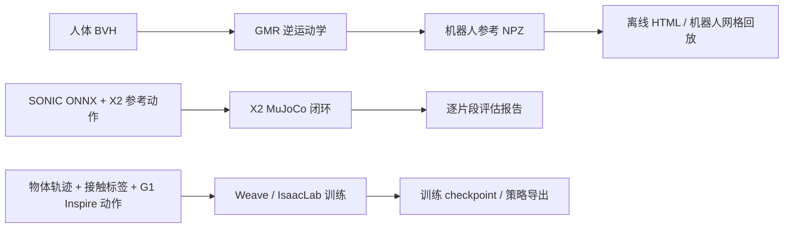

# GMR、SONIC X2 与 Weave：接入边界和运行指令

本轮引入 GMR 的无窗口动作重定向和 SONIC X2 的 CPU 仿真评估入口，继续使用已有
Weave 训练适配。三者依赖各自的固定外部仓库；没有把它们的实现、模型或机器人资产
复制进 EmbodiedForge。主入口仍在 `ef` 环境运行，SDK 依赖放在单独环境。

模型体积、控制预设、精度存储、外力和 CPU 延迟的完整实测见
[人形动作接入实验](humanoid-integration-study-20260928.md)。

## 分工与版本

| 仓库 | 固定提交 | 当前用途 | 与训练的关系 |
| --- | --- | --- | --- |
| GMR | `bb1bbe40774794fceb2a7c579a3464a28e68c844` | BVH → 机器人参考动作，保存 NPZ 和离线 HTML 回放 | 逆运动学重定向，不执行 RL，不训练策略 |
| sonic-x2 | `c9959443f80276533083a8b31ecd3760a41eaa65` | X2 Ultra 的预训练 ONNX 策略在 MuJoCo 中跟踪动作 | 此仓库只有两个评估脚本，没有训练器和可恢复的训练 checkpoint |
| Weave | `b162a351ddabe302a7a3d50d1543eb83dfeff082` | G1 Inspire 人物交互动作的训练、续训、评估、导出 | 现有外部 IsaacLab / Muon PPO 适配，见 [Weave 指南](weave-reference.md) |

GMR 的主代码许可证为 MIT，机器人资产遵循各自许可证。sonic-x2 本地固定提交没有
顶层 LICENSE；README 另说明动作源于 BONES-SEED、网格来自智元。Weave 本地没有
统一的顶层 LICENSE，包元数据声明 Apache-2.0，部分文件还有 IsaacLab 的 BSD-3-Clause
标识。这里保留外部调用边界，不将这些声明等同于所有代码、数据和权重都可重新分发。

这三个入口不能直接串成一条训练链路：GMR 当前没有 X2 的机器人/IK 配置；其 G1
输出也没有 Weave 所需的物体轨迹、接触标签和 Inspire 手部布局。不能补零或只改关节
名称就当作有效 HOI 数据。现有 `ef-motion-v1` HOI 格式与 GMR 输出的机器人回放
格式用途不同。



## SDK 环境

在 EmbodiedForge 根目录操作。当前机器已经准备了可用的
`.cache/humanoid-motion-venv/bin/python`，不需要重复安装；它通过独立 venv 复用
`hmotion` 环境的 Torch，新增依赖未写入 `ef` 或 `hmotion`。

在另一台机器上可以创建独立 Python 3.10 环境，安装如下运行依赖。GMR 的包入口会
导入 Torch 工具模块，即使只做 CPU IK 也需要 Torch；SONIC 单独使用时不需要 Torch、
Mink 或 QP 求解器。无需安装 SMPL-X 数据集或 Qt 编辑器即可运行本文的 BVH 路径。

```bash
python3.10 -m venv .venv-humanoid
.venv-humanoid/bin/python -m pip install \
  'torch>=2.2,<3' --index-url https://download.pytorch.org/whl/cpu
.venv-humanoid/bin/python -m pip install \
  'numpy==1.26.4' 'scipy==1.15.3' 'mujoco==3.3.7' \
  'mink==0.0.13' 'qpsolvers[daqp]==4.8.1' 'daqp==0.10.1' \
  'onnxruntime==1.23.2' joblib pyyaml rich loop-rate-limiters imageio
```

独立新环境使用 [PyTorch 官方 CPU wheel 源](https://docs.pytorch.org/get-started/previous-versions/)，
不必为 CPU IK 下载 CUDA 运行库。上述命令仅安装运行依赖。GMR 和 SONIC 入口都必须显式传入
SDK `--python`，不会自动安装包或切换主环境。

```bash
conda activate ef
GMR_ROOT=/home/ubuntu/workspace/3rdparty/GMR
SONIC_ROOT=/home/ubuntu/workspace/3rdparty/sonic-x2
MOTION_PYTHON="$PWD/.cache/humanoid-motion-venv/bin/python"
# 使用上面新建的环境时，改为 "$PWD/.venv-humanoid/bin/python"。
```

两个仓库都必须处于表中提交且没有已跟踪文件修改；允许额外下载的网格等未跟踪资产。
每次运行使用新输出目录，保存输入快照及 SHA256、`request.json`、`worker.log`、
`run.json` 和 `result.json`。中断会传给本次子进程，并记录为 interrupted。
本地适配代码的 Python、XML 和许可证文件保存到 `implementation/embodiedforge`，
SDK 子进程从该快照加载，并按 `request.json` 中的 SHA256 清单校验。
因此启动后继续编辑工作区不会改变该次运行的适配代码。外部 SDK 仍使用上述固定提交，
不会复制整套上游仓库；历史运行记录也不会自动补充代码快照。

## GMR：完整 BVH 重定向与回放

下面处理仓库已有的完整 4,249 帧 Xsens 拳击动作，无需下载人体模型。

```bash
python -m embodiedforge gmr retarget \
  --gmr-root "$GMR_ROOT" --python "$MOTION_PYTHON" \
  --input "$GMR_ROOT/assets/xsens_bvh_test/251021_04_boxing_120Hz_cm_3DsMax.bvh" \
  --format xsens --robot unitree_g1 --human-height 1.75 \
  --output runs/gmr-g1-boxing

# H1-2 使用它自己的 27 关节模型；与项目原有的 H1 训练模型不同。
python -m embodiedforge gmr retarget \
  --gmr-root "$GMR_ROOT" --python "$MOTION_PYTHON" \
  --input "$GMR_ROOT/assets/xsens_bvh_test/251021_04_boxing_120Hz_cm_3DsMax.bvh" \
  --format xsens --robot unitree_h1_2 --human-height 1.75 \
  --output runs/gmr-h1-2-boxing
```

默认无窗口，也接受显式 `--headless`。输出 `motion.html` 可以直接在浏览器打开，
包含时间轴、播放速度、视角和缩放；它显示参考骨架，不执行策略或动力学。
需要机器人网格时，使用已有 Web 回放入口：

```bash
python -m embodiedforge replay \
  --model "$GMR_ROOT/assets/unitree_g1/g1_mocap_29dof.xml" \
  --motion runs/gmr-g1-boxing/motion.npz
```

支持的格式和机器人组合来自固定版本的实际 IK 配置：

| `--format` | `--robot` |
| --- | --- |
| `xsens` | `unitree_g1`、`unitree_h1_2` |
| `lafan1` | `unitree_g1`、`unitree_g1_with_hands`、`booster_t1_29dof`、`fourier_n1`、`stanford_toddy`、`engineai_pm01`、`pal_talos` |
| `nokov` | `unitree_g1` |

当前真实数据验证覆盖 Xsens → G1 / H1-2；其他组合沿用上游映射，尚未用对应数据实测。
Xsens 路径支持上游的 3DS Max BVH、厘米单位，固定零编辑偏置并归一化初始根部 XY/yaw，
不读取工作目录里的 `offsets.json`，也不导入 Qt 编辑器。LAFAN1 / Nokov 沿用上游
厘米单位和坐标转换。`--human-height` 是明确传入的身高尺度，默认 1.75 米，
不从最后一帧姿态估算身高。

帧数和时间间隔读取 BVH 头部，不使用上游示例的默认 30 fps，也不把
`1 / 0.008333 = 120.004800192…` 截断为整数。每帧都被保存，包括最后一帧。
NPZ 复用现有回放格式，记录世界坐标、xyzw 四元数、关节和刚体名称、FK 刚体位姿；
读取不需要 pickle。为兼容已有回放时间戳约定，源第 0 帧写在 `dt` 时刻，元数据
`source_frame_zero_time=dt`；相邻帧间隔和源动作跨度保持不变。

重定向采用上游 DAQP IK 和关节范围约束，未启用速度限制。满足关节范围约束不等于动作
可以直接下发真机，也不代表已经验证接触、平衡或动力学可行性。

## SONIC X2：预训练策略的仿真部署

先准备固定版本 sonic-x2 所需的 X2 Ultra v1.3.0 网格。原安装脚本的下载地址在本轮
返回 HTTP 403，可使用 [智元官方资产仓库](https://github.com/AgibotTech/agibot_x2_urdf)
中的 `X2_URDF-v1.3.0/meshes`。本轮使用资产提交
`575cc6b988f976c23550e0db85aa1e5475d3652d`。将该目录的 STL 文件放入外部
`$SONIC_ROOT/assets/urdf/x2_ultra/meshes/`；保留 sonic-x2 自带 MJCF，不能用官方
默认 XML 替换其控制参数已调整的模型。评估记录实际加载的 MJCF 和网格哈希。

```bash
# transfer-v2：自动配对空 tuning、action clip 20、冻结手腕。
python -m embodiedforge sonic evaluate \
  --sonic-root "$SONIC_ROOT" --python "$MOTION_PYTHON" \
  --model transfer-v2 --motion walk --threads 2 \
  --output runs/sonic-v2-walk

# 旧模型：自动配对它自己的 bigrun.yaml。
python -m embodiedforge sonic evaluate \
  --sonic-root "$SONIC_ROOT" --python "$MOTION_PYTHON" \
  --model incumbent-14000 --motion walk --threads 2 \
  --output runs/sonic-incumbent-walk

# dance 包内有原始和镜像两个片段，默认分别评估两者。
python -m embodiedforge sonic evaluate \
  --sonic-root "$SONIC_ROOT" --python "$MOTION_PYTHON" \
  --model transfer-v2 --motion dance \
  --output runs/sonic-v2-dance
```

`--motion` 可选 `walk`、`idle`、`dance`；默认模型为 `transfer-v2`。
`--clip` 可以选择一个精确片段名称，`--init-frame` 指定 RSI 初始化帧，必须至少
留下两帧。入口只接受固定仓库自带的动作包；其 joblib/pickle 在 SDK 子进程读取。
不会把不受约束的外部 pickle 文件当作通用数据格式。

评估始终 headless、CPU ONNX 推理、50 Hz 控制，不加载 CUDA 策略。不设无限循环，
每个选中片段从指定帧开始，遇到 motion_end、跌倒或保护性时间上限就结束该次试验。
跌倒的试验仍是有效评估结果，`run.json=complete` 表示评估执行完成；成功与否看
`result.json` 的逐片段状态和 `success_rate`。统计覆盖全部选中片段，避免上游普通
物理播放路径只使用包内第一个片段。
如果后续片段报错或运行被中断，已完成片段的指标仍保留在 `result.json`，
其整体状态同步为 `failed` 或 `interrupted`，并记录错误原因；未完成的评估不生成整体完成率。

完成判据沿用上游：片段结束前未触发骨盆高度或身体倾斜阈值。它不包含全局根部
XY 轨迹误差阈值，因此完成率不能单独代表世界坐标路径跟踪精度。

`result.json` 区分 motion_end / failed / truncated，并保存关节 MAE、最大关节误差、
骨盆高度 MAE、模拟时长、文件大小、ONNX 输入输出形状与执行 provider。指标读取
固定上游播放器的终止日志：时间两位小数、关节 MAE 四位小数、最大关节误差和骨盆
MAE 三位小数，不能当作未舍入的逐帧轨迹误差。每个片段保留独立日志和实际命令。
每个片段必须恰好有一条完整的首轮终止记录；重复、损坏或非有限数值的报告会使评估报错，
避免跳过异常记录后误报成功。

这属于 MuJoCo 仿真部署。该 bundle 没有本项目可运行的预训练、LoRA 后训练或真机
通信入口；不能据此给出能在此仓库执行的 `sonic train` 或上机命令。LoRA 模型的
训练过程和上游报告也不能用少量随包动作的表现代替复现。

## 权重与训练状态

以下为本地 ONNX 文件的实际统计，MiB 使用 1024² 字节。初始化张量数量包含网络
权重和图常量，不等同于训练时可训练参数量。

| 模型 | 文件字节 | MiB | FP32 初始化元素 | 其他初始化元素 |
| --- | ---: | ---: | ---: | ---: |
| incumbent-14000 | 58,505,726 | 55.795 | 14,621,279 | 0 |
| transfer-v2 | 57,692,064 | 55.019 | 14,415,724 | 60 个 INT64 |

两者都是 1670 维输入、31 维动作的融合推理图。上游的 transfer-v2 来源记录描述了
冻结 G1 核心后的 LoRA 迁移，但本地只有融合 ONNX 和模型说明文件，没有训练优化器状态
或独立 LoRA 适配器。部署文件仍约 55 MiB，不能把 LoRA 的可训练参数节省直接当作
部署权重大小的同等缩减。实际内存和速度还取决于 ORT 优化、线程和整条控制环路。

Weave 的训练/续训命令继续以 [既有指南](weave-reference.md) 为准。2026-09-28 本机
复查仍缺训练动作，`smalltable.usd` 仍为 LFS 指针，因此完整 HOI 训练仍未实测。
GMR 参考动作的生成不会自动补齐这些条件。
