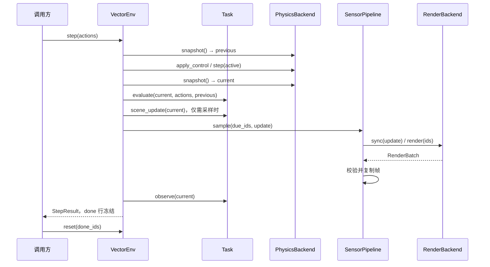

# 接口设计准则与模块阅读指南

本文描述当前实现的公共接口。长期扩展目标见 [architecture.md](architecture.md)，未实现的部分见 [implementation.md](implementation.md)。源代码使用英文类型与 docstring，本文提供中文职责和调用约定。

## 1. 必须遵守的设计准则

1. **单一职责**：任务决定学习问题；物理推进状态；渲染生成图像；传感器管理采样与缓存；环境安排执行顺序；训练器优化策略。新增需求先确定所属模块。
2. **依赖接口**：任务与运行时通过 `Task`、`PhysicsBackend`、`RenderBackend`、`Policy` 协议协作。任务不导入 MuJoCo/Newton，渲染器不读取任务对象或求解器私有字段。
3. **接口分离**：物理协议不包含相机或奖励；渲染协议不包含 step；示范策略 `expert_action` 是任务的可选工具，不属于每个任务都必须实现的协议。
4. **可替换性**：后端替换后保持单位、batch 轴、时间、reset/done、内存所有权等语义。求解器数值结果允许任务容差内差异；不支持的场景和能力在资源构建前拒绝。
5. **显式契约**：公共接口有类型；docstring 说明职责和关键副作用；数组明确 shape、dtype、单位和所有权。维度从 `TaskSpec` 读取，不在训练器里重复定义。
6. **失败可定位**：无效配置、动作、插件输出使用有含义的错误说明；不静默裁掉缺失模态或自动切换后端。动作容差内的浮点舍入可裁回边界。
7. **组合优先**：环境组合任务、物理、渲染和传感器。继承只用于语义一致的局部复用，例如固定原点任务复用 reach 的动力学与奖励。
8. **兼容可追踪**：协议有破坏性变更时写迁移说明；持久化数据和 checkpoint 显式版本化。内部函数以下划线开头，不作为下游扩展点。

当前协议仍是同步 CPU 参考协议。类型标注帮助阅读与工具检查，不代表已经完成全项目静态类型检查；运行时仍在插件边界检查关键形状和语义。

## 2. 模块与类的职责索引

| 模块 | 类/协议 | 职责与边界 |
| --- | --- | --- |
| [core.py](../src/embodiedforge/core.py) | `Config` | 不可变运行配置；检查命名、频率、数量、通道，不创建 SDK 对象 |
| core | `SceneSpec` | 当前二维场景的描述；尚不是通用 USD/URDF 资产模型 |
| core | `TaskSpec` | 任务 ID、指令、proprio/action 维度、动作单位和标量范围 |
| core | `ControlSpec` | 物理控制的维度与单位/坐标顺序，独立于策略归一化 |
| core | `Capabilities` | 后端声明的场景、设备、传输方式、局部 reset、控制、必需实体与通道能力 |
| core | `StateSnapshot` | 拥有独立内存的物理状态与时间/版本 |
| core | `SceneUpdate` | 同步渲染需要的状态和具名实体位置；没有后端私有对象 |
| core | `RenderBatch` | 指定环境顺序的图像、时间、版本和标定 |
| core | `StepResult` | reset 前的下一观测、奖励、terminated/truncated 和辅助信息 |
| core | `Task` | 任务生命周期、初始化、观测、评价和可视实体协议 |
| core | `PhysicsBackend` | 物理生命周期、控制、步进和快照协议 |
| core | `RenderBackend` | 场景同步和图像生成协议 |
| core | `Policy` | 观测到 `[N,H,A]` action chunk 的推理协议 |
| [backends/__init__.py](../src/embodiedforge/backends/__init__.py) | `Registration` | 延迟工厂与能力元数据；注册时不加载引擎 |
| [backends/physics.py](../src/embodiedforge/backends/physics.py) | `NumpyPhysics` | 二维半隐式 Euler 参考动力学 |
| backends.physics | `MujocoPhysics` | 真实 MuJoCo 模型/MjData 生命周期；逐环境 CPU 步进 |
| [backends/newton.py](../src/embodiedforge/backends/newton.py) | `NewtonPhysics` | 固定 Newton v1.6.0rc1；独立粒子 world、双状态积分和活动掩码 |
| [backends/render.py](../src/embodiedforge/backends/render.py) | `NullRenderer` | 无图像适配器 |
| backends.render | `RasterRenderer` | 独立二维调试渲染；从具名实体映射生成图像 |
| [tasks.py](../src/embodiedforge/tasks.py) | `ReachTask` | 随机目标、六维 proprio、到达奖励与 PD 示范 |
| tasks | `HoldTask` | 固定原点、四维 proprio，验证环境与 PPO 不依赖六维输入 |
| [sensors.py](../src/embodiedforge/sensors.py) | `SensorPipeline` | 相机调度、输出校验、帧缓存和帧龄；不推进物理 |
| [env.py](../src/embodiedforge/env.py) | `VectorEnv` | 创建和组合各模块、维护 episode 时钟、执行 reset/step、释放资源 |
| [policies.py](../src/embodiedforge/policies.py) | `ActionExecutor` | 每环境 chunk 缓存与消费；不管理模型内部历史 |
| [rollout.py](../src/embodiedforge/rollout.py) | `TransitionWriter` | 同步接收 transition 的最小协议；运行器不依赖具体存储 |
| rollout | `DemonstrationPolicy` | 将单步示范动作适配为 `[B,1,A]` 策略输出 |
| rollout | `RolloutSummary` | 本次运行的完成 episode 数、终态成功率与平均步奖励 |
| [data.py](../src/embodiedforge/data.py) | `EpisodeReadOptions` | 不可变读取配置：观测字段选择与确定性 episode 分片 |
| data | `EpisodeRecorder` | 有界同步记录，原子发布完整 episode，标记未完成数据 |
| [batching.py](../src/embodiedforge/batching.py) | `BatchOptions` | 不可变批次大小、打乱容量、seed/epoch 和尾批配置 |
| batching | `WindowBatch` | 拥有数组的观测/动作批次与逐样本语言指令 |
| [training.py](../src/embodiedforge/training.py) | `PPOConfig` | PPO 超参数及基本校验 |
| training | `ActorCritic` | 来自任务规格的策略/value 网络和动作范围转换 |
| training | `PolicyCheckpoint` | 策略、原环境配置和环境规格；评估前检查兼容性 |
| [viewers/__init__.py](../src/embodiedforge/viewers/__init__.py) | `ViewerBackend` | 独立查看器的控制、快照提交和关闭协议 |
| [viewers/viser.py](../src/embodiedforge/viewers/viser.py) | `DebugViewer` | 浏览器服务与 GUI 请求 |
| [viewers/newton.py](../src/embodiedforge/viewers/newton.py) | `NewtonViewer` | Newton GL/RTX 点场景桥接，不访问物理私有对象 |
| [cli.py](../src/embodiedforge/cli.py) | 无类 | 应用装配入口；处理参数、选择训练/采集/评估工作流 |
| [__init__.py](../src/embodiedforge/__init__.py) | 无类 | 轻量公共入口；导入时不加载训练/仿真 SDK |
| [__main__.py](../src/embodiedforge/__main__.py) | 无类 | `python -m embodiedforge` 入口 |

公共函数：`register` 注册后端，`register_task` 注册任务，`execution_plan` 解析组合，`read_episodes`/`action_windows` 读取数据，`train_ppo` 启动参考训练，`load_checkpoint` 加载完整评估配置，`load_policy` 只返回策略。PPO 内部采样和优化分别放在 `_collect_rollout`、`_optimize_policy`，方便独立阅读。

## 3. 数据契约与所有权

| 接口/数据 | shape 与类型 | 所有权/副作用 |
| --- | --- | --- |
| `Task.reset(ids, rngs)` | 返回 `[len(ids),D]` 初始位置；当前场景 D=2 | 只修改任务的指定环境；RNG 与 ID 一一对应 |
| `PhysicsBackend.apply_control` | 当前场景力 `[N,2]`，单位牛顿 | 复制控制输入；不推进时间 |
| `PhysicsBackend.step` | `active: bool[N]`，`dt` 为整个控制周期 | 仅推进 active 行；子步长度 `dt/substeps` |
| `PhysicsBackend.snapshot` | position/velocity `[N,D]`；time/version `[N]` | 返回自有数组，之后的引擎写入不可修改它 |
| `Task.observe` | 必含 `proprio: float32[N,P]` | 可借用任务缓存；运行时复制后返回给调用方 |
| `Task.evaluate` | reward float32、terminated bool、success bool，均 `[N]` | 只读当前/上一步状态；不推进时间或 reset |
| `SceneUpdate` | 实体 ID → `[N,D]` 位置 | 借用至同步 render 返回；消费者不可原地修改 |
| `RenderBatch` | RGB `[B,1,H,W,3]` uint8；depth/ID `[B,1,H,W]` | 管线验证时间/版本、通道、dtype/shape 后复制到缓存 |
| `VectorEnv.reset` | 返回指定 ID 顺序的观测子批次 | 首帧立即采样；不会 reset 其他环境 |
| `VectorEnv.observe` | 所有环境的当前观测与最近帧 | 返回自有数组；不推进时间或重采样 |
| `VectorEnv.step` | 输入 `[N,A]`；输出 `StepResult` | 输出保留终止帧；不自动 reset |
| `Policy.act` | 输出 `[N,H,A]` | 使用 TaskSpec 的动作单位/范围，不强制范围为 ±1 |

`TaskSpec` 当前描述标量动作上下限；逐关节不同限幅、控制器映射和嵌套观测规格属于后续扩展。`SensorPipeline` 当前只支持一个相机和内置通道规范；增加新模态时必须同时增加规范和契约测试。

任务观测不能覆盖 runtime/sensor 字段，例如 `env_id`、`episode_id`、`time`、`rgb`。低频图像通过 `frame_time`、`frame_version`、`frame_age` 表明实际采样时间。终止与 reset 强制采样。深度是米制光学 Z，无效值为零，并附带一致的有效掩码。

## 4. 生命周期与调用顺序



初始化顺序是能力解析 → task.build → physics.build → renderer.build → SensorPipeline → reset。关闭时按 renderer → physics 的顺序释放资源；close 幂等，适配器须支持部分初始化后的 close。任务当前仅持有内存状态，不应自己创建需要关闭的引擎或服务资源。

无通道的训练跳过 scene_update、sync、render。一个正常 step 只获取上一步与本步两份物理快照，本步快照复用于任务、渲染和观测。返回结果仍然拥有独立数组，避免用减少复制换来别名错误。

无效动作/ID 在物理写入前拒绝，可以修正后重试。插件调用或输出校验失败时，运行时记录 `failure`，立即关闭后端并拒绝后续 observe/reset/step；不会回滚已经推进的物理状态。清理始终尝试两个后端，清理异常保留在 `cleanup_errors`，不会覆盖原始操作异常或 with 块内异常。显式 close 没有其他异常时会报告清理错误。传感器缓存仅在整个批次验证通过后更新。

`EpisodeRecorder.append` 先验证并复制整个批次，再修改缓存和发布文件。输入错误不会留下部分行，可修正后重试；写盘错误使记录器进入失败状态，禁止继续 append。文件发布按 episode 原子化，不承诺跨 episode 的磁盘事务。reader 同时检查 episode 身份、时间、终止边界和 obs/next 连续性。

`ActionExecutor` 在观测包含 `episode_id` 和 `step_id` 时，自动对新 episode、重复观测或跨步调用丢弃旧 chunk 并重新规划；其他行继续消费缓存。没有这些标识的旧调用方式仍需显式 reset。模型内部 history/KV cache 仍由调用方维护，自动清理 chunk 不等于清理模型状态。

## 5. 扩展示例与兼容策略

```python
from embodiedforge import Config, VectorEnv
from embodiedforge.tasks import HoldTask, register_task

# 创建自定义类时，先保持 Task 协议和当前场景支持范围。
class MyHoldTask(HoldTask):
    """An application-specific hold task with the same current observation contract."""

register_task("my_hold", MyHoldTask)
with VectorEnv(Config(task="my_hold")) as env:
    observation = env.observe()
```

新增真正不同的任务应定义自己的 `TaskSpec.id`、观测和动作语义，实例必须专属于一个 VectorEnv。注册名是查找键，TaskSpec.id 是记录的任务语义 ID；同一任务可有别名。

本轮迁移：

- 任务的 `instruction/action_dim/proprio_dim` 集中到 `task.spec`。
- 原 `env.target` 归入 `env.task.target`；通用调用方不应依赖该 reach 专属字段。
- 渲染从 `sync(state, target)` 改为 `sync(SceneUpdate)`；外部适配器需更新签名。
- 相机缓存和采样逻辑移入 `env.sensors`；`env.calibration` 保留为只读复制入口。
- Config 增加 `task`，默认 `reach`，旧配置仍能加载。
- checkpoint 写入 schema v2，包含 model_spec/env_spec；加载器继续支持初版六维 reach 的 v1。
- CLI evaluate 默认采用 checkpoint 的环境配置；显式覆盖 task、场景、控制周期或动作语义不兼容时拒绝评估。

持久化 Episode 仍是 schema v1，此轮仅新增任务、seed 和 scene_spec 元数据，原有数组和字段含义不变。此前的 `expert_action`、`load_policy` 便捷入口继续保留。

## 6. 在 ef 环境验证

```bash
conda activate ef
python -m pip install -e '.[train,mujoco,test]'
python -m pytest -q
ruff check src tests benchmarks
ruff format --check src tests benchmarks

embodiedforge plan --task hold --render raster
embodiedforge train --task hold --num-envs 4 --updates 2 --output runs/hold-smoke
embodiedforge evaluate --checkpoint runs/hold-smoke/checkpoint.pt --steps 110
```

测试包括两个任务 × 两种物理 × 两种渲染的替换组合、错误模态/版本拒绝、缓存原子更新、快照次数、无渲染路径、不同输入维度的训练/checkpoint 和旧 checkpoint 兼容。新增后端必须通过相应契约测试，而不仅是实现同名方法。

`ef` 已安装并验证真实 MuJoCo 和指定版本 Newton；Newton 的来源、能力范围和专项验证见 [newton.md](newton.md)。异常边界、记录器批次预校验/读取连续性和动作自动失效也有独立测试。PyTorch 尚未安装，训练测试模块显式跳过，因此不能把当前 `ef` 验证视为 PPO/checkpoint 的完整验收。

## 7. 启动前契约与安装诊断

`resolve(config, scene, task_spec)` 是运行时与 `execution_plan` 共用的能力检查入口，在 `Task.build` 和后端工厂调用之前执行。动作维度或单位不一致、缺少必需场景实体、请求未知传感器通道时立即拒绝组合。错误包含后端名称及要求，避免资源初始化后才出现数组形状错误或错误的控制含义。

新增物理适配器必须明确声明 `Capabilities(control=ControlSpec(dimension=2, units="newtons_xy"))`，并将同一份能力对象用于类与注册表；未声明控制能力会拒绝启动。当前三个物理后端都接受按 XY 排列的牛顿力。渲染器的 `control` 保持 `None`，可用 `required_entities` 声明依赖的稳定实体 ID。已有外部调用需为 `resolve` 补传 `TaskSpec`；已有物理注册需补充控制声明。

通道类型由 `sensors.CHANNEL_DTYPES` 定义；扩展模态必须同时实现管线的形状/语义检查，不能只在渲染注册表中声明。`depth_valid` 是深度的派生输出，不作为独立可请求通道。

`diagnostics.installation_report(config)` 提供 JSON 可序列化的安装报告，CLI 入口如下：

```bash
embodiedforge doctor --physics newton --render raster
```

报告列出选中内置物理后端的依赖是否安装，并严格核对 Newton `1.6.0rc1` 版本；其他依赖仅报告版本和存在性，不校验全部版本范围。PyTorch 单独列为可选训练依赖，缺失不导致仿真依赖检查失败。退出码 0 表示已知依赖的元数据检查通过；1 表示缺失、Newton 版本不符或自定义后端依赖未知。

此命令不导入物理/训练 SDK，不分配设备，不验证安装来源、CUDA、动态库 ABI 或实际积分结果。真正的运行兼容性仍由后端专项测试验证，不能仅凭 `metadata_ok` 判定。

## 8. 共用 rollout 执行链路

`run_rollout` 位于 `rollout.py`，负责采集/评估循环；CLI 负责参数、checkpoint 验证和资源创建。单步示范通过 `DemonstrationPolicy` 适配后与模型使用同一路径。PPO 的训练采样器仍保留自己的 value/log-prob 收集逻辑。

```python
from embodiedforge import Config, VectorEnv
from embodiedforge.rollout import DemonstrationPolicy, run_rollout

with VectorEnv(Config(task="hold", num_envs=4)) as env:
    policy = DemonstrationPolicy(env.task.expert_action)
    summary = run_rollout(env, policy, steps=110)
    print(summary)
```

自定义 chunk 策略通过 `run_rollout(env, policy, steps=100, chunk_horizon=16)` 接入；16 是允许返回的最大长度，实际长度可为 1～16。运行器逐步消费完整 chunk，仅对耗尽或重置的行重新推理。当前 CLI checkpoint 加载器仍只支持参考 PPO，不能直接加载任意 VLA 权重。

有状态策略显式传入 `on_reset=policy.reset`。回调接收全局环境 ID：开始时全部 ID，局部 reset 时只收到对应 ID；每次都在下一次推理之前调用。策略必须按观测中的 `env_id` 管理历史，不能把推理子批次的行号当作全局 ID。没有回调时，调用者应提供无状态策略。

每次 `run_rollout` 都先全量 reset，开启新 episode，不用于续接已有轨迹。传入的 writer 不应存在之前运行的未完成记录。env、policy、writer 的关闭由调用者负责；推理、回调或记录异常直接向上传播，运行器不重试副作用。

终态 transition 先记录，再准备下一次输入；替换 reset 行时复制观测，保留原 `StepResult`。最后一个控制步结束后不再 reset，便于检查终态。指标只统计完成 episode 的终态成功标志，未完成 episode 不进入成功率分母。

## 9. 采集缓存预算

`EpisodeRecorder(directory, env, max_buffer_bytes=256 * 1024 * 1024)` 为单个记录器设置固定预算，保存在 `run.json` 中。`max_buffer_bytes` 是只读配置，`buffered_bytes` 提供当前未完成 episode 的数组载荷字节数。完成 episode 发布成功后释放计数；正常关闭会清空未完成缓存。

每批次先计算活动行的新增载荷，包含 obs/next、action、reward 和终止标志。在复制数组或修改缓存之前检查 `buffered_bytes + incoming_bytes`；超限抛出 `BufferError`，整个批次不写入，已有完整 episode 不受影响。即使本批次会结束 episode，也先预留整个批次的复制空间，避免依赖发布顺序绕过预算。预算检查不提供断点续写；减少图像大小、环境数量或 episode 长度，或显式提高预算后创建新运行。

这是数组载荷预算，不是进程 RSS 上限：Python 容器、调用者持有的观测、压缩和 `np.stack` 临时空间需要额外内存。当前仍按完整 episode 压缩发布；超大视觉数据需要后续分块存储方案。

```bash
embodiedforge rollout --physics newton --render raster --num-envs 4 \
  --record-buffer-mib 128 --output runs/bounded-recording
```

记录器还将每批次的未完成 episode 查找改为按环境 ID 建表，避免每行重复扫描全部缓存。离线 `action_windows` 严格要求 history/horizon 为正整数，在访问文件前拒绝布尔值和浮点数。

## 10. 离线读取与 worker 分片

`read_episodes` 与 `action_windows` 新增仅关键字参数 `options: EpisodeReadOptions | None`。默认行为保持不变：读取并校验全部数组。配置只使用 Python/NumPy，不依赖 PyTorch 或具体训练框架。

```python
from embodiedforge.data import EpisodeReadOptions, action_windows

options = EpisodeReadOptions(
    observation_keys=("rgb",),  # None：全部；()：仅必要状态字段
    shard_index=0,
    num_shards=4,
)
for sample in action_windows("runs/demo", history=2, horizon=3, options=options):
    images = sample["observation"]["rgb"]
    actions = sample["action"]
```

- 始终读取 `env_id/episode_id/step_id/time/proprio` 和动作、奖励、终止字段，校验身份、时间、边界及所读观测的连续性。`observation_keys` 指定额外观测，字段不存在会报错。所有返回数组仍由调用者拥有。
- 按文件名排序，只对有完成标记的 episode 编号；编号对 `num_shards` 取余决定归属，在打开 NPZ 之前排除其他分片。同一静态数据集的所有分片互不重叠并覆盖全部 episode；长度不同可能造成 worker 负载不均，不保证窗口数相同。
- 分布式训练可由调用者计算 `shard_index = rank * workers_per_rank + worker_id`，`num_shards = world_size * workers_per_rank`。读取期间必须保持完成 episode 集合不变；新增文件可能改变归属。此接口不自动查询 DataLoader，也不提供在线采集快照或随机打乱。
- 字段选择检查整个 obs/next 的字段名是否一致，但只解压、校验选中数组与必需字段。未选择的图像损坏可能不被发现。数据验收应使用无 options 的 `read_episodes`，训练时再按需求投影。

当前 NPZ 按数组解压，依然需要将选中字段的一个完整 episode 放入内存；这不是按帧随机访问或磁盘映射实现。

## 11. 可复现的离线训练批次

`batching.window_batches` 组合现有 `action_windows`、分片读取、缓存打乱与批次拼接。它独立于 PyTorch，返回 `WindowBatch`：观测为 `[B,history,...]`，动作为 `[B,horizon,A]`，指令为长度 B 的字符串元组。张量转换、设备传输、tokenization 和 padding 由训练适配器负责。

```python
from embodiedforge.batching import BatchOptions, window_batches
from embodiedforge.data import EpisodeReadOptions

for epoch in range(3):
    batches = window_batches(
        "runs/demo", history=2, horizon=3,
        options=EpisodeReadOptions(observation_keys=("rgb",)),
        batching=BatchOptions(
            batch_size=8, shuffle_buffer=32,
            seed=42, epoch=epoch, drop_last=False,
        ),
    )
    for batch in batches:
        images = batch.observation["rgb"]
        actions = batch.action
        instructions = batch.instruction
```

固定文件集合、读取配置、batch 配置及 seed/epoch 时，顺序可复现；随机数生成器为本地实例，种子还包含分片编号和数量，不修改全局 NumPy RNG。更换 epoch 会使用不同随机流，但不保证所有小数据集都产生不同排列。

`shuffle_buffer=0` 保持原顺序；正值启用有限缓存打乱，不是全数据的均匀随机排列，除非缓存能容纳全部输入。缓存最多保留指定数量的窗口，处理时另有一个新输入、待拼接样本、输出批次和一个解压 episode；这不是 RSS 或字节预算。使用大图像时应降低容量或选择所需观测字段。

默认保留不足 batch_size 的尾批；`drop_last=True` 在每个分片独立丢弃尾批。空输入不产生批次。分片间 episode 长度不同时，不保证训练步数一致，分布式训练器需要另行协调。相同批次内字段集合、shape 或 dtype 不一致会明确报错，不进行隐式类型提升。拼接输出拥有独立数组，调用者可以修改。

## 12. 浏览器调试入口

`visualization.DebugViewer` 拥有 Viser 服务，`update(SceneUpdate, Observation, reward)` 只读取公共场景和观测快照，不控制物理。当前固定支持点质量 agent/target 场景与一个 RGB 相机。依赖通过 `viz` extra 安装，导入仿真核心不加载 Viser。

`python examples/visualize.py --physics newton` 与 `python -m embodiedforge.visualization --physics newton` 调用同一入口。主线程按 control_hz 推进示范动作，按 `--fps` 推送选中行；GUI 回调通过 Event 请求重置/单步，避免在服务器回调线程里修改物理。暂停期间可单步或重置选中行，结束的 episode 在下一仿真步前自动重置。浏览器控制为共享控制，不提供多用户隔离。

服务器默认只绑定 127.0.0.1:8080；远程访问可以用 SSH 转发。Ctrl+C、`--duration` 到期或异常均关闭服务器和环境。它是独立实时调试程序，尚未连接后台训练任务或记录器；本地传感器仍渲染所有配置环境，浏览器只接收一个选中环境。图像帧龄用于区分最新物理状态与相机采样时间。


## 13. 原生查看器接入

可视化循环现在面向 `ViewerBackend`，不再访问 Viser 控件。`create_viewer` 在构造前检查场景、环境 ID 及必要通道；`viewer_dependencies` 为无设备初始化的依赖诊断。`visualization.DebugViewer` 保留导入兼容入口，实际实现移到 `viewers/viser.py`。GL/RTX 使用 `--viewer` 选择，与 `--physics` 独立；详情见 [viewers.md](viewers.md)。
