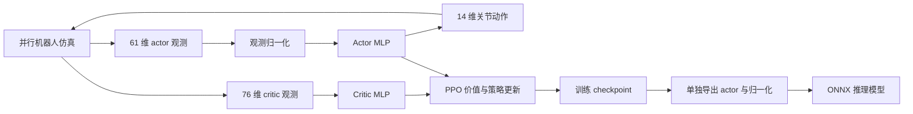

# 机械鸭行走模型：权重规模、预训练、后训练与消融实验

本文以 EmbodiedForge 内已移植的 **Microduck 平地行走 PPO** 为对象，说明模型有多大、训练产物包含什么、如何建立基础策略并继续训练，以及怎样设计可解释的消融实验。配置和文件统计核对日期为 **2026-09-17**。

当前确定性行走策略是一个约 **19.78 万参数的 MLP**；用于 PPO 训练的 actor 与 critic 合计约 **40.16 万参数**。实测完整训练 checkpoint 为 **4.84 MB**，部署 ONNX 为 **0.79 MB**。文件小并不意味着仿真训练显存需求小，也不意味着行走已经达标：已有一次追加 1000 次 PPO 更新的实验，速度跟踪反而变差。

本文中的数字分为三类：从配置与权重直接读取的模型统计、已经完成的实验结果、尚待执行的实验设计。文中的训练命令是复现说明，本次撰文没有启动新的训练或消融任务。

## 1. 当前系统训练的是什么

当前任务为 `Mjlab-Velocity-Flat-MicroDuck`。任务配置、奖励、观测、执行器扩展和机器人资产位于本仓库，默认运行无需 `3rdparty/microduck_rl`。底层仍使用固定版本的 mjlab、MuJoCo-Warp、BAM 和 RSL-RL；这是一项仿真强化学习任务。

主入口使用 `ef`，SDK 位于独立的 Python 3.12 环境。锁定依赖包括 mjlab 1.3.0、PyTorch 2.9.1、RSL-RL 5.0.1、MuJoCo 3.10.0；完整清单见 [requirements.txt](../src/embodiedforge/locomotion/microduck/requirements.txt)。

这里的策略不接收图像，也没有语言模型、视觉骨干或 Transformer。ACT 模仿学习是仓库中的另一条训练路径，不能将 ACT 的演示数据、模型参数量或预训练权重直接套到本任务上。



### 1.1 输入、动作与机器人模型

Actor 输入按当前配置的拼接顺序排列：

| 索引区间（左闭右开） | 内容 | 维度 |
| --- | --- | ---: |
| `[0:3]` | 机体角速度 | 3 |
| `[3:6]` | 机体坐标系中的重力投影 | 3 |
| `[6:20]` | 相对默认姿态的关节位置 | 14 |
| `[20:34]` | 关节速度 | 14 |
| `[34:48]` | 上一时刻动作 | 14 |
| `[48:51]` | 前进、横移、偏航速度指令 | 3 |
| `[51:55]` | 头颈姿态指令 | 4 |
| `[55:61]` | 机体位置与姿态指令 | 6 |
| 合计 | | **61** |

Critic 输入为 76 维，额外使用机体线速度、足部高度、腾空时间、接触及接触力等仿真信息。Actor 与 critic 的观测并不完全相同，因此部署时不能把 critic 的输入直接传给 actor。

输出为 14 个受控关节的动作，包含两腿和头颈。输出随后由环境的 `JointPositionAction` 和执行器模型解释，不能直接当作电机力矩。当前动作缩放为 1.0；默认姿态、关节顺序、单位和控制接口仍须与训练配置一致。ONNX 元数据记录了相关关节信息，但单个模型文件不构成完整实机控制程序。

机器人 MJCF 中还包含浮动基座和被动关节。已完成的迁移核对得到 `nq=21`、`nv=20`、`nu=14`；这些物理自由度数量与神经网络输入维度、参数量是不同概念。机器人 XML 和 38 个 STL 网格也是仿真资产，不是策略权重。见 [移植验证记录](microduck-port-20260916.md)。

### 1.2 网络结构与参数量

两个网络均使用隐藏层 `(512, 256, 128)` 和 ELU 激活，并启用观测归一化。

| 网络 | 结构 | 可训练参数 |
| --- | --- | ---: |
| Actor 确定性均值网络 | `61 → 512 → 256 → 128 → 14` | 197,774 |
| Actor 探索标准差 | 每个动作对应一个可学习值 | 14 |
| Actor 训练参数合计 | 均值网络 + 探索标准差 | **197,788** |
| Critic | `76 → 512 → 256 → 128 → 1` | **203,777** |
| PPO 模型合计 | Actor + critic | **401,565** |

线性层参数量按 `输入维度 × 输出维度 + 输出维度` 计算。例如 actor 第一层为 `61 × 512 + 512 = 31,744`，最后一层为 `128 × 14 + 14 = 1,806`。

Actor 均值网络的线性层合计约 196,864 次乘加/次推理。若把一次乘和一次加分别计为一次浮点操作，约为 0.394 MFLOPs；这里没有计入归一化、ELU、数据复制或框架开销，因此不能由此直接推算端到端控制延迟。

观测均值、方差、标准差及计数属于保存状态，不是可训练网络参数。把 `state_dict` 中所有张量元素都相加，会将这些缓冲区混入参数量。

### 1.3 小网络候选：先算规模，再验证效果

保持 61 维输入和 14 维输出，只缩小 actor 隐藏层，可以得到以下**公式估算**。只有第一行是本文已加载验证的结构，后两行没有完成训练、导出或性能评估。

| Actor 隐藏层 | 均值网络参数 | 含探索标准差的 actor 参数 | 线性层 MAC/次 | FP32 均值网络与推理归一化载荷 |
| --- | ---: | ---: | ---: | ---: |
| `(512, 256, 128)` | 197,774 | 197,788 | 196,864 | 791,584 bytes |
| `(256, 128, 64)` | 57,934 | 57,948 | 57,472 | 232,224 bytes |
| `(128, 64, 32)` | 18,734 | 18,748 | 18,496 | 75,424 bytes |

最后一列按 `(均值网络参数 + 2 × 61) × 4` 计算，包含归一化均值和标准差，不包含计算图、元数据或运行时。它不是导出后的文件大小，也不是推理内存实测。A6 首轮可只缩小 actor、保持 critic 不变，便于区分部署策略容量与价值估计能力的影响；两个网络同时缩小应作为另一项实验记录。

## 2. 权重文件为什么比 actor 大

以下为本机已有产物的实测大小。MB 使用十进制 `1,000,000 bytes`，MiB 使用二进制 `1,048,576 bytes`。

| 项目 | 字节数 | MB | MiB | 内容 |
| --- | ---: | ---: | ---: | --- |
| 完整 `model_2018.pt` | 4,843,445 | 4.843445 | 4.619069 | Actor、critic、优化器及恢复信息 |
| 续训后的 `model_3017.pt` | 4,843,445 | 4.843445 | 4.619069 | 同结构，权重与训练状态已改变 |
| Actor 状态的张量载荷 | 791,892 | 0.791892 | 0.755207 | 网络、探索标准差、归一化缓冲区 |
| Critic 状态的张量载荷 | 816,028 | 0.816028 | 0.778225 | 网络及归一化缓冲区 |
| 优化器状态的张量载荷 | 3,212,588 | 3.212588 | 3.063763 | Adam 动量等状态及步数 |
| 部署 ONNX 文件 | 793,822 | 0.793822 | 0.757048 | 确定性 actor、归一化、计算图和元数据 |

表中的“张量载荷”不是独立文件大小。三个状态组的张量共占 4,820,508 bytes，完整 checkpoint 还包含序列化结构等额外信息。Adam 的两组动量是 checkpoint 明显大于 actor 的主要原因。

本次 ONNX 的 initializer 共 197,896 个 FP32 元素，即 791,584 bytes：包含 197,774 个均值网络参数和归一化使用的均值、标准差。它不需要 critic、优化器、探索标准差或训练计数。图结构及元数据使最终文件略大；路径等元数据不同也可能使导出文件大小变化。

**模型大小相同不能说明模型效果相同。** 本次两个 checkpoint 大小完全相等，但跟踪结果不同。比较模型身份应使用 SHA256，而不是文件大小或迭代编号。

本次统计的本机产物为：

```text
runs/microduck-hour-training-20260912/logs/rsl_rl/microduck/2026-09-12_00-29-14_embodiedforge/model_2018.pt
runs/microduck-hour-opt-training-20260916/logs/rsl_rl/microduck/2026-09-16_23-42-00_embodiedforge/model_3017.pt
runs/microduck-actor-only-export-20260917.onnx
```

三份产物的 SHA256：

| 产物 | SHA256 |
| --- | --- |
| 基础 `model_2018.pt` | `096b5fc09326da3d5cdcd25a6afebaf2cdcdf9960333dad3a2b0c0c996a572fb` |
| 续训 `model_3017.pt` | `62ab9a17b21c08402e89c458165ef8cd116e3bba6762e324a8416ed56f9efbea` |
| 本文统计的 ONNX | `cf7b78bad737cf52d370e47612318a6e50cb9580b5bde171d08e71c29635bf26` |

ONNX 来自基础 `model_2018.pt`，不是续训后的 `model_3017.pt`；其同名 `.validation.json` 中的 `checkpoint_sha256` 可验证这一关系。部署模型的哈希与输入 checkpoint 的哈希是两个不同字段，动作一致的两次导出也可能因元数据不同而有不同的文件哈希。

上述运行产物保存在本机，不随源码分发。换用其他 checkpoint 时应重新统计，不能直接引用这些数值。

### 2.1 文件体积、内存和显存要分别报告

0.79 MB 的 ONNX 只是磁盘文件。推理还需要运行时、张量和中间激活；训练还需要 critic、梯度、优化器状态和 rollout 缓冲区；并行仿真还需要物理模型、接触、传感器及 Warp/CUDA 工作空间。

以 512 个环境、每次采样 24 步为例，仅 FP32 actor 观测、critic 观测和动作的原始存储就约为：

```text
512 × 24 × (61 + 76 + 14) × 4 bytes = 7.078125 MiB
```

这不是完整 rollout 大小，更不是训练峰值显存。不要用“权重不到 1 MB”推断小显存设备可以运行相同数量的仿真环境。`runtime.json.gpu_memory` 记录的是检查时的空闲和总显存，也不等于峰值占用。

磁盘预算也应按整个运行目录估算。按当前 SDK 的保存逻辑，从零训练 4000 次更新，会在编号 0、250、…、3750 保存，并额外保存最终编号 3999，合计 17 个 checkpoint。若每个约 4.84 MB，仅权重就约 82 MB，此外还有实现快照、TensorBoard 和阶段日志；导出尝试也保存一份输入 checkpoint 和实现快照。当前没有自动清理历史模型的机制，不能按一个 ONNX 的大小估算整个实验的存储需求。

## 3. 预训练与后训练在本任务中的含义

| 阶段 | 本文定义 | 当前支持情况 |
| --- | --- | --- |
| 基础训练／预训练 | 随机初始化 actor、critic，在平地仿真中用 PPO 学习基础行走 | `train`，不指定恢复参数 |
| 同任务继续训练 | 从完整 checkpoint 追加 PPO 更新 | `train --resume-run` 或 `--resume` |
| 目标工况适配 | 从基础策略出发，调整训练分布或目标后继续 PPO | 需要修改并记录配方；没有专用“后训练模式” |
| 仅加载 actor、重新初始化 critic 和优化器 | 独立的 warm start 实验 | 当前公开训练 CLI 未提供该选项 |
| 演示学习、蒸馏、偏好优化 | 引入不同数据和损失的训练阶段 | 不属于当前 Microduck PPO 入口 |

“预训练”在这里是基础策略训练阶段的命名，不代表使用了公开大模型权重、人工演示或一个已经验收的通用行走模型。“后训练”也不是另一个已实现的算法接口；当前可直接使用的是 PPO 续训。

### 3.1 当前 PPO 配方

下表来自 [任务配置](../src/embodiedforge/locomotion/microduck/tasks/microduck_velocity_env_cfg.py)。启动器会覆盖训练预算、并行环境数、种子和日志方式。

| 配置 | 当前值 |
| --- | --- |
| 每环境 rollout 长度 | 24 个控制步 |
| 物理时间步 / 控制 decimation | 0.005 s / 4，即控制步 0.02 s（50 Hz） |
| Episode 时间上限 | 20 s |
| PPO epochs / minibatches | 5 / 4 |
| 初始学习率 / 调度 | `1e-3` / adaptive |
| 目标 KL / clip | 0.01 / 0.2 |
| 折扣系数 γ / GAE λ | 0.99 / 0.95 |
| Entropy 系数 / 梯度范数上限 | 0.01 / 1.0 |
| checkpoint 保存间隔 | 250 次更新，并在正常结束时保存最终模型 |
| 对称增强 | 默认关闭：`ENABLE_SYMMETRY=False` |

512 个环境时，每次更新采集 `512 × 24 = 12,288` 条环境 transition；默认对称增强关闭，四个 minibatch 对应每批 3,072 条，五个 epoch 共进行 20 次 minibatch 优化。4000 次更新对应 49,152,000 条新采样 transition，追加 1000 次更新对应 12,288,000 条。跨 epoch 复用的数据不能算作新的环境采样。

域随机化和课程会改变训练难度。当前配置包含躯干／头部质心、质量与惯性、关节摩擦、armature、IMU 安装误差、编码器偏置和推扰等处理；Kp/Kd 随机化默认关闭。具体启用项应以启动时保存的配置和实现快照为准，不能仅根据源文件中的历史注释推断。

当前实现会在 PPO 回报计算后检查优势值和回报：出现 NaN/Inf 时立即报错，停止本次策略更新，由启动器记录失败及阶段日志。早期移植版本会将这些异常值替换为零，可能掩盖异常批次；该行为已修正。有限数值的计算仍沿用锁定版本 RSL-RL，历史实验结果未因这次修改重新计算。

该检查由任务配置指定的 `MicroduckPPO` 子类完成，不再全局替换 RSL-RL 的 `PPO.compute_returns`。模型结构和 checkpoint 字段保持兼容，其他使用原始 PPO 的任务不会因导入 Microduck 而改变算法行为。

奖励项的 NaN/Inf 处理使用 mjlab 1.3.0 自带实现：在单项加权奖励累加前置零。本地已移除重复遍历奖励累计值的全局补丁。这个处理不代表物理状态有效；训练末尾仍会检查 `nan_state` 指标，PPO 目标异常也仍会报错。仅看到有限奖励，不能据此认定整次训练无数值异常。

平滑惩罚、站立比例、头部指令范围及质心范围等会随课程计数变化。例如 `action_rate_l2` 从 -0.1 逐步变为 -1.0，站立比例从 0.02 逐步变为 0.25。这意味着同一网络在不同训练阶段可能面临不同的奖励与指令分布。

### 3.2 基础训练命令

从仓库根目录执行，输出目录须尚不存在：

```bash
conda activate ef

# 仅首次安装或依赖清单更新后执行。
python -m embodiedforge.microduck setup

python -m embodiedforge.microduck train \
  --headless --quiet --seed 0 \
  --num-envs 512 --iterations 4000 \
  --output runs/duck-base-s0

python -m embodiedforge.microduck progress --run runs/duck-base-s0
```

这是一条正式训练命令，无需先跑短训练。4000 是示例预算，512 是并行规模示例，不是经过本文验证的最优配置或达标承诺。训练默认无窗口、不录像，只保存 checkpoint；ONNX 使用独立导出命令。

### 3.3 继续训练命令与恢复语义

```bash
python -m embodiedforge.microduck train \
  --resume-run runs/duck-base-s0 \
  --headless --quiet --seed 0 \
  --num-envs 512 --iterations 1000 \
  --output runs/duck-post-s0
```

这里的 `--iterations 1000` 表示追加 1000 次 PPO 更新。恢复内容包含 actor、critic、优化器、迭代记录和课程计数；启动器还恢复 checkpoint 中的学习率，避免重新使用配置中的 `1e-3`。首次环境 reset 前会设置课程计数，恢复证据写入 `resume.initialization.json`。

它重新创建仿真环境，不恢复每个环境的物理状态或完整随机数状态，因此不等价于原进程逐步无缝继续。SDK 的迭代编号沿用已有语义，不能只用两个 `model_N.pt` 文件名相减推算实际更新量；应看 `metrics.validation.json`、`resume.json` 和课程计数。

已经正常收尾的失败或中断运行，也可以通过 `--resume-run` 选择记录中的 checkpoint。仍标记为 `running` 的目录不会自动恢复，详见 [快捷命令](microduck-quickstart.md)。

当前 CLI 没有 `--learning-rate`、`--reset-optimizer` 或 `--ablation` 参数。若要研究“降学习率适配”或“只继承 actor”，需要先明确实现恢复策略，再开展实验；不能给当前命令加一个不存在的参数，也不能仅修改配置初始学习率就声称覆盖了恢复学习率。

### 3.4 如何确认续训真正恢复了指定状态

下面以 `runs/microduck-hour-opt-training-20260916/` 为例。只看到训练正常结束，不能证明恢复了正确的课程阶段；这些文件记录了不同阶段的证据：

| 要核对的事项 | 文件与字段 | 本次记录 |
| --- | --- | --- |
| 输入权重身份 | `resume.json.sha256`、`run.json.resume.sha256` 与原 checkpoint 哈希 | 三者均为第 2 节的基础模型哈希 |
| 恢复起点 | `resume.json.iteration`、`common_step_counter`、`learning_rate` | 2018、48,480、约 `2.56289e-4` |
| 第一次 reset 已采用恢复状态 | `resume.initialization.json.counter_at_first_reset`、`checkpoint_sha256` | 48,480，且哈希匹配基础模型 |
| 首次 reset 的课程配置 | 同一文件的 `action_rate_weight`、`standing_env_fraction` | -1.0、0.25；并非从 -0.1、0.02 重新开始 |
| 实际更新数 | `metrics.validation.json.iterations`、`start_iteration` | 1000 次，从编号 2018 开始 |
| 数值诊断 | 同一文件的 `all_scalars_finite`、`nan_states` | `true`、0；这不是行走效果验收 |
| 最终输出身份 | `run.json.checkpoint_relative`、`checkpoint_sha256`，再核对文件本身 | `model_3017.pt`，哈希见第 2 节 |

当前 SDK 的该次循环编号为 `2018 ... 3017`，首尾均计入，因此实际更新数是 `3017 - 2018 + 1 = 1000`。课程计数增加量则为 `72,480 - 48,480 = 24,000 = 1000 × 24`。一个是更新编号，一个是每个并行环境共用的控制步计数，不能再乘以 512 后当作课程起点。

如果预算尚未完成就中断，可能已有可恢复 checkpoint，但没有完整的 `metrics.validation.json`。应保留运行的失败／中断状态，报告实际完成的预算；不能因为找到了模型文件就把它算作完成的 1000 次训练实验。

## 4. 已完成的续训实验：效果没有改善

基础模型为 `model_2018.pt`，在 512 个环境中追加 1000 次更新后得到 `model_3017.pt`。从 `run.json.started_at` 到 `finished_at` 共 498.04 秒，即约 8 分 18 秒；这是包含准备、运行和收尾的启动器 wall time，不是纯 PPO 计算时间。该次记录的指标有限、NaN 状态为 0。两者的课程计数由 48,480 增加到 72,480，正好增加 `1000 × 24`；优化器学习率从约 `2.56289e-4` 变为 `1e-5`，后者是自适应训练的结果。

相同运行至少有三种时间／吞吐口径：

| 口径 | 如何获得 | 适合回答的问题 |
| --- | --- | --- |
| 启动器 wall time | `run.json` 的开始与结束时间差 | 一次完整作业占用了多少时间 |
| PPO 采样与更新耗时 | TensorBoard 的 `Perf/collection_time`、`Perf/learning_time` | 学习循环内采样和优化各占多少时间 |
| 端到端采样吞吐 | 已完成 transition 数除以启动器 wall time | 同一预算、同类硬件下的整体运行效率 |

该次端到端吞吐约为 `12,288,000 / 498.04 ≈ 24,673 transition/s`。它不是策略单帧推理速度，也不是 TensorBoard 某一迭代的 `Perf/total_fps`；并行仿真的合计采样速率更不能当作真实机器人的控制频率。

对照采用相同的三个评估种子 0、1、2，每个种子 16 环境、1000 步，即每环境 20 秒。指令为前进 0.2 m/s、横移和偏航为 0，关闭推扰，并将两组评估课程起点都固定为 48,480；两组均使用 TF32。

| 指标（三个评估种子的均值） | 续训前 | 续训后 | 解读 |
| --- | ---: | ---: | --- |
| 平面速度 RMSE（m/s） | 0.18757145 | 0.19222329 | 增加 0.00465184，变差 |
| 前进速度均值（m/s） | 0.04986567 | 0.03899638 | 两者均明显低于 0.2 m/s 指令 |
| 偏航速度 RMSE（rad/s） | 0.26621836 | 0.26220667 | 略有下降，不能抵消前进跟踪不足 |
| 每步平均奖励 | 0.16131981 | 0.15929317 | 下降 |
| 摔倒次数 | 0 | 0 | 仅说明本次窗口内未记录摔倒 |
| 首次 episode 完整观察期存活数量 | 16/16 | 16/16 | 不代表速度跟踪达标 |

同一对照中的逐种子平面速度 RMSE 为：

| 评估种子 | 续训前（m/s） | 续训后（m/s） | 后减前（m/s） |
| --- | ---: | ---: | ---: |
| 0 | 0.18424618 | 0.18746552 | +0.00321935 |
| 1 | 0.18682287 | 0.19422156 | +0.00739869 |
| 2 | 0.19164529 | 0.19498279 | +0.00333750 |

三组均变差，配对差值的样本标准差约为 0.00237957 m/s。这描述的是同一训练轨迹的评估波动，不是跨训练种子的误差条，也没有在这里进行显著性检验。

结果支持的结论是：**在所列工况下，单纯追加训练没有带来更好的速度跟踪。** 它没有证明继续训练必然有害，也没有确定退化原因。要分析平滑惩罚、站立比例、域随机化或学习率的作用，需要控制变量实验。

这只是一个训练轨迹上的前后对照，三个评估种子不等于三个独立训练重复。没有足够证据宣称统计显著性或对所有工况的泛化。历史细节见 [续训优化记录](microduck-hour-optimization-20260916.md)，本机原始汇总位于 `runs/microduck-hour-opt-comparison-20260916/comparison.json`。

## 5. 消融实验应怎样设计

以下为**尚未执行的实验计划**，不是效果排名。先保留基线和原始权重，针对一个假设只改一个因素，再用同一评估协议比较。

### 5.1 基础策略训练消融

| 编号 | 基线与变体 | 要回答的问题 | 实施注意事项 |
| --- | --- | --- | --- |
| A0 | 当前完整配方 | 建立可重复基线 | 至少使用多个独立训练种子 |
| A1 | 当前动作平滑课程 vs 全程固定 -0.1 | 强平滑约束是否限制了步幅与速度？ | 将 `action_rate_weight.params.weight_stages` 改为仅保留 step=0、weight=-0.1；只改初始 reward 会被课程覆盖 |
| A2 | 站立比例课程 vs 全程固定 0.02 | 较高站立采样比例是否削弱运动跟踪？ | 将 `standing_envs.params.standing_stages` 改为仅保留 step=0、rel_standing_envs=0.02；其余指令配置不变 |
| A3 | 开启 vs 关闭训练推扰 | 推扰带来恢复能力，还是牺牲平稳跟踪？ | 分别测无推扰与有推扰工况；两者不是同一个对照组 |
| A4 | 躯干质心随机化课程 vs 去掉该项 | 质量分布变化对稳态跟踪有何影响？ | 同时移除 `randomize_com` 事件和 `com_range` 课程；头部质心等其他项保持一致，不能称为关闭全部随机化 |
| A5 | `ENABLE_SYMMETRY=False` vs 开启 mirror loss | 镜像约束是否改善左右步态一致性？ | 当前候选配置是 mirror loss，不是完整 critic 观测数据增强 |
| A6 | 当前 actor vs 较小 MLP | 更小模型能否保持跟踪并降低推理成本？ | 需先支持匹配的模型构建／导出配置；不能用默认网络加载不同形状权重 |

这些因素未必相互独立。第一轮采用单因素实验，找到有证据的候选改动后再研究组合，避免把网络、奖励、随机化和训练预算一起改变。

启用对称项前应核对当前 61 维观测、14 维关节顺序和符号映射。[对称实现](../src/embodiedforge/locomotion/microduck/tasks/symmetry.py) 的默认候选配置为 `use_mirror_loss=True`、系数 0.5、`use_data_augmentation=False`；critic 的完整镜像没有实现。不能将“关闭与开启镜像损失”描述成“已经验证的双倍数据增强”。

对于 A6，例如将 actor 隐藏层改为 `(256, 128, 64)`，按同样公式可估算均值网络参数，但估算不能替代真实模型统计和评估。该实验会改变权重形状，应从相应结构重新训练，或另行实现并验证蒸馏；当前恢复入口不会自动转换架构。

### 5.2 后训练消融

固定同一个基础 checkpoint，再设计以下分支：

| 分支 | 操作 | 与其他分支的关系 |
| --- | --- | --- |
| P0 | 不追加训练，只评估基础 checkpoint | 衡量后训练是否真正增加收益 |
| P1 | 恢复完整状态，按原配方追加 1000 次更新 | 当前 CLI 直接支持的续训基线 |
| P2 | 同样恢复与预算，只调整一个目标工况因素 | 例如只调整训练指令分布，需修改配方 |
| P3 | 只继承 actor，重建 critic／优化器后用相同预算训练 | 尚需增加明确的 warm start 实现，不能冒充现有 `--resume` |

P0 与其他分支的计算预算不同，因此它回答“追加计算是否值得”，不回答“相同预算下哪个算法最好”。P1/P2/P3 应匹配新增 transition 数。学习率、课程起点和优化器是否恢复必须记录，因为它们本身就是实验变量。

评估后训练稳定性时，应对多个基础训练种子分别建立这些分支，再按基础种子配对比较。只从一个基础 checkpoint 派生多个评估种子，仍然不能估计基础训练的不确定性。

### 5.3 统一预算与记录口径

正式对照至少固定或记录：

- 训练种子、基础 checkpoint SHA256、新增 PPO 更新数、环境数、rollout 长度和总 transition 数。
- actor／critic 结构、归一化、奖励、指令分布、随机化范围和课程阶段。
- 学习率策略、优化器恢复方式、代码与依赖哈希、硬件和实际耗时。
- 评估种子、工况、环境数、步数、课程起点、推扰设置及计算精度。
- 每个训练种子的结果、失败运行和选择 checkpoint 的规则，避免只报告最好的一个。

多环境用于采集更多轨迹，不能简单把 16 个并行环境当成 16 个独立训练重复。可以先用 3 个独立训练种子形成初步结果，有明确趋势后再扩展；这里是实验规划，不是已完成的样本规模。

网络权重小与训练成本低也不是同一结论。网络压缩实验应同时报告策略参数量、ONNX 字节数、CPU 单帧延迟、训练 wall time 和仿真吞吐，不能只报告文件缩小比例。

### 5.4 分阶段预算与选模规则

以 512 环境、24 步 rollout 为例，下面是采样预算，不是预计 wall time：

| 计划 | 训练运行数 | 每次新增更新 | 总新增 transition |
| --- | ---: | ---: | ---: |
| 先比较 A0 与 A1，各 3 个训练种子 | 6 | 4000 | 294,912,000 |
| 展开 A0～A6，各 3 个训练种子 | 21 | 4000 | 1,032,192,000 |
| 在 3 个基础模型上比较 P1、P2 | 6 | 1000 | 73,728,000 |

后训练预算不含建立三个基础模型的成本，P0 还需要评估计算；表中也未计入任何验证或测试仿真。不宜把一次历史续训的 8 分 18 秒直接乘上这些运行数作为工期承诺，因为网络、接触和随机化都会影响耗时。

可以先完成 A0/A1，再根据独立验证集决定是否扩展其余因素。若按固定预算比较，预先约定使用最终 checkpoint；若允许按验证集选最佳 checkpoint，则所有变体采用相同保存间隔、候选数量和选择规则。选择过程中查看过的种子与工况属于验证集，最终测试应另留一组且不参与调参。失败运行应报告失败原因和已完成预算，不能静默删除或换种子直到成功。

## 6. 评估、对比与部署命令

### 6.1 在同一评估实现下比较基础策略与续训策略

以下命令评估前面示例训练目录。它使用 100、101、102 作为固定评估种子，与上文历史实验的 0、1、2 不同。两次评估期间保持仓库代码和依赖不变：

```bash
python -m embodiedforge.microduck evaluate \
  --run runs/duck-base-s0 --headless --quiet \
  --velocity 0.2 0 0 --no-pushes --curriculum-step 0 \
  --num-envs 16 --steps 1000 --seeds 100 101 102 \
  --output runs/duck-base-eval

python -m embodiedforge.microduck evaluate \
  --run runs/duck-post-s0 --headless --quiet \
  --velocity 0.2 0 0 --no-pushes --curriculum-step 0 \
  --num-envs 16 --steps 1000 --seeds 100 101 102 \
  --output runs/duck-post-eval

python -m embodiedforge.microduck compare \
  --before runs/duck-base-eval --after runs/duck-post-eval \
  --output runs/duck-base-vs-post
```

`--curriculum-step 0` 在这里选定一个共同的评估起点，不会把网络权重恢复成初始值；它也不是永远冻结课程，后续计数仍会推进。要复现历史对照应使用 48480，并匹配当时的其他条件。测试更成熟的随机化阶段时，应另设同样配对的评估组。

`compare` 对本地实现要求相同的 `implementation_sha256` 和 `requirements_sha256`。奖励、网络或随机化消融会改变训练源码；正确做法是保存各变体的训练快照，并尽可能将兼容结构的 checkpoint 放到同一套固定评估实现中重新评估。两份直接来自不同评估代码的报告会被拒绝比较。

架构或观测不同的变体还需要匹配的加载配置，以及另外设计的跨配置分析流程。当前 `compare` 不提供忽略实现差异的开关；不能把手工改哈希当作消融实验支持。

### 6.2 指标与测试工况

本任务的评估仍从 `play=True` 配置出发，命令覆盖的范围如下：

| 评估选项 | 实际变化 | 不应推断的结论 |
| --- | --- | --- |
| `--velocity VX VY WZ` | 固定速度；头颈／机体指令置零；移除站立比例、头部范围、机体范围三项指令课程 | 不等于测试了完整头颈指令跟踪或完整训练分布 |
| `--no-pushes` | 移除 `push_robot` 事件 | 不关闭质心、摩擦、质量等其他随机化 |
| `--curriculum-step N` | 在首次 reset 前设置共同课程起点 | 不会冻结后续课程，也不会关闭随机化 |
| 不传 `--no-pushes` | 保留 play 配置的推扰 | 不等同于训练推扰频率：当前 play 为 0.5～1.0 s，训练为 3～6 s |

A3 要分开回答“训练时加入推扰是否改善固定工况”与“策略在推扰下是否稳定”。前者是在同一个固定评估环境中比较两个训练策略；后者额外改变了评估工况，应另建一组配对结果。对 A2 使用固定速度评估时，站立采样在评估侧被关闭，测到的是训练配方对行走策略的影响；若还要看站立能力，应单独评估零速度工况。

至少一起查看平面／偏航速度 RMSE、实际速度均值、每环境偏差、摔倒与 NaN、首次 episode 存活及截尾情况。平均速度接近目标，仍可能掩盖左右摆动；没有摔倒，也可能只是近似站立。

初步工况可分别覆盖站立、前进、后退、横移与原地转向，再添加推扰评估。每种工况单独生成报告；现有汇总要求相同评估条件，不把不同速度指令混成一个“总体均分”。平地任务通过也不能外推到斜坡、台阶或实机。

当前 episode 上限为 20 秒，1000 个控制步正好是 20 秒。若延长到 3000 步，环境会经历超时和重置；首次 episode 可能被标为提前截尾。此时不能机械地沿用“首次 episode 存活整个 60 秒”的验收门槛，应结合总摔倒、逐环境统计和 episode 语义重新定义长期稳定性指标。

验收阈值应在选模前确定，例如最大平面 RMSE、最大偏航 RMSE、最低存活比例。`assess` 支持对已有结果离线应用阈值；不设置阈值时，运行完成仅表示流程和数据检查通过，不代表步态质量达标。

### 6.3 RMSE 的计算口径与报告字段

速度误差在物理步之后、环境 reset 和指令重采样之前累计，包含终止步，避免跌倒后的重置掩盖失败时的误差。设一个种子的环境数为 `E`，每环境控制步数为 `T`，`dx`、`dy` 分别为实际速度减去对应指令的误差：

```text
RMSE_x = sqrt(sum(dx²) / (E × T))
RMSE_y = sqrt(sum(dy²) / (E × T))
平面 RMSE = sqrt(sum(dx² + dy²) / (E × T))
          = sqrt(RMSE_x² + RMSE_y²)
```

平面 RMSE 的单位是 m/s；偏航角速度 RMSE 单独以 rad/s 报告，不能把三轴平方相加并仍称为 m/s。平均速度偏差是有符号误差的均值，正负误差可以抵消，因此也不能替代 RMSE。

| 想报告的数值 | 对应字段或计算方式 |
| --- | --- |
| 单个种子的平面 RMSE | `evaluation.json → velocity_tracking.planar_velocity_rmse_m_s` |
| 各种子平面 RMSE 的均值 | `summary.json → metrics.planar_velocity_rmse_m_s.mean` |
| 各种子平面 RMSE 的样本标准差 | 同一指标下的 `sample_std`；只有一个种子时为 `null` |
| 合并样本的平面 RMSE | 对 `summary.json → pooled_velocity_rmse` 的前两轴做 `hypot` |
| 前后配对差值的均值 | `comparison.json → metrics.planar_velocity_rmse_m_s.mean_delta` |
| 配对差值的样本标准差 | 同一指标下的 `delta_sample_std` |

当前批次要求各个种子的环境数、步数相同，所以合并样本的平面 RMSE 等于 `sqrt(mean(各个种子的平面 RMSE²))`，而不是 `mean(各个种子的平面 RMSE)`。历史结果的两种统计分别为：

| 统计方式（m/s） | 续训前 | 续训后 |
| --- | ---: | ---: |
| 各种子 RMSE 均值，即第 4 节使用的指标 | 0.18757145 | 0.19222329 |
| 合并样本的 RMSE | 0.18759651 | 0.19225298 |

两种统计回答不同问题，报告时应明确选择哪一种。先逐训练种子计算配对变化，再讨论训练重复间的波动；不能把报告中三个评估种子的 `sample_std` 标成训练算法的置信区间。当前 `compare` 输出差值和样本标准差，不自动给出显著性结论。

### 6.4 离线验收与失败解释

已有评估报告可以在 `ef` 环境中直接验收，无需 GPU，也不会重新启动仿真。例如，对前面的续训评估应用平面 RMSE 和存活比例两项限制：

```bash
python -m embodiedforge.microduck assess \
  --run runs/duck-post-eval \
  --max-planar-rmse 0.1 --min-survival-fraction 1.0 \
  --output runs/duck-post-acceptance
```

这里的 `0.1 m/s` 和 `1.0` 仅用于说明命令，不是历史实验预先确定的门槛，也不是实机验收标准。正式实验应在选模前根据任务确定阈值，并对所有候选使用同一标准；还可通过 `--max-yaw-rmse` 添加偏航角速度限制，单位为 rad/s。未指定的指标不会自动参与验收。

每个种子必须满足每一项限制：RMSE 小于等于上限，存活比例大于等于下限，恰好等于阈值也通过。存活比例是该种子首次 episode 存活完整评估时长的环境数除以环境总数，不是所有重置后 episode 的成功率。

输出目录必须尚不存在。`acceptance.json` 保留逐种子的实测值、阈值、判定和 `failed_seeds`；`run.json` 记录验收状态，`inputs/` 保存输入报告副本，原始评估目录不变。

| 结果 | 如何解释 |
| --- | --- |
| 退出码 `0`、状态 `complete` | 所有种子满足所有已设置的阈值；结论仅适用于这些工况与指标 |
| 退出码 `3`、状态 `rejected` | 报告有效，但策略未达标；查看 `acceptance.json` 中失败的具体指标 |
| 报告缺失、批次未完成或数据不一致，退出码 `1` | 无法形成有效验收结论；不能把缺失种子补零或当成策略通过 |

对第 4 节历史续训后的三个种子应用上述示例阈值，会得到 `rejected`：三者存活比例均为 `1.0`，但平面 RMSE 分别约为 `0.18747`、`0.19422`、`0.19498 m/s`，全部高于 `0.1 m/s`。这说明“未摔倒”不足以证明速度跟踪达标。该判断是对已有结果的事后说明，不构成新的训练实验。

`compare` 回答候选相对基础模型改变了多少，`assess` 回答是否满足绝对阈值。相对改善和绝对达标应分别报告：有所改善的策略仍可能不达标，满足宽松阈值的策略也可能比基础模型退步。

### 6.5 导出和动作一致性

```bash
python -m embodiedforge.microduck export \
  --run runs/duck-post-s0 --headless --quiet \
  --output runs/duck-post-s0.onnx

python -m embodiedforge.microduck evaluate \
  --run runs/duck-post-s0 --onnx runs/duck-post-s0.onnx \
  --headless --quiet --video \
  --velocity 0.2 0 0 --no-pushes --curriculum-step 0 \
  --num-envs 16 --steps 1000 --seeds 100 101 102 \
  --output runs/duck-post-onnx-eval
```

导出只恢复 actor；checkpoint 先在 CPU 读取，所需策略权重再加载到 GPU，避免将无用训练状态搬到 GPU。当前导出仍需 CUDA 创建任务环境，不能因此称为纯 CPU 导出。

部署 ONNX 的输入为 FP32 `[1, 61]`，输出为 FP32 `[1, 14]`，opset 为 18。模型内部包含学习到的观测归一化，调用者需要提供与训练一致的原始策略观测，不能再次重复归一化。

`--onnx` 每步抽取一个环境的观测，在 CPU 上执行 ONNX，并与 PyTorch 的确定性原始动作比较；该模式关闭 TF32，使用逐元素容差 `1e-4 + 1e-4 × abs(torch_action)`。有、无 ONNX 对照的运行可能使用不同计算精度，不应直接混作消融结果。

当前 ONNX 单帧推理使用一个线程。本机已有优化验证：同一 checkpoint 在改为 actor-only 导出后，101 组零／随机输入的动作与旧导出完全一致；单线程与默认线程配置在另一组同规模输入对照中也完全一致。这些是导出／运行时一致性证据，不能等同于新的行走性能实验。

当前“部署”覆盖仿真回放和模型导出；硬件控制接口、真实传感器处理、控制周期和机器人现场验收尚未完成。ONNX 对照时仿真仍由 PyTorch 动作驱动，不能声称已经验证 ONNX 独立闭环或真实机械鸭行走。

### 6.6 从网络动作到关节目标

当前动作顺序与关节位置、关节速度观测内部的顺序一致。下表按已有 ONNX 的 `joint_names` 和本地 `HOME_FRAME` 核对，索引从零开始；默认角度为 rad，保留配置中的四位小数：

| 动作索引 | 关节名称，按顺序 | 默认角度，按顺序 |
| --- | --- | --- |
| `0～4` | `left_hip_yaw, left_hip_roll, left_hip_pitch, left_knee, left_ankle` | `0.0000, -0.0873, -0.4579, -0.0049, 0.4530` |
| `5～8` | `neck_pitch, head_pitch, head_yaw, head_roll` | `0.3491, 0.3491, 0.0000, 0.0000` |
| `9～13` | `right_hip_yaw, right_hip_roll, right_hip_pitch, right_knee, right_ankle` | `0.0000, 0.0873, 0.4579, 0.0049, -0.4530` |

头颈位于两腿之间，不能按“左腿、右腿、头颈”重新拼接。硬件电机 ID 应通过关节名称映射到这个顺序。

设 ONNX 输出为 `a_t`、默认关节角为 `q_default`，当前 `scale=1.0` 且 `use_default_offset=True`，动作处理为：

```text
q_target_encoder = q_default + 1.0 × a_t
q_target_sim = q_target_encoder - encoder_bias
```

第二行是仿真 `JointPositionAction` 对编码器偏置的处理，与 actor 看到的带偏置关节位置配套；真实驱动需要使用自身的标定约定，不能再人为采样一份训练随机偏置。动作是相对默认姿态的偏移，不是相对当前关节角的增量，也不是力矩。

当前配方的 `clip_actions` 和动作项 `clip` 均为 `None`，因此 ONNX 输出没有固定的 `[-1, 1]` 范围保证。新增限幅会改变控制行为，应在对应闭环中重新评估。Actor 输入 `[34:48]` 保存上一控制步的原始动作 `a_(t-1)`，不是加上默认角后的关节目标；环境 reset 时该动作历史清零。策略按 50 Hz 更新，仿真在每次更新之间执行 4 个物理步。

本文统计的历史 ONNX 中，`default_joint_pos` 被通用导出器格式化到三位小数，精确默认角应取对应训练配置。当前本地导出已修复此精度损失：新导出的默认角使用完整浮点数值，仍保持逗号分隔格式；已有文件不会自动更新，本文历史文件的大小与 SHA256 仍对应原文件。

`joint_stiffness=1`、`joint_damping=0` 来自 MuJoCo 执行器参数，不能当作舵机固件的 P/D 增益。本任务使用 BAM 执行器，配置中的固件 P 增益覆盖值为 `kp_fw=200.0`，其含义和动力学应结合 [机器人配置](../src/embodiedforge/locomotion/microduck/robot/microduck_constants.py) 与执行器实现理解。

## 7. 如何重新核对模型大小与来源

在仓库根目录执行下面的只读统计；查看自己的模型时替换 `path` 和 `onnx_path` 两个路径。脚本在 CPU 上读取权重与 ONNX，不创建仿真或启动训练：

```bash
.cache/microduck-native-venv/bin/python -I - <<'PY'
from pathlib import Path
import hashlib
import onnx
import torch

path = Path("runs/microduck-hour-training-20260912/logs/rsl_rl/microduck/2026-09-12_00-29-14_embodiedforge/model_2018.pt")
onnx_path = Path("runs/microduck-actor-only-export-20260917.onnx")
with path.open("rb") as stream:
    state = torch.load(stream, map_location="cpu", weights_only=True)
    stream.seek(0)
    digest = hashlib.sha256()
    checkpoint_bytes = 0
    for block in iter(lambda: stream.read(1024 * 1024), b""):
        digest.update(block)
        checkpoint_bytes += len(block)

def tensors(value):
    if isinstance(value, torch.Tensor):
        yield value
    elif isinstance(value, dict):
        for child in value.values():
            yield from tensors(child)
    elif isinstance(value, (list, tuple)):
        for child in value:
            yield from tensors(child)

print("checkpoint bytes:", checkpoint_bytes)
print("checkpoint SHA256:", digest.hexdigest())
for name in ("actor_state_dict", "critic_state_dict", "optimizer_state_dict"):
    print(name, "tensor bytes:", sum(t.numel() * t.element_size() for t in tensors(state[name])))
for name in ("actor_state_dict", "critic_state_dict"):
    # 本文固定 MLP/Gaussian 结构：归一化状态是 buffer，不计作可训练参数。
    count = sum(t.numel() for key, t in state[name].items()
                if key.startswith(("mlp.", "distribution.")))
    print(name, "trainable parameters:", count)
print("iteration:", state["iter"])
print("curriculum:", state["infos"]["env_state"]["common_step_counter"])

raw = onnx_path.read_bytes()
model = onnx.load_model_from_string(raw)
print("ONNX bytes:", len(raw))
print("ONNX SHA256:", hashlib.sha256(raw).hexdigest())
print("ONNX initializer elements:", sum(
    onnx.numpy_helper.to_array(t).size for t in model.graph.initializer))
print("ONNX initializer bytes:", sum(
    onnx.numpy_helper.to_array(t).nbytes for t in model.graph.initializer))
metadata = {item.key: item.value for item in model.metadata_props}
for key in ("joint_names", "default_joint_pos", "action_scale",
            "joint_stiffness", "joint_damping", "observation_names"):
    print("ONNX metadata", key, ":", metadata.get(key))
PY
```

这里的参数筛选对应当前 MLP/Gaussian 命名；更换模型实现后应使用该模型的 `named_parameters()` 核对，而不是继续照搬前缀筛选。ONNX 统计对应本文的单文件内嵌权重格式；若另行导出使用外部权重文件的大模型，磁盘体积须连同外部数据一起计算。

复核历史训练耗时和已记录预算时，只需标准库，可直接在 `ef` 中读取日志：

```bash
python - <<'PY'
import json
from datetime import datetime
from pathlib import Path

root = Path("runs/microduck-hour-opt-training-20260916")
run = json.loads((root / "run.json").read_text())
metrics = json.loads((root / "metrics.validation.json").read_text())
initial = json.loads((root / "resume.initialization.json").read_text())
seconds = (datetime.fromisoformat(run["finished_at"])
           - datetime.fromisoformat(run["started_at"])).total_seconds()
# 本文配方每环境每次更新采样 24 步；换配方时须读取其实际 rollout 长度。
transitions = metrics["iterations"] * initial["num_envs"] * 24
print("status:", run["status"])
print("updates:", metrics["iterations"])
print("wall seconds:", seconds)
print("collected transitions:", transitions)
print("end-to-end transitions/s:", transitions / seconds)
PY
```

这个计算针对本文已经完成且通过更新数校验的运行。不要将计划预算代入中断任务，也不要用 episode 存活数量推算训练采样数；前者是训练完成度，后者是评估行为指标。

## 8. 证据与实现入口

| 内容 | 来源 |
| --- | --- |
| 观测、动作、网络、PPO 和课程配方 | [microduck_velocity_env_cfg.py](../src/embodiedforge/locomotion/microduck/tasks/microduck_velocity_env_cfg.py) |
| 左右镜像与候选 mirror loss 配置 | [symmetry.py](../src/embodiedforge/locomotion/microduck/tasks/symmetry.py) |
| 恢复、评估、ONNX 对照和运行指标 | [_microduck_worker.py](../src/embodiedforge/_microduck_worker.py) |
| checkpoint 保存与独立导出 | [runner](../src/embodiedforge/locomotion/microduck/tasks/__init__.py)、[export.py](../src/embodiedforge/locomotion/microduck/export.py) |
| 报告汇总、验收和同条件比较 | [_microduck_reports.py](../src/embodiedforge/_microduck_reports.py) |
| 已完成的迁移与续训实验 | [移植验证](microduck-port-20260916.md)、[续训前后对照](microduck-hour-optimization-20260916.md) |
| 日常训练与部署操作 | [快捷命令](microduck-quickstart.md)、[完整说明](microduck.md) |
