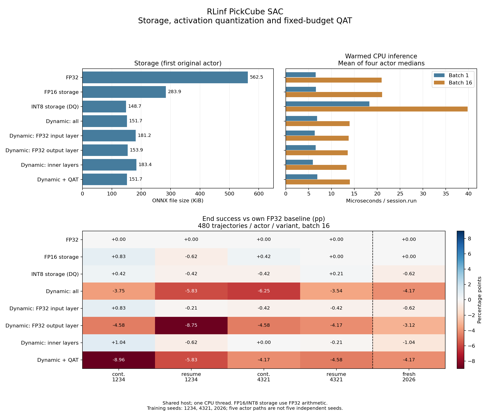
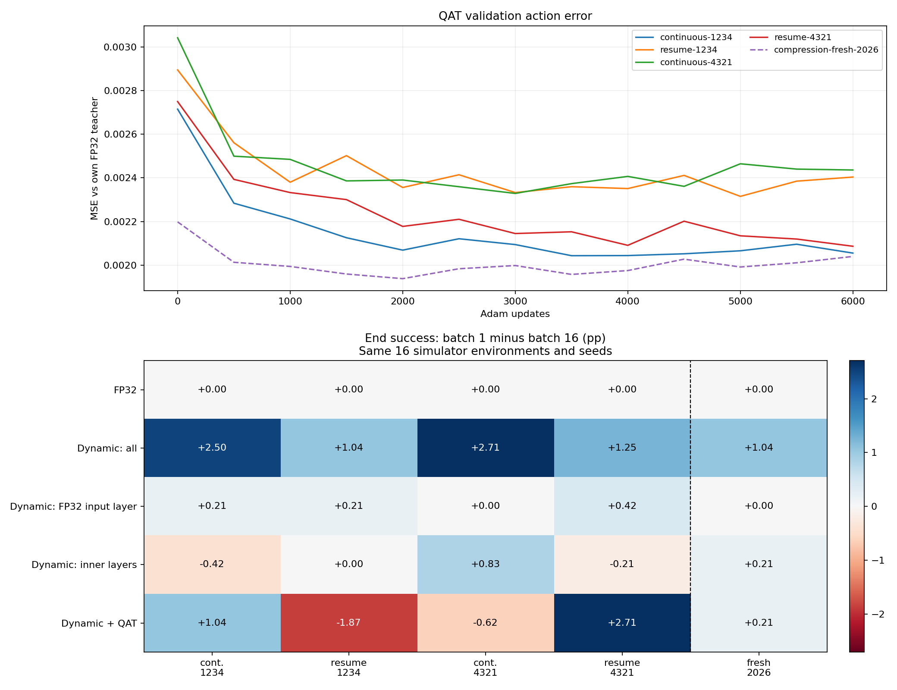

# RLinf SAC 模型压缩、量化后训练与逐层消融

这篇文章接续 [连续训练与完整状态续训实验](rl-resume-study-20260928.md)，分析同一策略压缩后为什么会损失成功率，并把可复用的 FP16/INT8 权重存储接入正式导出命令。研究覆盖 FP32、两种权重存储压缩、四种动态 INT8 层级配置和一次固定预算的量化感知后训练（QAT）。所有结果来自本机 headless PickCube 仿真；CPU ONNX 产生动作，GPU 仿真执行动作。

核心区别是：参数数量、模型文件大小、推理精度、计算耗时和闭环成功率是不同指标。FP16 存储使正式导出的文件从 **575,951 B 缩至 290,616 B（减少 49.54%）**，网络仍有 **143,620 个确定性 actor 参数**，输入、输出与算术仍为 FP32。正式 INT8 权重存储进一步缩至 **151,266 B（减少 73.74%）**，同样保持 FP32 计算。动态激活 INT8 是另一种方案，需要额外检查激活量化和 batch 对动作的影响。

## 实验对象和数据边界

主实验固定上一轮四个第 3000 轮模型：`continuous-1234`、`resume-1234`、`continuous-4321`、`resume-4321`。它们只包含两个独立训练种子；同种子的连续与续训路径共享第 1000 轮起点。额外确认组使用 **seed 2026 从零训练 3000 轮**，模型和训练参数不变，全部八种压缩配置都参与。五条 actor 路径合计三个训练种子，不能作为五个独立种子计算置信区间。

RLinf 固定提交 `67864d67c086a111de9921c5f4591eb5882f74ec`。研究使用开始时冻结的 EmbodiedForge 包，正式入口改动另行验证。新训练沿用 32 个训练环境、每轮 2 个采样步和 32 次 SAC 更新、batch 1024；3000 轮对应 **192,000 条环境转换、96,000 次 SAC 更新**。每 500 轮保存一次，使用事先指定的最终第 3000 轮，而非按评估分数挑选保存点。

每个原始 FP32 teacher 用环境种子 8001、8002、8003 各采集 8000 个真实闭环状态与动作：前两个种子共 16,000 个状态用于 QAT，第三个种子 8000 个状态仅用于误差验证。保留实际的 16 环境批量分组，因为动态量化范围受整个输入张量影响。主组的采集成功计数逐项匹配上一轮 FP32 结果。

最终闭环比较使用另一组环境种子 **10001、10002、10003**，每个模型、变体、种子运行 16 环境 × 10 个 episode，每条 episode 50 步。每个变体每个 actor 合计 **480 条轨迹**。主组 96 次评估共 15,360 条轨迹；确认组 24 次评估共 3840 条轨迹。加上后文逐状态推理、QAT-FP32 和正式 INT8 补充对照，本轮共完成 **225 次对照评估、36,000 条轨迹**，数据采集和安装包检查另计。相同种子便于对照，但轨迹会随策略动作分叉；这里报告成功计数和百分点差值，不把相关样本视为独立训练重复。

主实验八种配置和 QAT 预算在闭环评估前固定。新增 seed 2026 的确认训练及全部八种评估在其结果产生前声明。逐状态推理对照是在观察到离线 batch 差异后追加的机制检查，协议另行归档，不能称为原始实验预注册。

## 权重大小与计算路径

网络结构为 `42 → 256 → 256 → 256 → 4`，每层后为 Tanh。确定性导出裁去 critic 和探索方差头，只保留 `tanh(actor_mean)`。原始完整模型权重为 1,754,385 B；其中可训练参数 435,466 个（actor 144,648、critic 290,818），state dict 另有两个动作变换缓冲区，共 435,468 个标量。完整 SAC 恢复目录还包含优化器、目标网络、回放和随机状态，不能用下面的 ONNX 文件恢复 SAC。

下表是主实验第一条 actor 的研究图大小，原始 INT8 存储采用 `DequantizeLinear`（DQ）；后文另报使用常量展开的正式 INT8 实现。其余模型结构相同；QAT 图携带额外元数据。KiB 按 1024 字节计算。正式 FP16 图为 290,616 B，研究图因元数据和节点名称不同为 290,682 B；四个 actor 在各自 8000 个验证状态上的正式与研究图动作逐元素完全一致。


| 变体 | ONNX / B | KiB | 比 FP32 缩小 | 执行方式 |
| --- | --- | --- | --- | --- |
| FP32 | 575,951 | 562.452 | 0.00% | 4 层 FP32 |
| FP16 权重存储 | 290,682 | 283.869 | 49.53% | 4 个矩阵 FP16 存储，Cast 后 FP32 计算 |
| INT8 权重存储（DQ） | 152,233 | 148.665 | 73.57% | 4 个矩阵 INT8 存储，反量化后 FP32 计算 |
| 全部动态 INT8 | 155,314 | 151.674 | 73.03% | 4 层动态激活量化与整数矩阵乘法 |
| 输入层保留 FP32 | 185,561 | 181.212 | 67.78% | 第 1 层 FP32，后 3 层动态量化 |
| 输出层保留 FP32 | 157,587 | 153.894 | 72.64% | 前 3 层动态量化，第 4 层 FP32 |
| 仅中间层动态 INT8 | 187,821 | 183.419 | 67.39% | 第 1、4 层 FP32，中间 2 层动态量化 |
| 全部动态 INT8 + QAT | 155,342 | 151.701 | 73.03% | 后训练后，4 层动态量化 |


四个矩阵共 142,848 个元素，偏置共 772 个元素。FP32 初始化张量有效载荷为 **574,480 B**；FP16 存储为 **288,784 B**（矩阵 285,696 B、偏置 3088 B），正式 ONNX 文件另有 1832 B 的图和序列化开销。这里按张量元素字节数相加，未包含运行时展开或计算缓冲区。逐图、逐 dtype 的统计保存在 JSON 的 `tensor_sizes` 中。

FP16 和 INT8 权重存储均保留 FP32 bias、观测、动作和计算。只压缩四个矩阵，不改变网络宽度或参数数量。scale 和 zero point 是存储表示附加的常量，不计作 actor 可训练参数；后文另测量 CPU 进程内存，不将文件大小等同于运行时占用。INT8 权重采用逐输出通道对称量化，范围 −127…127；动态方案额外使用每次调用中按张量范围确定的 UINT8 激活量化。逐层校验确认：仅权重 INT8 与全部动态 INT8 的量化整数权重、scale、zero point 完全一致（计入矩阵转置），为比较激活量化和执行路径提供控制。

## 闭环结果：原有两个训练种子

表中为 **结束时成功**，每格分母都是 480；JSON 同时保留曾成功、每种子的成功计数、三种评估种子间标准差。结束成功要求最后一步仍成功，比“轨迹中曾成功过”更能反映保持抓取的能力。


| 变体 | continuous-1234 | resume-1234 | continuous-4321 | resume-4321 |
| --- | --- | --- | --- | --- |
| FP32 | 466/480 (97.083%) | 467/480 (97.292%) | 462/480 (96.250%) | 468/480 (97.500%) |
| FP16 权重存储 | 470/480 (97.917%) | 464/480 (96.667%) | 464/480 (96.667%) | 468/480 (97.500%) |
| INT8 权重存储（DQ） | 468/480 (97.500%) | 465/480 (96.875%) | 460/480 (95.833%) | 469/480 (97.708%) |
| 全部动态 INT8 | 448/480 (93.333%) | 439/480 (91.458%) | 432/480 (90.000%) | 451/480 (93.958%) |
| 输入层保留 FP32 | 470/480 (97.917%) | 466/480 (97.083%) | 460/480 (95.833%) | 466/480 (97.083%) |
| 输出层保留 FP32 | 444/480 (92.500%) | 425/480 (88.542%) | 440/480 (91.667%) | 448/480 (93.333%) |
| 仅中间层动态 INT8 | 471/480 (98.125%) | 464/480 (96.667%) | 462/480 (96.250%) | 467/480 (97.292%) |
| 全部动态 INT8 + QAT | 423/480 (88.125%) | 439/480 (91.458%) | 442/480 (92.083%) | 446/480 (92.917%) |

主组的 FP16 存储结束成功率相对 FP32 变化为 **−0.625～+0.833 pp**；全部动态 INT8 为 **−6.250～−3.542 pp**。保留输入层 FP32 后为 **−0.417～+0.833 pp**，仅保留输出层仍为 **−8.750～−4.167 pp**；只量化中间两层为 **−0.625～+1.042 pp**。这些是有限样本上的观察范围，接近基线不构成统计等效性证明。输入层配置的比较同时改变该层权重和激活处理，不能单凭这一张表把改善归因于某一个算子。




图中成功率差值均相对同一 actor 的 FP32，单位为百分点。虚线右侧为新增 seed 2026，单独作为确认组；耗时面板仅对主组四个 actor 的中位数取均值。

## 新训练种子的确认组

seed 2026 的策略从随机初始化独立训练，随后执行相同的数据采集、八种转换、6000 次 QAT 更新和三个 held-out 环境种子评估。预算和方案不根据确认组结果调整。


| 变体 | 曾成功 | 结束成功 | 结束成功相对 FP32 / pp |
| --- | --- | --- | --- |
| FP32 | 469/480 (97.708%) | 466/480 (97.083%) | +0.000 |
| FP16 权重存储 | 469/480 (97.708%) | 466/480 (97.083%) | +0.000 |
| INT8 权重存储（DQ） | 467/480 (97.292%) | 463/480 (96.458%) | -0.625 |
| 全部动态 INT8 | 459/480 (95.625%) | 446/480 (92.917%) | -4.167 |
| 输入层保留 FP32 | 469/480 (97.708%) | 463/480 (96.458%) | -0.625 |
| 输出层保留 FP32 | 464/480 (96.667%) | 451/480 (93.958%) | -3.125 |
| 仅中间层动态 INT8 | 464/480 (96.667%) | 461/480 (96.042%) | -1.042 |
| 全部动态 INT8 + QAT | 459/480 (95.625%) | 446/480 (92.917%) | -4.167 |


新增训练的 6 个保存点通过状态核对：DCP 模型与独立权重逐项一致，优化器步数为对应训练轮数的 32 倍，目标网络和优化器张量有限，回放条目及累计采样数符合预算。全部 120,654 条已记录 TensorBoard 标量为有限值；这不等同于检查未记录的每个中间张量。

## 量化感知后训练：训练误差与任务结果分开看

这里的基础模型来自 SAC 交互训练，没有演示数据或 ACT 预训练。QAT 是在压缩后的同一 actor 上，用其原始 FP32 teacher 的动作进行离线自蒸馏；它属于量化感知的模仿后训练，**没有继续执行 SAC、重新设计奖励或训练 critic**。

每条 actor 路径使用同样的固定预算：Adam 6000 次更新、学习率 0.00001、batch 16、梯度范数上限 1、无 weight decay、随机种子 411。每次随机抽一个完整的原始 16 状态批量，以动作 MSE 训练；权重与激活使用模拟量化及直通梯度。只取最终第 6000 次更新，不用验证误差最低点或闭环成功率选模型。

模拟量化在 PyTorch 中执行，最终评估运行实际 ORT 整数图。开始训练前修正过激活舍入顺序，初始失败检查没有执行梯度更新，记录保留在归档中。正确顺序为 `round(x / scale) + zero_point`。即便权重量化字节相同，浮点线性层、Tanh 与量化边界仍可产生执行差异；研究记录模拟量化与 ORT 的误差，未声称逐位等价。


| actor | 后训练前 MSE（ORT） | 后训练后 MSE（ORT） | 误差下降 | 结束成功相对未后训练动态 INT8 / pp |
| --- | --- | --- | --- | --- |
| continuous-1234 | 0.002714 | 0.002055 | 24.28% | -5.208 |
| resume-1234 | 0.002894 | 0.002404 | 16.95% | +0.000 |
| continuous-4321 | 0.003042 | 0.002436 | 19.92% | +2.083 |
| resume-4321 | 0.002749 | 0.002086 | 24.12% | -1.042 |
| compression-fresh-2026 | 0.002198 | 0.002040 | 7.20% | +0.000 |

主组 QAT 相对未后训练的全部动态 INT8，结束成功率变化分别为 **−5.208、0.000、+2.083、−1.042 pp**。四条路径的动作 MSE 均下降，闭环却没有一致改善；这次固定预算的后训练不能视为已经修复量化损失。


前后误差使用相同的验证状态；开始时的 ORT MSE 取自 JSON 的 `benchmark.batch16.rmse²`；图中的过程曲线是模拟量化的验证 MSE。MSE 下降仅表示更接近 teacher 在这些状态上的动作，不等同于闭环成功率提升。QAT 保存的 `full_weights.pt` 只更新 actor、保留旧 critic，供正常导出工具读取；它不是一致的 SAC 完整续训保存点。

### 四个动作分量的误差

依据本机 ManiSkill Panda 的控制器配置与拼接顺序，前三个动作分量是末端位置增量控制，第四个是夹爪控制。下表按五个 actor 各 8000 个验证状态汇总，先平均平方误差再开方；单位均为归一化动作，不是米制位置误差或抓取失败概率。控制器源码路径和哈希归档在 `component_analysis`。

| 变体 | 位置 x RMSE | 位置 y RMSE | 位置 z RMSE | 夹爪 RMSE |
| --- | --- | --- | --- | --- |
| 全部动态 INT8 | 0.03906 | 0.05249 | 0.04519 | 0.06749 |
| 输入层保留 FP32 | 0.00572 | 0.00883 | 0.00684 | 0.01251 |
| 仅中间层动态 INT8 | 0.00276 | 0.00434 | 0.00348 | 0.00659 |
| 全部动态 INT8 + QAT | 0.03541 | 0.04515 | 0.03781 | 0.06399 |

全部动态 INT8 的夹爪分量 RMSE 最大。QAT 后位置三个分量的 RMSE 分别下降约 9.35%、13.99%、16.32%，夹爪只下降约 5.18%。这说明相同的平均动作误差下降不能代表每个控制分量得到同等改善；它不能单独证明闭环失败由夹爪误差引起，本轮也没有改变损失权重来验证这一因果假设。

### 模拟量化的计算细节

逐输出通道的权重 scale 为 `max(abs(weight), axis=input) / 127`，激活 scale 为包含零点的全张量范围除以 255。scale 下限取 FP32 最小正规正数，避免全零张量除零。下面是研究中实际使用的前向与直通梯度写法；固定 batch 分组在外层数据加载中保留。

```python
import torch


def fake_weight(weight):
    scale = (weight.detach().abs().amax(dim=1, keepdim=True) / 127).clamp_min(
        torch.finfo(weight.dtype).tiny
    )
    decoded = (weight / scale).round().clamp(-127, 127) * scale
    return weight + (decoded - weight).detach()


def fake_activation(states):
    zero = states.new_zeros(())
    low = torch.minimum(states.detach().amin(), zero)
    high = torch.maximum(states.detach().amax(), zero)
    scale = ((high - low) / 255).clamp_min(torch.finfo(states.dtype).tiny)
    offset = (-low / scale).round().clamp(0, 255)
    quantized = ((states / scale).round() + offset).clamp(0, 255)
    decoded = (quantized - offset) * scale
    return states + (decoded - states).detach()
```

每层执行 `tanh(linear(fake_activation(x), fake_weight(weight), bias))`，最后计算四维归一化动作与 teacher 动作的均方误差。直通梯度使用原值的导数近似；这不是实际整数算子的可微实现，因而最后仍需导出并评估真正的 ORT 模型。

## 补充消融：去掉最终量化后，QAT 权重表现如何

这组检查在看到主组 QAT 闭环结果后追加，属于探索性机制消融。沿用固定第 6000 次更新的权重，导出未经量化的 FP32 图，与原始 FP32 teacher 和同一 QAT 权重的 INT8 图比较；不增加训练、调整超参数或按结果选择模型。五个 actor × 三个评估种子共 15 次评估、2400 条轨迹。

| actor | 原始 FP32 teacher | QAT 权重 + FP32 执行 | QAT 权重 + 动态 INT8 |
| --- | --- | --- | --- |
| continuous-1234 | 466/480 (97.083%) | 450/480 (93.750%) | 423/480 (88.125%) |
| resume-1234 | 467/480 (97.292%) | 416/480 (86.667%) | 439/480 (91.458%) |
| continuous-4321 | 462/480 (96.250%) | 450/480 (93.750%) | 442/480 (92.083%) |
| resume-4321 | 468/480 (97.500%) | 450/480 (93.750%) | 446/480 (92.917%) |
| compression-fresh-2026 | 466/480 (97.083%) | 460/480 (95.833%) | 446/480 (92.917%) |

这张表区分后训练后的权重改变与最终量化执行；QAT 本来针对带量化的前向优化，移除量化后的图是一个对照，不是默认部署建议。

## 推理批量为何需要单独检查

`DynamicQuantizeLinear` 按整个输入张量计算 min/max。把状态与其他状态组成 batch，可能改变本状态的激活量化 scale；FP32 和仅压缩权重的图没有这种动态激活范围耦合。下表在同一组 8000 个验证状态上，比较逐状态调用与原始 16 状态批量调用，列出主组四个 actor 中最大的单动作绝对差值。


| 变体 | batch 1 与 batch 16 最大动作差 |
| --- | --- |
| FP32 | 0.000000 |
| FP16 权重存储 | 0.000000 |
| INT8 权重存储（DQ） | 0.000003 |
| 全部动态 INT8 | 1.152575 |
| 输入层保留 FP32 | 0.046435 |
| 输出层保留 FP32 | 1.151118 |
| 仅中间层动态 INT8 | 0.047777 |
| 全部动态 INT8 + QAT | 1.090826 |


追加闭环对照保留 16 个仿真环境、三个环境种子、每种子 160 条轨迹，只把一次 16 状态的 ORT 调用拆成 16 次单状态调用。选择 FP32、全部动态 INT8、保留输入层、仅中间层动态 INT8、QAT 五个变体；五条 actor 路径共 75 次评估、12,000 条轨迹。这个对照隔离推理批量，**不是**把仿真切成单环境，也不代表真实机器人硬件。

下面每格为 **batch 1 结束成功计数 / 480（相对该策略 batch 16 的百分点变化）**：


| 变体 | continuous-1234 | resume-1234 | continuous-4321 | resume-4321 | compression-fresh-2026 |
| --- | --- | --- | --- | --- | --- |
| FP32 | 466/480 (+0.000) | 467/480 (+0.000) | 462/480 (+0.000) | 468/480 (+0.000) | 466/480 (+0.000) |
| 全部动态 INT8 | 460/480 (+2.500) | 444/480 (+1.042) | 445/480 (+2.708) | 457/480 (+1.250) | 451/480 (+1.042) |
| 输入层保留 FP32 | 471/480 (+0.208) | 467/480 (+0.208) | 460/480 (+0.000) | 468/480 (+0.417) | 463/480 (+0.000) |
| 仅中间层动态 INT8 | 469/480 (-0.417) | 464/480 (+0.000) | 466/480 (+0.833) | 466/480 (-0.208) | 462/480 (+0.208) |
| 全部动态 INT8 + QAT | 428/480 (+1.042) | 430/480 (-1.875) | 439/480 (-0.625) | 459/480 (+2.708) | 447/480 (+0.208) |




主组四个策略的全部动态 INT8 改为 batch 1 后，结束成功率提高 **1.042～2.708 pp**，但仍比各自 FP32 低 **1.250～4.792 pp**；QAT 的 batch 变化则有升有降。逐状态调用可以改变结果，并没有统一消除量化损失。批量仿真评估和单机器人调用都应按实际运行方式检查，不能仅凭固定 batch 的低动作误差作部署结论。

## CPU 耗时：区分模型大小和实际计算

测试机器为 AMD Ryzen 9 9950X（16 核）、RTX 5090 D v2；SDK 为 Python 3.12、Torch 2.10.0+cu128、ONNX Runtime 1.24.4、ManiSkill 3.0.0b22、SAPIEN 3.0.1。CPU 不绑核，主机和 GPU 同时有其他工作负载。

离线测量使用 CPUExecutionProvider、单线程、真实验证状态；每个 batch 规格先预热 100 次，再测量 1000 次，共 5 个顺序随机化轮次。每个模型、每种 batch 有 5000 次调用，计时范围仅 `session.run`。下表对主组四个 actor 的各自 p50 取均值，单位为微秒/次，不是把不同策略的所有调用混成一个分位数。


| 变体 | batch 1 / μs | batch 16 / μs |
| --- | --- | --- |
| FP32 | 6.563 | 20.992 |
| FP16 权重存储 | 6.588 | 21.063 |
| INT8 权重存储（DQ） | 18.307 | 39.806 |
| 全部动态 INT8 | 6.878 | 13.992 |
| 输入层保留 FP32 | 6.325 | 13.748 |
| 输出层保留 FP32 | 6.525 | 13.551 |
| 仅中间层动态 INT8 | 5.916 | 13.305 |
| 全部动态 INT8 + QAT | 6.905 | 13.997 |


本机观察到 INT8 权重存储文件小，但 ORT 推理比 FP32 慢；FP16 存储主要减少文件大小，并没有带来明显的 CPU 计算加速。动态 INT8 的 batch 16 耗时较低，batch 1 的优势较小，且必须结合成功率判断。主机和 GPU 共享使用，这些是当前软件、硬件、调度条件下的测量，不是专用设备吞吐保证。

正式 `rlinf evaluate --onnx` 现在在 `result.json.inference` 记录调用数、batch、均值、p50、p95 和是否包含首次调用。这里测量仿真循环内的 `session.run`，不包含观测拷贝、环境步或机器人通信。它与连续预热基准的调度和缓存上下文不同，耗时可以明显更高；二者不能互换成端到端控制周期。

## 工程优化：可折叠的 INT8 权重存储

这项优化在主实验后根据 ORT 运行时图检查追加，单独归档。原始 INT8 存储图在 ORT 1.24.4 优化后仍保留四个 `DequantizeLinear`，profiling 确认每次调用执行这些节点；FP16 的 `Cast` 则被折叠，剩下四个 `FusedGemm`。这说明原始 INT8 存储方案不仅有文件压缩，还带来运行时反量化工作。

正式 `--weight-storage int8` 使用同样的逐输出通道对称整数权重和 scale，采用常量 `Cast` + `Mul` 展开，让本机 ORT 在加载时折叠。解码后的矩阵不变，bias、所有激活与计算仍为 FP32。不同执行优化可能有微小舍入差异，因此同时核对真实观测上的动作和实际闭环结果。

正式 INT8 文件为 **151,266 B（147.721 KiB）**，比 FP32 减少 **73.74%**。每个 actor 对照 8000 个验证状态，各模型相对原始反量化存储图的最大动作差异为 **2.18e-06**。五个模型的整数权重和 scale 与原始 DQ 图逐元素一致，各 8000 个验证状态上的 batch 1 与 batch 16 动作也逐元素一致。每个 actor 再使用同样的三个闭环评估种子，共 480 条轨迹；五个 actor 合计新增 2400 条轨迹。

| actor | 正式 INT8 存储结束成功 | 相对 FP32 / pp | 相对原始 INT8 存储 / pp |
| --- | --- | --- | --- |
| continuous-1234 | 469/480 (97.708%) | +0.625 | +0.208 |
| resume-1234 | 467/480 (97.292%) | +0.000 | +0.417 |
| continuous-4321 | 460/480 (95.833%) | -0.417 | +0.000 |
| resume-4321 | 469/480 (97.708%) | +0.208 | +0.000 |
| compression-fresh-2026 | 465/480 (96.875%) | -0.208 | +0.417 |

追加的配对耗时测量在同一阶段执行上述三种图，每个 actor 每种 batch 仍为五个随机顺序轮次、每轮预热 100 次后测量 1000 次。下表对五个 actor 的 p50 取均值，独立于主实验的四模型测量，不混合两次计时数据。

| 执行图 | batch 1 / μs | batch 16 / μs |
| --- | --- | --- |
| FP32 | 6.964 | 21.260 |
| 原始 INT8 反量化 | 18.706 | 40.182 |
| 正式 INT8 常量展开 | 6.871 | 21.290 |

正式 INT8 初始化张量有效载荷为 149,024 B：整数矩阵 142,848 B、每输出通道的 FP32 scale 3088 B、FP32 bias 3088 B；省去显式的全零 zero point。上述文件还包含图及元数据。

这项改动减少本机的逐调用开销，文件压缩不会减少网络参数量；运行时会展开 FP32 常量，不能据此推断内存减半或整数计算加速。FP32 仍是默认存储。

## CPU 进程内存与首次动作

针对 `continuous-1234` 的三个正式导出图，每种存储格式启动八个独立进程，共 24 个进程；每轮随机排列三种格式。先导入 NumPy/ORT、加载同一份真实观测，记录基线；随后校验并加载模型、计算 batch 1 的首次动作，再执行 500 次 batch 16 推理。主表的 RSS 统一读取 Linux `/proc/self/smaps_rollup` 的 `Rss`，避免混用不同进程内存统计口径。

下表为八个进程的中位数。增量先逐进程计算再取中位数，因此不要求严格等于前两列中位数相减；完整范围与原始记录在 JSON 的 `memory` 中。

| 存储格式 | 基线 RSS / MiB | 推理后 RSS / MiB | RSS 增量 / MiB | 校验、加载至首次动作 / ms |
| --- | --- | --- | --- | --- |
| fp32 | 52.008 | 61.750 | 9.746 | 3.197 |
| fp16 | 52.037 | 61.371 | 9.330 | 2.993 |
| int8 | 52.018 | 62.059 | 10.062 | 3.086 |

这些是整个进程的驻留页，包含 ORT、分配器及映射库的页面，不是模型张量专属内存，也不是 GPU 或训练显存峰值。首次动作耗时从文件校验前开始，包含加载及一次推理，排除 Python/ORT 导入；未清除操作系统文件缓存，不能称为磁盘冷启动。本机的进程 RSS 增量没有按 FP16/INT8 的文件压缩比例下降，符合加载后恢复 FP32 常量的执行方式。

## 正式命令与工程验证

主环境仍为 `ef`，Torch、RLinf、ManiSkill 与 ONNX Runtime 留在独立 SDK。下面在仓库根目录执行；`--output` 使用新的目录，训练与评估均为 headless。当前集成仍依赖固定版本的外部 RLinf 仓库。

```bash
conda activate ef
SDK_PYTHON="$PWD/.cache/rlinf-sac-venv/bin/python"
RLINF_REPO=/home/ubuntu/workspace/3rdparty/RLinf

# 训练；默认配方是单卡 PickCube MLP SAC
python -m embodiedforge rlinf train \
  --repo "$RLINF_REPO" --python "$SDK_PYTHON" \
  --output runs/pickcube-sac --gpu 0 --headless \
  --seed 2026 --num-envs 32 --iterations 3000 --save-interval 500

# 压缩矩阵存储，保留 FP32 输入、输出与计算
python -m embodiedforge rlinf export \
  --repo "$RLINF_REPO" --python "$SDK_PYTHON" \
  --checkpoint runs/pickcube-sac/maniskill_sac_mlp/checkpoints/global_step_3000/actor/model_state_dict/full_weights.pt \
  --output runs/pickcube-fp16 --weight-storage float16 --headless

# 同样的 FP32 计算，进一步采用 INT8 矩阵存储
python -m embodiedforge rlinf export \
  --repo "$RLINF_REPO" --python "$SDK_PYTHON" \
  --checkpoint runs/pickcube-sac/maniskill_sac_mlp/checkpoints/global_step_3000/actor/model_state_dict/full_weights.pt \
  --output runs/pickcube-int8 --weight-storage int8 --headless

# 导出的 CPU ONNX 策略直接驱动 GPU 仿真
python -m embodiedforge rlinf evaluate \
  --repo "$RLINF_REPO" --python "$SDK_PYTHON" \
  --onnx runs/pickcube-fp16/policy.onnx \
  --output runs/pickcube-fp16-eval --gpu 0 --headless \
  --seed 10001 --num-envs 16 --eval-epochs 10
```

不传 `--weight-storage` 时仍导出 FP32。此次默认导出与已有 FP32 模型字节一致。压缩存储导出对照的是权重解码回 FP32 后的上游确定性策略；原始 FP32 策略的误差另记为 `original_fp32_max_absolute_error`，避免把“后端正确复现舍入模型”和“压缩没有改变动作”混淆。超过 FP16 有限范围的矩阵会在发布前报错，已有目标文件不被覆盖。

现有 RLinf 测试扩展后 **28 项通过**，没有新建测试文件。四个实际 actor 的正式 FP16 导出分别与研究图对照 8000 个状态，并各完成 160 条闭环轨迹，成功计数一致。FP16 与新增 INT8 入口分别构建 wheel，在仓库外解包执行对应导出和各 160 条闭环评估，产物哈希与成功计数均匹配各自源码入口。`ef` 的 CLI 导入不加载 Torch、Ray、ORT 或仿真库，wheel 基础依赖仍只有 NumPy。

动态 INT8 激活量化的层级消融与 QAT 保留为本篇的研究脚本；未增加一组尚未稳定的正式训练选项。选择 FP16 存储也需要在自己的任务上检查成功率，本实验覆盖的是固定 PickCube 配方。

### 复现逐层动态 INT8 消融

在独立 SDK 中，对本配方正式导出的 FP32 图执行以下转换，可复现“仅中间层动态 INT8”。四层在当前固定导出图中的名字及实际整数算子数均记录于 JSON；下面明确检查最终只量化两层，避免名称不匹配时无声改变实验。

```python
import onnx
from onnxruntime.quantization import QuantType, quantize_dynamic

quantize_dynamic(
    "policy.onnx",
    "policy.inner.int8.onnx",
    op_types_to_quantize=["MatMul"],
    nodes_to_exclude=["/0/0.0/Gemm_MatMul", "/1/Gemm_MatMul"],
    per_channel=True,
    weight_type=QuantType.QInt8,
)
graph = onnx.load("policy.inner.int8.onnx")
assert sum(node.op_type == "MatMulInteger" for node in graph.graph.node) == 2
```

仅排除第一个名称对应保留输入层；仅排除第二个名称对应保留输出层；不排除节点对应全部动态量化。使用正式 `rlinf evaluate --onnx` 评估新图，输出目录与 FP32 对照分开。正式 `--weight-storage int8` 使用的是前一节的仅权重存储优化，与此处的动态激活量化不同。

## 产物与可复核范围

- [完整实验数据 JSON](rl-compression-study-20260928.json)：协议、每次命令、逐种子计数、QAT 曲线、CPU 分位数、模型与源码哈希、工程验证和产物索引。
- [绘图脚本](assets/rl-compression-study-20260928.py)：仅依赖 NumPy 和 Matplotlib；在仓库根目录运行 `python docs/assets/rl-compression-study-20260928.py` 即可从归档 JSON 重绘。绘图依赖版本与重复生成检查在 JSON 的 `figure_validation` 中；同一绘图环境重复生成的 PNG/SVG 字节一致。
- [主结果 SVG](assets/rl-compression-study-20260928.svg) 与 [QAT / batch 对照 SVG](assets/rl-compression-study-20260928-qat-batch.svg) 可直接用于文档。
- 本机原始数据位于 `runs/rlinf-compression-study-20260928/`：冻结源码、采集数据、32 个主实验图、8 个确认图、研究脚本、全部闭环结果、测试日志与 wheel。确认训练位于 `runs/rlinf-compression-fresh-2026-20260928/`。这些大文件不嵌入 Git 文档，JSON 记录原始路径与 SHA-256。

本轮没有真实机器人验证，没有新的机械鸭或宇树行走任务结果，也没有把单一任务、三个训练种子的观察泛化到所有 RL 算法。模型压缩方案的取舍需要同时看权重体积、实际调用 batch、CPU 耗时以及任务成功率。
