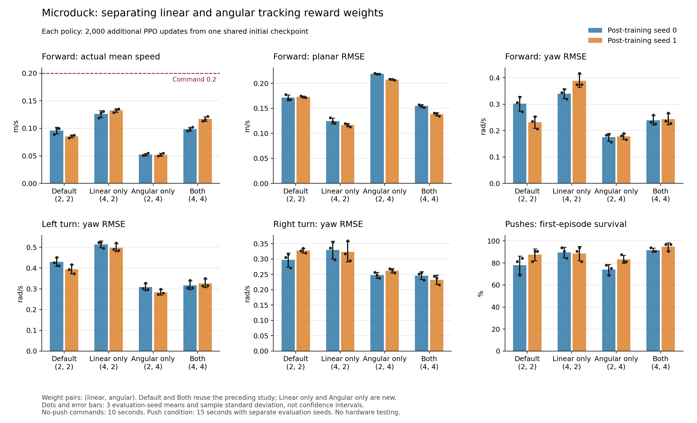
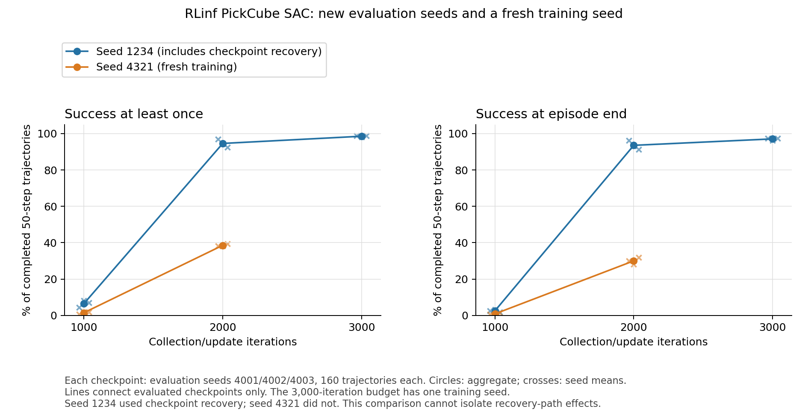

# 机械鸭跟踪奖励拆分、RLinf 训练种子与部署资源

本轮接续 [2026-09-26 后训练对照](rl-posttraining-study-20260926.md)，补齐机械鸭线速度、角速度奖励的四种组合，并检查 RLinf PickCube 在新评估种子及另一训练种子下的表现。训练入口仍使用 `ef`，两个任务分别使用隔离 SDK，全程 headless。

本轮完成了四份新的机械鸭后训练模型和一份新的 SAC 基础训练模型。机械鸭拆分实验显示：提高线速度奖励能增加前进均速，却会加大航向误差；提高角速度奖励则改善航向，但显著降低前进速度。默认配方保持不变。RLinf 新训练轨迹在 2000 轮的曾成功率为 **38.542%**，旧轨迹同预算为 **94.583%**，说明单条高成功率训练轨迹还不足以证明当前预算下的稳定表现。

工程上新增了 **RLinf 确定性 actor 的 CPU ONNX 导出**，并验证旧、新两份实际权重的仿真闭环。文件约 0.549 MiB；导出一致性与策略质量分别报告。

后续的 [2026-09-28 续训对照](rl-resume-study-20260928.md) 分别在两个训练种子内比较连续训练与同保存点续训，并将预算延长至 3000 轮，同时验证正式的 `rlinf evaluate --onnx` 入口。下文保留本轮原始预算与结果。

## 四种奖励组合如何比较

上一轮把线速度和角速度跟踪奖励同时从 2 提高到 4。两份候选改善了转向和扰动下的存活，但在 0.2 m/s 指令下，平均前进速度只有约 0.099 和 0.117 m/s。单看共同提高两项奖励的结果，无法区分各项贡献及其交互。本轮只补缺失的两个组合：

| 名称 | 线速度权重 | 角速度权重 | 数据来源 |
| --- | ---: | ---: | --- |
| 默认 | 2 | 2 | 复用上一轮 seed 0、1 |
| 仅线速度 | 4 | 2 | 本轮新增 seed 0、1 |
| 仅角速度 | 2 | 4 | 本轮新增 seed 0、1 |
| 两项同时 | 4 | 4 | 复用上一轮 seed 0、1 |

八个模型均从同一个已训练 4000 次更新的 `model_3999.pt` 开始，初始 SHA-256 为 `1999a2f5cc403ac7ad7a4c6eaeed07cb97f2dcd35d10eb4e81fa6de2590518e7`。每组 512 环境、24 步 rollout，追加 2000 次 PPO 更新；初始学习率 1e-5，保留自适应调度，恢复 actor、critic、优化器和课程计数；仿真和随机流按本次 seed 重建，不恢复原进程的完整物理状态。每个模型新增 24,576,000 条转换，本轮四个模型合计新增 98,304,000 条。历史四个模型没有重新训练。

这是同一初始策略上的两个后训练种子，不是两个独立基础训练种子，也没有新增模仿学习预训练。源码核对确认任务文件只差预定奖励权重，SDK 已安装包版本与历史运行一致。不同配方的训练总奖励不作为质量排名。

奖励函数仍沿用原核宽度，线速度项也惩罚竖直速度，角速度项也惩罚横滚和俯仰角速度：

```text
r_linear  = exp(-((vx-cx)^2 + (vy-cy)^2 + vz^2) / 0.1)
r_angular = exp(-((wz-cw)^2 + wx^2 + wy^2) / 0.5)
```

因此“仅线速度”仍不等于只增强前进激励；“仅角速度”也不等于只增强 yaw。此次拆分不进一步分离这些轴向分量。

## 评估条件与结果

本轮评估器固定为上一轮默认评估的完整源码快照。途中新增的 RLinf 导出代码会改变整个包的哈希，即使机械鸭文件没有变化，也不混入主要对照：仅角速度 seed 0 的两项已完成评估及一项进行中评估保留在 `superseded/`，随后统一从固定快照重新评估；该调整依据源码一致性，未按模型成绩筛选。

八个模型统一使用默认环境代码、课程计数 144,000、中性头部和身体指令，以及 TF32 策略矩阵计算。四种无推力指令为站立 `(0,0,0)`、前进 `(0.2,0,0)`、左转 `(0,0,0.5)`、右转 `(0,0,-0.5)`；每项使用 seed 1001、1002、1003，各 32 环境、500 步，即 96 个 10 秒环境窗口。线速度单位为 m/s，角速度为 rad/s。

另外使用 seed 3001、3002、3003，各 32 环境、750 步，对前进指令保留 play 模式的速度扰动。它每 0.5–1.0 秒向世界坐标系 x/y 速度分别叠加 `[-0.3,0.3]` m/s；不是指定牛顿值的外力，也比训练的 3–6 秒间隔更频繁。15 秒窗口短于 20 秒 episode 上限。速度指标统计整段窗口，包括 reset 后的步骤；首次完整存活只统计初始 episode，总跌倒包含 reset 后的再次跌倒。

下表为三个评估种子的均值 ± 样本标准差，不是置信区间。RMSE 统计每步速度误差，包含步态振荡；平均实际速度描述净偏差。每个奖励组合仍只有两份训练模型，评估重复不增加训练种子数量。

### 无推力前进

| 模型 / 后训练 seed | 前进均速，m/s | 平面 RMSE，m/s | yaw RMSE，rad/s |
| --- | ---: | ---: | ---: |
| 默认 / 0 | 0.0959 ± 0.0063 | 0.1713 ± 0.0056 | 0.3013 ± 0.0277 |
| 默认 / 1 | 0.0854 ± 0.0026 | 0.1729 ± 0.0018 | 0.2312 ± 0.0231 |
| 仅线速度 / 0 | 0.1259 ± 0.0064 | 0.1247 ± 0.0056 | 0.3396 ± 0.0187 |
| 仅线速度 / 1 | 0.1325 ± 0.0033 | 0.1165 ± 0.0033 | 0.3884 ± 0.0249 |
| 仅角速度 / 0 | 0.0523 ± 0.0022 | 0.2191 ± 0.0010 | 0.1745 ± 0.0155 |
| 仅角速度 / 1 | 0.0519 ± 0.0027 | 0.2076 ± 0.0011 | 0.1781 ± 0.0119 |
| 两项同时 / 0 | 0.0986 ± 0.0034 | 0.1548 ± 0.0028 | 0.2385 ± 0.0177 |
| 两项同时 / 1 | 0.1169 ± 0.0043 | 0.1384 ± 0.0032 | 0.2431 ± 0.0205 |

### 站立与转向

左转和右转的目标分别是 `+0.5`、`-0.5` rad/s；下表给出平均实际角速度，逐步误差见后面的图和 JSON。

| 模型 / 后训练 seed | 站立平面 RMSE，m/s | 左转均速，rad/s | 右转均速，rad/s |
| --- | ---: | ---: | ---: |
| 默认 / 0 | 0.1304 ± 0.0009 | 0.2450 ± 0.0007 | -0.3843 ± 0.0162 |
| 默认 / 1 | 0.1276 ± 0.0003 | 0.2914 ± 0.0047 | -0.2987 ± 0.0121 |
| 仅线速度 / 0 | 0.0857 ± 0.0014 | 0.1150 ± 0.0054 | -0.3589 ± 0.0233 |
| 仅线速度 / 1 | 0.0859 ± 0.0014 | 0.1944 ± 0.0026 | -0.3614 ± 0.0207 |
| 仅角速度 / 0 | 0.1546 ± 0.0020 | 0.3390 ± 0.0072 | -0.4209 ± 0.0060 |
| 仅角速度 / 1 | 0.1366 ± 0.0007 | 0.4093 ± 0.0118 | -0.3602 ± 0.0071 |
| 两项同时 / 0 | 0.1014 ± 0.0010 | 0.3698 ± 0.0089 | -0.4113 ± 0.0043 |
| 两项同时 / 1 | 0.1046 ± 0.0009 | 0.3857 ± 0.0092 | -0.4073 ± 0.0056 |

### 速度扰动

| 模型 / 后训练 seed | 首次完整存活 / 96 | 总跌倒 | 前进均速，m/s | 平面 RMSE，m/s | yaw RMSE，rad/s |
| --- | ---: | ---: | ---: | ---: | ---: |
| 默认 / 0 | 75 | 24 | 0.0868 ± 0.0046 | 0.2027 ± 0.0021 | 0.4802 ± 0.0316 |
| 默认 / 1 | 84 | 13 | 0.0764 ± 0.0035 | 0.2005 ± 0.0042 | 0.4375 ± 0.0478 |
| 仅线速度 / 0 | 86 | 10 | 0.1135 ± 0.0038 | 0.1599 ± 0.0011 | 0.5068 ± 0.0106 |
| 仅线速度 / 1 | 85 | 13 | 0.1226 ± 0.0036 | 0.1534 ± 0.0047 | 0.5548 ± 0.0318 |
| 仅角速度 / 0 | 71 | 30 | 0.0420 ± 0.0021 | 0.2446 ± 0.0039 | 0.3993 ± 0.0417 |
| 仅角速度 / 1 | 80 | 19 | 0.0430 ± 0.0039 | 0.2339 ± 0.0029 | 0.3846 ± 0.0216 |
| 两项同时 / 0 | 88 | 8 | 0.0975 ± 0.0054 | 0.1814 ± 0.0024 | 0.3841 ± 0.0132 |
| 两项同时 / 1 | 91 | 5 | 0.1167 ± 0.0026 | 0.1616 ± 0.0019 | 0.3897 ± 0.0325 |

仅提高线速度权重，在两个后训练种子上都提高了前进均速、降低了平面 RMSE，同时增大前进时的 yaw RMSE。seed 0 的前进均速增加约 0.0300 m/s，seed 1 增加约 0.0471 m/s；yaw RMSE 分别增加约 0.0383 和 0.1572 rad/s。相同方向的取舍在两个种子上出现，但幅度明显不同。

扰动条件下，“仅线速度”的完整存活分别为 86/96 和 85/96，默认为 75/96 和 84/96，两项同时提高为 88/96 和 91/96。线速度项的存活变化在两个种子上幅度不同，且 yaw RMSE 都增大，不能把更快前进等同于全面改善。

仅提高角速度权重则在两个种子上都降低了前进时的 yaw RMSE，但前进均速降到约 0.052 m/s，平面 RMSE 增大。两项同时提高时，前进均速、平面 RMSE 和 yaw RMSE 位于两个单项方案之间。这里观察到的是指标取舍，不能用一种奖励项改善后的训练回报替代实际跟踪质量。

八个模型的四种无推力指令均完成 96/96 个初始窗口且没有跌倒，但这不足以证明速度跟踪达标。最接近前进目标的“仅线速度”也只有约 0.126–0.133 m/s，仍低于 0.2 m/s 指令。仅角速度方案在扰动下存活 71/96、80/96，均低于各自默认模型；两项同时提高的存活数最高，但前进速度低于仅线速度方案。结合航向、转向和扰动表现，本轮保留默认配方，提供这些权重作为带有明确取舍的实验产物。

### 条件差值与交互

对每个后训练种子分别计算指标 `y` 的差值：

```text
线速度效应，角速度权重 2：y(4,2) - y(2,2)
线速度效应，角速度权重 4：y(4,4) - y(2,4)
交互差值：y(4,4) - y(4,2) - y(2,4) + y(2,2)
```

这些是描述性差值。对于 RMSE，负值表示下降；对前进均速，方向还需结合目标速度解释。交互差值反映两个条件效应是否相同，不能凭两个后训练种子将其称为显著的协同或冲突。原始数据保留每项条件效应，避免把两份训练模型压成一个均值。

| 后训练 seed | 前进均速：线速度效应，角权重 2 | 前进均速：线速度效应，角权重 4 | 前进均速：交互 | 平面 RMSE：交互 | yaw RMSE：交互 |
| --- | ---: | ---: | ---: | ---: | ---: |
| 0 | +0.0300 | +0.0463 | +0.0163 | -0.0178 | +0.0257 |
| 1 | +0.0471 | +0.0650 | +0.0179 | -0.0129 | -0.0921 |

前进均速的交互差值在两个种子上分别为 `+0.0163`、`+0.0179` m/s；平面 RMSE 的交互为 `-0.0178`、`-0.0129` m/s。yaw RMSE 的交互却从 seed 0 的 `+0.0257` 变为 seed 1 的 `-0.0921` rad/s。即便某些指标方向一致，也不能将其推广为所有行为指标上的统一协同效应。



[SVG 图](assets/rl-factorial-study-20260927.svg) 和 [绘图脚本](assets/rl-factorial-study-20260927.py) 可由本文 [JSON 数据](rl-factorial-study-20260927.json) 重绘。每个组合分别显示两个后训练种子，黑点为三个评估种子的均值。推力图的百分比只对应各自 15 秒窗口，不与无推力存活合并。

## 复现训练、评估与导出

本轮没有增加消融 CLI 开关。实验副本中只修改现有配置的一个权重：

```python
# locomotion/microduck/tasks/microduck_velocity_env_cfg.py
# 仅线速度；仅角速度实验则保留第一项 2.0，将第二项改为 4.0。
cfg.rewards["track_linear_velocity"].weight = 4.0
cfg.rewards["track_angular_velocity"].weight = 2.0
```

本机已有实验快照时，可直接从保存的源码副本重复后训练：

```bash
conda activate ef
cd /home/ubuntu/workspace/chase/EmbodiedForge
PYTHONPATH="$PWD/runs/microduck-factorial-linear-s0-20260927/implementation" \
python -m embodiedforge.microduck train --headless --quiet \
  --env-dir .cache/microduck-native-venv \
  --resume-run runs/microduck-fresh-baseline-20260926 \
  --seed 0 --num-envs 512 --iterations 2000 \
  --output runs/my-microduck-linear-s0

PYTHONPATH="$PWD/runs/microduck-tracking-eval-baseline-s0-forward-20260926b/implementation" \
python -m embodiedforge.microduck evaluate --headless --quiet \
  --run runs/my-microduck-linear-s0 \
  --num-envs 32 --steps 500 --seeds 1001 1002 1003 \
  --velocity 0.2 0 0 --no-pushes --curriculum-step 144000 \
  --output runs/my-microduck-linear-s0-forward

PYTHONPATH="$PWD/runs/microduck-tracking-eval-baseline-s0-forward-20260926b/implementation" \
python -m embodiedforge.microduck export --headless --quiet \
  --run runs/my-microduck-linear-s0 \
  --output runs/my-microduck-linear-s0.onnx
```

每个 `PYTHONPATH` 前缀只作用于紧随其后的命令：训练使用奖励实验副本，评估和导出入口使用上一轮默认评估的固定快照。第二个训练种子使用 `--seed 1` 和新输出目录；仅角速度实验选择 `microduck-factorial-angular-s0-20260927/implementation`。其他速度指令只替换 `--velocity`。推力条件改用 `--steps 750 --seeds 3001 3002 3003` 并省略 `--no-pushes`。本机 `runs/` 中的模型、日志和源码快照不随文章分发，其他机器需要对应权重和源码快照，或在自己的统一源码版本上重新训练并评估全部对照。

### 参数、文件与推理资源

网络结构保持不变：确定性 actor 197,774 参数；训练 actor 加入探索标准差后 197,788，critic 203,777，合计 401,565。ONNX 输入 61 维、输出 14 维，包含推理归一化；完整 PPO checkpoint 还包含 critic 和 Adam，不能等同于部署文件。

| 新模型 / seed | checkpoint SHA-256 前 12 位 | 最终学习率 | PPO checkpoint，bytes | ONNX，bytes | 轨迹最大绝对误差 |
| --- | --- | ---: | ---: | ---: | ---: |
| 仅线速度 / 0 | `b9a263750734` | 1e-05 | 4,847,293 | 793,960 | 1.67e-06 |
| 仅线速度 / 1 | `b9417fc2b252` | 1e-05 | 4,847,293 | 793,960 | 1.43e-06 |
| 仅角速度 / 0 | `c32669d83b8b` | 1.5e-05 | 4,847,293 | 793,961 | 2.15e-06 |
| 仅角速度 / 1 | `29c619286cad` | 5.0625e-05 | 4,847,293 | 793,961 | 2.86e-06 |

四份新模型的最终编号均为 5999，课程计数 144,000，Adam 更新计数 120,000。实际 checkpoint 中的模型和优化器张量均为有限值；文件大小完全相同不代表模型行为相同。

本机四份新模型的训练目录为 `runs/microduck-factorial-{linear|angular}-s{0|1}-20260927/`，每个目录下的 `policy.onnx` 就是表中对应的部署文件。下方 `my-*` 命令用于建立新的复现实验；选择已有模型时，将 `--run` 指向对应的实际训练目录。

各组从同一学习率开始，最终学习率可以不同，因为 PPO 自适应调度仍正常运行。这个表记录奖励配置改变后的完整训练结果，不把它描述成固定全程学习率的对照。

导出对照使用三个种子各 500 个实际仿真观测，逐步抽取一个环境的观测，比较 CPU ONNX 与 PyTorch 动作。容差为 `1e-4 + 1e-4 × abs(torch)`，该模式关闭 TF32，仿真由 PyTorch 驱动；它验证导出一致性，不是 ONNX 独立闭环或真机验收。

```bash
PYTHONPATH="$PWD/runs/microduck-tracking-eval-baseline-s0-forward-20260926b/implementation" \
python -m embodiedforge.microduck evaluate --headless --quiet \
  --run runs/my-microduck-linear-s0 --onnx runs/my-microduck-linear-s0.onnx \
  --num-envs 32 --steps 500 --seeds 1001 1002 1003 \
  --velocity 0.2 0 0 --no-pushes --curriculum-step 144000 \
  --output runs/my-microduck-linear-s0-onnx-eval
```

另外测量了上一轮默认 seed 0 的实际 ONNX 文件，SHA-256 前 12 位 `59c320a517e5`，大小 793,962 bytes。测量在 AMD Ryzen 9 9950X 上使用 Python 3.12.14、ONNX Runtime 1.24.4、CPUExecutionProvider，intra/inter-op 均为 1 线程，OpenBLAS 为 1 线程；进程未导入 PyTorch。

使用 64 份固定合成观测轮换输入，batch=1，预热 200 次后计时 5000 次 `session.run`。输入生成与输出检查不计入时间，Python 调用开销包含在内。结果为中位数 **9.678 µs**、P95 **14.147 µs**、P99 **16.812 µs**、最大值 **138.353 µs**；session 创建约 **3.94 ms**。所有输出有限且维度为 `(1,14)`。

Linux `/proc/self/status` 记录的 RSS 在导入依赖前为 14.83 MiB、导入后 45.27 MiB、创建 session 后 54.53 MiB、测量结束时 59.77 MiB。后者包括 Python、NumPy、ONNX Runtime、模型和测量数据，不能称为模型本身占用 59.77 MiB。约 0.757 MiB 的文件大小与运行内存是两个不同口径。

这是共享工作站上的一次运行时测量，尾部耗时会受调度影响。它不含传感器读取、观测组装、动作转换和电机通信，也不是树莓派结果或完整 50 Hz 控制链路的时限保证。没有按延迟对不同奖励配方排名。

## RLinf：新评估种子与另一训练种子

上一轮 3000 轮 PickCube 模型在 seed 2001、2002、2003 上的曾成功比例为 98.125%。本轮固定使用此前未参与评估的 seed 4001、4002、4003，分别检查原 seed 1234 的 1000、2000、3000 轮权重，以及新 seed 4321 从零训练后的 1000、2000 轮权重。每次评估使用 16 环境、10 个 rollout，每个种子实际统计 160 条 50 步轨迹，每份模型共 480 条。

新训练使用相同 SAC 配方、32 环境、每轮 2 个采样步和 32 次 SAC 更新，本轮新训练 2000 轮，对应 128,000 条采样转换和 64,000 次优化器更新；同时保存 1000 轮的中间权重。旧 seed 1234 的训练经历过完整状态恢复，新 seed 4321 从零开始并连续运行；比较不能排除恢复路径的影响，且 1000、2000 轮各只有两个训练种子。3000 轮模型仍只有一个训练种子。已核对新训练与旧 2000 轮模型最后一段续训的实际解析配置：算法、网络、采样参数及保存/评估间隔一致，差异只有种子、恢复输入和输出路径。本轮没有改动 SAC 算法。外部 GPU 作业结束后，为给独立评估留出时间，新 SAC 训练与最后一组机械鸭训练部分重叠，启动时要求主机可用内存超过 28 GiB；不据此比较吞吐量。根据已观察到的运行速度，新种子预算在其训练开始前从 1000 调整为 2000 轮，并保留两个阶段的评估；没有根据新种子成绩选择追加训练。

| 模型 | 评估 seed | 轨迹数 | 曾成功 | 结束时成功 |
| --- | ---: | ---: | ---: | ---: |
| 旧 seed 1234 / 1000 轮 | 4001 | 160 | 4.375% | 2.500% |
| 旧 seed 1234 / 1000 轮 | 4002 | 160 | 8.125% | 3.125% |
| 旧 seed 1234 / 1000 轮 | 4003 | 160 | 6.875% | 1.875% |
| 旧 seed 1234 / 1000 轮 | 合计 | 480 | 6.458% | 2.500% |
| 旧 seed 1234 / 2000 轮 | 4001 | 160 | 96.875% | 96.250% |
| 旧 seed 1234 / 2000 轮 | 4002 | 160 | 94.375% | 93.125% |
| 旧 seed 1234 / 2000 轮 | 4003 | 160 | 92.500% | 91.250% |
| 旧 seed 1234 / 2000 轮 | 合计 | 480 | 94.583% | 93.542% |
| 旧 seed 1234 / 3000 轮 | 4001 | 160 | 98.750% | 97.500% |
| 旧 seed 1234 / 3000 轮 | 4002 | 160 | 98.125% | 96.250% |
| 旧 seed 1234 / 3000 轮 | 4003 | 160 | 98.750% | 97.500% |
| 旧 seed 1234 / 3000 轮 | 合计 | 480 | 98.542% | 97.083% |
| 新 seed 4321 / 1000 轮 | 4001 | 160 | 0.625% | 0.625% |
| 新 seed 4321 / 1000 轮 | 4002 | 160 | 1.875% | 0.625% |
| 新 seed 4321 / 1000 轮 | 4003 | 160 | 1.875% | 1.250% |
| 新 seed 4321 / 1000 轮 | 合计 | 480 | 1.458% | 0.833% |
| 新 seed 4321 / 2000 轮 | 4001 | 160 | 38.125% | 30.000% |
| 新 seed 4321 / 2000 轮 | 4002 | 160 | 38.125% | 28.125% |
| 新 seed 4321 / 2000 轮 | 4003 | 160 | 39.375% | 31.875% |
| 新 seed 4321 / 2000 轮 | 合计 | 480 | 38.542% | 30.000% |

旧轨迹从 1000 到 2000 轮有明显提升，3000 轮在新评估种子上保持较高成功率。新轨迹也从 1.458% 提高到 38.542%，但在同样 2000 轮预算下，曾成功率比旧轨迹低约 **56.04 个百分点**，结束时成功率为 **30.000%**，旧轨迹为 **93.542%**。这种差距不能归因于 ONNX 导出，因为这里的两条轨迹都通过上游 PyTorch 评估入口运行；也不能仅归因于种子，因为旧轨迹还包含恢复路径。

因此本文没有把旧模型约 95% 的成绩推广为两种子稳定收敛结论，也没有按新种子成绩追加训练或更换保存点。两个训练种子仍不足以估计可靠的成功率分布。



[SVG 图](assets/rl-factorial-study-20260927-sac.svg) 由同一绘图脚本生成。折线仅连接已评估的保存点；3000 轮仍只有旧种子的数据。

```bash
python -m embodiedforge rlinf train \
  --repo /home/ubuntu/workspace/3rdparty/RLinf \
  --python .cache/rlinf-sac-venv/bin/python \
  --seed 4321 --num-envs 32 --iterations 2000 --save-interval 500 \
  --gpu 0 --headless --quiet --output runs/my-pickcube-seed4321

python -m embodiedforge rlinf evaluate \
  --repo /home/ubuntu/workspace/3rdparty/RLinf \
  --python .cache/rlinf-sac-venv/bin/python \
  --checkpoint runs/my-pickcube-seed4321/maniskill_sac_mlp/checkpoints/global_step_2000/actor/model_state_dict/full_weights.pt \
  --seed 4001 --num-envs 16 --eval-epochs 10 \
  --gpu 0 --headless --quiet --output runs/my-pickcube-seed4321-eval4001
```

另外两个评估分别更换 seed 和输出目录。1000、2000 轮在这里是固定对照预算，训练是否充分由评估结果判断。

### RLinf 保存点与权重

| 模型 | 权重 SHA-256 前 12 位 | 完整模型 .pt，bytes | 完整 SAC 保存点，bytes | 确定性 ONNX，bytes |
| --- | --- | ---: | ---: | ---: |
| 旧 seed 1234 / 1000 轮 | `f864d07d7e5c` | 1,754,385 | 40,865,652 | — |
| 旧 seed 1234 / 2000 轮 | `250dbead623c` | 1,754,385 | 72,581,645 | — |
| 旧 seed 1234 / 3000 轮 | `0ce8638a2fe2` | 1,754,385 | 104,297,667 | 575,951 |
| 新 seed 4321 / 1000 轮 | `57ac5ef0ffcb` | 1,754,385 | 40,865,654 | — |
| 新 seed 4321 / 2000 轮 | `53fbaedeabee` | 1,754,385 | 72,581,655 | 575,951 |

本轮新训练目录为 `runs/rlinf-seed-study-new-4321-20260927/`，保存点位于其中的 `maniskill_sac_mlp/checkpoints/global_step_N/`。实际导出目录分别为 `runs/rlinf-actor-export-reference3000-20260927/` 和 `runs/rlinf-actor-export-new4321-2000-20260927/`；每个目录包含 `policy.onnx` 与记录其哈希的 `result.json`。

完整 SAC 保存点按实际目录内全部文件内容求和，包含 actor、critic、目标网络、优化器、调度器、熵温度和回放缓存，不含文件系统分配开销或其他保存点。单独的 `.pt` 是含两个 Q 网络的完整模型，ONNX 则只包含确定性 actor；这三种大小不能混用。新训练四个保存点中三个优化器的计数、调度器和回放样本计数另由实际 DCP 数据核对。

### RLinf actor 的 CPU ONNX 部署

本轮新增 `rlinf export`，沿用固定 SDK 和输入快照校验，从完整 SAC 权重中提取确定性 actor。保留 `backbone → actor_mean → tanh`，与上游 `predict_action_batch(mode="eval")` 一致；两个 Q 网络和探索用的 log-std head 不进入部署文件。

| 文件或结构 | 参数 / 大小 |
| --- | ---: |
| 训练 actor，含探索 head | 144,648 参数 |
| 两个 Q 网络 | 290,818 参数 |
| 完整模型 | 435,466 参数 |
| 确定性部署 actor | 143,620 参数 |
| 3000 轮模型 `full_weights.pt` | 1,754,385 bytes |
| 对应 `policy.onnx` | 575,951 bytes，约 0.549 MiB |

确定性 actor 的结构为 `42 → 256 → 256 → 256 → 4`，隐藏层与最终动作均采用 Tanh。参数量包含偏置：`(42+1)×256 + 2×(256+1)×256 + (256+1)×4 = 143,620`；训练 actor 另有一个 1,028 参数的 log-std head。

两个 Q 网络彼此独立，也不与 actor 共享参数。每个网络拼接 42 维状态和 4 维动作，结构为 `46 → 256 → 256 → 256 → 1`，三个隐藏层使用 LayerNorm 和 Tanh；含归一化的可学习缩放与偏置，每个 Q 网络为 145,409 参数，合计 290,818。

输入为 `float32 states[N,42]`，按固定 ManiSkill 状态定义排列；输出为 `float32 actions[N,4]`，属于 `pd_ee_delta_pos` 控制器的 `[-1,1]` 归一化输入。batch 维动态，ONNX opset 17，文件元数据包含控制器、上游提交和源权重哈希。导出在 CPU 上运行，不启动 Ray 或模拟器。结构检查及 1、7、32 三种 batch 的上游动作对照全部通过后才发布最终文件。

```bash
python -m embodiedforge rlinf export \
  --repo /home/ubuntu/workspace/3rdparty/RLinf \
  --python .cache/rlinf-sac-venv/bin/python \
  --checkpoint runs/my-pickcube-seed4321/maniskill_sac_mlp/checkpoints/global_step_2000/actor/model_state_dict/full_weights.pt \
  --headless --quiet --output runs/my-pickcube-seed4321-export
```

部署端只需 NumPy 和 ONNX Runtime，推理示例见 [RLinf 导出说明](rlinf.md#导出与-cpu-推理)。42 维状态和 4 维动作是这个仿真任务的接口，不能直接替代真实机械臂的传感器和控制器适配。

除导出时的合成输入检查外，还让 **CPU ONNX 的动作实际驱动 PickCube 仿真**，PyTorch CPU 策略仅作为逐步动作对照。固定使用旧 seed 1234 / 3000 轮模型，另取 seed 6001、6002、6003，各 16 环境、500 步，仿真使用 GPU。共检查 24,000 个真实观测，最大绝对动作误差 `1.7285e-6`，满足 `atol=rtol=1e-5`，所有输出有限且在动作界内。

| 独立闭环评估 seed | 完成轨迹 | 曾成功条数 | 结束时成功条数 |
| --- | ---: | ---: | ---: |
| 6001 | 160 | 157 | 157 |
| 6002 | 160 | 157 | 153 |
| 6003 | 160 | 159 | 158 |
| 合计 | 480 | 473（98.542%） | 468（97.500%） |

新 seed 4321 / 2000 轮的 ONNX 也使用相同的 CPU 驱动方式和 seed 6001、6002、6003 独立验证，每个种子 160 条轨迹。结果如下：

| 独立闭环评估 seed | 完成轨迹 | 曾成功条数 | 结束时成功条数 |
| --- | ---: | ---: | ---: |
| 6001 | 160 | 74 | 46 |
| 6002 | 160 | 65 | 53 |
| 6003 | 160 | 59 | 44 |
| 合计 | 480 | 198（41.250%） | 143（29.792%） |

这份新模型也通过了 24,000 个真实观测上的逐步动作比较，最大绝对误差 `3.0696e-6`。两份权重的导出时合成输入误差均约为 `1.07e-6`。新 ONNX 的哈希前 12 位为 `b7600dba92e8`，对应源权重 `53fbaedeabee`；旧模型的对应哈希为 `325e0469c5e3` 和 `0ce8638a2fe2`。数值一致不等于策略已经达到较高成功率，旧、新模型的训练预算也不同。

两组 ONNX 使用相同的闭环流程；它们与前述 SAC 评估使用不同的环境种子和执行链，因此单列记录，不并入训练种子比较。没有验证真机部署，也不能将近似动作一致性称为长轨迹逐位一致。

同一工作站还测量了旧 seed 1234 / 3000 轮 actor 的独立 CPU 推理：Python 3.12.0、ONNX Runtime 1.24.4，batch=1、单线程、64 份合成观测、200 次预热、5000 次计时调用。中位数 **6.572 µs**、P95 **7.925 µs**、P99 **9.908 µs**、最大值 **32.011 µs**；session 创建 **2.489 ms**。进程未导入 Torch，创建 session 后 RSS 为 **54.26 MiB**，计时结束为 **59.28 MiB**。这与机械鸭测量采用相同方法，但使用各自 SDK Python，且运行时刻不同；仅说明这份部署产物的工作站资源消耗，不作为两个算法的速度排名。

## 记录与适用范围

本轮新增 4 次机械鸭后训练、1 次 RLinf 从零训练，历史模型作为对照复用。机械鸭的后训练种子、评估环境种子和初始基础权重分别记录，不把 3 次评估重复写成 3 次独立训练。所有质量结论限定于本文的训练预算、指令和扰动条件，不意味着充分收敛或真实机器人验收。

本文 JSON 保留每个训练模型、逐种子指标、条件差值、源码与报告散列、导出检查和 SDK 版本。主要运行记录在 `runs/microduck-factorial-study-20260927/`；本文的图可仅靠归档 JSON 重绘，模型和完整日志仍是本机产物。

工程验证包含 23 项 RLinf 测试；新增的真实上游 actor 导出检查覆盖裁剪训练 head、动态 batch、动作一致性和输入哈希变化时保留已有产物。测试模块隔离清理后，该目标检查再次通过。没有新增测试文件或训练启动模式。修改过的 Python 文件通过 Ruff，文档图由归档 JSON 重绘。

实际训练验证另行记录：机械鸭四份新 checkpoint 的模型、优化器和课程计数均通过检查；SAC 新训练的 500、1000、1500、2000 轮 DCP 与模型权重逐张量一致，三个优化器及调度器分别推进至 16,000、32,000、48,000、64,000 步，回放累计 32,000、64,000、96,000、128,000 条转换。完整 TensorBoard 历史的 **54 类、80,436 条**标量记录均有限，最终损失及评估覆盖日志步 1999。这些状态和日志检查不替代独立策略评估，也不是逐个中间张量的检查。

八份机械鸭策略共 40 组条件报告、40 份配对比较，四份新 ONNX 共 6000 个真实观测的动作对照全部完成。RLinf 五个训练阶段/种子组合共 2400 条独立评估轨迹，另外两份 CPU ONNX 各完成 480 条闭环轨迹与 24,000 个观测的动作对照；两种执行链分别归档，不合并为一个成功率。

原始权重、运行目录和 SDK 留在本机，文档仅保留统计、配置和哈希。当前默认训练配置保持不变；本轮没有新增冒烟模式或通用消融参数，也没有改动外部 RLinf 源码。后续若要判断更广泛的步态质量，需要独立基础训练种子及更长时域的速度、地形和扰动覆盖，不能由本文的两个后训练种子直接推出。
