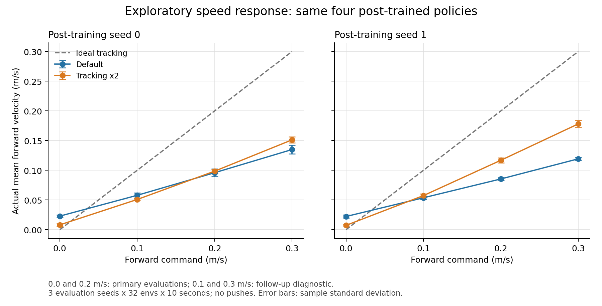
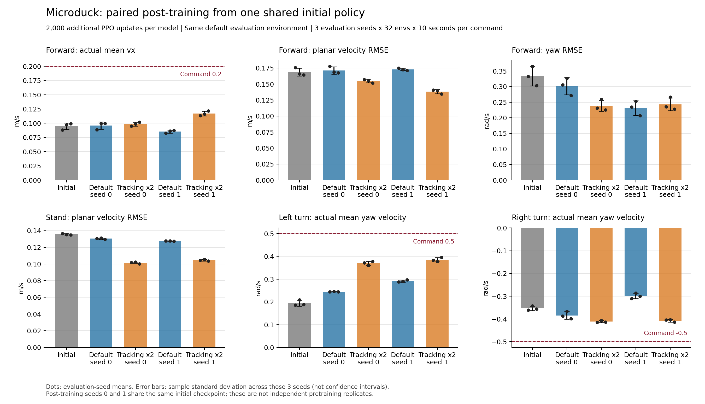

# RL 后训练对照与 worker 异常退出

本轮接续 [动作惩罚消融与 RLinf GPU 验证](rl-training-study-20260926.md)。Microduck 完成四组各 2000 次更新的后训练：提高跟踪奖励改善了转向和扰动下的存活，但前进速度仍不足，默认配方保持不变。RLinf 修复了 worker 异常被 dashboard 连接错误掩盖的问题，并完成 PickCube 从 2000 到 3000 轮的完整续训；最终模型在 480 条独立评估轨迹中，曾成功比例为 98.125%，结束时成功比例为 97.917%。

主入口仍为 `ef`，仿真使用独立 SDK，全部 headless。候选奖励保存在实验副本中。本文的 [JSON 数据](rl-posttraining-study-20260926.json) 包含逐种子指标、恢复审计、运行条件和原始报告散列；`runs/` 下的模型与完整日志是本机产物，不随本文分发。

Microduck SDK 实际使用 Python 3.12.14、Torch 2.9.1、mjlab 1.3.0、RSL-RL 5.0.1、Warp 1.12.0、MuJoCo 3.10.0 / mujoco-warp 3.8.1；ONNX 1.22.0、ONNX Runtime 1.24.4。版本来自本次运行记录，不是对其他版本的兼容性声明。RLinf 使用另一套 SDK，见后文。

## Microduck：提高速度跟踪奖励

上一轮从零训练模型在 `(0.2, 0, 0)` 指令下的前进速度约为 0.096 m/s。降低动作变化惩罚没有全面改善行为，因此本轮保持其课程不变，比较以下一个因素：将线速度与角速度跟踪奖励同时乘以 2。两个权重从 `2.0` 变为 `4.0`，核函数宽度、其他奖励、随机化和优化器配置均保持不变。角速度权重一起提高，是为了避免只优化前进速度而忽略先前观察到的转向误差。

实际 SDK 中的 `mjlab.tasks.velocity.mdp.rewards.track_linear_velocity` 和 `track_angular_velocity` 还包括非指令轴的速度。按本任务的核宽度，未乘权重的两项为：

```text
r_linear  = exp(-((vx-cx)^2 + (vy-cy)^2 + vz^2) / 0.1)
r_angular = exp(-((wz-cw)^2 + wx^2 + wy^2) / 0.5)
```

其中速度均在机体坐标系，`cx/cy/cw` 是指令。因此本轮也增强了对上下运动、横滚和俯仰角速度的约束；不能把这一共同倍率解释成只增加前进激励。固定指令评估分别统计平面速度和 yaw，不是上述两个奖励的完整数值替代。本轮没有拆分这些分量，不能进一步归因于其中某一项。

所有后训练从 `runs/microduck-fresh-baseline-20260926` 的同一份 `model_3999.pt` 开始，输入 SHA-256 为 `1999a2f5cc403ac7ad7a4c6eaeed07cb97f2dcd35d10eb4e81fa6de2590518e7`。每个设置使用后训练 seed 0、1，512 个环境，每次 rollout 24 步，追加 2000 次 PPO 更新，即每个模型新增 24,576,000 条转换。完整模型、critic、Adam 状态、学习率和课程计数从 checkpoint 恢复。

这是**固定初始模型上的两个后训练种子**，不是两次独立预训练；也没有新的模仿学习或数据集预训练。恢复不承诺与原训练无缝逐位一致。四组均已完成，保存为 `model_5999.pt`，课程计数为 144,000；合计新增 98,304,000 条转换。初始学习率为 `1e-5`，后续保留各自的自适应调度。

实际检查点中的 17 组 Adam 参数状态均从 80,000 步推进到 120,000 步，与每次 PPO 更新 5 个 epoch、4 个 minibatch 相符。模型、优化器和训练指标检查通过，没有记录到 NaN 状态。各模型没有更改网络规模：

| 模型 | checkpoint SHA-256 前 12 位 | 课程计数 | Adam 步数 | 保存的学习率 |
| --- | --- | ---: | ---: | ---: |
| 初始模型 | `1999a2f5cc40` | 96,000 | 80,000 | 1e-5 |
| 默认 / seed 0 | `98ac479f7907` | 144,000 | 120,000 | 1.5e-5 |
| 跟踪 ×2 / seed 0 | `a34e0595ddf7` | 144,000 | 120,000 | 1.5e-5 |
| 默认 / seed 1 | `6220205c845d` | 144,000 | 120,000 | 1.5e-5 |
| 跟踪 ×2 / seed 1 | `333f60403b4e` | 144,000 | 120,000 | 3.375e-5 |

学习率的差别来自保留的自适应调度，没有额外覆盖候选的学习率。实际运行目录为 `runs/microduck-tracking-{baseline|candidate}-s{0|1}-20260926b`。

为了比较行为，评估使用同一份默认环境代码、相同速度指令和课程起点，关闭推力，头部与身体指令固定为中性；不能直接比较两个不同奖励权重下的训练总奖励。候选配置文件 SHA-256 为 `f4cd9d54f7a6540214b09a56d80ae54f943f4b722774c98388ea69c0cd2bd9cd`，原配方为 `c6dce6f8e794455ebde868a758596d6da93a00437eb4088aba74d7039849c845`。

### 固定指令与初始模型

每个模型分别评估站立 `(0,0,0)`、前进 `(0.2,0,0)`、原地左转 `(0,0,0.5)`、原地右转 `(0,0,-0.5)`，前两维单位为 m/s，第三维为 rad/s。每项使用 seed 1001、1002、1003，各 32 个环境、500 步，即每个指令 96 个环境、48,000 条转换；每个环境观测 10 秒。五个模型均从相同的评估课程计数 144,000 开始，初始模型也不使用它自身较早的 96,000 起点。

初始策略存在前进不足、站立漂移和左右转向不对称，所以后训练比较同时保留这四类条件。全部五个模型、四类指令均为 96/96 个首次 episode 完整存活，共 1920 个 10 秒观测窗口，没有跌倒；单看存活率无法区分这些模型。

### 后训练结果

以下为三个评估种子的均值 ± 样本标准差，不是置信区间。RMSE 使用每步瞬时机体速度，包含步态振荡；实际均速反映净跟踪偏差，两者不能互相替代。

| 模型 | 前进均速，m/s | 平面速度 RMSE，m/s | 转向 RMSE，rad/s |
| --- | ---: | ---: | ---: |
| 初始模型 | 0.0949 ± 0.0058 | 0.1687 ± 0.0062 | 0.3337 ± 0.0310 |
| 默认 / seed 0 | 0.0959 ± 0.0063 | 0.1713 ± 0.0056 | 0.3013 ± 0.0277 |
| 跟踪 ×2 / seed 0 | 0.0986 ± 0.0034 | 0.1548 ± 0.0028 | 0.2385 ± 0.0177 |
| 默认 / seed 1 | 0.0854 ± 0.0026 | 0.1729 ± 0.0018 | 0.2312 ± 0.0231 |
| 跟踪 ×2 / seed 1 | 0.1169 ± 0.0043 | 0.1384 ± 0.0032 | 0.2431 ± 0.0205 |

候选的前进均速在 seed 0 中只提高约 0.0026 m/s，在 seed 1 中提高约 0.0315 m/s，收益随后训练种子变化。两个候选的平面 RMSE 都较低，但 seed 1 的前进条件下 yaw RMSE 从 0.2312 升至 0.2431，不能称为所有指标都改善。两份候选的前进均速仍远低于 0.2 m/s 指令。

| 模型 | 站立时前进均速，m/s | 左转均速，rad/s | 右转均速，rad/s |
| --- | ---: | ---: | ---: |
| 初始模型 | 0.0366 ± 0.0044 | 0.1945 ± 0.0129 | -0.3529 ± 0.0097 |
| 默认 / seed 0 | 0.0229 ± 0.0020 | 0.2450 ± 0.0007 | -0.3843 ± 0.0162 |
| 跟踪 ×2 / seed 0 | 0.0081 ± 0.0022 | 0.3698 ± 0.0089 | -0.4113 ± 0.0043 |
| 默认 / seed 1 | 0.0222 ± 0.0026 | 0.2914 ± 0.0047 | -0.2987 ± 0.0121 |
| 跟踪 ×2 / seed 1 | 0.0073 ± 0.0012 | 0.3857 ± 0.0092 | -0.4073 ± 0.0056 |

站立时前向漂移和左右转向的响应幅度在两组中都改善，左右转向条件下的角速度 RMSE 也均下降。比较通过现有 `compare` 入口逐种子配对，并核对评估源码、课程计数及其他条件一致。每个配方只有两个后训练模型；重复评估不增加训练种子数量。

这项结果支持将共同倍率 2 作为当前初始模型的后训练候选。它尚未经过独立基础训练种子、完整速度范围、非中性头部指令和真机验证，默认配方保持不变。

### 追加诊断：不同前进指令的响应

在上述结果显示前进不足后，另对四个后训练模型补测 `(0.1,0,0)` 与 `(0.3,0,0)`。这是观察结果后增加的探索性诊断，没有重新训练模型。沿用相同的三个评估种子、32 环境、500 步、课程计数、默认环境、无推力和中性头部指令；下面的 0.2 m/s 列直接复用前面的评估。

| 模型 | 指令 0.1：实际均速 | 指令 0.2：实际均速 | 指令 0.3：实际均速 |
| --- | ---: | ---: | ---: |
| 默认 / seed 0 | 0.0579 ± 0.0043 | 0.0959 ± 0.0063 | 0.1350 ± 0.0073 |
| 跟踪 ×2 / seed 0 | 0.0509 ± 0.0020 | 0.0986 ± 0.0034 | 0.1513 ± 0.0053 |
| 默认 / seed 1 | 0.0537 ± 0.0025 | 0.0854 ± 0.0026 | 0.1193 ± 0.0025 |
| 跟踪 ×2 / seed 1 | 0.0574 ± 0.0029 | 0.1169 ± 0.0043 | 0.1781 ± 0.0058 |

单位均为 m/s，误差仍为三个评估种子的样本标准差。新增八组共 768 个 10 秒初始观测窗口，全部完整存活且未跌倒。四个模型的均速均随指令增大，但全部低于目标，绝对速度偏差也随指令增大；不是只有 0.2 m/s 这一点跟踪不足。seed 0 候选在 0.1 m/s 下反而比默认模型更慢，再次说明共同提高奖励不保证整个指令范围改善。



[SVG 矢量图](assets/rl-posttraining-study-20260926-speed.svg)。图中 0 指令点复用站立评估，用于显示前向漂移；连线只连接已测量的离散指令，不代表中间速度已经测试。三个非零指令点不能确定偏差来自奖励平衡、步态、动力学或训练预算，不据此更改动作缩放。复现时将固定指令命令中的 `--velocity` 分别改为 `0.1 0 0` 与 `0.3 0 0`，各自使用新输出目录。

下一项可检验的消融是分别只提高线速度或角速度权重，补齐 `(2,2)`、`(4,2)`、`(2,4)`、`(4,4)` 的四种组合，括号内依次为线速度、角速度权重。本文只实际完成了两个对角组合；另外两个尚未训练。继续使用同一初始模型、相同更新预算和配对种子，可先区分两项奖励及其交互对当前后训练的影响。即使补齐这一对照，也仍需独立基础训练种子才能判断结论能否推广。

### 复现后训练

默认配方的后训练命令如下。`--iterations` 为追加次数，`--seed` 为本次后训练种子；第二组改为 seed 1 并使用新的输出目录：

```bash
conda activate ef
cd /home/ubuntu/workspace/chase/EmbodiedForge
python -m embodiedforge.microduck train --headless --quiet \
  --resume-run runs/microduck-fresh-baseline-20260926 \
  --seed 0 --num-envs 512 --iterations 2000 \
  --output runs/my-microduck-posttrain-default-s0
python -m embodiedforge.microduck evaluate --headless --quiet \
  --run runs/my-microduck-posttrain-default-s0 \
  --num-envs 32 --steps 500 --seeds 1001 1002 1003 \
  --velocity 0.2 0 0 --no-pushes --curriculum-step 144000 \
  --output runs/my-microduck-posttrain-default-s0-forward
```

其他指令只替换 `--velocity`，并分别使用新输出目录。候选训练在独立源码副本中只应用下面两行修改，SDK、恢复输入与上述参数保持相同；正式评估回到默认源码目录执行：

```python
# locomotion/microduck/tasks/microduck_velocity_env_cfg.py
cfg.rewards["track_linear_velocity"].weight = 4.0  # 原值 2.0
cfg.rewards["track_angular_velocity"].weight = 4.0  # 原值 2.0
```

实际候选源码会随启动快照保存在训练目录的 `implementation/embodiedforge/`，`run.json` 记录文件与整体实现散列。无需增加新的消融开关或改动主环境依赖。上述 `runs/` 输入是本机训练产物；其他机器需先完成同配方基础训练，或获得相同检查点及其运行记录，才能复现这组后训练。

本机已有候选源码快照时，也可以直接用它重复这项后训练，无需再次编辑默认配置：

```bash
PYTHONPATH="$PWD/runs/microduck-tracking-candidate-s0-20260926b/implementation" \
python -m embodiedforge.microduck train --headless --quiet \
  --env-dir .cache/microduck-native-venv \
  --resume-run runs/microduck-fresh-baseline-20260926 \
  --seed 1 --num-envs 512 --iterations 2000 \
  --output runs/my-microduck-posttrain-tracking-s1
```

这个环境变量只作用于该次命令。评估命令仍从默认源码启动，不继承候选奖励。

### 独立扰动条件

另对初始模型和四个后训练模型使用 seed 3001、3002、3003，32 个环境、750 步，评估 15 秒的 `(0.2,0,0)` 前进指令，保留默认 play 环境的推力事件。此项使用独立的评估种子，不与无推力条件合并平均。

这里的“推力”是向根链接世界坐标系的 x/y 速度各叠加 `[-0.3,0.3]` m/s 的随机增量，不是指定牛顿值的外力。play 模式事件间隔为 0.5–1.0 秒，比训练时的 3–6 秒更频繁，因此它是独立扰动条件。15 秒短于任务的 20 秒 episode 上限，便于区分首次 episode 跌倒与时间截断。

```bash
python -m embodiedforge.microduck evaluate --headless --quiet \
  --run runs/my-microduck-posttrain-default-s0 \
  --num-envs 32 --steps 750 --seeds 3001 3002 3003 \
  --velocity 0.2 0 0 --curriculum-step 144000 \
  --output runs/my-microduck-posttrain-default-s0-pushes
```

| 模型 | 首次完整存活 / 96 | 总跌倒次数 | 前进均速，m/s | 平面 RMSE，m/s | 转向 RMSE，rad/s |
| --- | ---: | ---: | ---: | ---: | ---: |
| 初始模型 | 68 | 34 | 0.0873 ± 0.0046 | 0.2012 ± 0.0013 | 0.5206 ± 0.0337 |
| 默认 / seed 0 | 75 | 24 | 0.0868 ± 0.0046 | 0.2027 ± 0.0021 | 0.4802 ± 0.0316 |
| 跟踪 ×2 / seed 0 | 88 | 8 | 0.0975 ± 0.0054 | 0.1814 ± 0.0024 | 0.3841 ± 0.0132 |
| 默认 / seed 1 | 84 | 13 | 0.0764 ± 0.0035 | 0.2005 ± 0.0042 | 0.4375 ± 0.0478 |
| 跟踪 ×2 / seed 1 | 91 | 5 | 0.1167 ± 0.0026 | 0.1616 ± 0.0019 | 0.3897 ± 0.0325 |

首次完整存活只统计初始 episode 是否撑过 15 秒；总跌倒次数包含 reset 后的再次跌倒，二者不是互补计数。本组没有首次 episode 的时间截断。两份候选均比同种子的默认模型减少跌倒，但没有全部存活；无推力条件的 96/96 不能作为扰动下的结论。表中速度指标覆盖全部评估步，包括 reset 后的轨迹。

### 可重绘的对照图



[SVG 矢量图](assets/rl-posttraining-study-20260926.svg)；黑点为三个评估种子的结果，误差条为其样本标准差。图中分别保留两个后训练种子，没有合并为一个模型。使用 [绘图脚本](assets/rl-posttraining-study-20260926.py) 可从本文的 JSON 摘要重绘，无需本机的训练目录：

```bash
.cache/microduck-native-venv/bin/python docs/assets/rl-posttraining-study-20260926.py
```

## 模型大小与 ONNX

本轮保持原网络结构：确定性 actor 有 197,774 个参数，包含探索标准差的训练 actor 有 197,788 个参数，critic 有 203,777 个参数，合计 401,565。观测归一化状态不是可训练参数。完整 PPO checkpoint 包含 actor、critic、Adam 和恢复信息，不能当作部署文件大小。

四份后训练模型均完成实际导出和仿真轨迹对照。它们的完整 PPO checkpoint 均为 4,847,293 bytes，每份导出分别检查了 1500 个实际轨迹观测，合计 6000 个：

| 模型 | ONNX，bytes | 固定输入最大绝对误差 | 轨迹最大绝对误差 | ONNX SHA-256 前 12 位 |
| --- | ---: | ---: | ---: | --- |
| 默认 / seed 0 | 793,962 | 2.86e-6 | 1.07e-6 | `59c320a517e5` |
| 跟踪 ×2 / seed 0 | 793,963 | 7.15e-7 | 1.43e-6 | `dfde863cbf9b` |
| 默认 / seed 1 | 793,962 | 1.43e-6 | 2.62e-6 | `a0ee61a33db7` |
| 跟踪 ×2 / seed 1 | 793,963 | 2.38e-6 | 1.91e-6 | `f48b4311af3f` |

四份 ONNX 均约 0.757 MiB，输入 61 维、输出 14 维，含推理所需的归一化。相差一个字节不代表网络容量不同，文件还包含路径等元数据。完整 SHA-256、对应 checkpoint 散列和逐种子对照误差保存在本文 JSON 的 `exports` 中。

轨迹对照使用三个种子各 500 步，每步轮换抽取一个环境的观测，比较 ONNX CPU 与 PyTorch 动作。逐元素容差为 `1e-4 + 1e-4 × abs(torch)`；该模式关闭 TF32，仿真由 PyTorch 策略驱动。它验证导出一致性，不能称为 ONNX 独立闭环或真机验收，也未与前面的 TF32 行为指标合并。

```bash
python -m embodiedforge.microduck export --headless --quiet \
  --run runs/my-microduck-posttrain-default-s0 \
  --output runs/my-microduck-posttrain-default-s0.onnx
python -m embodiedforge.microduck evaluate --headless --quiet \
  --run runs/my-microduck-posttrain-default-s0 \
  --onnx runs/my-microduck-posttrain-default-s0.onnx \
  --num-envs 32 --steps 500 --seeds 1001 1002 1003 \
  --velocity 0.2 0 0 --no-pushes --curriculum-step 144000 \
  --output runs/my-microduck-posttrain-default-s0-onnx-eval
```

候选只需替换 `--run` 和输出路径；部署动作到关节目标的转换与硬件接口仍见 [模型与部署说明](microduck-model-training-ablation.md#66-从网络动作到关节目标)。

另为 seed 1 默认和候选模型各保存了一段离屏录像，位于本机 `runs/microduck-tracking-video-{baseline|candidate}-s1-20260926b/policy.mp4`。使用 `(0.2,0,0)` 指令、seed 1001、32 环境、无推力，录像只展示环境 0；每段 640 × 480、500 帧、50 fps，共 10 秒。EGL 运行记录确认渲染设备为 RTX 5090 D v2。复现时在固定指令评估命令中添加 `--video` 即可；这两次回放不增加独立评估样本数。本文 JSON 的 `qualitative_videos` 保留条件、帧数和文件散列。

## RLinf：失败时保留原始错误

上一轮的第二次主机内存失败日志中，同时运行的多个 C++ 编译进程占用了较多内存。该证据不足以认定 RLinf 存在回放缓冲区泄漏，因此没有添加未经验证的回放管理逻辑或关闭 Ray 的内存保护。本轮 GPU 训练按作业串行安排。

实际 CPU `WorkerGroup` 异常实验复现了另一处问题：即使保留 Ray 默认 dashboard 设置，上游 SIGUSR1 处理器仍可能调用不可用的 State API，最终把原始 worker 错误掩盖为 `ServerUnavailable`。适配器本来就拥有独立的本地 Ray 实例，并在 `finally` 中关闭它，没有必要为了这个退出路径依赖 dashboard 列举 actor。

现在仅在固定上游入口创建完 `Cluster` 后，替换这个入口的 worker 失败信号处理：保留已打印到日志的原始异常，抛出明确的 worker 失败错误，由现有 `finally` 关闭本次 Ray。清理期间忽略重复失败信号，退出后恢复原来的信号处理器和入口引用。未修改外部 RLinf 源码、SAC 更新或其他 Ray 实例。

真实 CPU 验证分别确认：

- 故意触发的 worker 原始异常保留在日志中，退出原因不再变成 State API 连接错误。
- 子进程非零退出，所属 worker 已停止，`ray.is_initialized()` 为 false。
- 旁边独立创建的 Ray 作业仍返回相同进程标识，未被清理。

这项故障注入检查不启动 GPU 模拟器，不应称作策略训练结果。现有 RLinf 测试增加一个失败信号分支，总计 22 项通过，没有新增测试文件。

### 正常 GPU 训练与独立评估

正常路径从上一轮的 `global_step_2000` 完整 SAC 检查点追加 1000 次采样/训练循环，目标为第 3000 轮，每 500 轮保存和评估。继承 seed 1234、32 个训练环境，保留每轮 2 个环境步和 32 次 SAC 更新；新增采样预算为 64,000 条转换。随后以相同的三个独立评估种子 2001、2002、2003，各 16 环境、10 轮 rollout 检查最终模型。

```bash
python -m embodiedforge rlinf train \
  --repo /home/ubuntu/workspace/3rdparty/RLinf \
  --python .cache/rlinf-sac-venv/bin/python \
  --resume runs/rlinf-pickcube-final-20260926/maniskill_sac_mlp/checkpoints/global_step_2000 \
  --iterations 1000 --save-interval 500 --gpu 0 --headless --quiet \
  --output runs/my-pickcube-3000
python -m embodiedforge rlinf evaluate \
  --repo /home/ubuntu/workspace/3rdparty/RLinf \
  --python .cache/rlinf-sac-venv/bin/python \
  --checkpoint runs/my-pickcube-3000/maniskill_sac_mlp/checkpoints/global_step_3000/actor/model_state_dict/full_weights.pt \
  --num-envs 16 --seed 2001 --eval-epochs 10 --gpu 0 --headless --quiet \
  --output runs/my-pickcube-3000-eval-s2001
```

另外两个评估分别更换 seed 和输出目录。GPU 结果用于检查修复后的训练、完整状态恢复、保存和独立评估路径；本轮没有改动 SAC 更新算法。

上述续训已正常完成，新增 64,000 条采样转换。保存点的 DCP 模型与同目录 `full_weights.pt` 张量逐项相等，模型和优化器张量均为有限值。实际读取的恢复状态如下：

| 保存轮数 | Actor / critic / alpha 优化器步数 | 调度器计数 | 回放批次数 | 回放转换数 |
| --- | ---: | ---: | ---: | ---: |
| 2000，输入 | 64,000 | 64,000 | 2000 | 128,000 |
| 2500 | 80,000 | 80,000 | 2500 | 160,000 |
| 3000 | 96,000 | 96,000 | 3000 | 192,000 |

回放批次数来自上游轨迹记录，每批为 2 个时间步 × 32 个环境；它不是完成 episode 的数量。最终训练日志步数为 2999，对应已完成 3000 轮。训练内最后一次评估只有 16 条轨迹，其 100% 成功率单独保留，不与以下独立评估合并。

独立评估每个种子实际产生 160 条、每条 50 步的轨迹。2000 与 3000 轮模型使用相同的任务配置、SDK 和三个评估种子：

| 评估种子 | 2000：曾成功 | 3000：曾成功 | 2000：结束时成功 | 3000：结束时成功 |
| --- | ---: | ---: | ---: | ---: |
| 2001 | 93.125% | 99.375% | 92.500% | 98.750% |
| 2002 | 95.625% | 96.875% | 95.000% | 96.875% |
| 2003 | 95.625% | 98.125% | 93.750% | 98.125% |
| 合计，480 条轨迹 | 94.792% | 98.125% | 93.750% | 97.917% |

`success_once` 表示轨迹内至少一次成功，`success_at_end` 表示轨迹结束时成功。追加训练后两项汇总指标分别提高约 3.333 和 4.167 个百分点。这是同一训练模型继续更新后的观察，没有独立训练种子对照，不能把收益归因于退出处理修复，也不能推广到其他任务。

网络仍为 435,466 个参数，其中 actor 144,648、两个 Q 网络共 290,818。最终完整模型权重文件为 1,754,385 bytes，包含 Q 网络和 action buffer；它不是仅 actor 的部署文件。SHA-256 为 `0ce8638a2fe212b74a0b7e639c8f92f00a0ca0366e2051edea2e48cd1dd4c607`。完整 SAC 保存点从 2000 轮的 72,581,645 bytes 增至 3000 轮的 104,297,667 bytes，主要随回放数据增长；不能据此认为模型参数增加。

实际运行位于 `runs/rlinf-worker-recovery-training-20260926b`，三个评估位于 `runs/rlinf-worker-recovery-eval-s{2001|2002|2003}-20260926b`。上游仍固定在提交 `67864d67c086a111de9921c5f4591eb5882f74ec`，SDK 为 Python 3.12、Torch 2.10.0+cu128、Ray 2.57.0、ManiSkill 3.0.0b22、SAPIEN 3.0.1。GPU 为 RTX 5090 D v2；主机与其他作业共享，本轮不作吞吐量比较。

后续的 [四组合奖励消融与部署资源实测](rl-factorial-study-20260927.md) 分开比较线速度和角速度奖励，并补充 ONNX 文件大小、CPU 推理资源与 RLinf actor 导出结果。
