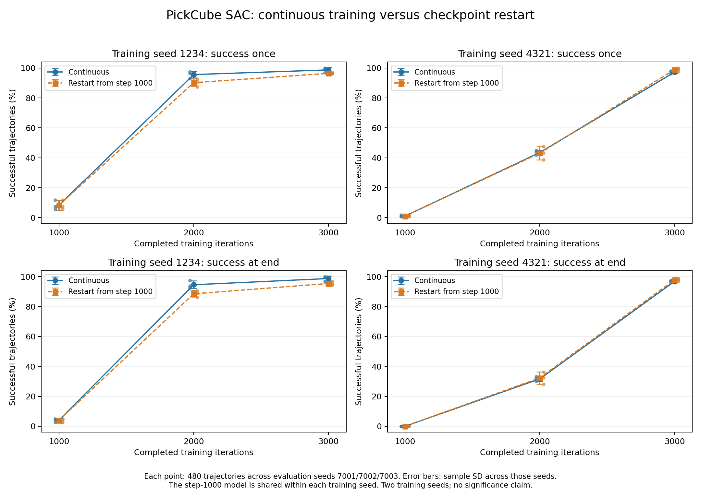

# RLinf SAC 连续训练、保存点续训与 ONNX 闭环评估

本轮接续 [上一轮奖励消融与训练种子实验](rl-factorial-study-20260927.md)，重点回答一个尚未分开的因素：相同训练种子、相同 1000 轮保存点，继续运行与停止后加载完整状态，最终表现是否相同。工程上将上一轮独立脚本中的 ONNX 仿真运行整理为正式的 `rlinf evaluate --onnx` 命令。

本轮完成两个训练种子的四条路径，以及对应的独立评估和 ONNX 部署检查。seed 1234 连续训练与续训的 3000 轮曾成功率分别为 **98.750%、96.458%**；seed 4321 连续训练与续训的 3000 轮曾成功率分别为 **97.292%、98.958%**。这些是同一种子、同一分支起点上的实测对照，仍只覆盖两个训练种子。 追加的动态 INT8 压缩实验使四个 actor 文件均缩小 73.02%，但结束成功率下降 4.375–6.042 个百分点，默认导出仍保留 FP32。

本轮保持固定上游 SAC、网络和奖励设置，主入口使用 `ef`，训练和仿真使用独立 SDK，全部 headless。没有新增模仿学习预训练，没有用新数据调整奖励或选择检查点，也没有声称完成真实机器人部署。

## 对照如何安排

使用训练种子 **1234、4321**。每个种子从零连续训练 3000 轮，保留 1000 轮的完整保存点；第一条训练完成后，另起进程从这个保存点追加 2000 轮。每个种子的两条路径共享真实的前 1000 轮模型、优化器、目标网络、熵温度和回放数据。

| 路径 | 起点 | 本轮新增训练轮数 | 最终累计轮数 |
| --- | --- | ---: | ---: |
| continuous-1234 | 随机初始化，seed 1234 | 3000 | 3000 |
| resume-1234 | 同一 continuous-1234 的第 1000 轮保存点 | 2000 | 3000 |
| continuous-4321 | 随机初始化，seed 4321 | 3000 | 3000 |
| resume-4321 | 同一 continuous-4321 的第 1000 轮保存点 | 2000 | 3000 |

训练使用冻结的 EmbodiedForge 包副本，避免正在开发的 ONNX 入口进入对照。外部 RLinf 固定在 `67864d67c086a111de9921c5f4591eb5882f74ec`，没有修改上游代码。每 500 轮评估、保存一次，比较点事先指定为 1000、2000、3000 轮；1000 轮模型在两条路径间共享，不重复评估为两个独立样本。另外逐字段比较了两组实际生效的 `tensorboard/config.yaml`：每组只有日志/视频输出路径和恢复目录不同，算法、网络、优化器、环境、种子与最终累计预算一致。

核心设置保持一致：32 个训练环境，每轮采集 2 个环境步，随后执行 32 次优化更新，batch size 1024；actor、critic 与熵温度学习率均为 0.0003，梯度裁剪阈值 10，折扣因子 0.8，目标网络 EMA 系数 0.01。四次训练新增 **640,000 条环境转换、320,000 次 SAC 更新**，actor、critic 和熵温度各执行 320,000 次优化器更新。一轮不是一条转换，也不是一次梯度更新。每轮的 32 次更新各抽取 1024 个回放样本，共 32,768 次抽样；这些样本可以重复使用已有转换，不等于新增 32,768 条环境数据。

回放中的 `trajectory_counter` 计的是每轮采样片段：这里每段包含 32 个环境各 2 步，共 64 条转换。它不同于独立评估中持续 50 步的完整任务轨迹。

这是两种训练路径的对照。完整状态恢复仍没有恢复整个仿真、rollout worker 随机流和回放采样生成器的当前位置，运行时梯度也不在保存点中。因此不能把观察到的差异单独解释为某个恢复细节、随机流或梯度裁剪的因果效应。

## 独立评估结果

主要评估固定使用环境种子 **7001、7002、7003**，每个种子 16 个并行环境、10 个 rollout epoch，每个 epoch 50 步。固定配方控制频率为 20 Hz，每条轨迹为 2.5 秒；忽略提前成功终止，到 50 步自动重置。每个模型共完成 **480 条轨迹**。10 个不同保存点合计 **4800 条轨迹**。

“曾成功”表示一条轨迹至少成功一次，“结束成功”表示第 50 步仍成功。下表用成功次数除以完成轨迹数，按实际计数汇总；三个环境种子数量相等。训练日志里的 16 环境评估只用于学习曲线，不混入这里的独立评估。

| 训练种子 | 路径 | 累计轮数 | 曾成功 | 结束成功 |
| --- | --- | --- | --- | --- |
| 1234 | 连续 | 1000 | 40/480 (8.333%) | 19/480 (3.958%) |
| 1234 | 连续 | 2000 | 459/480 (95.625%) | 454/480 (94.583%) |
| 1234 | 续训 | 2000 | 433/480 (90.208%) | 425/480 (88.542%) |
| 1234 | 连续 | 3000 | 474/480 (98.750%) | 474/480 (98.750%) |
| 1234 | 续训 | 3000 | 463/480 (96.458%) | 458/480 (95.417%) |
| 4321 | 连续 | 1000 | 5/480 (1.042%) | 0/480 (0.000%) |
| 4321 | 连续 | 2000 | 209/480 (43.542%) | 152/480 (31.667%) |
| 4321 | 续训 | 2000 | 207/480 (43.125%) | 155/480 (32.292%) |
| 4321 | 连续 | 3000 | 467/480 (97.292%) | 465/480 (96.875%) |
| 4321 | 续训 | 3000 | 475/480 (98.958%) | 470/480 (97.917%) |



图中误差棒是三个**评估环境种子**之间的样本标准差，小点是各自的成功率；不是训练种子置信区间。两条曲线在 1000 轮处共用同一个模型，该点重复显示只为画出分支。

续训减去连续训练的差值如下，单位为百分点：

| 训练种子 | 累计轮数 | 曾成功变化 / pp | 结束成功变化 / pp |
| --- | --- | --- | --- |
| 1234 | 2000 | -5.417 | -6.042 |
| 1234 | 3000 | -2.292 | -3.333 |
| 4321 | 2000 | -0.417 | +0.625 |
| 4321 | 3000 | +1.667 | +1.042 |

seed 1234 在 2000 轮时续训相对连续训练的曾成功率变化为 -5.417 个百分点，3000 轮时为 -2.292 个百分点；对应的结束成功率变化为 -6.042、-3.333 个百分点。

seed 4321 在 2000 轮时续训相对连续训练的曾成功率变化为 -0.417 个百分点，3000 轮时为 +1.667 个百分点；对应的结束成功率变化为 +0.625、+1.042 个百分点。

连续训练的 seed4321 从 2000 轮的 43.542% 曾成功率提高到 3000 轮的 97.292%，结束成功率从 31.667% 提高到 96.875%。这说明增加预算在这条实际训练轨迹上有效；仍需更多训练种子才能判断3000轮预算是否普遍足够。

在 3000 轮，两种成功指标的续训差值均随训练种子改变方向：seed1234 较低，seed4321 较高。本轮没有观察到跨这两个种子一致的续训优势或损失；它验证了保存点能够继续训练，也显示恢复后的学习轨迹不能视为原连续轨迹的逐步重放。

两个训练种子不足以作显著性推断，480 条轨迹也不能当成 480 次独立训练。上一轮旧 seed 1234 的结果还包含多次恢复，不能直接作为本轮 uninterrupted 路径。这里保留上一轮数据和默认配方，不把本轮模型自动升级为新的默认策略。

## 与上一轮同种子基础训练的辅助核对

本轮还只读核对了上一轮seed4321从零训练的保存点。两次运行的SAC算法、网络及优化器配置一致，使用常数学习率；原计划总预算分别为2000、3000轮，因此不把它当成新的独立训练种子或额外的续训对照。文件一致性结果如下：

| 累计轮数 | 两次完整权重文件的SHA-256是否一致 |
| --- | --- |
| 500 | 一致 |
| 1000 | 一致 |
| 1500 | 一致 |
| 2000 | 一致 |

一致只描述这些实际保存点，不承诺其他GPU、SDK版本或训练种子下也逐位一致。这里不追加训练、不据此挑选模型，也不把两次相同种子的结果混合提高样本量。

## 同一种子再次续训的补充检查

预先声明的额外同种子复跑因剩余时间不足，按协议跳过。四条主训练与独立评估不受影响；本轮不对同种子重复波动给出实测结论。

## 恢复是否保留了训练状态

本轮核对每次保存后的 DCP 状态、导出的完整权重、目标网络和回放计数。所有检查从已完成写入的保存点读取，避免把部分写入的目录当成可恢复状态。

四条路径共检查 **20 个保存点**：DCP 中的模型与独立 `full_weights.pt` 精确一致，优化器与目标网络张量有限，优化器/调度器和回放计数符合累计轮数；两份续训输入与各自源目录完全一致。TensorBoard 的 **402,180 条标量记录**全部为有限值；这不表示检查了每个尚未记录的中间张量。

检查点 1000、2000、3000 对应的三个 Adam 优化器步数和调度器计数应分别是 32,000、64,000、96,000；回放样本数分别是 64,000、128,000、192,000。续训分支的这些计数延续原状态，不从零开始。输入快照还与同一种子的 continuous-1000 完整目录逐文件核对，排除误选另一份保存点。

固定上游的恢复范围还需要区分以下状态，源码文件哈希记录在本轮数据中：

| 状态 | 固定版本的行为 |
| --- | --- |
| 模型、三个优化器、调度器、目标网络与回放数据 | 从保存点加载，本轮检查计数与张量内容 |
| actor 进程的 Python / Torch RNG | FSDP 保存并恢复；不代表 env 和 rollout worker 的随机流也恢复 |
| actor 进程的 NumPy RNG | FSDP 会恢复，但随后加载回放数据会再次调用 `np.random.seed(saved_seed)` |
| 回放采样专用 Torch generator | 根据保存的 seed 重建，没有保存当前 generator 状态 |
| 仿真状态与 rollout 随机流 | 重新初始化；runner 的恢复入口调用 actor 的加载流程 |
| 参数运行时 `.grad` | 不在模型 state dict 中；上游跨优化器的整体梯度裁剪可能受其影响 |

上述差异是源码行为，不能根据本轮两个种子的训练曲线就判定其中哪一项主导了最终差异。

完整日志的有限值检查用于排除已经记录的 NaN/Inf，并不保证策略收敛。训练日志中的梯度范数是每轮 32 次更新的均值；均值高于 10 只能说明这一轮至少有一次达到裁剪条件，不能从这个均值反推每次更新的裁剪比例。

| 路径 | 有记录的训练轮数 | actor 平均范数 > 10 的轮数 | critic 平均范数 > 10 的轮数 |
| --- | --- | --- | --- |
| continuous-1234 | 3000 | 0 | 0 |
| resume-1234 | 2000 | 0 | 0 |
| continuous-4321 | 3000 | 0 | 0 |
| resume-4321 | 2000 | 0 | 0 |

## 模型、权重与完整保存点大小

网络没有改变：确定性 actor 为 `42 → 256 → 256 → 256 → 4`，隐藏层及输出使用 Tanh，共 **143,620 参数**。训练额外使用 1028 参数的 log-std head；两个独立 Q 网络共 290,818 参数，总计 435,466 参数。两项注册 buffer 使 FP32 state dict 有 435,468 个元素，即 1,741,872 个张量字节。

| 路径 | 累计轮数 | 完整模型 .pt / B | 完整保存点 / B | 完整保存点 / MiB |
| --- | --- | --- | --- | --- |
| continuous-1234 | 1000 | 1,754,385 | 40,865,646 | 38.973 |
| continuous-1234 | 2000 | 1,754,385 | 72,581,647 | 69.219 |
| continuous-1234 | 3000 | 1,754,385 | 104,297,647 | 99.466 |
| resume-1234 | 2000 | 1,754,385 | 72,581,639 | 69.219 |
| resume-1234 | 3000 | 1,754,385 | 104,297,639 | 99.466 |
| continuous-4321 | 1000 | 1,754,385 | 40,865,646 | 38.973 |
| continuous-4321 | 2000 | 1,754,385 | 72,581,647 | 69.219 |
| continuous-4321 | 3000 | 1,754,385 | 104,297,647 | 99.466 |
| resume-4321 | 2000 | 1,754,385 | 72,581,639 | 69.219 |
| resume-4321 | 3000 | 1,754,385 | 104,297,639 | 99.466 |

3000 轮完整保存点的内容拆分如下（MiB）：

| 路径 | 独立模型 | 模型 + 优化器 DCP | 目标网络 | 熵温度组件 | 回放数据 |
| --- | --- | --- | --- | --- | --- |
| continuous-1234 | 1.673 | 5.343 | 1.675 | 0.057 | 90.719 |
| resume-1234 | 1.673 | 5.343 | 1.675 | 0.057 | 90.719 |
| continuous-4321 | 1.673 | 5.343 | 1.675 | 0.057 | 90.719 |
| resume-4321 | 1.673 | 5.343 | 1.675 | 0.057 | 90.719 |

`.pt` 和 ONNX 文件包含序列化、图与元数据开销；完整保存点保留用于评估的独立 `.pt` 与 DCP 内的模型副本，还包含三个优化器、调度器、目标网络、熵温度、RNG 以及回放数据。因此同一网络的完整保存点会随回放增长，不能据此认为模型参数变多。大小采用文件内容字节数，不是文件系统占用块数或 GPU 峰值内存。

按后续用途选择需要保留的产物：

| 产物 | 用途 | 能否直接恢复本配方的 SAC 训练 |
| --- | --- | --- |
| `policy.onnx` | CPU 确定性策略推理、ONNX 仿真评估 | 不能；只包含部署 actor |
| `full_weights.pt` | PyTorch 仿真评估、再次导出 ONNX | 不能；缺少优化器、回放等训练状态 |
| 完整 `global_step_N/` 目录 | 从第 N 轮追加训练 | 可以；保留目录内全部状态文件 |

这里的“基础训练”是 SAC 从随机初始化采样学习，“续训”是在保存点上继续同一算法和任务。没有额外的 ACT/LeRobot 演示预训练、奖励微调或知识蒸馏；这些概念不能混用。

## ONNX 正式入口与新模型部署检查

新入口复用 SDK 隔离、输入快照、哈希和运行状态管理，只要求导出的 `policy.onnx`。CPU ONNX 直接产生动作，ManiSkill GPU 仿真执行动作；不加载原始 `.pt` 作为策略，也不启动 Ray。运行前检查固定任务、上游提交、42 维观测、4 维归一化动作及动态 batch。每步检查观测、动作和环境指标，使用终局信息累计成功次数。

先用上一轮已有的两份策略与环境种子 6001、6002、6003 核对新入口：**960 条轨迹、48,000 次观测动作计算**，每一组成功计数均与上一轮独立 ONNX 驱动脚本一致。旧 3000 轮策略为 473/480 曾成功、468/480 结束成功；另一份 2000 轮策略为 198/480、143/480。这里用于验证入口，两个模型的训练预算不同，不用来比较训练方法。

本轮四个 3000 轮模型全部导出，不按分数筛选；随后使用另一组环境种子 **8001、8002、8003** 运行 CPU ONNX 闭环，每模型 480 条轨迹，共 **1920 条轨迹、96,000 次观测动作计算**：

| 3000 轮路径 | ONNX / B | 曾成功 | 结束成功 | 导出动作对照最大绝对误差 |
| --- | --- | --- | --- | --- |
| continuous-1234 | 575,951 | 98.333% | 98.125% | 2.25e-06 |
| resume-1234 | 575,951 | 96.667% | 96.458% | 9.83e-07 |
| continuous-4321 | 575,951 | 97.083% | 96.250% | 1.34e-06 |
| resume-4321 | 575,951 | 97.292% | 96.875% | 1.61e-06 |

这组数值与主要 PyTorch 评估使用不同环境种子及执行路径，分别报告，不混合求总成功率。导出时仍执行与上游 PyTorch 确定性策略的数值对照，验证 1、7、32 三种 batch；正式 ONNX 闭环命令只运行导出策略，不每步加载 PyTorch 参考网络。

工程验证：现有 RLinf 测试扩展后 **26 项通过**，覆盖 ONNX 输入快照、动态 batch、任务元数据和源文件变化处理；没有新增测试文件。`ef` CLI 导入不会加载 Torch、Ray、ManiSkill 或 ONNX Runtime；依赖继续留在独立 SDK。

另从当前源码构建 wheel，在仓库外解包并用 `ef` 调用独立 SDK：新 ONNX 评估入口完成 seed9001 的 160 条轨迹、8000 次观测动作计算。三个相关模块与源码哈希一致，主环境导入未加载仿真或学习依赖，wheel 基础依赖仍只有 NumPy。这是安装包集成检查，单独归档，不混入上面的训练路径比较或 1920 条部署评估。

## 补充：训练后动态 INT8 量化

四条训练与 FP32 部署评估结束后，追加一次独立的压缩实验，事先指定四个最终模型全部参与，沿用部署环境种子 8001、8002、8003。使用本机 ONNX Runtime 的 `quantize_dynamic`，设定 `weight_type=QInt8`、`per_channel=True`，量化 MatMul；四个矩阵乘法均转为 `MatMulInteger`，保留 FP32 输入、输出与 Tanh。没有重新训练、使用离线校准数据或按成功率调整量化参数，默认导出仍为 FP32。

以下转换代码在已安装 ONNX Runtime 的独立 SDK 中运行，输入是正式导出的 FP32 模型，输出使用新文件名：

```python
from onnxruntime.quantization import QuantType, quantize_dynamic

quantize_dynamic(
    "policy.onnx",
    "policy.int8.onnx",
    op_types_to_quantize=["MatMul"],
    weight_type=QuantType.QInt8,
    per_channel=True,
)
```

转换后用相同的 `rlinf evaluate --onnx` 命令评估新文件。研究脚本额外在模型元数据中记录源 ONNX 哈希和量化方法，不改变上述转换参数。

每个量化模型完成 480 条轨迹，共新增 1920 条，使用同一个正式 ONNX 评估入口。下表与对应 FP32 ONNX 模型在同一组环境种子下比较；差值为量化减去 FP32，单位是百分点：

| 路径 | INT8文件 / B | 文件缩小 | 曾成功 | 曾成功变化 / pp | 结束成功 | 结束成功变化 / pp |
| --- | --- | --- | --- | --- | --- | --- |
| continuous-1234 | 155,384 | 73.02% | 96.250% | -2.083 | 92.708% | -5.417 |
| resume-1234 | 155,384 | 73.02% | 94.167% | -2.500 | 91.875% | -4.583 |
| continuous-4321 | 155,384 | 73.02% | 95.417% | -1.667 | 90.208% | -6.042 |
| resume-4321 | 155,384 | 73.02% | 94.792% | -2.500 | 92.500% | -4.375 |

在这四份实际模型上，动态 INT8 都使结束成功率下降，幅度为 4.375–6.042 个百分点；曾成功率也均下降。原 FP32 actor 已只有约 0.55 MiB，本次量化再节省约 0.40 MiB，同时带来上述行为损失。因此保留默认 FP32 产物，量化结果作为独立压缩对照；不据此判断其他任务或量化方法也会有相同变化。

这是一项训练后的模型压缩实验，不是新增 SAC 后训练或蒸馏。量化模型不适用前述 FP32 导出的 1e-5 数值一致性要求；这里用实际闭环成功率评估行为变化。没有测量量化后的推理延迟或峰值内存，文件缩小不等于运行速度提升。量化文件与原始 FP32 文件分目录保留，转换脚本及源文件哈希归档于本轮数据。

## 训练、续训、导出和闭环评估命令

以下在仓库根目录运行；本机 SDK 是 `.cache/rlinf-sac-venv/bin/python`。换机器时按 [RLinf 环境说明](rlinf.md) 安装独立 SDK，并替换 `--python`。每个 `--output` 必须是新目录。主环境仍是 `ef`。

```bash
conda activate ef
cd /home/ubuntu/workspace/chase/EmbodiedForge

python -m embodiedforge rlinf train \
  --repo /home/ubuntu/workspace/3rdparty/RLinf \
  --python .cache/rlinf-sac-venv/bin/python \
  --output runs/my-sac-continuous-1234 \
  --gpu 0 --headless --quiet --seed 1234 --num-envs 32 \
  --iterations 3000 --save-interval 500
```

从同一次训练的 1000 轮完整目录继续，追加 2000 轮；省略 seed 和 num-envs 时继承原状态：

```bash
python -m embodiedforge rlinf train \
  --repo /home/ubuntu/workspace/3rdparty/RLinf \
  --python .cache/rlinf-sac-venv/bin/python \
  --output runs/my-sac-resume-1234 \
  --gpu 0 --headless --quiet \
  --resume runs/my-sac-continuous-1234/maniskill_sac_mlp/checkpoints/global_step_1000 \
  --iterations 2000 --save-interval 500
```

独立评估完整权重：

```bash
python -m embodiedforge rlinf evaluate \
  --repo /home/ubuntu/workspace/3rdparty/RLinf \
  --python .cache/rlinf-sac-venv/bin/python \
  --output runs/my-sac-pytorch-eval-7001 \
  --checkpoint runs/my-sac-resume-1234/maniskill_sac_mlp/checkpoints/global_step_3000/actor/model_state_dict/full_weights.pt \
  --gpu 0 --headless --quiet --seed 7001 --num-envs 16 --eval-epochs 10
```

导出 CPU 策略，再让导出文件驱动仿真：

```bash
python -m embodiedforge rlinf export \
  --repo /home/ubuntu/workspace/3rdparty/RLinf \
  --python .cache/rlinf-sac-venv/bin/python \
  --output runs/my-sac-export \
  --checkpoint runs/my-sac-resume-1234/maniskill_sac_mlp/checkpoints/global_step_3000/actor/model_state_dict/full_weights.pt \
  --headless --quiet

python -m embodiedforge rlinf evaluate \
  --repo /home/ubuntu/workspace/3rdparty/RLinf \
  --python .cache/rlinf-sac-venv/bin/python \
  --output runs/my-sac-onnx-eval-8001 \
  --onnx runs/my-sac-export/policy.onnx \
  --gpu 0 --headless --quiet --seed 8001 --num-envs 16 --eval-epochs 10
```

`--onnx` 与 `--checkpoint` 二选一。输入需要 ManiSkill 原始 42 维状态，动作是 `pd_ee_delta_pos` 控制器的归一化输入；具体字段和缩放见 [观测与动作定义](rlinf.md#导出与-cpu-推理)。不能直接把这四维输出当成真实机械臂关节目标。

## 数据和复现范围

- [机器可读结果](rl-resume-study-20260928.json) 保存协议、每种子结果、状态审计、产物大小及哈希。
- [绘图脚本](assets/rl-resume-study-20260928.py) 从该 JSON 重建 [PNG](assets/rl-resume-study-20260928.png) 与 [SVG](assets/rl-resume-study-20260928.svg)。
- `runs/rlinf-resume-study-20260928/` 保存协议、训练/评估队列、CPU 状态审计、脚本和冻结的训练实现；这些本地运行产物不等于提交进 Git 的权重。
- 四个训练目录为 `runs/rlinf-{continuous,resume}-{1234,4321}-20260928`；最终策略导出在同名 `-export-20260928` 目录。

本机 SDK：torch 2.10.0+cu128、ray 2.57.0、hydra-core 1.3.2、mani_skill 3.0.0b22、sapien 3.0.1；Python 3.12.0。实际依赖快照保存在各运行的 `environment.json`。 硬件为 NVIDIA GeForce RTX 5090 D v2（驱动595.91.07，设备报告24455 MiB显存）、AMD Ryzen9 9950X；共享主机内存约60 GiB。

训练和部分评估共享单张 GPU，使用 CPU ONNX 的评估仍有 GPU 仿真开销。本轮不把耗时当成吞吐基准，也不承诺 GPU 运算逐位确定性。新命令验证的是仿真部署链路；观测获取、控制器适配和真实硬件验收仍需独立完成。

后续实验进一步区分了权重存储压缩、动态激活量化、输入/输出层精度与 QAT，并补充第三个训练种子及 batch 1/16 对照，见 [模型压缩、后训练与逐层消融](rl-compression-study-20260928.md)。
