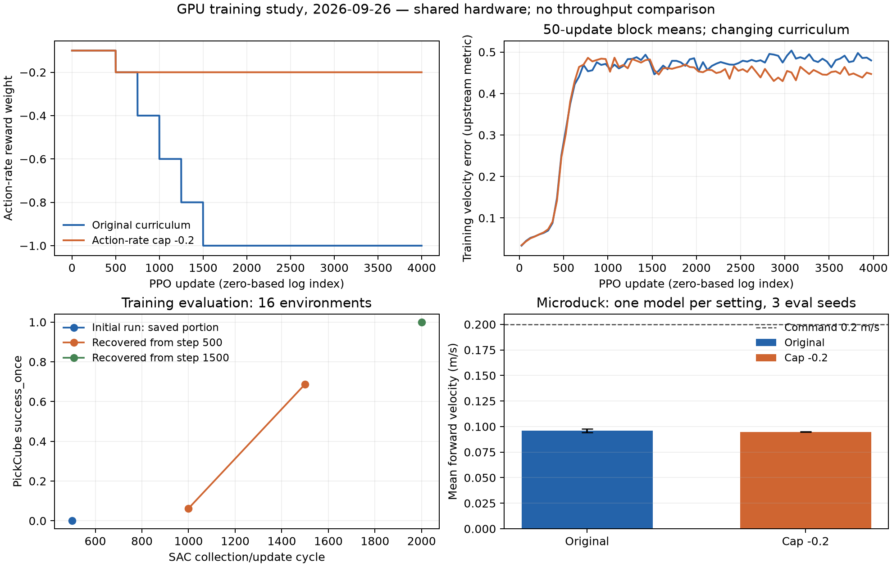

# RLinf GPU 训练验证与 Microduck 动作惩罚对照

本轮完成 RLinf 的实际 GPU 训练、完整状态恢复和独立评估：最终模型在三个新种子、480 条轨迹上达到约 **94.79% 的至少一次成功率**。Microduck 的两组 4000 次更新对照没有支持降低动作惩罚，保留默认配方。本文接续 [前一轮训练对照](rl-training-study-20260925.md)；所有运行使用 headless，保留原始配置、日志和模型哈希，没有增加启动试训模式。

[机器可读记录](rl-training-study-20260926.json) 保存完成状态、配置、指标和原始报告 SHA-256。`runs/` 是本机产物，不随 Git 分发；本文、JSON 摘要与图片可随 PR 审阅。

后续的两个后训练种子、速度跟踪奖励与推力扰动对照，以及 RLinf worker 故障退出修复，见 [后训练与恢复记录](rl-posttraining-study-20260926.md)。本文保留这一轮实验当时的结果和失败经过。

## 环境与实验口径

主命令仍从 `ef` 环境执行。RLinf 使用本机 `.cache/rlinf-sac-venv/bin/python`，该虚拟环境以 `--system-site-packages` 只读继承现有 IsaacLab Python 3.12 环境中的 Torch 2.10.0+cu128 和 Ray 2.57.0，在自己的目录安装 ManiSkill 3.0.0b22、SAPIEN 3.0.1、Hydra 1.3.2 和 OmegaConf 2.3.0 等依赖。原 IsaacLab 和 `ef` 的包没有被替换。

这个环境是本机验证用的依赖叠加环境，不是可独立复制到任意机器的完整 SDK，也不用于运行 IsaacLab。实际版本见运行目录中的 `environment.json` 和 `sdk-overlay.json`；新机器仍按 [RLinf 环境说明](rlinf.md) 使用固定上游安装器准备 SDK。固定上游提交为 `67864d67c086a111de9921c5f4591eb5882f74ec`，没有修改外部仓库。

Microduck 使用现有独立 SDK：Torch 2.9.1、mjlab 1.3.0、RSL-RL 5.0.1。两项任务共用 RTX 5090 D v2，机器另有其他负载，因此不以墙钟时间比较训练效率。评估种子不是独立训练种子，本轮不报告统计显著性或置信区间。

## RLinf：PickCube / MLP / SAC

从零训练配置为 seed 1234、32 个环境、目标 2000 次采样与训练循环，每 500 次保存并评估。保留上游每轮 2 个环境步、32 次 SAC 更新和 batch size 1024。训练内评估使用 16 个环境、50 步；独立评估单独启动环境与 rollout，不建立训练 actor。

```bash
conda activate ef
cd /home/ubuntu/workspace/chase/EmbodiedForge
python -m embodiedforge rlinf train \
  --repo /home/ubuntu/workspace/3rdparty/RLinf \
  --python .cache/rlinf-sac-venv/bin/python \
  --output runs/my-pickcube-train --gpu 0 --headless --quiet \
  --num-envs 32 --seed 1234 --iterations 2000 --save-interval 500
```

这里的 2000 次循环不是 2000 个 episode，也不是 2000 次梯度更新。最终保存点应为 `global_step_2000`，最终训练内评估日志步数为 1999。策略文件只包含网络状态；完整 SAC 保存点还包含目标网络、三个优化器、调度器、熵温度和回放数据，续训必须使用完整目录。

首次运行保存了第 500 轮。随后并行启动续训时，整机内存压力触发 Ray 的 worker 回收，两个 RLinf 作业均受影响：续训失败，原训练在通信报错后停止，最近有效保存点仍为 500。该尝试保留为失败/中断记录，不算完成的 2000 轮训练。

适配器随后将单卡 Ray 实例的 CPU 调度资源限制为最多 4 个，减少按整机 32 核预启动的闲置 worker；不修改上游算法，不关闭内存保护。第一次恢复从 500 推进并保存到 1500，但后来整机内存再次达到 Ray 的 95% 阈值，运行在 1701 附近失败。并行 Microduck 训练均正常完成。最后从有效的 1500 保存点串行补完 500 轮。原始失败日志和各次独立运行目录均保留。

曾尝试关闭 Ray dashboard 来减少开销，但实际错误路径显示，上游 SIGUSR1 处理器需要通过 dashboard 的 State API 查询 actor；关闭后会出现额外的 `ServerUnavailable`，因此撤回这个设置。最终只保留 CPU 调度资源限制。资源收敛不能保证共享机器永不耗尽内存。

这条恢复链与不中断的 2000 轮训练不同：仿真和回放采样的 RNG 并未完整恢复，不能声称两者逐位等价。最终回放所对应的有效采样预算不包含失败后丢弃的未保存更新；后者也是实际运行成本。

对实际 GPU 训练生成的 DCP 文件另做 CPU 读取核对：第 500 轮的 actor、critic、熵温度 Adam 步数均为 16,000；恢复后的第 1000 轮均为 32,000，三个学习率调度器的 `last_epoch` 同步推进。回放数据从 500 条批次轨迹、32,000 个样本增至 1000 条批次轨迹、64,000 个样本。这里一条批次轨迹包含 32 个环境各 2 步，不等于一个 episode。模型及优化器状态张量均为有限值；这项检查验证了保存状态的延续，不证明续训与连续运行等价。

最终运行正常退出并生成 `result.json`：`final_step=2000`，最终评估日志为 1999，actor、critic、熵温度的优化器步数与调度器 `last_epoch` 均为 64,000，回放包含 2000 条批次轨迹、128,000 个样本。[恢复状态核对](../runs/rlinf-pickcube-recovered-20260926/restore-audit.json) 和 [最终运行结果](../runs/rlinf-pickcube-final-20260926/result.json) 保留原始数据。

| 保存步数 | 评估轨迹 | 至少成功一次 | 结束时成功 |
| --- | ---: | ---: | ---: |
| 500 | 16 | 0% | 0% |
| 1000 | 16 | 6.25% | 0% |
| 1500 | 16 | 68.75% | 62.5% |
| 2000 | 16 | 100% | 100% |

这是同一条恢复链上的训练内评估，每次只有 16 条轨迹。最终模型另以 seed 2001、2002、2003 独立评估，每个 16 环境、10 轮 50 步 rollout。它们共享一个训练模型，不能作为三个训练种子。

| 新评估种子 | 完成轨迹数 | 至少成功一次 | 结束时成功 |
| --- | ---: | ---: | ---: |
| 2001 | 160 | 93.125% | 92.5% |
| 2002 | 160 | 95.625% | 95% |
| 2003 | 160 | 95.625% | 93.75% |
| 合计 | 480 | 94.792% | 93.75% |

合计按完成轨迹数加权。指标保留上游定义：`success_once` 表示 episode 内至少满足过一次成功条件，`success_at_end` 表示终止时仍满足。三个评估均正常退出，读取相同权重哈希 `250dbead623c957d72fc2ea13231ff8bb436382a115649ca49373aff412afc5f`；没有用训练内的 100% 替代独立评估结果。

```bash
python -m embodiedforge rlinf train \
  --repo /home/ubuntu/workspace/3rdparty/RLinf \
  --python .cache/rlinf-sac-venv/bin/python \
  --output runs/my-pickcube-resume --gpu 0 --headless --quiet \
  --resume runs/my-pickcube-train/maniskill_sac_mlp/checkpoints/global_step_1500 \
  --iterations 500 --save-interval 500
python -m embodiedforge rlinf evaluate \
  --repo /home/ubuntu/workspace/3rdparty/RLinf \
  --python .cache/rlinf-sac-venv/bin/python \
  --output runs/my-pickcube-eval-s2001 --gpu 0 --headless --quiet \
  --num-envs 16 --seed 2001 --eval-epochs 10 \
  --checkpoint runs/my-pickcube-resume/maniskill_sac_mlp/checkpoints/global_step_2000/actor/model_state_dict/full_weights.pt
```

更换评估 seed 和输出目录即可复现另外两组。本机实际最终权重位于 `runs/rlinf-pickcube-final-20260926/maniskill_sac_mlp/checkpoints/global_step_2000/actor/model_state_dict/full_weights.pt`。这个结果只验证当前单卡 PickCube MLP/SAC 配方，不代表 VLA 后训练、其他机器人任务或真机部署已接入。

## Microduck：降低动作变化惩罚

此前模型在 `(0.2, 0, 0)` 指令下能保持站立，但前进速度不足。一个待验证的解释是动作变化惩罚随课程从 `-0.1` 增加到 `-1.0` 后，对运动施加了过强约束。本轮只将第 750、1000、1250、1500 次更新对应的惩罚权重统一限制为 `-0.2`，前两个阶段仍为 `-0.1` 和 `-0.2`。其余奖励、站立比例、随机化、网络和优化器配置保持一致。

候选实现保存在独立源代码副本中，并由启动器快照进入运行目录；仓库的默认课程没有变化。原配置文件 SHA-256 为 `c6dce6f8e794455ebde868a758596d6da93a00437eb4088aba74d7039849c845`，候选为 `8457a9375688b3d4c61b98d6a657a207ee1c97ac908e31dc3f8af879a717d1c1`。

### 从相同旧模型追加 1000 次更新

两侧均从 `model_3017.pt` 恢复，seed 0、512 环境、24 步 rollout，追加 1000 次更新，即每侧 12,288,000 条新增转换。输入模型哈希相同，初始课程计数为 72,480，最终为 96,480。学习率都从 checkpoint 的 `1e-5` 恢复，后续按各自训练的自适应调度变化，不额外固定学习率。

评估统一使用仓库默认实现：seed 0、1、2，各 32 环境、500 步，前进指令 `(0.2,0,0)`，关闭推力，中性头部与身体指令，课程起点 96,480。以下比较运动指标，不把两种训练奖励的大小直接当作质量优劣。

| 指标 | 原惩罚课程 | 限制为 -0.2 |
| --- | ---: | ---: |
| 首次 episode 完整存活 | 96/96 | 96/96 |
| 平面速度 RMSE，m/s | 0.1928 ± 0.0029 | 0.1827 ± 0.0015 |
| 转向 RMSE，rad/s | 0.2733 ± 0.0184 | 0.3405 ± 0.0227 |
| 实际前进速度，m/s | 0.0293 ± 0.0096 | 0.0500 ± 0.0040 |

表中为三个评估种子的均值 ± 样本标准差。候选前进速度有所提高，但仍远低于 0.2 m/s 指令，而且转向误差增大。这个结果不足以替换默认奖励或部署权重，也不能证明动作惩罚是唯一原因。只有一对训练实验，多次评估不能替代多训练种子复现。

原始报告为 [原课程续训评估](../runs/microduck-resume-after-eval-20260925/summary.json) 和 [候选续训评估](../runs/microduck-action-rate-cap-eval-20260926/summary.json)。

### 从零训练的同预算对照

为了区分旧模型续训停滞与配方本身的影响，两侧另从零训练 seed 0、512 环境、4000 次更新，每个模型预算为 49,152,000 条转换。两侧使用相同的评估条件，最终课程计数为 96,000；不与上述课程计数 96,480 的续训实验直接混合平均。

两组均正常完成，最终保存 `model_3999.pt`，课程计数 96,000，学习率 `1e-5`。训练后模型、critic、优化器状态与 TensorBoard 指标检查均通过。

| 指标 | 原惩罚课程 | 限制为 -0.2 |
| --- | ---: | ---: |
| 首次 episode 完整存活 | 96/96 | 96/96 |
| 平面速度 RMSE，m/s | 0.1665 ± 0.0011 | 0.1583 ± 0.0005 |
| 转向 RMSE，rad/s | 0.3016 ± 0.0072 | 0.4377 ± 0.0041 |
| 实际前进速度，m/s | 0.0961 ± 0.0018 | 0.0948 ± 0.0002 |

降低动作惩罚并没有提高这对从零训练模型的前进速度，转向误差反而更大。虽然平面 RMSE 略低，但不能据这一列认定候选全面更好。结合续训实验，保留原配方；没有把候选设为默认或推荐真机权重。结果也说明旧模型的续训结果不能直接外推到从零训练。

原始报告：[原课程](../runs/microduck-fresh-baseline-eval-20260926/summary.json)、[低惩罚候选](../runs/microduck-fresh-action-rate-cap-eval-20260926/summary.json)。二者只各有一个训练种子，结论限于本次预算和评估条件；尚未覆盖完整速度范围、扰动、地形或真机。

复现原配方训练与固定指令评估；每次使用新输出目录：

```bash
python -m embodiedforge.microduck train --headless --quiet \
  --seed 0 --num-envs 512 --iterations 4000 \
  --output runs/my-microduck-baseline
python -m embodiedforge.microduck evaluate --headless --quiet \
  --run runs/my-microduck-baseline --num-envs 32 --steps 500 \
  --seeds 0 1 2 --velocity 0.2 0 0 --no-pushes \
  --curriculum-step 96000 --output runs/my-microduck-baseline-eval
```

候选只修改 `locomotion/microduck/tasks/microduck_velocity_env_cfg.py` 中 `action_rate_weight` 的四个后期 `weight_stages`，不修改其他奖励项。此次候选完整源码保存在其训练目录的 `implementation/embodiedforge/`，`run.json` 记录配置文件和整体实现的散列，可直接核查与原配方的差异。

## 模型文件与导出

| 项目 | 实际大小或数量 |
| --- | ---: |
| RLinf actor 参数 | 144,648 |
| RLinf 两个 Q 网络参数 | 290,818 |
| RLinf 总参数 | 435,466 |
| RLinf FP32 state dict 字节，含两个 buffer | 1,741,872 |
| RLinf `full_weights.pt` 文件字节 | 1,754,385 |
| RLinf 第 2000 轮完整 SAC 保存点字节 | 72,581,645 |
| Microduck 完整训练 checkpoint 字节，两组相同 | 4,847,293 |
| Microduck 原配方 actor ONNX 文件字节 | 793,954 |

完整 SAC 保存点约 69.22 MiB，包含优化器、目标网络和回放，不能当作部署策略大小；`full_weights.pt` 也仍包含 Q 网络。Microduck ONNX 约 0.757 MiB，输入 61 维、输出 14 维，包含推理所需的归一化。文件大小不等于运行内存、显存或 SDK 安装大小。Microduck 的参数结构与预训练/后训练定义仍见 [模型与实验说明](microduck-model-training-ablation.md)；本轮没有新的模仿学习预训练。

Microduck 基线导出固定输入对照通过，最大绝对误差 `1.43e-6`。在三个种子各 500 步的实际仿真轨迹中，每步轮换抽一个环境做 ONNX CPU / PyTorch 动作比较，共 **1500 个观测样本**；最大绝对误差 `1.67e-6`，满足逐元素 `1e-4 + 1e-4 × abs(torch)` 容差。该对照关闭 TF32，仿真仍由 PyTorch 策略驱动，所以没有将它与前面的 TF32 行为评估合并，也不称为 ONNX 独立闭环或真机验收。

[导出报告](../runs/microduck-fresh-baseline-20260926/policy.validation.json) 与 [轨迹对照报告](../runs/microduck-fresh-baseline-onnx-eval-20260926/summary.json) 记录模型哈希和验证条件。复现命令：

```bash
python -m embodiedforge.microduck export --headless --quiet \
  --run runs/my-microduck-baseline --output runs/my-microduck-policy.onnx
python -m embodiedforge.microduck evaluate --headless --quiet \
  --run runs/my-microduck-baseline --onnx runs/my-microduck-policy.onnx \
  --num-envs 32 --steps 500 --seeds 0 1 2 --velocity 0.2 0 0 \
  --no-pushes --curriculum-step 96000 --output runs/my-microduck-onnx-eval
```

## 曲线与验证



[SVG 矢量图](assets/rl-training-study-20260926.svg)。训练速度误差保留上游指标口径，以不重叠的 50 次更新分块均值显示；它随训练课程和采样条件变化，不等同于固定指令评估 RMSE。右下误差条为三个评估种子的样本标准差，不是置信区间。左下分别标记恢复链的三个运行段，未将失败后的未保存更新连成有效训练记录。

RLinf 的 21 项现有测试全部通过，覆盖固定上游配置、模型结构、输入快照、DCP 分片、指标读取、虚拟环境激活、Ray 启动与清理。资源设置与 `--quiet` 使用原有测试收敛验证，没有新增测试文件或启动试训模式。实际 GPU 训练、恢复、独立评估与 Microduck 轨迹导出对照另保留上述运行产物。
